<!DOCTYPE HTML>
<html xmlns:v="urn:schemas-microsoft-com:vml"
xmlns:o="urn:schemas-microsoft-com:office:office"
xmlns:w="urn:schemas-microsoft-com:office:word"
xmlns:dt="uuid:C2F41010-65B3-11d1-A29F-00AA00C14882"
xmlns:m="http://schemas.microsoft.com/office/2004/12/omml"
xmlns="http://www.w3.org/TR/REC-html40">

<head>
<meta http-equiv=Content-Type content="text/html; charset=us-ascii">
<meta name=ProgId content=Word.Document>
<meta name=Generator content="Microsoft Word 15">
<meta name=Originator content="Microsoft Word 15">
<link rel=File-List
href="DiyabcRandomForestUserManual21-01-2021_fichiers/filelist.xml">
<link rel=Edit-Time-Data
href="DiyabcRandomForestUserManual21-01-2021_fichiers/editdata.mso">
<!--[if !mso]>

<![endif]-->
<title>USER MANUAL for DIYABC Random Forest v1.0</title>
<!--[if gte mso 9]><xml>
 <o:DocumentProperties>
  <o:Author>Arnaud Estoup</o:Author>
  <o:LastAuthor>Fran&#231;ois-David Collin</o:LastAuthor>
  <o:Revision>2</o:Revision>
  <o:TotalTime>8</o:TotalTime>
  <o:LastPrinted>2021-01-21T16:10:00Z</o:LastPrinted>
  <o:Created>2021-01-21T16:44:00Z</o:Created>
  <o:LastSaved>2021-01-21T16:44:00Z</o:LastSaved>
  <o:Pages>62</o:Pages>
  <o:Words>20733</o:Words>
  <o:Characters>114033</o:Characters>
  <o:Company>Universit&#233; de Montpellier</o:Company>
  <o:Paragraphs>en-US</o:Paragraphs>
  <o:Lines>950</o:Lines>
  <o:Paragraphs>268</o:Paragraphs>
  <o:CharactersWithSpaces>134498</o:CharactersWithSpaces>
  <o:Version>16.00</o:Version>
 </o:DocumentProperties>
 <o:CustomDocumentProperties>
  <o:AppVersion dt:dt="string">14.0000</o:AppVersion>
  <o:Company dt:dt="string">Universit&#233; de Montpellier</o:Company>
  <o:DocSecurity dt:dt="float">0</o:DocSecurity>
  <o:HyperlinksChanged dt:dt="boolean">0</o:HyperlinksChanged>
  <o:LinksUpToDate dt:dt="boolean">0</o:LinksUpToDate>
  <o:ScaleCrop dt:dt="boolean">0</o:ScaleCrop>
  <o:ShareDoc dt:dt="boolean">0</o:ShareDoc>
 </o:CustomDocumentProperties>
</xml><![endif]-->
<link rel=dataStoreItem
href="DiyabcRandomForestUserManual21-01-2021_fichiers/item0001.xml"
target="DiyabcRandomForestUserManual21-01-2021_fichiers/props002.xml">
<link rel=themeData
href="DiyabcRandomForestUserManual21-01-2021_fichiers/themedata.thmx">
<link rel=colorSchemeMapping
href="DiyabcRandomForestUserManual21-01-2021_fichiers/colorschememapping.xml">
<!--[if gte mso 9]><xml>
 <w:WordDocument>
  <w:ActiveWritingStyle Lang="FR" VendorID="64" DLLVersion="6" NLCheck="1">0</w:ActiveWritingStyle>
  <w:ActiveWritingStyle Lang="EN-US" VendorID="64" DLLVersion="6" NLCheck="1">0</w:ActiveWritingStyle>
  <w:ActiveWritingStyle Lang="EN-US" VendorID="64" DLLVersion="4096" NLCheck="1">0</w:ActiveWritingStyle>
  <w:ActiveWritingStyle Lang="FR" VendorID="64" DLLVersion="4096" NLCheck="1">0</w:ActiveWritingStyle>
  <w:SpellingState>Clean</w:SpellingState>
  <w:GrammarState>Clean</w:GrammarState>
  <w:TrackMoves>false</w:TrackMoves>
  <w:TrackFormatting/>
  <w:HyphenationZone>21</w:HyphenationZone>
  <w:PunctuationKerning/>
  <w:ValidateAgainstSchemas/>
  <w:SaveIfXMLInvalid>false</w:SaveIfXMLInvalid>
  <w:IgnoreMixedContent>false</w:IgnoreMixedContent>
  <w:AlwaysShowPlaceholderText>false</w:AlwaysShowPlaceholderText>
  <w:DoNotPromoteQF/>
  <w:LidThemeOther>EN-US</w:LidThemeOther>
  <w:Compatibility>
   <w:BreakWrappedTables/>
   <w:SnapToGridInCell/>
   <w:WrapTextWithPunct/>
   <w:UseAsianBreakRules/>
   <w:UseWord2010TableStyleRules/>
   <w:DontGrowAutofit/>
   <w:SplitPgBreakAndParaMark/>
   <w:EnableOpenTypeKerning/>
   <w:DontFlipMirrorIndents/>
   <w:OverrideTableStyleHps/>
  </w:Compatibility>
  <w:DoNotOptimizeForBrowser/>
  <m:mathPr>
   <m:mathFont m:val="Cambria Math"/>
   <m:brkBin m:val="before"/>
   <m:brkBinSub m:val="&#45;-"/>
   <m:smallFrac m:val="off"/>
   <m:dispDef/>
   <m:lMargin m:val="0"/>
   <m:rMargin m:val="0"/>
   <m:defJc m:val="centerGroup"/>
   <m:wrapIndent m:val="1440"/>
   <m:intLim m:val="subSup"/>
   <m:naryLim m:val="undOvr"/>
  </m:mathPr></w:WordDocument>
</xml><![endif]--><!--[if gte mso 9]><xml>
 <w:LatentStyles DefLockedState="false" DefUnhideWhenUsed="false"
  DefSemiHidden="false" DefQFormat="false" LatentStyleCount="375">
  <w:LsdException Locked="false" QFormat="true" Name="Normal"/>
  <w:LsdException Locked="false" Priority="9" QFormat="true" Name="heading 1"/>
  <w:LsdException Locked="false" Priority="9" QFormat="true" Name="heading 2"/>
  <w:LsdException Locked="false" Priority="9" QFormat="true" Name="heading 3"/>
  <w:LsdException Locked="false" SemiHidden="true" UnhideWhenUsed="true"
   Name="heading 6"/>
  <w:LsdException Locked="false" SemiHidden="true" UnhideWhenUsed="true"
   Name="index 3"/>
  <w:LsdException Locked="false" SemiHidden="true" UnhideWhenUsed="true"
   Name="index 4"/>
  <w:LsdException Locked="false" SemiHidden="true" UnhideWhenUsed="true"
   Name="index 5"/>
  <w:LsdException Locked="false" SemiHidden="true" UnhideWhenUsed="true"
   Name="index 6"/>
  <w:LsdException Locked="false" SemiHidden="true" UnhideWhenUsed="true"
   Name="index 7"/>
  <w:LsdException Locked="false" SemiHidden="true" UnhideWhenUsed="true"
   Name="index 8"/>
  <w:LsdException Locked="false" SemiHidden="true" UnhideWhenUsed="true"
   Name="index 9"/>
  <w:LsdException Locked="false" Priority="39" SemiHidden="true"
   UnhideWhenUsed="true" Name="toc 1"/>
  <w:LsdException Locked="false" Priority="39" SemiHidden="true"
   UnhideWhenUsed="true" Name="toc 2"/>
  <w:LsdException Locked="false" Priority="39" SemiHidden="true"
   UnhideWhenUsed="true" Name="toc 3"/>
  <w:LsdException Locked="false" SemiHidden="true" UnhideWhenUsed="true"
   Name="toc 4"/>
  <w:LsdException Locked="false" SemiHidden="true" UnhideWhenUsed="true"
   Name="toc 5"/>
  <w:LsdException Locked="false" SemiHidden="true" UnhideWhenUsed="true"
   Name="toc 6"/>
  <w:LsdException Locked="false" SemiHidden="true" UnhideWhenUsed="true"
   Name="toc 7"/>
  <w:LsdException Locked="false" SemiHidden="true" UnhideWhenUsed="true"
   Name="toc 8"/>
  <w:LsdException Locked="false" SemiHidden="true" UnhideWhenUsed="true"
   Name="toc 9"/>
  <w:LsdException Locked="false" SemiHidden="true" UnhideWhenUsed="true"
   Name="Normal Indent"/>
  <w:LsdException Locked="false" SemiHidden="true" UnhideWhenUsed="true"
   Name="footnote text"/>
  <w:LsdException Locked="false" Priority="99" SemiHidden="true"
   UnhideWhenUsed="true" QFormat="true" Name="annotation text"/>
  <w:LsdException Locked="false" SemiHidden="true" UnhideWhenUsed="true"
   Name="header"/>
  <w:LsdException Locked="false" Priority="99" SemiHidden="true"
   UnhideWhenUsed="true" Name="footer"/>
  <w:LsdException Locked="false" SemiHidden="true" UnhideWhenUsed="true"
   Name="index heading"/>
  <w:LsdException Locked="false" SemiHidden="true" UnhideWhenUsed="true"
   Name="caption"/>
  <w:LsdException Locked="false" SemiHidden="true" UnhideWhenUsed="true"
   Name="table of figures"/>
  <w:LsdException Locked="false" SemiHidden="true" UnhideWhenUsed="true"
   Name="envelope address"/>
  <w:LsdException Locked="false" SemiHidden="true" UnhideWhenUsed="true"
   Name="envelope return"/>
  <w:LsdException Locked="false" SemiHidden="true" UnhideWhenUsed="true"
   Name="footnote reference"/>
  <w:LsdException Locked="false" Priority="99" SemiHidden="true"
   UnhideWhenUsed="true" Name="annotation reference"/>
  <w:LsdException Locked="false" SemiHidden="true" UnhideWhenUsed="true"
   Name="line number"/>
  <w:LsdException Locked="false" SemiHidden="true" UnhideWhenUsed="true"
   Name="page number"/>
  <w:LsdException Locked="false" SemiHidden="true" UnhideWhenUsed="true"
   Name="endnote reference"/>
  <w:LsdException Locked="false" SemiHidden="true" UnhideWhenUsed="true"
   Name="endnote text"/>
  <w:LsdException Locked="false" SemiHidden="true" UnhideWhenUsed="true"
   Name="table of authorities"/>
  <w:LsdException Locked="false" SemiHidden="true" UnhideWhenUsed="true"
   Name="macro"/>
  <w:LsdException Locked="false" SemiHidden="true" UnhideWhenUsed="true"
   Name="toa heading"/>
  <w:LsdException Locked="false" SemiHidden="true" UnhideWhenUsed="true"
   Name="List"/>
  <w:LsdException Locked="false" SemiHidden="true" UnhideWhenUsed="true"
   Name="List Bullet"/>
  <w:LsdException Locked="false" SemiHidden="true" UnhideWhenUsed="true"
   Name="List Number"/>
  <w:LsdException Locked="false" SemiHidden="true" UnhideWhenUsed="true"
   Name="List 2"/>
  <w:LsdException Locked="false" SemiHidden="true" UnhideWhenUsed="true"
   Name="List 3"/>
  <w:LsdException Locked="false" SemiHidden="true" UnhideWhenUsed="true"
   Name="List 4"/>
  <w:LsdException Locked="false" SemiHidden="true" UnhideWhenUsed="true"
   Name="List 5"/>
  <w:LsdException Locked="false" SemiHidden="true" UnhideWhenUsed="true"
   Name="List Bullet 3"/>
  <w:LsdException Locked="false" SemiHidden="true" UnhideWhenUsed="true"
   Name="List Bullet 4"/>
  <w:LsdException Locked="false" SemiHidden="true" UnhideWhenUsed="true"
   Name="List Number 3"/>
  <w:LsdException Locked="false" SemiHidden="true" UnhideWhenUsed="true"
   Name="List Number 4"/>
  <w:LsdException Locked="false" SemiHidden="true" UnhideWhenUsed="true"
   Name="List Number 5"/>
  <w:LsdException Locked="false" SemiHidden="true" UnhideWhenUsed="true"
   Name="Closing"/>
  <w:LsdException Locked="false" SemiHidden="true" UnhideWhenUsed="true"
   Name="Signature"/>
  <w:LsdException Locked="false" Priority="1" SemiHidden="true"
   UnhideWhenUsed="true" Name="Default Paragraph Font"/>
  <w:LsdException Locked="false" SemiHidden="true" UnhideWhenUsed="true"
   QFormat="true" Name="Body Text"/>
  <w:LsdException Locked="false" SemiHidden="true" UnhideWhenUsed="true"
   Name="Body Text Indent"/>
  <w:LsdException Locked="false" SemiHidden="true" UnhideWhenUsed="true"
   Name="List Continue"/>
  <w:LsdException Locked="false" SemiHidden="true" UnhideWhenUsed="true"
   Name="List Continue 2"/>
  <w:LsdException Locked="false" SemiHidden="true" UnhideWhenUsed="true"
   Name="List Continue 3"/>
  <w:LsdException Locked="false" SemiHidden="true" UnhideWhenUsed="true"
   Name="List Continue 4"/>
  <w:LsdException Locked="false" SemiHidden="true" UnhideWhenUsed="true"
   Name="List Continue 5"/>
  <w:LsdException Locked="false" SemiHidden="true" UnhideWhenUsed="true"
   Name="Message Header"/>
  <w:LsdException Locked="false" SemiHidden="true" UnhideWhenUsed="true"
   Name="Salutation"/>
  <w:LsdException Locked="false" SemiHidden="true" UnhideWhenUsed="true"
   Name="Date"/>
  <w:LsdException Locked="false" SemiHidden="true" UnhideWhenUsed="true"
   Name="Body Text First Indent"/>
  <w:LsdException Locked="false" SemiHidden="true" UnhideWhenUsed="true"
   Name="Body Text First Indent 2"/>
  <w:LsdException Locked="false" SemiHidden="true" UnhideWhenUsed="true"
   Name="Body Text Indent 3"/>
  <w:LsdException Locked="false" SemiHidden="true" UnhideWhenUsed="true"
   Name="Block Text"/>
  <w:LsdException Locked="false" Priority="99" SemiHidden="true"
   UnhideWhenUsed="true" Name="Hyperlink"/>
  <w:LsdException Locked="false" SemiHidden="true" UnhideWhenUsed="true"
   Name="FollowedHyperlink"/>
  <w:LsdException Locked="false" SemiHidden="true" UnhideWhenUsed="true"
   Name="Document Map"/>
  <w:LsdException Locked="false" SemiHidden="true" UnhideWhenUsed="true"
   Name="Plain Text"/>
  <w:LsdException Locked="false" SemiHidden="true" UnhideWhenUsed="true"
   Name="E-mail Signature"/>
  <w:LsdException Locked="false" SemiHidden="true" UnhideWhenUsed="true"
   Name="HTML Top of Form"/>
  <w:LsdException Locked="false" SemiHidden="true" UnhideWhenUsed="true"
   Name="HTML Bottom of Form"/>
  <w:LsdException Locked="false" SemiHidden="true" UnhideWhenUsed="true"
   Name="Normal (Web)"/>
  <w:LsdException Locked="false" SemiHidden="true" UnhideWhenUsed="true"
   Name="HTML Acronym"/>
  <w:LsdException Locked="false" SemiHidden="true" UnhideWhenUsed="true"
   Name="HTML Address"/>
  <w:LsdException Locked="false" SemiHidden="true" UnhideWhenUsed="true"
   Name="HTML Cite"/>
  <w:LsdException Locked="false" SemiHidden="true" UnhideWhenUsed="true"
   Name="HTML Code"/>
  <w:LsdException Locked="false" SemiHidden="true" UnhideWhenUsed="true"
   Name="HTML Definition"/>
  <w:LsdException Locked="false" SemiHidden="true" UnhideWhenUsed="true"
   Name="HTML Keyboard"/>
  <w:LsdException Locked="false" SemiHidden="true" UnhideWhenUsed="true"
   Name="HTML Preformatted"/>
  <w:LsdException Locked="false" SemiHidden="true" UnhideWhenUsed="true"
   Name="HTML Sample"/>
  <w:LsdException Locked="false" SemiHidden="true" UnhideWhenUsed="true"
   Name="HTML Typewriter"/>
  <w:LsdException Locked="false" SemiHidden="true" UnhideWhenUsed="true"
   Name="HTML Variable"/>
  <w:LsdException Locked="false" SemiHidden="true" UnhideWhenUsed="true"
   Name="Normal Table"/>
  <w:LsdException Locked="false" SemiHidden="true" UnhideWhenUsed="true"
   Name="annotation subject"/>
  <w:LsdException Locked="false" Priority="99" SemiHidden="true"
   UnhideWhenUsed="true" Name="No List"/>
  <w:LsdException Locked="false" SemiHidden="true" UnhideWhenUsed="true"
   Name="Outline List 1"/>
  <w:LsdException Locked="false" SemiHidden="true" UnhideWhenUsed="true"
   Name="Outline List 2"/>
  <w:LsdException Locked="false" SemiHidden="true" UnhideWhenUsed="true"
   Name="Outline List 3"/>
  <w:LsdException Locked="false" SemiHidden="true" UnhideWhenUsed="true"
   Name="Table Simple 1"/>
  <w:LsdException Locked="false" SemiHidden="true" UnhideWhenUsed="true"
   Name="Table Simple 2"/>
  <w:LsdException Locked="false" SemiHidden="true" UnhideWhenUsed="true"
   Name="Table Simple 3"/>
  <w:LsdException Locked="false" SemiHidden="true" UnhideWhenUsed="true"
   Name="Table Classic 1"/>
  <w:LsdException Locked="false" SemiHidden="true" UnhideWhenUsed="true"
   Name="Table Classic 2"/>
  <w:LsdException Locked="false" SemiHidden="true" UnhideWhenUsed="true"
   Name="Table Classic 3"/>
  <w:LsdException Locked="false" SemiHidden="true" UnhideWhenUsed="true"
   Name="Table Classic 4"/>
  <w:LsdException Locked="false" SemiHidden="true" UnhideWhenUsed="true"
   Name="Table Colorful 1"/>
  <w:LsdException Locked="false" SemiHidden="true" UnhideWhenUsed="true"
   Name="Table Colorful 2"/>
  <w:LsdException Locked="false" SemiHidden="true" UnhideWhenUsed="true"
   Name="Table Colorful 3"/>
  <w:LsdException Locked="false" SemiHidden="true" UnhideWhenUsed="true"
   Name="Table Columns 1"/>
  <w:LsdException Locked="false" SemiHidden="true" UnhideWhenUsed="true"
   Name="Table Columns 2"/>
  <w:LsdException Locked="false" SemiHidden="true" UnhideWhenUsed="true"
   Name="Table Columns 3"/>
  <w:LsdException Locked="false" SemiHidden="true" UnhideWhenUsed="true"
   Name="Table Columns 4"/>
  <w:LsdException Locked="false" SemiHidden="true" UnhideWhenUsed="true"
   Name="Table Columns 5"/>
  <w:LsdException Locked="false" SemiHidden="true" UnhideWhenUsed="true"
   Name="Table Grid 1"/>
  <w:LsdException Locked="false" SemiHidden="true" UnhideWhenUsed="true"
   Name="Table Grid 2"/>
  <w:LsdException Locked="false" SemiHidden="true" UnhideWhenUsed="true"
   Name="Table Grid 3"/>
  <w:LsdException Locked="false" SemiHidden="true" UnhideWhenUsed="true"
   Name="Table Grid 4"/>
  <w:LsdException Locked="false" SemiHidden="true" UnhideWhenUsed="true"
   Name="Table Grid 5"/>
  <w:LsdException Locked="false" SemiHidden="true" UnhideWhenUsed="true"
   Name="Table Grid 6"/>
  <w:LsdException Locked="false" SemiHidden="true" UnhideWhenUsed="true"
   Name="Table Grid 7"/>
  <w:LsdException Locked="false" SemiHidden="true" UnhideWhenUsed="true"
   Name="Table Grid 8"/>
  <w:LsdException Locked="false" SemiHidden="true" UnhideWhenUsed="true"
   Name="Table List 1"/>
  <w:LsdException Locked="false" SemiHidden="true" UnhideWhenUsed="true"
   Name="Table List 2"/>
  <w:LsdException Locked="false" SemiHidden="true" UnhideWhenUsed="true"
   Name="Table List 3"/>
  <w:LsdException Locked="false" SemiHidden="true" UnhideWhenUsed="true"
   Name="Table List 4"/>
  <w:LsdException Locked="false" SemiHidden="true" UnhideWhenUsed="true"
   Name="Table List 5"/>
  <w:LsdException Locked="false" SemiHidden="true" UnhideWhenUsed="true"
   Name="Table List 6"/>
  <w:LsdException Locked="false" SemiHidden="true" UnhideWhenUsed="true"
   Name="Table List 7"/>
  <w:LsdException Locked="false" SemiHidden="true" UnhideWhenUsed="true"
   Name="Table List 8"/>
  <w:LsdException Locked="false" SemiHidden="true" UnhideWhenUsed="true"
   Name="Table 3D effects 1"/>
  <w:LsdException Locked="false" SemiHidden="true" UnhideWhenUsed="true"
   Name="Table 3D effects 2"/>
  <w:LsdException Locked="false" SemiHidden="true" UnhideWhenUsed="true"
   Name="Table 3D effects 3"/>
  <w:LsdException Locked="false" SemiHidden="true" UnhideWhenUsed="true"
   Name="Table Contemporary"/>
  <w:LsdException Locked="false" SemiHidden="true" UnhideWhenUsed="true"
   Name="Table Elegant"/>
  <w:LsdException Locked="false" SemiHidden="true" UnhideWhenUsed="true"
   Name="Table Professional"/>
  <w:LsdException Locked="false" SemiHidden="true" UnhideWhenUsed="true"
   Name="Table Subtle 1"/>
  <w:LsdException Locked="false" SemiHidden="true" UnhideWhenUsed="true"
   Name="Table Subtle 2"/>
  <w:LsdException Locked="false" SemiHidden="true" UnhideWhenUsed="true"
   Name="Table Web 1"/>
  <w:LsdException Locked="false" SemiHidden="true" UnhideWhenUsed="true"
   Name="Table Web 2"/>
  <w:LsdException Locked="false" SemiHidden="true" UnhideWhenUsed="true"
   Name="Table Web 3"/>
  <w:LsdException Locked="false" SemiHidden="true" UnhideWhenUsed="true"
   Name="Balloon Text"/>
  <w:LsdException Locked="false" SemiHidden="true" UnhideWhenUsed="true"
   Name="Table Grid"/>
  <w:LsdException Locked="false" SemiHidden="true" UnhideWhenUsed="true"
   Name="Table Theme"/>
  <w:LsdException Locked="false" SemiHidden="true" Name="Placeholder Text"/>
  <w:LsdException Locked="false" SemiHidden="true" Name="Revision"/>
  <w:LsdException Locked="false" QFormat="true" Name="List Paragraph"/>
  <w:LsdException Locked="false" SemiHidden="true" UnhideWhenUsed="true"
   Name="Bibliography"/>
  <w:LsdException Locked="false" Priority="39" SemiHidden="true"
   UnhideWhenUsed="true" QFormat="true" Name="TOC Heading"/>
  <w:LsdException Locked="false" Priority="41" Name="Plain Table 1"/>
  <w:LsdException Locked="false" Priority="42" Name="Plain Table 2"/>
  <w:LsdException Locked="false" Priority="43" Name="Plain Table 3"/>
  <w:LsdException Locked="false" Priority="44" Name="Plain Table 4"/>
  <w:LsdException Locked="false" Priority="45" Name="Plain Table 5"/>
  <w:LsdException Locked="false" Priority="40" Name="Grid Table Light"/>
  <w:LsdException Locked="false" Priority="46" Name="Grid Table 1 Light"/>
  <w:LsdException Locked="false" Priority="47" Name="Grid Table 2"/>
  <w:LsdException Locked="false" Priority="48" Name="Grid Table 3"/>
  <w:LsdException Locked="false" Priority="49" Name="Grid Table 4"/>
  <w:LsdException Locked="false" Priority="50" Name="Grid Table 5 Dark"/>
  <w:LsdException Locked="false" Priority="51" Name="Grid Table 6 Colorful"/>
  <w:LsdException Locked="false" Priority="52" Name="Grid Table 7 Colorful"/>
  <w:LsdException Locked="false" Priority="46"
   Name="Grid Table 1 Light Accent 1"/>
  <w:LsdException Locked="false" Priority="47" Name="Grid Table 2 Accent 1"/>
  <w:LsdException Locked="false" Priority="48" Name="Grid Table 3 Accent 1"/>
  <w:LsdException Locked="false" Priority="49" Name="Grid Table 4 Accent 1"/>
  <w:LsdException Locked="false" Priority="50" Name="Grid Table 5 Dark Accent 1"/>
  <w:LsdException Locked="false" Priority="51"
   Name="Grid Table 6 Colorful Accent 1"/>
  <w:LsdException Locked="false" Priority="52"
   Name="Grid Table 7 Colorful Accent 1"/>
  <w:LsdException Locked="false" Priority="46"
   Name="Grid Table 1 Light Accent 2"/>
  <w:LsdException Locked="false" Priority="47" Name="Grid Table 2 Accent 2"/>
  <w:LsdException Locked="false" Priority="48" Name="Grid Table 3 Accent 2"/>
  <w:LsdException Locked="false" Priority="49" Name="Grid Table 4 Accent 2"/>
  <w:LsdException Locked="false" Priority="50" Name="Grid Table 5 Dark Accent 2"/>
  <w:LsdException Locked="false" Priority="51"
   Name="Grid Table 6 Colorful Accent 2"/>
  <w:LsdException Locked="false" Priority="52"
   Name="Grid Table 7 Colorful Accent 2"/>
  <w:LsdException Locked="false" Priority="46"
   Name="Grid Table 1 Light Accent 3"/>
  <w:LsdException Locked="false" Priority="47" Name="Grid Table 2 Accent 3"/>
  <w:LsdException Locked="false" Priority="48" Name="Grid Table 3 Accent 3"/>
  <w:LsdException Locked="false" Priority="49" Name="Grid Table 4 Accent 3"/>
  <w:LsdException Locked="false" Priority="50" Name="Grid Table 5 Dark Accent 3"/>
  <w:LsdException Locked="false" Priority="51"
   Name="Grid Table 6 Colorful Accent 3"/>
  <w:LsdException Locked="false" Priority="52"
   Name="Grid Table 7 Colorful Accent 3"/>
  <w:LsdException Locked="false" Priority="46"
   Name="Grid Table 1 Light Accent 4"/>
  <w:LsdException Locked="false" Priority="47" Name="Grid Table 2 Accent 4"/>
  <w:LsdException Locked="false" Priority="48" Name="Grid Table 3 Accent 4"/>
  <w:LsdException Locked="false" Priority="49" Name="Grid Table 4 Accent 4"/>
  <w:LsdException Locked="false" Priority="50" Name="Grid Table 5 Dark Accent 4"/>
  <w:LsdException Locked="false" Priority="51"
   Name="Grid Table 6 Colorful Accent 4"/>
  <w:LsdException Locked="false" Priority="52"
   Name="Grid Table 7 Colorful Accent 4"/>
  <w:LsdException Locked="false" Priority="46"
   Name="Grid Table 1 Light Accent 5"/>
  <w:LsdException Locked="false" Priority="47" Name="Grid Table 2 Accent 5"/>
  <w:LsdException Locked="false" Priority="48" Name="Grid Table 3 Accent 5"/>
  <w:LsdException Locked="false" Priority="49" Name="Grid Table 4 Accent 5"/>
  <w:LsdException Locked="false" Priority="50" Name="Grid Table 5 Dark Accent 5"/>
  <w:LsdException Locked="false" Priority="51"
   Name="Grid Table 6 Colorful Accent 5"/>
  <w:LsdException Locked="false" Priority="52"
   Name="Grid Table 7 Colorful Accent 5"/>
  <w:LsdException Locked="false" Priority="46"
   Name="Grid Table 1 Light Accent 6"/>
  <w:LsdException Locked="false" Priority="47" Name="Grid Table 2 Accent 6"/>
  <w:LsdException Locked="false" Priority="48" Name="Grid Table 3 Accent 6"/>
  <w:LsdException Locked="false" Priority="49" Name="Grid Table 4 Accent 6"/>
  <w:LsdException Locked="false" Priority="50" Name="Grid Table 5 Dark Accent 6"/>
  <w:LsdException Locked="false" Priority="51"
   Name="Grid Table 6 Colorful Accent 6"/>
  <w:LsdException Locked="false" Priority="52"
   Name="Grid Table 7 Colorful Accent 6"/>
  <w:LsdException Locked="false" Priority="46" Name="List Table 1 Light"/>
  <w:LsdException Locked="false" Priority="47" Name="List Table 2"/>
  <w:LsdException Locked="false" Priority="48" Name="List Table 3"/>
  <w:LsdException Locked="false" Priority="49" Name="List Table 4"/>
  <w:LsdException Locked="false" Priority="50" Name="List Table 5 Dark"/>
  <w:LsdException Locked="false" Priority="51" Name="List Table 6 Colorful"/>
  <w:LsdException Locked="false" Priority="52" Name="List Table 7 Colorful"/>
  <w:LsdException Locked="false" Priority="46"
   Name="List Table 1 Light Accent 1"/>
  <w:LsdException Locked="false" Priority="47" Name="List Table 2 Accent 1"/>
  <w:LsdException Locked="false" Priority="48" Name="List Table 3 Accent 1"/>
  <w:LsdException Locked="false" Priority="49" Name="List Table 4 Accent 1"/>
  <w:LsdException Locked="false" Priority="50" Name="List Table 5 Dark Accent 1"/>
  <w:LsdException Locked="false" Priority="51"
   Name="List Table 6 Colorful Accent 1"/>
  <w:LsdException Locked="false" Priority="52"
   Name="List Table 7 Colorful Accent 1"/>
  <w:LsdException Locked="false" Priority="46"
   Name="List Table 1 Light Accent 2"/>
  <w:LsdException Locked="false" Priority="47" Name="List Table 2 Accent 2"/>
  <w:LsdException Locked="false" Priority="48" Name="List Table 3 Accent 2"/>
  <w:LsdException Locked="false" Priority="49" Name="List Table 4 Accent 2"/>
  <w:LsdException Locked="false" Priority="50" Name="List Table 5 Dark Accent 2"/>
  <w:LsdException Locked="false" Priority="51"
   Name="List Table 6 Colorful Accent 2"/>
  <w:LsdException Locked="false" Priority="52"
   Name="List Table 7 Colorful Accent 2"/>
  <w:LsdException Locked="false" Priority="46"
   Name="List Table 1 Light Accent 3"/>
  <w:LsdException Locked="false" Priority="47" Name="List Table 2 Accent 3"/>
  <w:LsdException Locked="false" Priority="48" Name="List Table 3 Accent 3"/>
  <w:LsdException Locked="false" Priority="49" Name="List Table 4 Accent 3"/>
  <w:LsdException Locked="false" Priority="50" Name="List Table 5 Dark Accent 3"/>
  <w:LsdException Locked="false" Priority="51"
   Name="List Table 6 Colorful Accent 3"/>
  <w:LsdException Locked="false" Priority="52"
   Name="List Table 7 Colorful Accent 3"/>
  <w:LsdException Locked="false" Priority="46"
   Name="List Table 1 Light Accent 4"/>
  <w:LsdException Locked="false" Priority="47" Name="List Table 2 Accent 4"/>
  <w:LsdException Locked="false" Priority="48" Name="List Table 3 Accent 4"/>
  <w:LsdException Locked="false" Priority="49" Name="List Table 4 Accent 4"/>
  <w:LsdException Locked="false" Priority="50" Name="List Table 5 Dark Accent 4"/>
  <w:LsdException Locked="false" Priority="51"
   Name="List Table 6 Colorful Accent 4"/>
  <w:LsdException Locked="false" Priority="52"
   Name="List Table 7 Colorful Accent 4"/>
  <w:LsdException Locked="false" Priority="46"
   Name="List Table 1 Light Accent 5"/>
  <w:LsdException Locked="false" Priority="47" Name="List Table 2 Accent 5"/>
  <w:LsdException Locked="false" Priority="48" Name="List Table 3 Accent 5"/>
  <w:LsdException Locked="false" Priority="49" Name="List Table 4 Accent 5"/>
  <w:LsdException Locked="false" Priority="50" Name="List Table 5 Dark Accent 5"/>
  <w:LsdException Locked="false" Priority="51"
   Name="List Table 6 Colorful Accent 5"/>
  <w:LsdException Locked="false" Priority="52"
   Name="List Table 7 Colorful Accent 5"/>
  <w:LsdException Locked="false" Priority="46"
   Name="List Table 1 Light Accent 6"/>
  <w:LsdException Locked="false" Priority="47" Name="List Table 2 Accent 6"/>
  <w:LsdException Locked="false" Priority="48" Name="List Table 3 Accent 6"/>
  <w:LsdException Locked="false" Priority="49" Name="List Table 4 Accent 6"/>
  <w:LsdException Locked="false" Priority="50" Name="List Table 5 Dark Accent 6"/>
  <w:LsdException Locked="false" Priority="51"
   Name="List Table 6 Colorful Accent 6"/>
  <w:LsdException Locked="false" Priority="52"
   Name="List Table 7 Colorful Accent 6"/>
  <w:LsdException Locked="false" Priority="99" SemiHidden="true"
   UnhideWhenUsed="true" Name="Mention"/>
  <w:LsdException Locked="false" Priority="99" SemiHidden="true"
   UnhideWhenUsed="true" Name="Smart Hyperlink"/>
  <w:LsdException Locked="false" Priority="99" SemiHidden="true"
   UnhideWhenUsed="true" Name="Hashtag"/>
  <w:LsdException Locked="false" Priority="99" SemiHidden="true"
   UnhideWhenUsed="true" Name="Unresolved Mention"/>
 </w:LatentStyles>
</xml><![endif]-->
<style>
<!--
 /* Font Definitions */
 @font-face
	{font-family:Wingdings;
	panose-1:5 0 0 0 0 0 0 0 0 0;
	mso-font-charset:2;
	mso-generic-font-family:auto;
	mso-font-pitch:variable;
	mso-font-signature:0 268435456 0 0 -2147483648 0;}
@font-face
	{font-family:"Cambria Math";
	panose-1:2 4 5 3 5 4 6 3 2 4;
	mso-font-charset:0;
	mso-generic-font-family:roman;
	mso-font-pitch:variable;
	mso-font-signature:-536869121 1107305727 33554432 0 415 0;}
@font-face
	{font-family:Calibri;
	panose-1:2 15 5 2 2 2 4 3 2 4;
	mso-font-charset:0;
	mso-generic-font-family:swiss;
	mso-font-pitch:variable;
	mso-font-signature:-469750017 -1073732485 9 0 511 0;}
@font-face
	{font-family:Cambria;
	panose-1:2 4 5 3 5 4 6 3 2 4;
	mso-font-alt:Cambria;
	mso-font-charset:0;
	mso-generic-font-family:roman;
	mso-font-pitch:variable;
	mso-font-signature:-536869121 1107305727 33554432 0 415 0;}
@font-face
	{font-family:Consolas;
	panose-1:2 11 6 9 2 2 4 3 2 4;
	mso-font-charset:0;
	mso-generic-font-family:modern;
	mso-font-pitch:fixed;
	mso-font-signature:-536869121 64767 1 0 415 0;}
@font-face
	{font-family:Tahoma;
	panose-1:2 11 6 4 3 5 4 4 2 4;
	mso-font-alt:Tahoma;
	mso-font-charset:0;
	mso-generic-font-family:swiss;
	mso-font-pitch:variable;
	mso-font-signature:-520081665 -1073717157 41 0 66047 0;}
@font-face
	{font-family:"Liberation Sans";
	mso-font-alt:Arial;
	mso-font-charset:0;
	mso-generic-font-family:swiss;
	mso-font-pitch:variable;
	mso-font-signature:-536868097 1342208255 33 0 447 0;}
@font-face
	{font-family:"AR PL SungtiL GB";
	mso-font-charset:1;
	mso-generic-font-family:auto;
	mso-font-pitch:variable;
	mso-font-signature:3 0 0 0 1 0;}
@font-face
	{font-family:"Lohit Devanagari";
	mso-font-alt:"Times New Roman";
	mso-font-charset:1;
	mso-generic-font-family:auto;
	mso-font-pitch:variable;
	mso-font-signature:3 0 0 0 1 0;}
@font-face
	{font-family:CMR10;
	panose-1:0 0 0 0 0 0 0 0 0 0;
	mso-font-charset:0;
	mso-generic-font-family:auto;
	mso-font-format:other;
	mso-font-pitch:auto;
	mso-font-signature:3 0 0 0 1 0;}
@font-face
	{font-family:CMMI10;
	panose-1:0 0 0 0 0 0 0 0 0 0;
	mso-font-charset:0;
	mso-generic-font-family:auto;
	mso-font-format:other;
	mso-font-pitch:auto;
	mso-font-signature:3 0 0 0 1 0;}
@font-face
	{font-family:CMSS10;
	panose-1:0 0 0 0 0 0 0 0 0 0;
	mso-font-charset:0;
	mso-generic-font-family:auto;
	mso-font-format:other;
	mso-font-pitch:auto;
	mso-font-signature:3 0 0 0 1 0;}
 /* Style Definitions */
 p.MsoNormal, li.MsoNormal, div.MsoNormal
	{mso-style-unhide:no;
	mso-style-qformat:yes;
	mso-style-parent:"";
	margin-top:0cm;
	margin-right:0cm;
	margin-bottom:10.0pt;
	margin-left:0cm;
	mso-pagination:widow-orphan;
	font-size:12.0pt;
	font-family:"Cambria",serif;
	mso-ascii-font-family:Cambria;
	mso-ascii-theme-font:minor-latin;
	mso-fareast-font-family:Cambria;
	mso-fareast-theme-font:minor-latin;
	mso-hansi-font-family:Cambria;
	mso-hansi-theme-font:minor-latin;
	mso-bidi-font-family:Cambria;
	mso-bidi-theme-font:minor-bidi;
	mso-ansi-language:EN-US;
	mso-fareast-language:EN-US;}
h1
	{mso-style-priority:9;
	mso-style-unhide:no;
	mso-style-qformat:yes;
	mso-style-link:"Titre 1 Car";
	margin-top:24.0pt;
	margin-right:0cm;
	margin-bottom:0cm;
	margin-left:0cm;
	margin-bottom:.0001pt;
	mso-pagination:widow-orphan lines-together;
	page-break-after:avoid;
	mso-outline-level:1;
	font-size:16.0pt;
	font-family:"Calibri",sans-serif;
	mso-ascii-font-family:Calibri;
	mso-ascii-theme-font:major-latin;
	mso-fareast-font-family:Calibri;
	mso-fareast-theme-font:major-fareast;
	mso-hansi-font-family:Calibri;
	mso-hansi-theme-font:major-latin;
	mso-bidi-font-family:Calibri;
	mso-bidi-theme-font:major-bidi;
	color:#4F81BD;
	mso-themecolor:accent1;
	mso-font-kerning:0pt;
	mso-ansi-language:EN-US;
	mso-fareast-language:EN-US;}
h2
	{mso-style-priority:9;
	mso-style-qformat:yes;
	mso-style-link:"Titre 2 Car";
	margin-top:10.0pt;
	margin-right:0cm;
	margin-bottom:0cm;
	margin-left:0cm;
	margin-bottom:.0001pt;
	mso-pagination:widow-orphan lines-together;
	page-break-after:avoid;
	mso-outline-level:2;
	font-size:14.0pt;
	font-family:"Calibri",sans-serif;
	mso-ascii-font-family:Calibri;
	mso-ascii-theme-font:major-latin;
	mso-fareast-font-family:Calibri;
	mso-fareast-theme-font:major-fareast;
	mso-hansi-font-family:Calibri;
	mso-hansi-theme-font:major-latin;
	mso-bidi-font-family:Calibri;
	mso-bidi-theme-font:major-bidi;
	color:#4F81BD;
	mso-themecolor:accent1;
	mso-ansi-language:EN-US;
	mso-fareast-language:EN-US;}
h3
	{mso-style-priority:9;
	mso-style-qformat:yes;
	mso-style-link:"Titre 3 Car";
	margin-top:10.0pt;
	margin-right:0cm;
	margin-bottom:0cm;
	margin-left:0cm;
	margin-bottom:.0001pt;
	mso-pagination:widow-orphan lines-together;
	page-break-after:avoid;
	mso-outline-level:3;
	font-size:12.0pt;
	font-family:"Calibri",sans-serif;
	mso-ascii-font-family:Calibri;
	mso-ascii-theme-font:major-latin;
	mso-fareast-font-family:Calibri;
	mso-fareast-theme-font:major-fareast;
	mso-hansi-font-family:Calibri;
	mso-hansi-theme-font:major-latin;
	mso-bidi-font-family:Calibri;
	mso-bidi-theme-font:major-bidi;
	color:#4F81BD;
	mso-themecolor:accent1;
	mso-ansi-language:EN-US;
	mso-fareast-language:EN-US;}
h4
	{mso-style-priority:9;
	mso-style-qformat:yes;
	margin-top:10.0pt;
	margin-right:0cm;
	margin-bottom:0cm;
	margin-left:0cm;
	margin-bottom:.0001pt;
	mso-pagination:widow-orphan lines-together;
	page-break-after:avoid;
	mso-outline-level:4;
	font-size:12.0pt;
	font-family:"Calibri",sans-serif;
	mso-ascii-font-family:Calibri;
	mso-ascii-theme-font:major-latin;
	mso-fareast-font-family:Calibri;
	mso-fareast-theme-font:major-fareast;
	mso-hansi-font-family:Calibri;
	mso-hansi-theme-font:major-latin;
	mso-bidi-font-family:Calibri;
	mso-bidi-theme-font:major-bidi;
	color:#4F81BD;
	mso-themecolor:accent1;
	mso-ansi-language:EN-US;
	mso-fareast-language:EN-US;
	font-weight:normal;
	mso-bidi-font-weight:bold;
	font-style:italic;
	mso-bidi-font-style:normal;}
h5
	{mso-style-priority:9;
	mso-style-qformat:yes;
	margin-top:10.0pt;
	margin-right:0cm;
	margin-bottom:0cm;
	margin-left:0cm;
	margin-bottom:.0001pt;
	mso-pagination:widow-orphan lines-together;
	page-break-after:avoid;
	mso-outline-level:5;
	font-size:12.0pt;
	font-family:"Calibri",sans-serif;
	mso-ascii-font-family:Calibri;
	mso-ascii-theme-font:major-latin;
	mso-fareast-font-family:Calibri;
	mso-fareast-theme-font:major-fareast;
	mso-hansi-font-family:Calibri;
	mso-hansi-theme-font:major-latin;
	mso-bidi-font-family:Calibri;
	mso-bidi-theme-font:major-bidi;
	color:#4F81BD;
	mso-themecolor:accent1;
	mso-ansi-language:EN-US;
	mso-fareast-language:EN-US;
	font-weight:normal;
	mso-bidi-font-style:italic;}
h6
	{mso-style-priority:9;
	mso-style-qformat:yes;
	margin-top:10.0pt;
	margin-right:0cm;
	margin-bottom:0cm;
	margin-left:0cm;
	margin-bottom:.0001pt;
	mso-pagination:widow-orphan lines-together;
	page-break-after:avoid;
	mso-outline-level:6;
	font-size:12.0pt;
	font-family:"Calibri",sans-serif;
	mso-ascii-font-family:Calibri;
	mso-ascii-theme-font:major-latin;
	mso-fareast-font-family:Calibri;
	mso-fareast-theme-font:major-fareast;
	mso-hansi-font-family:Calibri;
	mso-hansi-theme-font:major-latin;
	mso-bidi-font-family:Calibri;
	mso-bidi-theme-font:major-bidi;
	color:#4F81BD;
	mso-themecolor:accent1;
	mso-ansi-language:EN-US;
	mso-fareast-language:EN-US;
	font-weight:normal;}
p.MsoHeading7, li.MsoHeading7, div.MsoHeading7
	{mso-style-priority:9;
	mso-style-qformat:yes;
	margin-top:10.0pt;
	margin-right:0cm;
	margin-bottom:0cm;
	margin-left:0cm;
	margin-bottom:.0001pt;
	mso-pagination:widow-orphan lines-together;
	page-break-after:avoid;
	mso-outline-level:7;
	font-size:12.0pt;
	font-family:"Calibri",sans-serif;
	mso-ascii-font-family:Calibri;
	mso-ascii-theme-font:major-latin;
	mso-fareast-font-family:Calibri;
	mso-fareast-theme-font:major-fareast;
	mso-hansi-font-family:Calibri;
	mso-hansi-theme-font:major-latin;
	mso-bidi-font-family:Calibri;
	mso-bidi-theme-font:major-bidi;
	color:#4F81BD;
	mso-themecolor:accent1;
	mso-ansi-language:EN-US;
	mso-fareast-language:EN-US;}
p.MsoHeading8, li.MsoHeading8, div.MsoHeading8
	{mso-style-priority:9;
	mso-style-qformat:yes;
	margin-top:10.0pt;
	margin-right:0cm;
	margin-bottom:0cm;
	margin-left:0cm;
	margin-bottom:.0001pt;
	mso-pagination:widow-orphan lines-together;
	page-break-after:avoid;
	mso-outline-level:8;
	font-size:12.0pt;
	font-family:"Calibri",sans-serif;
	mso-ascii-font-family:Calibri;
	mso-ascii-theme-font:major-latin;
	mso-fareast-font-family:Calibri;
	mso-fareast-theme-font:major-fareast;
	mso-hansi-font-family:Calibri;
	mso-hansi-theme-font:major-latin;
	mso-bidi-font-family:Calibri;
	mso-bidi-theme-font:major-bidi;
	color:#4F81BD;
	mso-themecolor:accent1;
	mso-ansi-language:EN-US;
	mso-fareast-language:EN-US;}
p.MsoHeading9, li.MsoHeading9, div.MsoHeading9
	{mso-style-priority:9;
	mso-style-qformat:yes;
	margin-top:10.0pt;
	margin-right:0cm;
	margin-bottom:0cm;
	margin-left:0cm;
	margin-bottom:.0001pt;
	mso-pagination:widow-orphan lines-together;
	page-break-after:avoid;
	mso-outline-level:9;
	font-size:12.0pt;
	font-family:"Calibri",sans-serif;
	mso-ascii-font-family:Calibri;
	mso-ascii-theme-font:major-latin;
	mso-fareast-font-family:Calibri;
	mso-fareast-theme-font:major-fareast;
	mso-hansi-font-family:Calibri;
	mso-hansi-theme-font:major-latin;
	mso-bidi-font-family:Calibri;
	mso-bidi-theme-font:major-bidi;
	color:#4F81BD;
	mso-themecolor:accent1;
	mso-ansi-language:EN-US;
	mso-fareast-language:EN-US;}
p.MsoToc1, li.MsoToc1, div.MsoToc1
	{mso-style-update:auto;
	mso-style-priority:39;
	mso-style-next:Normal;
	margin-top:0cm;
	margin-right:0cm;
	margin-bottom:5.0pt;
	margin-left:0cm;
	mso-pagination:widow-orphan;
	font-size:12.0pt;
	font-family:"Cambria",serif;
	mso-ascii-font-family:Cambria;
	mso-ascii-theme-font:minor-latin;
	mso-fareast-font-family:Cambria;
	mso-fareast-theme-font:minor-latin;
	mso-hansi-font-family:Cambria;
	mso-hansi-theme-font:minor-latin;
	mso-bidi-font-family:Cambria;
	mso-bidi-theme-font:minor-bidi;
	mso-ansi-language:EN-US;
	mso-fareast-language:EN-US;}
p.MsoToc2, li.MsoToc2, div.MsoToc2
	{mso-style-update:auto;
	mso-style-priority:39;
	mso-style-next:Normal;
	margin-top:0cm;
	margin-right:0cm;
	margin-bottom:5.0pt;
	margin-left:12.0pt;
	mso-pagination:widow-orphan;
	font-size:12.0pt;
	font-family:"Cambria",serif;
	mso-ascii-font-family:Cambria;
	mso-ascii-theme-font:minor-latin;
	mso-fareast-font-family:Cambria;
	mso-fareast-theme-font:minor-latin;
	mso-hansi-font-family:Cambria;
	mso-hansi-theme-font:minor-latin;
	mso-bidi-font-family:Cambria;
	mso-bidi-theme-font:minor-bidi;
	mso-ansi-language:EN-US;
	mso-fareast-language:EN-US;}
p.MsoToc3, li.MsoToc3, div.MsoToc3
	{mso-style-update:auto;
	mso-style-priority:39;
	mso-style-next:Normal;
	margin-top:0cm;
	margin-right:0cm;
	margin-bottom:5.0pt;
	margin-left:24.0pt;
	mso-pagination:widow-orphan;
	font-size:12.0pt;
	font-family:"Cambria",serif;
	mso-ascii-font-family:Cambria;
	mso-ascii-theme-font:minor-latin;
	mso-fareast-font-family:Cambria;
	mso-fareast-theme-font:minor-latin;
	mso-hansi-font-family:Cambria;
	mso-hansi-theme-font:minor-latin;
	mso-bidi-font-family:Cambria;
	mso-bidi-theme-font:minor-bidi;
	mso-ansi-language:EN-US;
	mso-fareast-language:EN-US;}
p.MsoFootnoteText, li.MsoFootnoteText, div.MsoFootnoteText
	{mso-style-priority:9;
	mso-style-qformat:yes;
	margin-top:0cm;
	margin-right:0cm;
	margin-bottom:10.0pt;
	margin-left:0cm;
	mso-pagination:widow-orphan;
	font-size:12.0pt;
	font-family:"Cambria",serif;
	mso-ascii-font-family:Cambria;
	mso-ascii-theme-font:minor-latin;
	mso-fareast-font-family:Cambria;
	mso-fareast-theme-font:minor-latin;
	mso-hansi-font-family:Cambria;
	mso-hansi-theme-font:minor-latin;
	mso-bidi-font-family:Cambria;
	mso-bidi-theme-font:minor-bidi;
	mso-ansi-language:EN-US;
	mso-fareast-language:EN-US;}
p.MsoCommentText, li.MsoCommentText, div.MsoCommentText
	{mso-style-priority:99;
	mso-style-qformat:yes;
	mso-style-link:"Commentaire Car";
	margin-top:0cm;
	margin-right:0cm;
	margin-bottom:10.0pt;
	margin-left:0cm;
	mso-pagination:widow-orphan;
	font-size:10.0pt;
	font-family:"Cambria",serif;
	mso-ascii-font-family:Cambria;
	mso-ascii-theme-font:minor-latin;
	mso-fareast-font-family:Cambria;
	mso-fareast-theme-font:minor-latin;
	mso-hansi-font-family:Cambria;
	mso-hansi-theme-font:minor-latin;
	mso-bidi-font-family:Cambria;
	mso-bidi-theme-font:minor-bidi;
	mso-ansi-language:EN-US;
	mso-fareast-language:EN-US;}
p.MsoHeader, li.MsoHeader, div.MsoHeader
	{margin:0cm;
	margin-bottom:.0001pt;
	mso-pagination:widow-orphan;
	tab-stops:center 8.0cm right 16.0cm;
	font-size:12.0pt;
	font-family:"Cambria",serif;
	mso-ascii-font-family:Cambria;
	mso-ascii-theme-font:minor-latin;
	mso-fareast-font-family:Cambria;
	mso-fareast-theme-font:minor-latin;
	mso-hansi-font-family:Cambria;
	mso-hansi-theme-font:minor-latin;
	mso-bidi-font-family:Cambria;
	mso-bidi-theme-font:minor-bidi;
	mso-ansi-language:EN-US;
	mso-fareast-language:EN-US;}
p.MsoFooter, li.MsoFooter, div.MsoFooter
	{mso-style-priority:99;
	mso-style-link:"Pied de page Car";
	margin:0cm;
	margin-bottom:.0001pt;
	mso-pagination:widow-orphan;
	tab-stops:center 8.0cm right 16.0cm;
	font-size:12.0pt;
	font-family:"Cambria",serif;
	mso-ascii-font-family:Cambria;
	mso-ascii-theme-font:minor-latin;
	mso-fareast-font-family:Cambria;
	mso-fareast-theme-font:minor-latin;
	mso-hansi-font-family:Cambria;
	mso-hansi-theme-font:minor-latin;
	mso-bidi-font-family:Cambria;
	mso-bidi-theme-font:minor-bidi;
	mso-ansi-language:EN-US;
	mso-fareast-language:EN-US;}
p.MsoCaption, li.MsoCaption, div.MsoCaption
	{mso-style-unhide:no;
	mso-style-qformat:yes;
	mso-style-link:"L\00E9gende Car";
	margin-top:0cm;
	margin-right:0cm;
	margin-bottom:6.0pt;
	margin-left:0cm;
	mso-pagination:widow-orphan;
	font-size:12.0pt;
	font-family:"Cambria",serif;
	mso-ascii-font-family:Cambria;
	mso-ascii-theme-font:minor-latin;
	mso-fareast-font-family:Cambria;
	mso-fareast-theme-font:minor-latin;
	mso-hansi-font-family:Cambria;
	mso-hansi-theme-font:minor-latin;
	mso-bidi-font-family:Cambria;
	mso-bidi-theme-font:minor-bidi;
	mso-ansi-language:EN-US;
	mso-fareast-language:EN-US;
	font-style:italic;
	mso-bidi-font-style:normal;}
span.MsoCommentReference
	{mso-style-noshow:yes;
	mso-style-priority:99;
	mso-style-qformat:yes;
	mso-ansi-font-size:8.0pt;
	mso-bidi-font-size:8.0pt;}
p.MsoList, li.MsoList, div.MsoList
	{mso-style-unhide:no;
	mso-style-parent:"Corps de texte";
	margin-top:9.0pt;
	margin-right:0cm;
	margin-bottom:9.0pt;
	margin-left:0cm;
	mso-pagination:widow-orphan;
	font-size:12.0pt;
	font-family:"Cambria",serif;
	mso-ascii-font-family:Cambria;
	mso-ascii-theme-font:minor-latin;
	mso-fareast-font-family:Cambria;
	mso-fareast-theme-font:minor-latin;
	mso-hansi-font-family:Cambria;
	mso-hansi-theme-font:minor-latin;
	mso-bidi-font-family:"Lohit Devanagari";
	mso-ansi-language:EN-US;
	mso-fareast-language:EN-US;}
p.MsoTitle, li.MsoTitle, div.MsoTitle
	{mso-style-unhide:no;
	mso-style-qformat:yes;
	margin-top:24.0pt;
	margin-right:0cm;
	margin-bottom:12.0pt;
	margin-left:0cm;
	text-align:center;
	mso-pagination:widow-orphan lines-together;
	page-break-after:avoid;
	font-size:18.0pt;
	font-family:"Calibri",sans-serif;
	mso-ascii-font-family:Calibri;
	mso-ascii-theme-font:major-latin;
	mso-fareast-font-family:Calibri;
	mso-fareast-theme-font:major-fareast;
	mso-hansi-font-family:Calibri;
	mso-hansi-theme-font:major-latin;
	mso-bidi-font-family:Calibri;
	mso-bidi-theme-font:major-bidi;
	color:#345A8A;
	mso-themecolor:accent1;
	mso-themeshade:181;
	mso-ansi-language:EN-US;
	mso-fareast-language:EN-US;
	font-weight:bold;}
p.MsoBodyText, li.MsoBodyText, div.MsoBodyText
	{mso-style-unhide:no;
	mso-style-qformat:yes;
	mso-style-link:"Corps de texte Car";
	margin-top:9.0pt;
	margin-right:0cm;
	margin-bottom:9.0pt;
	margin-left:0cm;
	mso-pagination:widow-orphan;
	font-size:12.0pt;
	font-family:"Cambria",serif;
	mso-ascii-font-family:Cambria;
	mso-ascii-theme-font:minor-latin;
	mso-fareast-font-family:Cambria;
	mso-fareast-theme-font:minor-latin;
	mso-hansi-font-family:Cambria;
	mso-hansi-theme-font:minor-latin;
	mso-bidi-font-family:Cambria;
	mso-bidi-theme-font:minor-bidi;
	mso-ansi-language:EN-US;
	mso-fareast-language:EN-US;}
p.MsoSubtitle, li.MsoSubtitle, div.MsoSubtitle
	{mso-style-unhide:no;
	mso-style-qformat:yes;
	mso-style-parent:Titre;
	margin-top:12.0pt;
	margin-right:0cm;
	margin-bottom:12.0pt;
	margin-left:0cm;
	text-align:center;
	mso-pagination:widow-orphan lines-together;
	page-break-after:avoid;
	font-size:15.0pt;
	font-family:"Calibri",sans-serif;
	mso-ascii-font-family:Calibri;
	mso-ascii-theme-font:major-latin;
	mso-fareast-font-family:Calibri;
	mso-fareast-theme-font:major-fareast;
	mso-hansi-font-family:Calibri;
	mso-hansi-theme-font:major-latin;
	mso-bidi-font-family:Calibri;
	mso-bidi-theme-font:major-bidi;
	color:#345A8A;
	mso-themecolor:accent1;
	mso-themeshade:181;
	mso-ansi-language:EN-US;
	mso-fareast-language:EN-US;
	font-weight:bold;}
p.MsoDate, li.MsoDate, div.MsoDate
	{mso-style-unhide:no;
	mso-style-qformat:yes;
	mso-style-parent:"";
	margin:0cm;
	margin-bottom:.0001pt;
	text-align:center;
	mso-pagination:widow-orphan lines-together;
	page-break-after:avoid;
	font-size:12.0pt;
	font-family:"Cambria",serif;
	mso-ascii-font-family:Cambria;
	mso-ascii-theme-font:minor-latin;
	mso-fareast-font-family:Cambria;
	mso-fareast-theme-font:minor-latin;
	mso-hansi-font-family:Cambria;
	mso-hansi-theme-font:minor-latin;
	mso-bidi-font-family:Cambria;
	mso-bidi-theme-font:minor-bidi;
	mso-ansi-language:EN-US;
	mso-fareast-language:EN-US;}
p.MsoBlockText, li.MsoBlockText, div.MsoBlockText
	{mso-style-priority:9;
	mso-style-qformat:yes;
	mso-style-parent:"Corps de texte";
	margin-top:5.0pt;
	margin-right:24.0pt;
	margin-bottom:5.0pt;
	margin-left:24.0pt;
	mso-pagination:widow-orphan;
	font-size:12.0pt;
	font-family:"Cambria",serif;
	mso-ascii-font-family:Cambria;
	mso-ascii-theme-font:minor-latin;
	mso-fareast-font-family:Cambria;
	mso-fareast-theme-font:minor-latin;
	mso-hansi-font-family:Cambria;
	mso-hansi-theme-font:minor-latin;
	mso-bidi-font-family:Cambria;
	mso-bidi-theme-font:minor-bidi;
	mso-ansi-language:EN-US;
	mso-fareast-language:EN-US;}
a:link, span.MsoHyperlink
	{mso-style-priority:99;
	color:blue;
	mso-themecolor:hyperlink;
	text-decoration:underline;
	text-underline:single;}
a:visited, span.MsoHyperlinkFollowed
	{mso-style-noshow:yes;
	color:purple;
	mso-themecolor:followedhyperlink;
	text-decoration:underline;
	text-underline:single;}
p.MsoCommentSubject, li.MsoCommentSubject, div.MsoCommentSubject
	{mso-style-noshow:yes;
	mso-style-qformat:yes;
	mso-style-parent:Commentaire;
	mso-style-link:"Objet du commentaire Car";
	margin-top:0cm;
	margin-right:0cm;
	margin-bottom:10.0pt;
	margin-left:0cm;
	mso-pagination:widow-orphan;
	font-size:10.0pt;
	font-family:"Cambria",serif;
	mso-ascii-font-family:Cambria;
	mso-ascii-theme-font:minor-latin;
	mso-fareast-font-family:Cambria;
	mso-fareast-theme-font:minor-latin;
	mso-hansi-font-family:Cambria;
	mso-hansi-theme-font:minor-latin;
	mso-bidi-font-family:Cambria;
	mso-bidi-theme-font:minor-bidi;
	mso-ansi-language:EN-US;
	mso-fareast-language:EN-US;
	font-weight:bold;}
p.MsoAcetate, li.MsoAcetate, div.MsoAcetate
	{mso-style-noshow:yes;
	mso-style-qformat:yes;
	mso-style-link:"Texte de bulles Car";
	margin:0cm;
	margin-bottom:.0001pt;
	mso-pagination:widow-orphan;
	font-size:8.0pt;
	font-family:"Tahoma",sans-serif;
	mso-fareast-font-family:Cambria;
	mso-fareast-theme-font:minor-latin;
	mso-ansi-language:EN-US;
	mso-fareast-language:EN-US;}
span.MsoPlaceholderText
	{mso-style-noshow:yes;
	mso-style-unhide:no;
	color:gray;}
p.MsoRMPane, li.MsoRMPane, div.MsoRMPane
	{mso-style-noshow:yes;
	mso-style-unhide:no;
	mso-style-parent:"";
	margin:0cm;
	margin-bottom:.0001pt;
	mso-pagination:widow-orphan;
	font-size:12.0pt;
	font-family:"Cambria",serif;
	mso-ascii-font-family:Cambria;
	mso-ascii-theme-font:minor-latin;
	mso-fareast-font-family:Cambria;
	mso-fareast-theme-font:minor-latin;
	mso-hansi-font-family:Cambria;
	mso-hansi-theme-font:minor-latin;
	mso-bidi-font-family:Cambria;
	mso-bidi-theme-font:minor-bidi;
	mso-ansi-language:EN-US;
	mso-fareast-language:EN-US;}
p.MsoListParagraph, li.MsoListParagraph, div.MsoListParagraph
	{mso-style-unhide:no;
	mso-style-qformat:yes;
	margin-top:0cm;
	margin-right:0cm;
	margin-bottom:10.0pt;
	margin-left:36.0pt;
	mso-add-space:auto;
	mso-pagination:widow-orphan;
	font-size:12.0pt;
	font-family:"Cambria",serif;
	mso-ascii-font-family:Cambria;
	mso-ascii-theme-font:minor-latin;
	mso-fareast-font-family:Cambria;
	mso-fareast-theme-font:minor-latin;
	mso-hansi-font-family:Cambria;
	mso-hansi-theme-font:minor-latin;
	mso-bidi-font-family:Cambria;
	mso-bidi-theme-font:minor-bidi;
	mso-ansi-language:EN-US;
	mso-fareast-language:EN-US;}
p.MsoListParagraphCxSpFirst, li.MsoListParagraphCxSpFirst, div.MsoListParagraphCxSpFirst
	{mso-style-unhide:no;
	mso-style-qformat:yes;
	mso-style-type:export-only;
	margin-top:0cm;
	margin-right:0cm;
	margin-bottom:0cm;
	margin-left:36.0pt;
	margin-bottom:.0001pt;
	mso-add-space:auto;
	mso-pagination:widow-orphan;
	font-size:12.0pt;
	font-family:"Cambria",serif;
	mso-ascii-font-family:Cambria;
	mso-ascii-theme-font:minor-latin;
	mso-fareast-font-family:Cambria;
	mso-fareast-theme-font:minor-latin;
	mso-hansi-font-family:Cambria;
	mso-hansi-theme-font:minor-latin;
	mso-bidi-font-family:Cambria;
	mso-bidi-theme-font:minor-bidi;
	mso-ansi-language:EN-US;
	mso-fareast-language:EN-US;}
p.MsoListParagraphCxSpMiddle, li.MsoListParagraphCxSpMiddle, div.MsoListParagraphCxSpMiddle
	{mso-style-unhide:no;
	mso-style-qformat:yes;
	mso-style-type:export-only;
	margin-top:0cm;
	margin-right:0cm;
	margin-bottom:0cm;
	margin-left:36.0pt;
	margin-bottom:.0001pt;
	mso-add-space:auto;
	mso-pagination:widow-orphan;
	font-size:12.0pt;
	font-family:"Cambria",serif;
	mso-ascii-font-family:Cambria;
	mso-ascii-theme-font:minor-latin;
	mso-fareast-font-family:Cambria;
	mso-fareast-theme-font:minor-latin;
	mso-hansi-font-family:Cambria;
	mso-hansi-theme-font:minor-latin;
	mso-bidi-font-family:Cambria;
	mso-bidi-theme-font:minor-bidi;
	mso-ansi-language:EN-US;
	mso-fareast-language:EN-US;}
p.MsoListParagraphCxSpLast, li.MsoListParagraphCxSpLast, div.MsoListParagraphCxSpLast
	{mso-style-unhide:no;
	mso-style-qformat:yes;
	mso-style-type:export-only;
	margin-top:0cm;
	margin-right:0cm;
	margin-bottom:10.0pt;
	margin-left:36.0pt;
	mso-add-space:auto;
	mso-pagination:widow-orphan;
	font-size:12.0pt;
	font-family:"Cambria",serif;
	mso-ascii-font-family:Cambria;
	mso-ascii-theme-font:minor-latin;
	mso-fareast-font-family:Cambria;
	mso-fareast-theme-font:minor-latin;
	mso-hansi-font-family:Cambria;
	mso-hansi-theme-font:minor-latin;
	mso-bidi-font-family:Cambria;
	mso-bidi-theme-font:minor-bidi;
	mso-ansi-language:EN-US;
	mso-fareast-language:EN-US;}
p.MsoBibliography, li.MsoBibliography, div.MsoBibliography
	{mso-style-unhide:no;
	mso-style-qformat:yes;
	margin-top:0cm;
	margin-right:0cm;
	margin-bottom:10.0pt;
	margin-left:0cm;
	mso-pagination:widow-orphan;
	font-size:12.0pt;
	font-family:"Cambria",serif;
	mso-ascii-font-family:Cambria;
	mso-ascii-theme-font:minor-latin;
	mso-fareast-font-family:Cambria;
	mso-fareast-theme-font:minor-latin;
	mso-hansi-font-family:Cambria;
	mso-hansi-theme-font:minor-latin;
	mso-bidi-font-family:Cambria;
	mso-bidi-theme-font:minor-bidi;
	mso-ansi-language:EN-US;
	mso-fareast-language:EN-US;}
p.MsoTocHeading, li.MsoTocHeading, div.MsoTocHeading
	{mso-style-priority:39;
	mso-style-qformat:yes;
	mso-style-parent:"Titre 1";
	margin-top:12.0pt;
	margin-right:0cm;
	margin-bottom:0cm;
	margin-left:0cm;
	margin-bottom:.0001pt;
	line-height:107%;
	mso-pagination:widow-orphan lines-together;
	page-break-after:avoid;
	mso-outline-level:1;
	font-size:16.0pt;
	font-family:"Calibri",sans-serif;
	mso-ascii-font-family:Calibri;
	mso-ascii-theme-font:major-latin;
	mso-fareast-font-family:Calibri;
	mso-fareast-theme-font:major-fareast;
	mso-hansi-font-family:Calibri;
	mso-hansi-theme-font:major-latin;
	mso-bidi-font-family:Calibri;
	mso-bidi-theme-font:major-bidi;
	color:#365F91;
	mso-themecolor:accent1;
	mso-themeshade:191;
	mso-ansi-language:EN-US;
	mso-fareast-language:EN-US;}
span.LgendeCar
	{mso-style-name:"L\00E9gende Car";
	mso-style-unhide:no;
	mso-style-qformat:yes;
	mso-style-locked:yes;
	mso-style-link:L\00E9gende;}
span.VerbatimChar
	{mso-style-name:"Verbatim Char";
	mso-style-unhide:no;
	mso-style-qformat:yes;
	mso-style-locked:yes;
	mso-style-parent:"L\00E9gende Car";
	mso-style-link:"Source Code";
	mso-ansi-font-size:11.0pt;
	font-family:Consolas;
	mso-ascii-font-family:Consolas;
	mso-hansi-font-family:Consolas;}
span.FootnoteCharacters
	{mso-style-name:"Footnote Characters";
	mso-style-unhide:no;
	mso-style-qformat:yes;
	mso-style-parent:"L\00E9gende Car";
	vertical-align:super;}
span.FootnoteAnchor
	{mso-style-name:"Footnote Anchor";
	mso-style-unhide:no;
	mso-style-parent:"";
	vertical-align:super;}
span.InternetLink
	{mso-style-name:"Internet Link";
	mso-style-unhide:no;
	mso-style-parent:"L\00E9gende Car";
	color:#4F81BD;
	mso-themecolor:accent1;}
span.KeywordTok
	{mso-style-name:KeywordTok;
	mso-style-unhide:no;
	mso-style-qformat:yes;
	mso-style-parent:"Verbatim Char";
	mso-ansi-font-size:11.0pt;
	font-family:Consolas;
	mso-ascii-font-family:Consolas;
	mso-hansi-font-family:Consolas;
	color:#007020;
	font-weight:bold;
	mso-bidi-font-weight:normal;}
span.DataTypeTok
	{mso-style-name:DataTypeTok;
	mso-style-unhide:no;
	mso-style-qformat:yes;
	mso-style-parent:"Verbatim Char";
	mso-ansi-font-size:11.0pt;
	font-family:Consolas;
	mso-ascii-font-family:Consolas;
	mso-hansi-font-family:Consolas;
	color:#902000;}
span.DecValTok
	{mso-style-name:DecValTok;
	mso-style-unhide:no;
	mso-style-qformat:yes;
	mso-style-parent:"Verbatim Char";
	mso-ansi-font-size:11.0pt;
	font-family:Consolas;
	mso-ascii-font-family:Consolas;
	mso-hansi-font-family:Consolas;
	color:#40A070;}
span.BaseNTok
	{mso-style-name:BaseNTok;
	mso-style-unhide:no;
	mso-style-qformat:yes;
	mso-style-parent:"Verbatim Char";
	mso-ansi-font-size:11.0pt;
	font-family:Consolas;
	mso-ascii-font-family:Consolas;
	mso-hansi-font-family:Consolas;
	color:#40A070;}
span.FloatTok
	{mso-style-name:FloatTok;
	mso-style-unhide:no;
	mso-style-qformat:yes;
	mso-style-parent:"Verbatim Char";
	mso-ansi-font-size:11.0pt;
	font-family:Consolas;
	mso-ascii-font-family:Consolas;
	mso-hansi-font-family:Consolas;
	color:#40A070;}
span.ConstantTok
	{mso-style-name:ConstantTok;
	mso-style-unhide:no;
	mso-style-qformat:yes;
	mso-style-parent:"Verbatim Char";
	mso-ansi-font-size:11.0pt;
	font-family:Consolas;
	mso-ascii-font-family:Consolas;
	mso-hansi-font-family:Consolas;
	color:#880000;}
span.CharTok
	{mso-style-name:CharTok;
	mso-style-unhide:no;
	mso-style-qformat:yes;
	mso-style-parent:"Verbatim Char";
	mso-ansi-font-size:11.0pt;
	font-family:Consolas;
	mso-ascii-font-family:Consolas;
	mso-hansi-font-family:Consolas;
	color:#4070A0;}
span.SpecialCharTok
	{mso-style-name:SpecialCharTok;
	mso-style-unhide:no;
	mso-style-qformat:yes;
	mso-style-parent:"Verbatim Char";
	mso-ansi-font-size:11.0pt;
	font-family:Consolas;
	mso-ascii-font-family:Consolas;
	mso-hansi-font-family:Consolas;
	color:#4070A0;}
span.StringTok
	{mso-style-name:StringTok;
	mso-style-unhide:no;
	mso-style-qformat:yes;
	mso-style-parent:"Verbatim Char";
	mso-ansi-font-size:11.0pt;
	font-family:Consolas;
	mso-ascii-font-family:Consolas;
	mso-hansi-font-family:Consolas;
	color:#4070A0;}
span.VerbatimStringTok
	{mso-style-name:VerbatimStringTok;
	mso-style-unhide:no;
	mso-style-qformat:yes;
	mso-style-parent:"Verbatim Char";
	mso-ansi-font-size:11.0pt;
	font-family:Consolas;
	mso-ascii-font-family:Consolas;
	mso-hansi-font-family:Consolas;
	color:#4070A0;}
span.SpecialStringTok
	{mso-style-name:SpecialStringTok;
	mso-style-unhide:no;
	mso-style-qformat:yes;
	mso-style-parent:"Verbatim Char";
	mso-ansi-font-size:11.0pt;
	font-family:Consolas;
	mso-ascii-font-family:Consolas;
	mso-hansi-font-family:Consolas;
	color:#BB6688;}
span.ImportTok
	{mso-style-name:ImportTok;
	mso-style-unhide:no;
	mso-style-qformat:yes;
	mso-style-parent:"Verbatim Char";
	mso-ansi-font-size:11.0pt;
	font-family:Consolas;
	mso-ascii-font-family:Consolas;
	mso-hansi-font-family:Consolas;}
span.CommentTok
	{mso-style-name:CommentTok;
	mso-style-unhide:no;
	mso-style-qformat:yes;
	mso-style-parent:"Verbatim Char";
	mso-ansi-font-size:11.0pt;
	font-family:Consolas;
	mso-ascii-font-family:Consolas;
	mso-hansi-font-family:Consolas;
	color:#60A0B0;
	font-style:italic;
	mso-bidi-font-style:normal;}
span.DocumentationTok
	{mso-style-name:DocumentationTok;
	mso-style-unhide:no;
	mso-style-qformat:yes;
	mso-style-parent:"Verbatim Char";
	mso-ansi-font-size:11.0pt;
	font-family:Consolas;
	mso-ascii-font-family:Consolas;
	mso-hansi-font-family:Consolas;
	color:#BA2121;
	font-style:italic;
	mso-bidi-font-style:normal;}
span.AnnotationTok
	{mso-style-name:AnnotationTok;
	mso-style-unhide:no;
	mso-style-qformat:yes;
	mso-style-parent:"Verbatim Char";
	mso-ansi-font-size:11.0pt;
	font-family:Consolas;
	mso-ascii-font-family:Consolas;
	mso-hansi-font-family:Consolas;
	color:#60A0B0;
	font-weight:bold;
	mso-bidi-font-weight:normal;
	font-style:italic;
	mso-bidi-font-style:normal;}
span.CommentVarTok
	{mso-style-name:CommentVarTok;
	mso-style-unhide:no;
	mso-style-qformat:yes;
	mso-style-parent:"Verbatim Char";
	mso-ansi-font-size:11.0pt;
	font-family:Consolas;
	mso-ascii-font-family:Consolas;
	mso-hansi-font-family:Consolas;
	color:#60A0B0;
	font-weight:bold;
	mso-bidi-font-weight:normal;
	font-style:italic;
	mso-bidi-font-style:normal;}
span.OtherTok
	{mso-style-name:OtherTok;
	mso-style-unhide:no;
	mso-style-qformat:yes;
	mso-style-parent:"Verbatim Char";
	mso-ansi-font-size:11.0pt;
	font-family:Consolas;
	mso-ascii-font-family:Consolas;
	mso-hansi-font-family:Consolas;
	color:#007020;}
span.FunctionTok
	{mso-style-name:FunctionTok;
	mso-style-unhide:no;
	mso-style-qformat:yes;
	mso-style-parent:"Verbatim Char";
	mso-ansi-font-size:11.0pt;
	font-family:Consolas;
	mso-ascii-font-family:Consolas;
	mso-hansi-font-family:Consolas;
	color:#06287E;}
span.VariableTok
	{mso-style-name:VariableTok;
	mso-style-unhide:no;
	mso-style-qformat:yes;
	mso-style-parent:"Verbatim Char";
	mso-ansi-font-size:11.0pt;
	font-family:Consolas;
	mso-ascii-font-family:Consolas;
	mso-hansi-font-family:Consolas;
	color:#19177C;}
span.ControlFlowTok
	{mso-style-name:ControlFlowTok;
	mso-style-unhide:no;
	mso-style-qformat:yes;
	mso-style-parent:"Verbatim Char";
	mso-ansi-font-size:11.0pt;
	font-family:Consolas;
	mso-ascii-font-family:Consolas;
	mso-hansi-font-family:Consolas;
	color:#007020;
	font-weight:bold;
	mso-bidi-font-weight:normal;}
span.OperatorTok
	{mso-style-name:OperatorTok;
	mso-style-unhide:no;
	mso-style-qformat:yes;
	mso-style-parent:"Verbatim Char";
	mso-ansi-font-size:11.0pt;
	font-family:Consolas;
	mso-ascii-font-family:Consolas;
	mso-hansi-font-family:Consolas;
	color:#666666;}
span.BuiltInTok
	{mso-style-name:BuiltInTok;
	mso-style-unhide:no;
	mso-style-qformat:yes;
	mso-style-parent:"Verbatim Char";
	mso-ansi-font-size:11.0pt;
	font-family:Consolas;
	mso-ascii-font-family:Consolas;
	mso-hansi-font-family:Consolas;}
span.ExtensionTok
	{mso-style-name:ExtensionTok;
	mso-style-unhide:no;
	mso-style-qformat:yes;
	mso-style-parent:"Verbatim Char";
	mso-ansi-font-size:11.0pt;
	font-family:Consolas;
	mso-ascii-font-family:Consolas;
	mso-hansi-font-family:Consolas;}
span.PreprocessorTok
	{mso-style-name:PreprocessorTok;
	mso-style-unhide:no;
	mso-style-qformat:yes;
	mso-style-parent:"Verbatim Char";
	mso-ansi-font-size:11.0pt;
	font-family:Consolas;
	mso-ascii-font-family:Consolas;
	mso-hansi-font-family:Consolas;
	color:#BC7A00;}
span.AttributeTok
	{mso-style-name:AttributeTok;
	mso-style-unhide:no;
	mso-style-qformat:yes;
	mso-style-parent:"Verbatim Char";
	mso-ansi-font-size:11.0pt;
	font-family:Consolas;
	mso-ascii-font-family:Consolas;
	mso-hansi-font-family:Consolas;
	color:#7D9029;}
span.RegionMarkerTok
	{mso-style-name:RegionMarkerTok;
	mso-style-unhide:no;
	mso-style-qformat:yes;
	mso-style-parent:"Verbatim Char";
	mso-ansi-font-size:11.0pt;
	font-family:Consolas;
	mso-ascii-font-family:Consolas;
	mso-hansi-font-family:Consolas;}
span.InformationTok
	{mso-style-name:InformationTok;
	mso-style-unhide:no;
	mso-style-qformat:yes;
	mso-style-parent:"Verbatim Char";
	mso-ansi-font-size:11.0pt;
	font-family:Consolas;
	mso-ascii-font-family:Consolas;
	mso-hansi-font-family:Consolas;
	color:#60A0B0;
	font-weight:bold;
	mso-bidi-font-weight:normal;
	font-style:italic;
	mso-bidi-font-style:normal;}
span.WarningTok
	{mso-style-name:WarningTok;
	mso-style-unhide:no;
	mso-style-qformat:yes;
	mso-style-parent:"Verbatim Char";
	mso-ansi-font-size:11.0pt;
	font-family:Consolas;
	mso-ascii-font-family:Consolas;
	mso-hansi-font-family:Consolas;
	color:#60A0B0;
	font-weight:bold;
	mso-bidi-font-weight:normal;
	font-style:italic;
	mso-bidi-font-style:normal;}
span.AlertTok
	{mso-style-name:AlertTok;
	mso-style-unhide:no;
	mso-style-qformat:yes;
	mso-style-parent:"Verbatim Char";
	mso-ansi-font-size:11.0pt;
	font-family:Consolas;
	mso-ascii-font-family:Consolas;
	mso-hansi-font-family:Consolas;
	color:red;
	font-weight:bold;
	mso-bidi-font-weight:normal;}
span.ErrorTok
	{mso-style-name:ErrorTok;
	mso-style-unhide:no;
	mso-style-qformat:yes;
	mso-style-parent:"Verbatim Char";
	mso-ansi-font-size:11.0pt;
	font-family:Consolas;
	mso-ascii-font-family:Consolas;
	mso-hansi-font-family:Consolas;
	color:red;
	font-weight:bold;
	mso-bidi-font-weight:normal;}
span.NormalTok
	{mso-style-name:NormalTok;
	mso-style-unhide:no;
	mso-style-qformat:yes;
	mso-style-parent:"Verbatim Char";
	mso-ansi-font-size:11.0pt;
	font-family:Consolas;
	mso-ascii-font-family:Consolas;
	mso-hansi-font-family:Consolas;}
span.TextedebullesCar
	{mso-style-name:"Texte de bulles Car";
	mso-style-noshow:yes;
	mso-style-unhide:no;
	mso-style-qformat:yes;
	mso-style-locked:yes;
	mso-style-link:"Texte de bulles";
	mso-ansi-font-size:8.0pt;
	mso-bidi-font-size:8.0pt;
	font-family:"Tahoma",sans-serif;
	mso-ascii-font-family:Tahoma;
	mso-hansi-font-family:Tahoma;
	mso-bidi-font-family:Tahoma;}
span.En-tteCar
	{mso-style-name:"En-t\00EAte Car";
	mso-style-unhide:no;
	mso-style-qformat:yes;}
span.PieddepageCar
	{mso-style-name:"Pied de page Car";
	mso-style-priority:99;
	mso-style-unhide:no;
	mso-style-qformat:yes;
	mso-style-locked:yes;
	mso-style-link:"Pied de page";}
span.CommentaireCar
	{mso-style-name:"Commentaire Car";
	mso-style-priority:99;
	mso-style-unhide:no;
	mso-style-qformat:yes;
	mso-style-locked:yes;
	mso-style-link:Commentaire;
	mso-ansi-font-size:10.0pt;
	mso-bidi-font-size:10.0pt;}
span.ObjetducommentaireCar
	{mso-style-name:"Objet du commentaire Car";
	mso-style-noshow:yes;
	mso-style-unhide:no;
	mso-style-qformat:yes;
	mso-style-locked:yes;
	mso-style-parent:"Commentaire Car";
	mso-style-link:"Objet du commentaire";
	mso-ansi-font-size:10.0pt;
	mso-bidi-font-size:10.0pt;
	font-weight:bold;}
span.Titre1Car
	{mso-style-name:"Titre 1 Car";
	mso-style-priority:9;
	mso-style-unhide:no;
	mso-style-qformat:yes;
	mso-style-locked:yes;
	mso-style-link:"Titre 1";
	mso-ansi-font-size:16.0pt;
	mso-bidi-font-size:16.0pt;
	font-family:"Calibri",sans-serif;
	mso-ascii-font-family:Calibri;
	mso-ascii-theme-font:major-latin;
	mso-fareast-font-family:Calibri;
	mso-fareast-theme-font:major-fareast;
	mso-hansi-font-family:Calibri;
	mso-hansi-theme-font:major-latin;
	mso-bidi-font-family:Calibri;
	mso-bidi-theme-font:major-bidi;
	color:#4F81BD;
	mso-themecolor:accent1;
	font-weight:bold;}
span.LienInternet
	{mso-style-name:"Lien Internet";
	mso-style-priority:99;
	mso-style-qformat:yes;
	color:blue;
	text-decoration:underline;
	text-underline:single;}
span.Titre2Car
	{mso-style-name:"Titre 2 Car";
	mso-style-priority:9;
	mso-style-unhide:no;
	mso-style-qformat:yes;
	mso-style-locked:yes;
	mso-style-link:"Titre 2";
	mso-ansi-font-size:14.0pt;
	mso-bidi-font-size:14.0pt;
	font-family:"Calibri",sans-serif;
	mso-ascii-font-family:Calibri;
	mso-ascii-theme-font:major-latin;
	mso-fareast-font-family:Calibri;
	mso-fareast-theme-font:major-fareast;
	mso-hansi-font-family:Calibri;
	mso-hansi-theme-font:major-latin;
	mso-bidi-font-family:Calibri;
	mso-bidi-theme-font:major-bidi;
	color:#4F81BD;
	mso-themecolor:accent1;
	font-weight:bold;}
span.tlid-translation
	{mso-style-name:tlid-translation;
	mso-style-unhide:no;
	mso-style-qformat:yes;}
span.CorpsdetexteCar
	{mso-style-name:"Corps de texte Car";
	mso-style-unhide:no;
	mso-style-qformat:yes;
	mso-style-locked:yes;
	mso-style-link:"Corps de texte";}
span.Titre3Car
	{mso-style-name:"Titre 3 Car";
	mso-style-priority:9;
	mso-style-unhide:no;
	mso-style-qformat:yes;
	mso-style-locked:yes;
	mso-style-link:"Titre 3";
	font-family:"Calibri",sans-serif;
	mso-ascii-font-family:Calibri;
	mso-ascii-theme-font:major-latin;
	mso-fareast-font-family:Calibri;
	mso-fareast-theme-font:major-fareast;
	mso-hansi-font-family:Calibri;
	mso-hansi-theme-font:major-latin;
	mso-bidi-font-family:Calibri;
	mso-bidi-theme-font:major-bidi;
	color:#4F81BD;
	mso-themecolor:accent1;
	font-weight:bold;}
span.help-block
	{mso-style-name:help-block;
	mso-style-unhide:no;
	mso-style-qformat:yes;}
span.ListLabel1
	{mso-style-name:"ListLabel 1";
	mso-style-unhide:no;
	mso-style-qformat:yes;
	mso-style-parent:"";
	font-family:"Cambria",serif;
	mso-fareast-font-family:Cambria;}
span.ListLabel2
	{mso-style-name:"ListLabel 2";
	mso-style-unhide:no;
	mso-style-qformat:yes;
	mso-style-parent:"";
	font-family:"Courier New";
	mso-bidi-font-family:"Courier New";}
span.ListLabel3
	{mso-style-name:"ListLabel 3";
	mso-style-unhide:no;
	mso-style-qformat:yes;
	mso-style-parent:"";
	font-family:"Courier New";
	mso-bidi-font-family:"Courier New";}
span.ListLabel4
	{mso-style-name:"ListLabel 4";
	mso-style-unhide:no;
	mso-style-qformat:yes;
	mso-style-parent:"";
	font-family:"Courier New";
	mso-bidi-font-family:"Courier New";}
span.ListLabel5
	{mso-style-name:"ListLabel 5";
	mso-style-unhide:no;
	mso-style-qformat:yes;
	mso-style-parent:"";
	font-family:"Courier New";
	mso-bidi-font-family:"Courier New";}
span.ListLabel6
	{mso-style-name:"ListLabel 6";
	mso-style-unhide:no;
	mso-style-qformat:yes;
	mso-style-parent:"";
	font-family:"Courier New";
	mso-bidi-font-family:"Courier New";}
span.ListLabel7
	{mso-style-name:"ListLabel 7";
	mso-style-unhide:no;
	mso-style-qformat:yes;
	mso-style-parent:"";
	font-family:"Courier New";
	mso-bidi-font-family:"Courier New";}
span.ListLabel8
	{mso-style-name:"ListLabel 8";
	mso-style-unhide:no;
	mso-style-qformat:yes;
	mso-style-parent:"";
	font-family:"Cambria",serif;
	mso-fareast-font-family:Cambria;}
span.ListLabel9
	{mso-style-name:"ListLabel 9";
	mso-style-unhide:no;
	mso-style-qformat:yes;
	mso-style-parent:"";
	font-family:"Courier New";
	mso-bidi-font-family:"Courier New";}
span.ListLabel10
	{mso-style-name:"ListLabel 10";
	mso-style-unhide:no;
	mso-style-qformat:yes;
	mso-style-parent:"";
	font-family:"Courier New";
	mso-bidi-font-family:"Courier New";}
span.ListLabel11
	{mso-style-name:"ListLabel 11";
	mso-style-unhide:no;
	mso-style-qformat:yes;
	mso-style-parent:"";
	font-family:"Courier New";
	mso-bidi-font-family:"Courier New";}
span.ListLabel12
	{mso-style-name:"ListLabel 12";
	mso-style-unhide:no;
	mso-style-qformat:yes;
	mso-style-parent:"";
	font-family:"Courier New";
	mso-bidi-font-family:"Courier New";}
span.ListLabel13
	{mso-style-name:"ListLabel 13";
	mso-style-unhide:no;
	mso-style-qformat:yes;
	mso-style-parent:"";
	font-family:"Courier New";
	mso-bidi-font-family:"Courier New";}
span.ListLabel14
	{mso-style-name:"ListLabel 14";
	mso-style-unhide:no;
	mso-style-qformat:yes;
	mso-style-parent:"";
	font-family:"Courier New";
	mso-bidi-font-family:"Courier New";}
span.ListLabel15
	{mso-style-name:"ListLabel 15";
	mso-style-unhide:no;
	mso-style-qformat:yes;
	mso-style-parent:"";
	font-family:"Courier New";
	mso-bidi-font-family:"Courier New";}
span.ListLabel16
	{mso-style-name:"ListLabel 16";
	mso-style-unhide:no;
	mso-style-qformat:yes;
	mso-style-parent:"";
	font-family:"Courier New";
	mso-bidi-font-family:"Courier New";}
span.ListLabel17
	{mso-style-name:"ListLabel 17";
	mso-style-unhide:no;
	mso-style-qformat:yes;
	mso-style-parent:"";
	font-family:"Courier New";
	mso-bidi-font-family:"Courier New";}
span.ListLabel18
	{mso-style-name:"ListLabel 18";
	mso-style-unhide:no;
	mso-style-qformat:yes;
	mso-style-parent:"";
	font-family:"Courier New";
	mso-bidi-font-family:"Courier New";}
span.ListLabel19
	{mso-style-name:"ListLabel 19";
	mso-style-unhide:no;
	mso-style-qformat:yes;
	mso-style-parent:"";
	font-family:"Courier New";
	mso-bidi-font-family:"Courier New";}
span.ListLabel20
	{mso-style-name:"ListLabel 20";
	mso-style-unhide:no;
	mso-style-qformat:yes;
	mso-style-parent:"";}
span.ListLabel21
	{mso-style-name:"ListLabel 21";
	mso-style-unhide:no;
	mso-style-qformat:yes;
	mso-style-parent:"";
	font-family:"Courier New";
	mso-bidi-font-family:"Courier New";}
span.ListLabel22
	{mso-style-name:"ListLabel 22";
	mso-style-unhide:no;
	mso-style-qformat:yes;
	mso-style-parent:"";
	font-family:"Courier New";
	mso-bidi-font-family:"Courier New";}
span.ListLabel23
	{mso-style-name:"ListLabel 23";
	mso-style-unhide:no;
	mso-style-qformat:yes;
	mso-style-parent:"";
	font-family:"Courier New";
	mso-bidi-font-family:"Courier New";}
span.ListLabel24
	{mso-style-name:"ListLabel 24";
	mso-style-unhide:no;
	mso-style-qformat:yes;
	mso-style-parent:"";
	font-family:"Courier New";
	mso-bidi-font-family:"Courier New";}
span.ListLabel25
	{mso-style-name:"ListLabel 25";
	mso-style-unhide:no;
	mso-style-qformat:yes;
	mso-style-parent:"";
	font-family:"Courier New";
	mso-bidi-font-family:"Courier New";}
span.ListLabel26
	{mso-style-name:"ListLabel 26";
	mso-style-unhide:no;
	mso-style-qformat:yes;
	mso-style-parent:"";
	font-family:"Courier New";
	mso-bidi-font-family:"Courier New";}
span.ListLabel27
	{mso-style-name:"ListLabel 27";
	mso-style-unhide:no;
	mso-style-qformat:yes;
	mso-style-parent:"";
	font-family:"Courier New";
	mso-bidi-font-family:"Courier New";}
span.ListLabel28
	{mso-style-name:"ListLabel 28";
	mso-style-unhide:no;
	mso-style-qformat:yes;
	mso-style-parent:"";
	font-family:"Courier New";
	mso-bidi-font-family:"Courier New";}
span.ListLabel29
	{mso-style-name:"ListLabel 29";
	mso-style-unhide:no;
	mso-style-qformat:yes;
	mso-style-parent:"";
	font-family:"Courier New";
	mso-bidi-font-family:"Courier New";}
span.ListLabel30
	{mso-style-name:"ListLabel 30";
	mso-style-unhide:no;
	mso-style-qformat:yes;
	mso-style-parent:"";
	font-family:"Courier New";
	mso-bidi-font-family:"Courier New";}
span.ListLabel31
	{mso-style-name:"ListLabel 31";
	mso-style-unhide:no;
	mso-style-qformat:yes;
	mso-style-parent:"";
	font-family:"Courier New";
	mso-bidi-font-family:"Courier New";}
span.ListLabel32
	{mso-style-name:"ListLabel 32";
	mso-style-unhide:no;
	mso-style-qformat:yes;
	mso-style-parent:"";
	font-family:"Courier New";
	mso-bidi-font-family:"Courier New";}
span.ListLabel33
	{mso-style-name:"ListLabel 33";
	mso-style-unhide:no;
	mso-style-qformat:yes;
	mso-style-parent:"";
	font-family:"Courier New";
	mso-bidi-font-family:"Courier New";}
span.ListLabel34
	{mso-style-name:"ListLabel 34";
	mso-style-unhide:no;
	mso-style-qformat:yes;
	mso-style-parent:"";
	font-family:"Courier New";
	mso-bidi-font-family:"Courier New";}
span.ListLabel35
	{mso-style-name:"ListLabel 35";
	mso-style-unhide:no;
	mso-style-qformat:yes;
	mso-style-parent:"";
	font-family:"Courier New";
	mso-bidi-font-family:"Courier New";}
span.ListLabel36
	{mso-style-name:"ListLabel 36";
	mso-style-unhide:no;
	mso-style-qformat:yes;
	mso-style-parent:"";
	font-family:"Courier New";
	mso-bidi-font-family:"Courier New";}
span.ListLabel37
	{mso-style-name:"ListLabel 37";
	mso-style-unhide:no;
	mso-style-qformat:yes;
	mso-style-parent:"";
	font-family:"Courier New";
	mso-bidi-font-family:"Courier New";}
span.ListLabel38
	{mso-style-name:"ListLabel 38";
	mso-style-unhide:no;
	mso-style-qformat:yes;
	mso-style-parent:"";
	font-family:"Courier New";
	mso-bidi-font-family:"Courier New";}
span.ListLabel39
	{mso-style-name:"ListLabel 39";
	mso-style-unhide:no;
	mso-style-qformat:yes;
	mso-style-parent:"";
	font-family:"Courier New";
	mso-bidi-font-family:"Courier New";}
span.ListLabel40
	{mso-style-name:"ListLabel 40";
	mso-style-unhide:no;
	mso-style-qformat:yes;
	mso-style-parent:"";
	font-family:"Courier New";
	mso-bidi-font-family:"Courier New";}
span.ListLabel41
	{mso-style-name:"ListLabel 41";
	mso-style-unhide:no;
	mso-style-qformat:yes;
	mso-style-parent:"";
	font-family:"Courier New";
	mso-bidi-font-family:"Courier New";}
span.ListLabel42
	{mso-style-name:"ListLabel 42";
	mso-style-unhide:no;
	mso-style-qformat:yes;
	mso-style-parent:"";
	font-family:"Courier New";
	mso-bidi-font-family:"Courier New";}
span.ListLabel43
	{mso-style-name:"ListLabel 43";
	mso-style-unhide:no;
	mso-style-qformat:yes;
	mso-style-parent:"";
	font-family:"Courier New";
	mso-bidi-font-family:"Courier New";}
span.ListLabel44
	{mso-style-name:"ListLabel 44";
	mso-style-unhide:no;
	mso-style-qformat:yes;
	mso-style-parent:"";
	font-family:"Courier New";
	mso-bidi-font-family:"Courier New";}
span.ListLabel45
	{mso-style-name:"ListLabel 45";
	mso-style-unhide:no;
	mso-style-qformat:yes;
	mso-style-parent:"";
	font-family:"Courier New";
	mso-bidi-font-family:"Courier New";}
span.ListLabel46
	{mso-style-name:"ListLabel 46";
	mso-style-unhide:no;
	mso-style-qformat:yes;
	mso-style-parent:"";
	font-family:"Courier New";
	mso-bidi-font-family:"Courier New";}
span.ListLabel47
	{mso-style-name:"ListLabel 47";
	mso-style-unhide:no;
	mso-style-qformat:yes;
	mso-style-parent:"";
	font-family:"Courier New";
	mso-bidi-font-family:"Courier New";}
span.ListLabel48
	{mso-style-name:"ListLabel 48";
	mso-style-unhide:no;
	mso-style-qformat:yes;
	mso-style-parent:"";
	font-family:"Courier New";
	mso-bidi-font-family:"Courier New";}
span.ListLabel49
	{mso-style-name:"ListLabel 49";
	mso-style-unhide:no;
	mso-style-qformat:yes;
	mso-style-parent:"";
	font-family:"Courier New";
	mso-bidi-font-family:"Courier New";}
span.ListLabel50
	{mso-style-name:"ListLabel 50";
	mso-style-unhide:no;
	mso-style-qformat:yes;
	mso-style-parent:"";
	font-family:"Courier New";
	mso-bidi-font-family:"Courier New";}
span.ListLabel51
	{mso-style-name:"ListLabel 51";
	mso-style-unhide:no;
	mso-style-qformat:yes;
	mso-style-parent:"";
	font-family:"Courier New";
	mso-bidi-font-family:"Courier New";}
span.ListLabel52
	{mso-style-name:"ListLabel 52";
	mso-style-unhide:no;
	mso-style-qformat:yes;
	mso-style-parent:"";
	font-family:"Courier New";
	mso-bidi-font-family:"Courier New";}
span.ListLabel53
	{mso-style-name:"ListLabel 53";
	mso-style-unhide:no;
	mso-style-qformat:yes;
	mso-style-parent:"";
	font-family:"Courier New";
	mso-bidi-font-family:"Courier New";}
span.ListLabel54
	{mso-style-name:"ListLabel 54";
	mso-style-unhide:no;
	mso-style-qformat:yes;
	mso-style-parent:"";
	mso-ansi-font-size:10.0pt;}
span.ListLabel55
	{mso-style-name:"ListLabel 55";
	mso-style-unhide:no;
	mso-style-qformat:yes;
	mso-style-parent:"";
	mso-ansi-font-size:10.0pt;}
span.ListLabel56
	{mso-style-name:"ListLabel 56";
	mso-style-unhide:no;
	mso-style-qformat:yes;
	mso-style-parent:"";
	mso-ansi-font-size:10.0pt;}
span.ListLabel57
	{mso-style-name:"ListLabel 57";
	mso-style-unhide:no;
	mso-style-qformat:yes;
	mso-style-parent:"";
	mso-ansi-font-size:10.0pt;}
span.ListLabel58
	{mso-style-name:"ListLabel 58";
	mso-style-unhide:no;
	mso-style-qformat:yes;
	mso-style-parent:"";
	mso-ansi-font-size:10.0pt;}
span.ListLabel59
	{mso-style-name:"ListLabel 59";
	mso-style-unhide:no;
	mso-style-qformat:yes;
	mso-style-parent:"";
	mso-ansi-font-size:10.0pt;}
span.ListLabel60
	{mso-style-name:"ListLabel 60";
	mso-style-unhide:no;
	mso-style-qformat:yes;
	mso-style-parent:"";
	mso-ansi-font-size:10.0pt;}
span.ListLabel61
	{mso-style-name:"ListLabel 61";
	mso-style-unhide:no;
	mso-style-qformat:yes;
	mso-style-parent:"";
	mso-ansi-font-size:10.0pt;}
span.ListLabel62
	{mso-style-name:"ListLabel 62";
	mso-style-unhide:no;
	mso-style-qformat:yes;
	mso-style-parent:"";
	mso-ansi-font-size:10.0pt;}
span.ListLabel63
	{mso-style-name:"ListLabel 63";
	mso-style-unhide:no;
	mso-style-qformat:yes;
	mso-style-parent:"";
	font-family:"Courier New";
	mso-bidi-font-family:"Courier New";}
span.ListLabel64
	{mso-style-name:"ListLabel 64";
	mso-style-unhide:no;
	mso-style-qformat:yes;
	mso-style-parent:"";
	font-family:"Courier New";
	mso-bidi-font-family:"Courier New";}
span.ListLabel65
	{mso-style-name:"ListLabel 65";
	mso-style-unhide:no;
	mso-style-qformat:yes;
	mso-style-parent:"";
	font-family:"Courier New";
	mso-bidi-font-family:"Courier New";}
span.ListLabel66
	{mso-style-name:"ListLabel 66";
	mso-style-unhide:no;
	mso-style-qformat:yes;
	mso-style-parent:"";
	font-family:"Courier New";
	mso-bidi-font-family:"Courier New";}
span.ListLabel67
	{mso-style-name:"ListLabel 67";
	mso-style-unhide:no;
	mso-style-qformat:yes;
	mso-style-parent:"";
	font-family:"Courier New";
	mso-bidi-font-family:"Courier New";}
span.ListLabel68
	{mso-style-name:"ListLabel 68";
	mso-style-unhide:no;
	mso-style-qformat:yes;
	mso-style-parent:"";
	font-family:"Courier New";
	mso-bidi-font-family:"Courier New";}
span.ListLabel69
	{mso-style-name:"ListLabel 69";
	mso-style-unhide:no;
	mso-style-qformat:yes;
	mso-style-parent:"";
	font-family:"Cambria",serif;
	mso-fareast-font-family:Cambria;}
span.ListLabel70
	{mso-style-name:"ListLabel 70";
	mso-style-unhide:no;
	mso-style-qformat:yes;
	mso-style-parent:"";
	font-family:"Courier New";
	mso-bidi-font-family:"Courier New";}
span.ListLabel71
	{mso-style-name:"ListLabel 71";
	mso-style-unhide:no;
	mso-style-qformat:yes;
	mso-style-parent:"";
	font-family:"Courier New";
	mso-bidi-font-family:"Courier New";}
span.ListLabel72
	{mso-style-name:"ListLabel 72";
	mso-style-unhide:no;
	mso-style-qformat:yes;
	mso-style-parent:"";
	font-family:"Courier New";
	mso-bidi-font-family:"Courier New";}
span.ListLabel73
	{mso-style-name:"ListLabel 73";
	mso-style-unhide:no;
	mso-style-qformat:yes;
	mso-style-parent:"";
	font-family:"Courier New";
	mso-bidi-font-family:"Courier New";}
span.ListLabel74
	{mso-style-name:"ListLabel 74";
	mso-style-unhide:no;
	mso-style-qformat:yes;
	mso-style-parent:"";
	font-family:"Courier New";
	mso-bidi-font-family:"Courier New";}
span.ListLabel75
	{mso-style-name:"ListLabel 75";
	mso-style-unhide:no;
	mso-style-qformat:yes;
	mso-style-parent:"";
	font-family:"Courier New";
	mso-bidi-font-family:"Courier New";}
span.ListLabel76
	{mso-style-name:"ListLabel 76";
	mso-style-unhide:no;
	mso-style-qformat:yes;
	mso-style-parent:"";
	font-family:"Cambria",serif;
	mso-fareast-font-family:Cambria;}
span.ListLabel77
	{mso-style-name:"ListLabel 77";
	mso-style-unhide:no;
	mso-style-qformat:yes;
	mso-style-parent:"";
	font-family:"Courier New";
	mso-bidi-font-family:"Courier New";}
span.ListLabel78
	{mso-style-name:"ListLabel 78";
	mso-style-unhide:no;
	mso-style-qformat:yes;
	mso-style-parent:"";
	font-family:"Courier New";
	mso-bidi-font-family:"Courier New";}
span.ListLabel79
	{mso-style-name:"ListLabel 79";
	mso-style-unhide:no;
	mso-style-qformat:yes;
	mso-style-parent:"";
	font-family:"Courier New";
	mso-bidi-font-family:"Courier New";}
span.ListLabel80
	{mso-style-name:"ListLabel 80";
	mso-style-unhide:no;
	mso-style-qformat:yes;
	mso-style-parent:"";
	font-family:"Courier New";
	mso-bidi-font-family:"Courier New";}
span.ListLabel81
	{mso-style-name:"ListLabel 81";
	mso-style-unhide:no;
	mso-style-qformat:yes;
	mso-style-parent:"";
	font-family:"Courier New";
	mso-bidi-font-family:"Courier New";}
span.ListLabel82
	{mso-style-name:"ListLabel 82";
	mso-style-unhide:no;
	mso-style-qformat:yes;
	mso-style-parent:"";
	font-family:"Courier New";
	mso-bidi-font-family:"Courier New";}
span.ListLabel83
	{mso-style-name:"ListLabel 83";
	mso-style-unhide:no;
	mso-style-qformat:yes;
	mso-style-parent:"";
	font-family:"Times New Roman",serif;
	mso-bidi-font-family:"Times New Roman";
	color:windowtext;}
span.ListLabel84
	{mso-style-name:"ListLabel 84";
	mso-style-unhide:no;
	mso-style-qformat:yes;
	mso-style-parent:"";}
span.ListLabel85
	{mso-style-name:"ListLabel 85";
	mso-style-unhide:no;
	mso-style-qformat:yes;
	mso-style-parent:"";
	font-family:"Times New Roman",serif;
	mso-ascii-font-family:"Times New Roman";
	mso-hansi-font-family:"Times New Roman";
	mso-bidi-font-family:"Times New Roman";
	color:black;
	mso-themecolor:text1;}
span.ListLabel86
	{mso-style-name:"ListLabel 86";
	mso-style-unhide:no;
	mso-style-qformat:yes;
	mso-style-parent:"";
	font-family:"Times New Roman",serif;
	mso-ascii-font-family:"Times New Roman";
	mso-hansi-font-family:"Times New Roman";
	mso-bidi-font-family:"Times New Roman";}
p.Heading, li.Heading, div.Heading
	{mso-style-name:Heading;
	mso-style-unhide:no;
	mso-style-qformat:yes;
	mso-style-next:"Corps de texte";
	margin-top:12.0pt;
	margin-right:0cm;
	margin-bottom:6.0pt;
	margin-left:0cm;
	mso-pagination:widow-orphan;
	page-break-after:avoid;
	font-size:14.0pt;
	font-family:"Liberation Sans",sans-serif;
	mso-fareast-font-family:"AR PL SungtiL GB";
	mso-bidi-font-family:"Lohit Devanagari";
	mso-ansi-language:EN-US;
	mso-fareast-language:EN-US;}
p.Index, li.Index, div.Index
	{mso-style-name:Index;
	mso-style-unhide:no;
	mso-style-qformat:yes;
	margin-top:0cm;
	margin-right:0cm;
	margin-bottom:10.0pt;
	margin-left:0cm;
	mso-pagination:widow-orphan no-line-numbers;
	font-size:12.0pt;
	font-family:"Cambria",serif;
	mso-ascii-font-family:Cambria;
	mso-ascii-theme-font:minor-latin;
	mso-fareast-font-family:Cambria;
	mso-fareast-theme-font:minor-latin;
	mso-hansi-font-family:Cambria;
	mso-hansi-theme-font:minor-latin;
	mso-bidi-font-family:"Lohit Devanagari";
	mso-ansi-language:EN-US;
	mso-fareast-language:EN-US;}
p.FirstParagraph, li.FirstParagraph, div.FirstParagraph
	{mso-style-name:"First Paragraph";
	mso-style-unhide:no;
	mso-style-qformat:yes;
	mso-style-parent:"Corps de texte";
	margin-top:9.0pt;
	margin-right:0cm;
	margin-bottom:9.0pt;
	margin-left:0cm;
	mso-pagination:widow-orphan;
	font-size:12.0pt;
	font-family:"Cambria",serif;
	mso-ascii-font-family:Cambria;
	mso-ascii-theme-font:minor-latin;
	mso-fareast-font-family:Cambria;
	mso-fareast-theme-font:minor-latin;
	mso-hansi-font-family:Cambria;
	mso-hansi-theme-font:minor-latin;
	mso-bidi-font-family:Cambria;
	mso-bidi-theme-font:minor-bidi;
	mso-ansi-language:EN-US;
	mso-fareast-language:EN-US;}
p.Compact, li.Compact, div.Compact
	{mso-style-name:Compact;
	mso-style-unhide:no;
	mso-style-qformat:yes;
	mso-style-parent:"Corps de texte";
	margin-top:1.8pt;
	margin-right:0cm;
	margin-bottom:1.8pt;
	margin-left:0cm;
	mso-pagination:widow-orphan;
	font-size:12.0pt;
	font-family:"Cambria",serif;
	mso-ascii-font-family:Cambria;
	mso-ascii-theme-font:minor-latin;
	mso-fareast-font-family:Cambria;
	mso-fareast-theme-font:minor-latin;
	mso-hansi-font-family:Cambria;
	mso-hansi-theme-font:minor-latin;
	mso-bidi-font-family:Cambria;
	mso-bidi-theme-font:minor-bidi;
	mso-ansi-language:EN-US;
	mso-fareast-language:EN-US;}
p.Author, li.Author, div.Author
	{mso-style-name:Author;
	mso-style-unhide:no;
	mso-style-qformat:yes;
	mso-style-parent:"";
	margin:0cm;
	margin-bottom:.0001pt;
	text-align:center;
	mso-pagination:widow-orphan lines-together;
	page-break-after:avoid;
	font-size:12.0pt;
	font-family:"Cambria",serif;
	mso-ascii-font-family:Cambria;
	mso-ascii-theme-font:minor-latin;
	mso-fareast-font-family:Cambria;
	mso-fareast-theme-font:minor-latin;
	mso-hansi-font-family:Cambria;
	mso-hansi-theme-font:minor-latin;
	mso-bidi-font-family:Cambria;
	mso-bidi-theme-font:minor-bidi;
	mso-ansi-language:EN-US;
	mso-fareast-language:EN-US;}
p.Abstract, li.Abstract, div.Abstract
	{mso-style-name:Abstract;
	mso-style-unhide:no;
	mso-style-qformat:yes;
	margin-top:15.0pt;
	margin-right:0cm;
	margin-bottom:15.0pt;
	margin-left:0cm;
	mso-pagination:widow-orphan lines-together;
	page-break-after:avoid;
	font-size:10.0pt;
	font-family:"Cambria",serif;
	mso-ascii-font-family:Cambria;
	mso-ascii-theme-font:minor-latin;
	mso-fareast-font-family:Cambria;
	mso-fareast-theme-font:minor-latin;
	mso-hansi-font-family:Cambria;
	mso-hansi-theme-font:minor-latin;
	mso-bidi-font-family:Cambria;
	mso-bidi-theme-font:minor-bidi;
	mso-ansi-language:EN-US;
	mso-fareast-language:EN-US;}
p.DefinitionTerm, li.DefinitionTerm, div.DefinitionTerm
	{mso-style-name:"Definition Term";
	mso-style-unhide:no;
	mso-style-qformat:yes;
	margin:0cm;
	margin-bottom:.0001pt;
	mso-pagination:widow-orphan lines-together;
	page-break-after:avoid;
	font-size:12.0pt;
	font-family:"Cambria",serif;
	mso-ascii-font-family:Cambria;
	mso-ascii-theme-font:minor-latin;
	mso-fareast-font-family:Cambria;
	mso-fareast-theme-font:minor-latin;
	mso-hansi-font-family:Cambria;
	mso-hansi-theme-font:minor-latin;
	mso-bidi-font-family:Cambria;
	mso-bidi-theme-font:minor-bidi;
	mso-ansi-language:EN-US;
	mso-fareast-language:EN-US;
	font-weight:bold;
	mso-bidi-font-weight:normal;}
p.Definition, li.Definition, div.Definition
	{mso-style-name:Definition;
	mso-style-unhide:no;
	mso-style-qformat:yes;
	margin-top:0cm;
	margin-right:0cm;
	margin-bottom:10.0pt;
	margin-left:0cm;
	mso-pagination:widow-orphan;
	font-size:12.0pt;
	font-family:"Cambria",serif;
	mso-ascii-font-family:Cambria;
	mso-ascii-theme-font:minor-latin;
	mso-fareast-font-family:Cambria;
	mso-fareast-theme-font:minor-latin;
	mso-hansi-font-family:Cambria;
	mso-hansi-theme-font:minor-latin;
	mso-bidi-font-family:Cambria;
	mso-bidi-theme-font:minor-bidi;
	mso-ansi-language:EN-US;
	mso-fareast-language:EN-US;}
p.TableCaption, li.TableCaption, div.TableCaption
	{mso-style-name:"Table Caption";
	mso-style-unhide:no;
	mso-style-qformat:yes;
	mso-style-parent:L\00E9gende;
	margin-top:0cm;
	margin-right:0cm;
	margin-bottom:6.0pt;
	margin-left:0cm;
	mso-pagination:widow-orphan;
	page-break-after:avoid;
	font-size:12.0pt;
	font-family:"Cambria",serif;
	mso-ascii-font-family:Cambria;
	mso-ascii-theme-font:minor-latin;
	mso-fareast-font-family:Cambria;
	mso-fareast-theme-font:minor-latin;
	mso-hansi-font-family:Cambria;
	mso-hansi-theme-font:minor-latin;
	mso-bidi-font-family:Cambria;
	mso-bidi-theme-font:minor-bidi;
	mso-ansi-language:EN-US;
	mso-fareast-language:EN-US;
	font-style:italic;
	mso-bidi-font-style:normal;}
p.ImageCaption, li.ImageCaption, div.ImageCaption
	{mso-style-name:"Image Caption";
	mso-style-unhide:no;
	mso-style-qformat:yes;
	mso-style-parent:L\00E9gende;
	margin-top:0cm;
	margin-right:0cm;
	margin-bottom:6.0pt;
	margin-left:0cm;
	mso-pagination:widow-orphan;
	font-size:12.0pt;
	font-family:"Cambria",serif;
	mso-ascii-font-family:Cambria;
	mso-ascii-theme-font:minor-latin;
	mso-fareast-font-family:Cambria;
	mso-fareast-theme-font:minor-latin;
	mso-hansi-font-family:Cambria;
	mso-hansi-theme-font:minor-latin;
	mso-bidi-font-family:Cambria;
	mso-bidi-theme-font:minor-bidi;
	mso-ansi-language:EN-US;
	mso-fareast-language:EN-US;
	font-style:italic;
	mso-bidi-font-style:normal;}
p.Figure, li.Figure, div.Figure
	{mso-style-name:Figure;
	mso-style-unhide:no;
	mso-style-qformat:yes;
	margin-top:0cm;
	margin-right:0cm;
	margin-bottom:10.0pt;
	margin-left:0cm;
	mso-pagination:widow-orphan;
	font-size:12.0pt;
	font-family:"Cambria",serif;
	mso-ascii-font-family:Cambria;
	mso-ascii-theme-font:minor-latin;
	mso-fareast-font-family:Cambria;
	mso-fareast-theme-font:minor-latin;
	mso-hansi-font-family:Cambria;
	mso-hansi-theme-font:minor-latin;
	mso-bidi-font-family:Cambria;
	mso-bidi-theme-font:minor-bidi;
	mso-ansi-language:EN-US;
	mso-fareast-language:EN-US;}
p.CaptionedFigure, li.CaptionedFigure, div.CaptionedFigure
	{mso-style-name:"Captioned Figure";
	mso-style-unhide:no;
	mso-style-qformat:yes;
	mso-style-parent:Figure;
	margin-top:0cm;
	margin-right:0cm;
	margin-bottom:10.0pt;
	margin-left:0cm;
	mso-pagination:widow-orphan;
	page-break-after:avoid;
	font-size:12.0pt;
	font-family:"Cambria",serif;
	mso-ascii-font-family:Cambria;
	mso-ascii-theme-font:minor-latin;
	mso-fareast-font-family:Cambria;
	mso-fareast-theme-font:minor-latin;
	mso-hansi-font-family:Cambria;
	mso-hansi-theme-font:minor-latin;
	mso-bidi-font-family:Cambria;
	mso-bidi-theme-font:minor-bidi;
	mso-ansi-language:EN-US;
	mso-fareast-language:EN-US;}
p.SourceCode, li.SourceCode, div.SourceCode
	{mso-style-name:"Source Code";
	mso-style-unhide:no;
	mso-style-qformat:yes;
	mso-style-link:"Verbatim Char";
	margin-top:0cm;
	margin-right:0cm;
	margin-bottom:10.0pt;
	margin-left:0cm;
	mso-pagination:widow-orphan;
	font-size:12.0pt;
	font-family:"Cambria",serif;
	mso-ascii-font-family:Cambria;
	mso-ascii-theme-font:minor-latin;
	mso-fareast-font-family:Cambria;
	mso-fareast-theme-font:minor-latin;
	mso-hansi-font-family:Cambria;
	mso-hansi-theme-font:minor-latin;
	mso-bidi-font-family:Cambria;
	mso-bidi-theme-font:minor-bidi;
	mso-ansi-language:EN-US;
	mso-fareast-language:EN-US;}
span.SpellE
	{mso-style-name:"";
	mso-spl-e:yes;}
span.GramE
	{mso-style-name:"";
	mso-gram-e:yes;}
.MsoChpDefault
	{mso-style-type:export-only;
	mso-default-props:yes;
	font-size:12.0pt;
	mso-ansi-font-size:12.0pt;
	mso-bidi-font-size:12.0pt;
	font-family:"Cambria",serif;
	mso-ascii-font-family:Cambria;
	mso-ascii-theme-font:minor-latin;
	mso-fareast-font-family:Cambria;
	mso-fareast-theme-font:minor-latin;
	mso-hansi-font-family:Cambria;
	mso-hansi-theme-font:minor-latin;
	mso-bidi-font-family:Cambria;
	mso-bidi-theme-font:minor-bidi;
	mso-ansi-language:EN-US;
	mso-fareast-language:EN-US;}
 /* Page Definitions */
 @page
	{mso-footnote-separator:url("DiyabcRandomForestUserManual21-01-2021_fichiers/header.htm") fs;
	mso-footnote-continuation-separator:url("DiyabcRandomForestUserManual21-01-2021_fichiers/header.htm") fcs;
	mso-endnote-separator:url("DiyabcRandomForestUserManual21-01-2021_fichiers/header.htm") es;
	mso-endnote-continuation-separator:url("DiyabcRandomForestUserManual21-01-2021_fichiers/header.htm") ecs;}
@page WordSection1
	{size:612.0pt 792.0pt;
	margin:1.0cm 1.0cm 1.0cm 1.0cm;
	mso-header-margin:0cm;
	mso-footer-margin:36.0pt;
	mso-forms-protection:no;
	mso-footer:url("DiyabcRandomForestUserManual21-01-2021_fichiers/header.htm") f1;
	mso-paper-source:0;}
div.WordSection1
	{page:WordSection1;}
 /* List Definitions */
 @list l0
	{mso-list-id:30500696;
	mso-list-template-ids:-707858734;}
@list l0:level1
	{mso-level-number-format:bullet;
	mso-level-text:\F0B7;
	mso-level-tab-stop:none;
	mso-level-number-position:left;
	margin-left:24.0pt;
	text-indent:-24.0pt;
	font-family:Symbol;
	mso-bidi-font-family:Symbol;}
@list l0:level2
	{mso-level-number-format:bullet;
	mso-level-text:\F02D;
	mso-level-tab-stop:36.0pt;
	mso-level-number-position:left;
	margin-left:60.0pt;
	text-indent:-24.0pt;
	font-family:Symbol;
	mso-bidi-font-family:Symbol;}
@list l0:level3
	{mso-level-number-format:bullet;
	mso-level-text:\F0B7;
	mso-level-tab-stop:72.0pt;
	mso-level-number-position:left;
	margin-left:96.0pt;
	text-indent:-24.0pt;
	font-family:Symbol;
	mso-bidi-font-family:Symbol;}
@list l0:level4
	{mso-level-number-format:bullet;
	mso-level-text:\F02D;
	mso-level-tab-stop:108.0pt;
	mso-level-number-position:left;
	margin-left:132.0pt;
	text-indent:-24.0pt;
	font-family:Symbol;
	mso-bidi-font-family:Symbol;}
@list l0:level5
	{mso-level-number-format:bullet;
	mso-level-text:\F0B7;
	mso-level-tab-stop:144.0pt;
	mso-level-number-position:left;
	margin-left:168.0pt;
	text-indent:-24.0pt;
	font-family:Symbol;
	mso-bidi-font-family:Symbol;}
@list l0:level6
	{mso-level-number-format:bullet;
	mso-level-text:\F02D;
	mso-level-tab-stop:180.0pt;
	mso-level-number-position:left;
	margin-left:204.0pt;
	text-indent:-24.0pt;
	font-family:Symbol;
	mso-bidi-font-family:Symbol;}
@list l0:level7
	{mso-level-number-format:bullet;
	mso-level-text:\F0B7;
	mso-level-tab-stop:216.0pt;
	mso-level-number-position:left;
	margin-left:240.0pt;
	text-indent:-24.0pt;
	font-family:Symbol;
	mso-bidi-font-family:Symbol;}
@list l0:level8
	{mso-level-number-format:bullet;
	mso-level-text:\F02D;
	mso-level-tab-stop:252.0pt;
	mso-level-number-position:left;
	margin-left:276.0pt;
	text-indent:-24.0pt;
	font-family:Symbol;
	mso-bidi-font-family:Symbol;}
@list l0:level9
	{mso-level-number-format:bullet;
	mso-level-text:\F0B7;
	mso-level-tab-stop:288.0pt;
	mso-level-number-position:left;
	margin-left:312.0pt;
	text-indent:-24.0pt;
	font-family:Symbol;
	mso-bidi-font-family:Symbol;}
@list l1
	{mso-list-id:133304356;
	mso-list-template-ids:-1185352960;}
@list l1:level1
	{mso-level-number-format:bullet;
	mso-level-text:\F0B7;
	mso-level-tab-stop:none;
	mso-level-number-position:left;
	text-indent:-18.0pt;
	font-family:Symbol;
	mso-bidi-font-family:Symbol;}
@list l1:level2
	{mso-level-number-format:bullet;
	mso-level-text:-;
	mso-level-tab-stop:none;
	mso-level-number-position:left;
	text-indent:-18.0pt;
	font-family:"Cambria",serif;
	mso-bidi-font-family:Cambria;}
@list l1:level3
	{mso-level-number-format:bullet;
	mso-level-text:\F0A7;
	mso-level-tab-stop:none;
	mso-level-number-position:left;
	text-indent:-18.0pt;
	font-family:Wingdings;
	mso-bidi-font-family:Wingdings;}
@list l1:level4
	{mso-level-number-format:bullet;
	mso-level-text:\F0B7;
	mso-level-tab-stop:none;
	mso-level-number-position:left;
	text-indent:-18.0pt;
	font-family:Symbol;
	mso-bidi-font-family:Symbol;}
@list l1:level5
	{mso-level-number-format:bullet;
	mso-level-text:o;
	mso-level-tab-stop:none;
	mso-level-number-position:left;
	text-indent:-18.0pt;
	font-family:"Courier New";}
@list l1:level6
	{mso-level-number-format:bullet;
	mso-level-text:\F0A7;
	mso-level-tab-stop:none;
	mso-level-number-position:left;
	text-indent:-18.0pt;
	font-family:Wingdings;
	mso-bidi-font-family:Wingdings;}
@list l1:level7
	{mso-level-number-format:bullet;
	mso-level-text:\F0B7;
	mso-level-tab-stop:none;
	mso-level-number-position:left;
	text-indent:-18.0pt;
	font-family:Symbol;
	mso-bidi-font-family:Symbol;}
@list l1:level8
	{mso-level-number-format:bullet;
	mso-level-text:o;
	mso-level-tab-stop:none;
	mso-level-number-position:left;
	text-indent:-18.0pt;
	font-family:"Courier New";}
@list l1:level9
	{mso-level-number-format:bullet;
	mso-level-text:\F0A7;
	mso-level-tab-stop:none;
	mso-level-number-position:left;
	text-indent:-18.0pt;
	font-family:Wingdings;
	mso-bidi-font-family:Wingdings;}
@list l2
	{mso-list-id:143202209;
	mso-list-type:hybrid;
	mso-list-template-ids:-524246588 67895307 67895299 67895301 67895297 67895299 67895301 67895297 67895299 67895301;}
@list l2:level1
	{mso-level-number-format:bullet;
	mso-level-text:\F0D8;
	mso-level-tab-stop:none;
	mso-level-number-position:left;
	text-indent:-18.0pt;
	font-family:Wingdings;}
@list l2:level2
	{mso-level-number-format:bullet;
	mso-level-text:o;
	mso-level-tab-stop:none;
	mso-level-number-position:left;
	text-indent:-18.0pt;
	font-family:"Courier New";}
@list l2:level3
	{mso-level-number-format:bullet;
	mso-level-text:\F0A7;
	mso-level-tab-stop:none;
	mso-level-number-position:left;
	text-indent:-18.0pt;
	font-family:Wingdings;}
@list l2:level4
	{mso-level-number-format:bullet;
	mso-level-text:\F0B7;
	mso-level-tab-stop:none;
	mso-level-number-position:left;
	text-indent:-18.0pt;
	font-family:Symbol;}
@list l2:level5
	{mso-level-number-format:bullet;
	mso-level-text:o;
	mso-level-tab-stop:none;
	mso-level-number-position:left;
	text-indent:-18.0pt;
	font-family:"Courier New";}
@list l2:level6
	{mso-level-number-format:bullet;
	mso-level-text:\F0A7;
	mso-level-tab-stop:none;
	mso-level-number-position:left;
	text-indent:-18.0pt;
	font-family:Wingdings;}
@list l2:level7
	{mso-level-number-format:bullet;
	mso-level-text:\F0B7;
	mso-level-tab-stop:none;
	mso-level-number-position:left;
	text-indent:-18.0pt;
	font-family:Symbol;}
@list l2:level8
	{mso-level-number-format:bullet;
	mso-level-text:o;
	mso-level-tab-stop:none;
	mso-level-number-position:left;
	text-indent:-18.0pt;
	font-family:"Courier New";}
@list l2:level9
	{mso-level-number-format:bullet;
	mso-level-text:\F0A7;
	mso-level-tab-stop:none;
	mso-level-number-position:left;
	text-indent:-18.0pt;
	font-family:Wingdings;}
@list l3
	{mso-list-id:220217536;
	mso-list-template-ids:1917207830;}
@list l3:level1
	{mso-level-tab-stop:none;
	mso-level-number-position:left;
	margin-left:24.0pt;
	text-indent:-24.0pt;}
@list l3:level2
	{mso-level-tab-stop:36.0pt;
	mso-level-number-position:left;
	margin-left:60.0pt;
	text-indent:-24.0pt;}
@list l3:level3
	{mso-level-tab-stop:72.0pt;
	mso-level-number-position:left;
	margin-left:96.0pt;
	text-indent:-24.0pt;}
@list l3:level4
	{mso-level-tab-stop:108.0pt;
	mso-level-number-position:left;
	margin-left:132.0pt;
	text-indent:-24.0pt;}
@list l3:level5
	{mso-level-tab-stop:144.0pt;
	mso-level-number-position:left;
	margin-left:168.0pt;
	text-indent:-24.0pt;}
@list l3:level6
	{mso-level-tab-stop:180.0pt;
	mso-level-number-position:left;
	margin-left:204.0pt;
	text-indent:-24.0pt;}
@list l3:level7
	{mso-level-tab-stop:216.0pt;
	mso-level-number-position:left;
	margin-left:240.0pt;
	text-indent:-24.0pt;}
@list l3:level8
	{mso-level-tab-stop:252.0pt;
	mso-level-number-position:left;
	margin-left:276.0pt;
	text-indent:-24.0pt;}
@list l3:level9
	{mso-level-tab-stop:288.0pt;
	mso-level-number-position:left;
	margin-left:312.0pt;
	text-indent:-24.0pt;}
@list l4
	{mso-list-id:287123809;
	mso-list-template-ids:1074324104;}
@list l4:level1
	{mso-level-number-format:bullet;
	mso-level-text:\F0B7;
	mso-level-tab-stop:none;
	mso-level-number-position:left;
	text-indent:-18.0pt;
	font-family:Symbol;
	mso-bidi-font-family:Symbol;}
@list l4:level2
	{mso-level-number-format:bullet;
	mso-level-text:o;
	mso-level-tab-stop:none;
	mso-level-number-position:left;
	text-indent:-18.0pt;
	font-family:"Courier New";}
@list l4:level3
	{mso-level-number-format:bullet;
	mso-level-text:\F0A7;
	mso-level-tab-stop:none;
	mso-level-number-position:left;
	text-indent:-18.0pt;
	font-family:Wingdings;
	mso-bidi-font-family:Wingdings;}
@list l4:level4
	{mso-level-number-format:bullet;
	mso-level-text:\F0B7;
	mso-level-tab-stop:none;
	mso-level-number-position:left;
	text-indent:-18.0pt;
	font-family:Symbol;
	mso-bidi-font-family:Symbol;}
@list l4:level5
	{mso-level-number-format:bullet;
	mso-level-text:o;
	mso-level-tab-stop:none;
	mso-level-number-position:left;
	text-indent:-18.0pt;
	font-family:"Courier New";}
@list l4:level6
	{mso-level-number-format:bullet;
	mso-level-text:\F0A7;
	mso-level-tab-stop:none;
	mso-level-number-position:left;
	text-indent:-18.0pt;
	font-family:Wingdings;
	mso-bidi-font-family:Wingdings;}
@list l4:level7
	{mso-level-number-format:bullet;
	mso-level-text:\F0B7;
	mso-level-tab-stop:none;
	mso-level-number-position:left;
	text-indent:-18.0pt;
	font-family:Symbol;
	mso-bidi-font-family:Symbol;}
@list l4:level8
	{mso-level-number-format:bullet;
	mso-level-text:o;
	mso-level-tab-stop:none;
	mso-level-number-position:left;
	text-indent:-18.0pt;
	font-family:"Courier New";}
@list l4:level9
	{mso-level-number-format:bullet;
	mso-level-text:\F0A7;
	mso-level-tab-stop:none;
	mso-level-number-position:left;
	text-indent:-18.0pt;
	font-family:Wingdings;
	mso-bidi-font-family:Wingdings;}
@list l5
	{mso-list-id:315844875;
	mso-list-template-ids:520901986;}
@list l5:level1
	{mso-level-number-format:bullet;
	mso-level-text:\F0B7;
	mso-level-tab-stop:none;
	mso-level-number-position:left;
	text-indent:-18.0pt;
	font-family:Symbol;
	mso-bidi-font-family:Symbol;}
@list l5:level2
	{mso-level-number-format:bullet;
	mso-level-text:o;
	mso-level-tab-stop:none;
	mso-level-number-position:left;
	text-indent:-18.0pt;
	font-family:"Courier New";}
@list l5:level3
	{mso-level-number-format:bullet;
	mso-level-text:\F0A7;
	mso-level-tab-stop:none;
	mso-level-number-position:left;
	text-indent:-18.0pt;
	font-family:Wingdings;
	mso-bidi-font-family:Wingdings;}
@list l5:level4
	{mso-level-number-format:bullet;
	mso-level-text:\F0B7;
	mso-level-tab-stop:none;
	mso-level-number-position:left;
	text-indent:-18.0pt;
	font-family:Symbol;
	mso-bidi-font-family:Symbol;}
@list l5:level5
	{mso-level-number-format:bullet;
	mso-level-text:o;
	mso-level-tab-stop:none;
	mso-level-number-position:left;
	text-indent:-18.0pt;
	font-family:"Courier New";}
@list l5:level6
	{mso-level-number-format:bullet;
	mso-level-text:\F0A7;
	mso-level-tab-stop:none;
	mso-level-number-position:left;
	text-indent:-18.0pt;
	font-family:Wingdings;
	mso-bidi-font-family:Wingdings;}
@list l5:level7
	{mso-level-number-format:bullet;
	mso-level-text:\F0B7;
	mso-level-tab-stop:none;
	mso-level-number-position:left;
	text-indent:-18.0pt;
	font-family:Symbol;
	mso-bidi-font-family:Symbol;}
@list l5:level8
	{mso-level-number-format:bullet;
	mso-level-text:o;
	mso-level-tab-stop:none;
	mso-level-number-position:left;
	text-indent:-18.0pt;
	font-family:"Courier New";}
@list l5:level9
	{mso-level-number-format:bullet;
	mso-level-text:\F0A7;
	mso-level-tab-stop:none;
	mso-level-number-position:left;
	text-indent:-18.0pt;
	font-family:Wingdings;
	mso-bidi-font-family:Wingdings;}
@list l6
	{mso-list-id:412747448;
	mso-list-template-ids:-182968210;}
@list l6:level1
	{mso-level-number-format:bullet;
	mso-level-text:\F0B7;
	mso-level-tab-stop:none;
	mso-level-number-position:left;
	text-indent:-18.0pt;
	font-family:Symbol;
	mso-bidi-font-family:Symbol;}
@list l6:level2
	{mso-level-number-format:bullet;
	mso-level-text:o;
	mso-level-tab-stop:none;
	mso-level-number-position:left;
	text-indent:-18.0pt;
	font-family:"Courier New";}
@list l6:level3
	{mso-level-number-format:bullet;
	mso-level-text:\F0A7;
	mso-level-tab-stop:none;
	mso-level-number-position:left;
	text-indent:-18.0pt;
	font-family:Wingdings;
	mso-bidi-font-family:Wingdings;}
@list l6:level4
	{mso-level-number-format:bullet;
	mso-level-text:\F0B7;
	mso-level-tab-stop:none;
	mso-level-number-position:left;
	text-indent:-18.0pt;
	font-family:Symbol;
	mso-bidi-font-family:Symbol;}
@list l6:level5
	{mso-level-number-format:bullet;
	mso-level-text:o;
	mso-level-tab-stop:none;
	mso-level-number-position:left;
	text-indent:-18.0pt;
	font-family:"Courier New";}
@list l6:level6
	{mso-level-number-format:bullet;
	mso-level-text:\F0A7;
	mso-level-tab-stop:none;
	mso-level-number-position:left;
	text-indent:-18.0pt;
	font-family:Wingdings;
	mso-bidi-font-family:Wingdings;}
@list l6:level7
	{mso-level-number-format:bullet;
	mso-level-text:\F0B7;
	mso-level-tab-stop:none;
	mso-level-number-position:left;
	text-indent:-18.0pt;
	font-family:Symbol;
	mso-bidi-font-family:Symbol;}
@list l6:level8
	{mso-level-number-format:bullet;
	mso-level-text:o;
	mso-level-tab-stop:none;
	mso-level-number-position:left;
	text-indent:-18.0pt;
	font-family:"Courier New";}
@list l6:level9
	{mso-level-number-format:bullet;
	mso-level-text:\F0A7;
	mso-level-tab-stop:none;
	mso-level-number-position:left;
	text-indent:-18.0pt;
	font-family:Wingdings;
	mso-bidi-font-family:Wingdings;}
@list l7
	{mso-list-id:436147099;
	mso-list-template-ids:-1413996254;}
@list l7:level1
	{mso-level-number-format:bullet;
	mso-level-text:\F0B7;
	mso-level-tab-stop:none;
	mso-level-number-position:left;
	text-indent:-18.0pt;
	font-family:Symbol;
	mso-bidi-font-family:Symbol;}
@list l7:level2
	{mso-level-number-format:bullet;
	mso-level-text:o;
	mso-level-tab-stop:none;
	mso-level-number-position:left;
	text-indent:-18.0pt;
	font-family:"Courier New";}
@list l7:level3
	{mso-level-number-format:bullet;
	mso-level-text:\F0A7;
	mso-level-tab-stop:none;
	mso-level-number-position:left;
	text-indent:-18.0pt;
	font-family:Wingdings;
	mso-bidi-font-family:Wingdings;}
@list l7:level4
	{mso-level-number-format:bullet;
	mso-level-text:\F0B7;
	mso-level-tab-stop:none;
	mso-level-number-position:left;
	text-indent:-18.0pt;
	font-family:Symbol;
	mso-bidi-font-family:Symbol;}
@list l7:level5
	{mso-level-number-format:bullet;
	mso-level-text:o;
	mso-level-tab-stop:none;
	mso-level-number-position:left;
	text-indent:-18.0pt;
	font-family:"Courier New";}
@list l7:level6
	{mso-level-number-format:bullet;
	mso-level-text:\F0A7;
	mso-level-tab-stop:none;
	mso-level-number-position:left;
	text-indent:-18.0pt;
	font-family:Wingdings;
	mso-bidi-font-family:Wingdings;}
@list l7:level7
	{mso-level-number-format:bullet;
	mso-level-text:\F0B7;
	mso-level-tab-stop:none;
	mso-level-number-position:left;
	text-indent:-18.0pt;
	font-family:Symbol;
	mso-bidi-font-family:Symbol;}
@list l7:level8
	{mso-level-number-format:bullet;
	mso-level-text:o;
	mso-level-tab-stop:none;
	mso-level-number-position:left;
	text-indent:-18.0pt;
	font-family:"Courier New";}
@list l7:level9
	{mso-level-number-format:bullet;
	mso-level-text:\F0A7;
	mso-level-tab-stop:none;
	mso-level-number-position:left;
	text-indent:-18.0pt;
	font-family:Wingdings;
	mso-bidi-font-family:Wingdings;}
@list l8
	{mso-list-id:487984896;
	mso-list-template-ids:831189962;}
@list l8:level1
	{mso-level-number-format:bullet;
	mso-level-text:\F020;
	mso-level-tab-stop:none;
	mso-level-number-position:left;
	margin-left:24.0pt;
	text-indent:-24.0pt;
	font-family:Symbol;
	mso-bidi-font-family:Symbol;}
@list l8:level2
	{mso-level-number-format:bullet;
	mso-level-text:\F020;
	mso-level-tab-stop:36.0pt;
	mso-level-number-position:left;
	margin-left:60.0pt;
	text-indent:-24.0pt;
	font-family:Symbol;
	mso-bidi-font-family:Symbol;}
@list l8:level3
	{mso-level-number-format:bullet;
	mso-level-text:\F020;
	mso-level-tab-stop:72.0pt;
	mso-level-number-position:left;
	margin-left:96.0pt;
	text-indent:-24.0pt;
	font-family:Symbol;
	mso-bidi-font-family:Symbol;}
@list l8:level4
	{mso-level-number-format:bullet;
	mso-level-text:\F020;
	mso-level-tab-stop:108.0pt;
	mso-level-number-position:left;
	margin-left:132.0pt;
	text-indent:-24.0pt;
	font-family:Symbol;
	mso-bidi-font-family:Symbol;}
@list l8:level5
	{mso-level-number-format:bullet;
	mso-level-text:\F020;
	mso-level-tab-stop:144.0pt;
	mso-level-number-position:left;
	margin-left:168.0pt;
	text-indent:-24.0pt;
	font-family:Symbol;
	mso-bidi-font-family:Symbol;}
@list l8:level6
	{mso-level-number-format:bullet;
	mso-level-text:\F020;
	mso-level-tab-stop:180.0pt;
	mso-level-number-position:left;
	margin-left:204.0pt;
	text-indent:-24.0pt;
	font-family:Symbol;
	mso-bidi-font-family:Symbol;}
@list l8:level7
	{mso-level-number-format:bullet;
	mso-level-text:\F020;
	mso-level-tab-stop:216.0pt;
	mso-level-number-position:left;
	margin-left:240.0pt;
	text-indent:-24.0pt;
	font-family:Symbol;
	mso-bidi-font-family:Symbol;}
@list l8:level8
	{mso-level-number-format:bullet;
	mso-level-text:\F020;
	mso-level-tab-stop:252.0pt;
	mso-level-number-position:left;
	margin-left:276.0pt;
	text-indent:-24.0pt;
	font-family:Symbol;
	mso-bidi-font-family:Symbol;}
@list l8:level9
	{mso-level-number-format:bullet;
	mso-level-text:\F020;
	mso-level-tab-stop:288.0pt;
	mso-level-number-position:left;
	margin-left:312.0pt;
	text-indent:-24.0pt;
	font-family:Symbol;
	mso-bidi-font-family:Symbol;}
@list l9
	{mso-list-id:515389508;
	mso-list-template-ids:1869356982;}
@list l9:level1
	{mso-level-tab-stop:none;
	mso-level-number-position:left;
	margin-left:24.0pt;
	text-indent:-24.0pt;}
@list l9:level2
	{mso-level-tab-stop:36.0pt;
	mso-level-number-position:left;
	margin-left:60.0pt;
	text-indent:-24.0pt;}
@list l9:level3
	{mso-level-tab-stop:72.0pt;
	mso-level-number-position:left;
	margin-left:96.0pt;
	text-indent:-24.0pt;}
@list l9:level4
	{mso-level-tab-stop:108.0pt;
	mso-level-number-position:left;
	margin-left:132.0pt;
	text-indent:-24.0pt;}
@list l9:level5
	{mso-level-tab-stop:144.0pt;
	mso-level-number-position:left;
	margin-left:168.0pt;
	text-indent:-24.0pt;}
@list l9:level6
	{mso-level-tab-stop:180.0pt;
	mso-level-number-position:left;
	margin-left:204.0pt;
	text-indent:-24.0pt;}
@list l9:level7
	{mso-level-tab-stop:216.0pt;
	mso-level-number-position:left;
	margin-left:240.0pt;
	text-indent:-24.0pt;}
@list l9:level8
	{mso-level-tab-stop:252.0pt;
	mso-level-number-position:left;
	margin-left:276.0pt;
	text-indent:-24.0pt;}
@list l9:level9
	{mso-level-tab-stop:288.0pt;
	mso-level-number-position:left;
	margin-left:312.0pt;
	text-indent:-24.0pt;}
@list l10
	{mso-list-id:543837260;
	mso-list-type:hybrid;
	mso-list-template-ids:-1205543104 67895297 67895299 67895301 67895297 67895299 67895301 67895297 67895299 67895301;}
@list l10:level1
	{mso-level-number-format:bullet;
	mso-level-text:\F0B7;
	mso-level-tab-stop:none;
	mso-level-number-position:left;
	text-indent:-18.0pt;
	font-family:Symbol;}
@list l10:level2
	{mso-level-number-format:bullet;
	mso-level-text:o;
	mso-level-tab-stop:none;
	mso-level-number-position:left;
	text-indent:-18.0pt;
	font-family:"Courier New";}
@list l10:level3
	{mso-level-number-format:bullet;
	mso-level-text:\F0A7;
	mso-level-tab-stop:none;
	mso-level-number-position:left;
	text-indent:-18.0pt;
	font-family:Wingdings;}
@list l10:level4
	{mso-level-number-format:bullet;
	mso-level-text:\F0B7;
	mso-level-tab-stop:none;
	mso-level-number-position:left;
	text-indent:-18.0pt;
	font-family:Symbol;}
@list l10:level5
	{mso-level-number-format:bullet;
	mso-level-text:o;
	mso-level-tab-stop:none;
	mso-level-number-position:left;
	text-indent:-18.0pt;
	font-family:"Courier New";}
@list l10:level6
	{mso-level-number-format:bullet;
	mso-level-text:\F0A7;
	mso-level-tab-stop:none;
	mso-level-number-position:left;
	text-indent:-18.0pt;
	font-family:Wingdings;}
@list l10:level7
	{mso-level-number-format:bullet;
	mso-level-text:\F0B7;
	mso-level-tab-stop:none;
	mso-level-number-position:left;
	text-indent:-18.0pt;
	font-family:Symbol;}
@list l10:level8
	{mso-level-number-format:bullet;
	mso-level-text:o;
	mso-level-tab-stop:none;
	mso-level-number-position:left;
	text-indent:-18.0pt;
	font-family:"Courier New";}
@list l10:level9
	{mso-level-number-format:bullet;
	mso-level-text:\F0A7;
	mso-level-tab-stop:none;
	mso-level-number-position:left;
	text-indent:-18.0pt;
	font-family:Wingdings;}
@list l11
	{mso-list-id:563415426;
	mso-list-template-ids:-28932204;}
@list l11:level1
	{mso-level-number-format:bullet;
	mso-level-text:\F0B7;
	mso-level-tab-stop:none;
	mso-level-number-position:left;
	text-indent:-18.0pt;
	font-family:Symbol;
	mso-bidi-font-family:Symbol;}
@list l11:level2
	{mso-level-number-format:bullet;
	mso-level-text:o;
	mso-level-tab-stop:none;
	mso-level-number-position:left;
	text-indent:-18.0pt;
	font-family:"Courier New";}
@list l11:level3
	{mso-level-number-format:bullet;
	mso-level-text:\F0A7;
	mso-level-tab-stop:none;
	mso-level-number-position:left;
	text-indent:-18.0pt;
	font-family:Wingdings;
	mso-bidi-font-family:Wingdings;}
@list l11:level4
	{mso-level-number-format:bullet;
	mso-level-text:\F0B7;
	mso-level-tab-stop:none;
	mso-level-number-position:left;
	text-indent:-18.0pt;
	font-family:Symbol;
	mso-bidi-font-family:Symbol;}
@list l11:level5
	{mso-level-number-format:bullet;
	mso-level-text:o;
	mso-level-tab-stop:none;
	mso-level-number-position:left;
	text-indent:-18.0pt;
	font-family:"Courier New";}
@list l11:level6
	{mso-level-number-format:bullet;
	mso-level-text:\F0A7;
	mso-level-tab-stop:none;
	mso-level-number-position:left;
	text-indent:-18.0pt;
	font-family:Wingdings;
	mso-bidi-font-family:Wingdings;}
@list l11:level7
	{mso-level-number-format:bullet;
	mso-level-text:\F0B7;
	mso-level-tab-stop:none;
	mso-level-number-position:left;
	text-indent:-18.0pt;
	font-family:Symbol;
	mso-bidi-font-family:Symbol;}
@list l11:level8
	{mso-level-number-format:bullet;
	mso-level-text:o;
	mso-level-tab-stop:none;
	mso-level-number-position:left;
	text-indent:-18.0pt;
	font-family:"Courier New";}
@list l11:level9
	{mso-level-number-format:bullet;
	mso-level-text:\F0A7;
	mso-level-tab-stop:none;
	mso-level-number-position:left;
	text-indent:-18.0pt;
	font-family:Wingdings;
	mso-bidi-font-family:Wingdings;}
@list l12
	{mso-list-id:639186883;
	mso-list-template-ids:-828588578;}
@list l12:level1
	{mso-level-number-format:bullet;
	mso-level-text:\F0B7;
	mso-level-tab-stop:none;
	mso-level-number-position:left;
	text-indent:-18.0pt;
	font-family:Symbol;
	mso-bidi-font-family:Symbol;}
@list l12:level2
	{mso-level-number-format:bullet;
	mso-level-text:o;
	mso-level-tab-stop:none;
	mso-level-number-position:left;
	text-indent:-18.0pt;
	font-family:"Courier New";}
@list l12:level3
	{mso-level-number-format:bullet;
	mso-level-text:\F0A7;
	mso-level-tab-stop:none;
	mso-level-number-position:left;
	text-indent:-18.0pt;
	font-family:Wingdings;
	mso-bidi-font-family:Wingdings;}
@list l12:level4
	{mso-level-number-format:bullet;
	mso-level-text:\F0B7;
	mso-level-tab-stop:none;
	mso-level-number-position:left;
	text-indent:-18.0pt;
	font-family:Symbol;
	mso-bidi-font-family:Symbol;}
@list l12:level5
	{mso-level-number-format:bullet;
	mso-level-text:o;
	mso-level-tab-stop:none;
	mso-level-number-position:left;
	text-indent:-18.0pt;
	font-family:"Courier New";}
@list l12:level6
	{mso-level-number-format:bullet;
	mso-level-text:\F0A7;
	mso-level-tab-stop:none;
	mso-level-number-position:left;
	text-indent:-18.0pt;
	font-family:Wingdings;
	mso-bidi-font-family:Wingdings;}
@list l12:level7
	{mso-level-number-format:bullet;
	mso-level-text:\F0B7;
	mso-level-tab-stop:none;
	mso-level-number-position:left;
	text-indent:-18.0pt;
	font-family:Symbol;
	mso-bidi-font-family:Symbol;}
@list l12:level8
	{mso-level-number-format:bullet;
	mso-level-text:o;
	mso-level-tab-stop:none;
	mso-level-number-position:left;
	text-indent:-18.0pt;
	font-family:"Courier New";}
@list l12:level9
	{mso-level-number-format:bullet;
	mso-level-text:\F0A7;
	mso-level-tab-stop:none;
	mso-level-number-position:left;
	text-indent:-18.0pt;
	font-family:Wingdings;
	mso-bidi-font-family:Wingdings;}
@list l13
	{mso-list-id:680621734;
	mso-list-template-ids:206701058;}
@list l13:level1
	{mso-level-number-format:bullet;
	mso-level-text:\F0B7;
	mso-level-tab-stop:none;
	mso-level-number-position:left;
	margin-left:24.0pt;
	text-indent:-24.0pt;
	font-family:Symbol;
	mso-bidi-font-family:Symbol;}
@list l13:level2
	{mso-level-number-format:bullet;
	mso-level-text:\F02D;
	mso-level-tab-stop:36.0pt;
	mso-level-number-position:left;
	margin-left:60.0pt;
	text-indent:-24.0pt;
	font-family:Symbol;
	mso-bidi-font-family:Symbol;}
@list l13:level3
	{mso-level-number-format:bullet;
	mso-level-text:\F0B7;
	mso-level-tab-stop:72.0pt;
	mso-level-number-position:left;
	margin-left:96.0pt;
	text-indent:-24.0pt;
	font-family:Symbol;
	mso-bidi-font-family:Symbol;}
@list l13:level4
	{mso-level-number-format:bullet;
	mso-level-text:\F02D;
	mso-level-tab-stop:108.0pt;
	mso-level-number-position:left;
	margin-left:132.0pt;
	text-indent:-24.0pt;
	font-family:Symbol;
	mso-bidi-font-family:Symbol;}
@list l13:level5
	{mso-level-number-format:bullet;
	mso-level-text:\F0B7;
	mso-level-tab-stop:144.0pt;
	mso-level-number-position:left;
	margin-left:168.0pt;
	text-indent:-24.0pt;
	font-family:Symbol;
	mso-bidi-font-family:Symbol;}
@list l13:level6
	{mso-level-number-format:bullet;
	mso-level-text:\F02D;
	mso-level-tab-stop:180.0pt;
	mso-level-number-position:left;
	margin-left:204.0pt;
	text-indent:-24.0pt;
	font-family:Symbol;
	mso-bidi-font-family:Symbol;}
@list l13:level7
	{mso-level-number-format:bullet;
	mso-level-text:\F0B7;
	mso-level-tab-stop:216.0pt;
	mso-level-number-position:left;
	margin-left:240.0pt;
	text-indent:-24.0pt;
	font-family:Symbol;
	mso-bidi-font-family:Symbol;}
@list l13:level8
	{mso-level-number-format:bullet;
	mso-level-text:\F02D;
	mso-level-tab-stop:252.0pt;
	mso-level-number-position:left;
	margin-left:276.0pt;
	text-indent:-24.0pt;
	font-family:Symbol;
	mso-bidi-font-family:Symbol;}
@list l13:level9
	{mso-level-number-format:bullet;
	mso-level-text:\F0B7;
	mso-level-tab-stop:288.0pt;
	mso-level-number-position:left;
	margin-left:312.0pt;
	text-indent:-24.0pt;
	font-family:Symbol;
	mso-bidi-font-family:Symbol;}
@list l14
	{mso-list-id:731974873;
	mso-list-template-ids:177927004;}
@list l14:level1
	{mso-level-number-format:bullet;
	mso-level-text:\F0B7;
	mso-level-tab-stop:none;
	mso-level-number-position:left;
	text-indent:-18.0pt;
	font-family:Symbol;
	mso-bidi-font-family:Symbol;}
@list l14:level2
	{mso-level-number-format:bullet;
	mso-level-text:o;
	mso-level-tab-stop:none;
	mso-level-number-position:left;
	text-indent:-18.0pt;
	font-family:"Courier New";}
@list l14:level3
	{mso-level-number-format:bullet;
	mso-level-text:\F0A7;
	mso-level-tab-stop:none;
	mso-level-number-position:left;
	text-indent:-18.0pt;
	font-family:Wingdings;
	mso-bidi-font-family:Wingdings;}
@list l14:level4
	{mso-level-number-format:bullet;
	mso-level-text:\F0B7;
	mso-level-tab-stop:none;
	mso-level-number-position:left;
	text-indent:-18.0pt;
	font-family:Symbol;
	mso-bidi-font-family:Symbol;}
@list l14:level5
	{mso-level-number-format:bullet;
	mso-level-text:o;
	mso-level-tab-stop:none;
	mso-level-number-position:left;
	text-indent:-18.0pt;
	font-family:"Courier New";}
@list l14:level6
	{mso-level-number-format:bullet;
	mso-level-text:\F0A7;
	mso-level-tab-stop:none;
	mso-level-number-position:left;
	text-indent:-18.0pt;
	font-family:Wingdings;
	mso-bidi-font-family:Wingdings;}
@list l14:level7
	{mso-level-number-format:bullet;
	mso-level-text:\F0B7;
	mso-level-tab-stop:none;
	mso-level-number-position:left;
	text-indent:-18.0pt;
	font-family:Symbol;
	mso-bidi-font-family:Symbol;}
@list l14:level8
	{mso-level-number-format:bullet;
	mso-level-text:o;
	mso-level-tab-stop:none;
	mso-level-number-position:left;
	text-indent:-18.0pt;
	font-family:"Courier New";}
@list l14:level9
	{mso-level-number-format:bullet;
	mso-level-text:\F0A7;
	mso-level-tab-stop:none;
	mso-level-number-position:left;
	text-indent:-18.0pt;
	font-family:Wingdings;
	mso-bidi-font-family:Wingdings;}
@list l15
	{mso-list-id:763842518;
	mso-list-template-ids:-8359516;}
@list l15:level1
	{mso-level-number-format:bullet;
	mso-level-text:\F0B7;
	mso-level-tab-stop:none;
	mso-level-number-position:left;
	text-indent:-18.0pt;
	font-family:Symbol;
	mso-bidi-font-family:Symbol;}
@list l15:level2
	{mso-level-number-format:bullet;
	mso-level-text:o;
	mso-level-tab-stop:none;
	mso-level-number-position:left;
	text-indent:-18.0pt;
	font-family:"Courier New";}
@list l15:level3
	{mso-level-number-format:bullet;
	mso-level-text:\F0A7;
	mso-level-tab-stop:none;
	mso-level-number-position:left;
	text-indent:-18.0pt;
	font-family:Wingdings;
	mso-bidi-font-family:Wingdings;}
@list l15:level4
	{mso-level-number-format:bullet;
	mso-level-text:\F0B7;
	mso-level-tab-stop:none;
	mso-level-number-position:left;
	text-indent:-18.0pt;
	font-family:Symbol;
	mso-bidi-font-family:Symbol;}
@list l15:level5
	{mso-level-number-format:bullet;
	mso-level-text:o;
	mso-level-tab-stop:none;
	mso-level-number-position:left;
	text-indent:-18.0pt;
	font-family:"Courier New";}
@list l15:level6
	{mso-level-number-format:bullet;
	mso-level-text:\F0A7;
	mso-level-tab-stop:none;
	mso-level-number-position:left;
	text-indent:-18.0pt;
	font-family:Wingdings;
	mso-bidi-font-family:Wingdings;}
@list l15:level7
	{mso-level-number-format:bullet;
	mso-level-text:\F0B7;
	mso-level-tab-stop:none;
	mso-level-number-position:left;
	text-indent:-18.0pt;
	font-family:Symbol;
	mso-bidi-font-family:Symbol;}
@list l15:level8
	{mso-level-number-format:bullet;
	mso-level-text:o;
	mso-level-tab-stop:none;
	mso-level-number-position:left;
	text-indent:-18.0pt;
	font-family:"Courier New";}
@list l15:level9
	{mso-level-number-format:bullet;
	mso-level-text:\F0A7;
	mso-level-tab-stop:none;
	mso-level-number-position:left;
	text-indent:-18.0pt;
	font-family:Wingdings;
	mso-bidi-font-family:Wingdings;}
@list l16
	{mso-list-id:765730731;
	mso-list-template-ids:1526366750;}
@list l16:level1
	{mso-level-number-format:bullet;
	mso-level-text:\F0B7;
	mso-level-tab-stop:none;
	mso-level-number-position:left;
	text-indent:-18.0pt;
	font-family:Symbol;
	mso-bidi-font-family:Symbol;}
@list l16:level2
	{mso-level-number-format:bullet;
	mso-level-text:o;
	mso-level-tab-stop:none;
	mso-level-number-position:left;
	text-indent:-18.0pt;
	font-family:"Courier New";}
@list l16:level3
	{mso-level-number-format:bullet;
	mso-level-text:\F0A7;
	mso-level-tab-stop:none;
	mso-level-number-position:left;
	text-indent:-18.0pt;
	font-family:Wingdings;
	mso-bidi-font-family:Wingdings;}
@list l16:level4
	{mso-level-number-format:bullet;
	mso-level-text:\F0B7;
	mso-level-tab-stop:none;
	mso-level-number-position:left;
	text-indent:-18.0pt;
	font-family:Symbol;
	mso-bidi-font-family:Symbol;}
@list l16:level5
	{mso-level-number-format:bullet;
	mso-level-text:o;
	mso-level-tab-stop:none;
	mso-level-number-position:left;
	text-indent:-18.0pt;
	font-family:"Courier New";}
@list l16:level6
	{mso-level-number-format:bullet;
	mso-level-text:\F0A7;
	mso-level-tab-stop:none;
	mso-level-number-position:left;
	text-indent:-18.0pt;
	font-family:Wingdings;
	mso-bidi-font-family:Wingdings;}
@list l16:level7
	{mso-level-number-format:bullet;
	mso-level-text:\F0B7;
	mso-level-tab-stop:none;
	mso-level-number-position:left;
	text-indent:-18.0pt;
	font-family:Symbol;
	mso-bidi-font-family:Symbol;}
@list l16:level8
	{mso-level-number-format:bullet;
	mso-level-text:o;
	mso-level-tab-stop:none;
	mso-level-number-position:left;
	text-indent:-18.0pt;
	font-family:"Courier New";}
@list l16:level9
	{mso-level-number-format:bullet;
	mso-level-text:\F0A7;
	mso-level-tab-stop:none;
	mso-level-number-position:left;
	text-indent:-18.0pt;
	font-family:Wingdings;
	mso-bidi-font-family:Wingdings;}
@list l17
	{mso-list-id:816990092;
	mso-list-template-ids:829485956;}
@list l17:level1
	{mso-level-number-format:bullet;
	mso-level-text:\F0B7;
	mso-level-tab-stop:none;
	mso-level-number-position:left;
	margin-left:24.0pt;
	text-indent:-24.0pt;
	font-family:Symbol;
	mso-bidi-font-family:Symbol;}
@list l17:level2
	{mso-level-number-format:bullet;
	mso-level-text:\F02D;
	mso-level-tab-stop:36.0pt;
	mso-level-number-position:left;
	margin-left:60.0pt;
	text-indent:-24.0pt;
	font-family:Symbol;
	mso-bidi-font-family:Symbol;}
@list l17:level3
	{mso-level-number-format:bullet;
	mso-level-text:\F0B7;
	mso-level-tab-stop:72.0pt;
	mso-level-number-position:left;
	margin-left:96.0pt;
	text-indent:-24.0pt;
	font-family:Symbol;
	mso-bidi-font-family:Symbol;}
@list l17:level4
	{mso-level-number-format:bullet;
	mso-level-text:\F02D;
	mso-level-tab-stop:108.0pt;
	mso-level-number-position:left;
	margin-left:132.0pt;
	text-indent:-24.0pt;
	font-family:Symbol;
	mso-bidi-font-family:Symbol;}
@list l17:level5
	{mso-level-number-format:bullet;
	mso-level-text:\F0B7;
	mso-level-tab-stop:144.0pt;
	mso-level-number-position:left;
	margin-left:168.0pt;
	text-indent:-24.0pt;
	font-family:Symbol;
	mso-bidi-font-family:Symbol;}
@list l17:level6
	{mso-level-number-format:bullet;
	mso-level-text:\F02D;
	mso-level-tab-stop:180.0pt;
	mso-level-number-position:left;
	margin-left:204.0pt;
	text-indent:-24.0pt;
	font-family:Symbol;
	mso-bidi-font-family:Symbol;}
@list l17:level7
	{mso-level-number-format:bullet;
	mso-level-text:\F0B7;
	mso-level-tab-stop:216.0pt;
	mso-level-number-position:left;
	margin-left:240.0pt;
	text-indent:-24.0pt;
	font-family:Symbol;
	mso-bidi-font-family:Symbol;}
@list l17:level8
	{mso-level-number-format:bullet;
	mso-level-text:\F02D;
	mso-level-tab-stop:252.0pt;
	mso-level-number-position:left;
	margin-left:276.0pt;
	text-indent:-24.0pt;
	font-family:Symbol;
	mso-bidi-font-family:Symbol;}
@list l17:level9
	{mso-level-number-format:bullet;
	mso-level-text:\F0B7;
	mso-level-tab-stop:288.0pt;
	mso-level-number-position:left;
	margin-left:312.0pt;
	text-indent:-24.0pt;
	font-family:Symbol;
	mso-bidi-font-family:Symbol;}
@list l18
	{mso-list-id:830102740;
	mso-list-template-ids:-737147270;}
@list l18:level1
	{mso-level-number-format:roman-lower;
	mso-level-text:"\(%1\)";
	mso-level-tab-stop:none;
	mso-level-number-position:left;
	margin-left:39.0pt;
	text-indent:-36.0pt;}
@list l18:level2
	{mso-level-number-format:alpha-lower;
	mso-level-tab-stop:none;
	mso-level-number-position:left;
	margin-left:57.0pt;
	text-indent:-18.0pt;}
@list l18:level3
	{mso-level-number-format:roman-lower;
	mso-level-tab-stop:none;
	mso-level-number-position:right;
	margin-left:93.0pt;
	text-indent:-9.0pt;}
@list l18:level4
	{mso-level-tab-stop:none;
	mso-level-number-position:left;
	margin-left:129.0pt;
	text-indent:-18.0pt;}
@list l18:level5
	{mso-level-number-format:alpha-lower;
	mso-level-tab-stop:none;
	mso-level-number-position:left;
	margin-left:165.0pt;
	text-indent:-18.0pt;}
@list l18:level6
	{mso-level-number-format:roman-lower;
	mso-level-tab-stop:none;
	mso-level-number-position:right;
	margin-left:201.0pt;
	text-indent:-9.0pt;}
@list l18:level7
	{mso-level-tab-stop:none;
	mso-level-number-position:left;
	margin-left:237.0pt;
	text-indent:-18.0pt;}
@list l18:level8
	{mso-level-number-format:alpha-lower;
	mso-level-tab-stop:none;
	mso-level-number-position:left;
	margin-left:273.0pt;
	text-indent:-18.0pt;}
@list l18:level9
	{mso-level-number-format:roman-lower;
	mso-level-tab-stop:none;
	mso-level-number-position:right;
	margin-left:309.0pt;
	text-indent:-9.0pt;}
@list l19
	{mso-list-id:922228786;
	mso-list-template-ids:-338923104;}
@list l19:level1
	{mso-level-tab-stop:none;
	mso-level-number-position:left;
	margin-left:54.0pt;
	text-indent:-18.0pt;}
@list l19:level2
	{mso-level-number-format:alpha-lower;
	mso-level-tab-stop:none;
	mso-level-number-position:left;
	margin-left:90.0pt;
	text-indent:-18.0pt;}
@list l19:level3
	{mso-level-number-format:roman-lower;
	mso-level-tab-stop:none;
	mso-level-number-position:right;
	margin-left:126.0pt;
	text-indent:-9.0pt;}
@list l19:level4
	{mso-level-tab-stop:none;
	mso-level-number-position:left;
	margin-left:162.0pt;
	text-indent:-18.0pt;}
@list l19:level5
	{mso-level-number-format:alpha-lower;
	mso-level-tab-stop:none;
	mso-level-number-position:left;
	margin-left:198.0pt;
	text-indent:-18.0pt;}
@list l19:level6
	{mso-level-number-format:roman-lower;
	mso-level-tab-stop:none;
	mso-level-number-position:right;
	margin-left:234.0pt;
	text-indent:-9.0pt;}
@list l19:level7
	{mso-level-tab-stop:none;
	mso-level-number-position:left;
	margin-left:270.0pt;
	text-indent:-18.0pt;}
@list l19:level8
	{mso-level-number-format:alpha-lower;
	mso-level-tab-stop:none;
	mso-level-number-position:left;
	margin-left:306.0pt;
	text-indent:-18.0pt;}
@list l19:level9
	{mso-level-number-format:roman-lower;
	mso-level-tab-stop:none;
	mso-level-number-position:right;
	margin-left:342.0pt;
	text-indent:-9.0pt;}
@list l20
	{mso-list-id:1042560041;
	mso-list-template-ids:-1968791418;}
@list l20:level1
	{mso-level-number-format:bullet;
	mso-level-text:\F0B7;
	mso-level-tab-stop:none;
	mso-level-number-position:left;
	text-indent:-18.0pt;
	font-family:Symbol;
	mso-bidi-font-family:Symbol;}
@list l20:level2
	{mso-level-number-format:bullet;
	mso-level-text:o;
	mso-level-tab-stop:none;
	mso-level-number-position:left;
	text-indent:-18.0pt;
	font-family:"Courier New";}
@list l20:level3
	{mso-level-number-format:bullet;
	mso-level-text:\F0A7;
	mso-level-tab-stop:none;
	mso-level-number-position:left;
	text-indent:-18.0pt;
	font-family:Wingdings;
	mso-bidi-font-family:Wingdings;}
@list l20:level4
	{mso-level-number-format:bullet;
	mso-level-text:\F0B7;
	mso-level-tab-stop:none;
	mso-level-number-position:left;
	text-indent:-18.0pt;
	font-family:Symbol;
	mso-bidi-font-family:Symbol;}
@list l20:level5
	{mso-level-number-format:bullet;
	mso-level-text:o;
	mso-level-tab-stop:none;
	mso-level-number-position:left;
	text-indent:-18.0pt;
	font-family:"Courier New";}
@list l20:level6
	{mso-level-number-format:bullet;
	mso-level-text:\F0A7;
	mso-level-tab-stop:none;
	mso-level-number-position:left;
	text-indent:-18.0pt;
	font-family:Wingdings;
	mso-bidi-font-family:Wingdings;}
@list l20:level7
	{mso-level-number-format:bullet;
	mso-level-text:\F0B7;
	mso-level-tab-stop:none;
	mso-level-number-position:left;
	text-indent:-18.0pt;
	font-family:Symbol;
	mso-bidi-font-family:Symbol;}
@list l20:level8
	{mso-level-number-format:bullet;
	mso-level-text:o;
	mso-level-tab-stop:none;
	mso-level-number-position:left;
	text-indent:-18.0pt;
	font-family:"Courier New";}
@list l20:level9
	{mso-level-number-format:bullet;
	mso-level-text:\F0A7;
	mso-level-tab-stop:none;
	mso-level-number-position:left;
	text-indent:-18.0pt;
	font-family:Wingdings;
	mso-bidi-font-family:Wingdings;}
@list l21
	{mso-list-id:1067530820;
	mso-list-template-ids:662064856;}
@list l21:level1
	{mso-level-number-format:bullet;
	mso-level-text:\F0B7;
	mso-level-tab-stop:none;
	mso-level-number-position:left;
	text-indent:-18.0pt;
	font-family:Symbol;
	mso-bidi-font-family:Symbol;}
@list l21:level2
	{mso-level-number-format:bullet;
	mso-level-text:o;
	mso-level-tab-stop:none;
	mso-level-number-position:left;
	text-indent:-18.0pt;
	font-family:"Courier New";}
@list l21:level3
	{mso-level-number-format:bullet;
	mso-level-text:\F0A7;
	mso-level-tab-stop:none;
	mso-level-number-position:left;
	text-indent:-18.0pt;
	font-family:Wingdings;
	mso-bidi-font-family:Wingdings;}
@list l21:level4
	{mso-level-number-format:bullet;
	mso-level-text:\F0B7;
	mso-level-tab-stop:none;
	mso-level-number-position:left;
	text-indent:-18.0pt;
	font-family:Symbol;
	mso-bidi-font-family:Symbol;}
@list l21:level5
	{mso-level-number-format:bullet;
	mso-level-text:o;
	mso-level-tab-stop:none;
	mso-level-number-position:left;
	text-indent:-18.0pt;
	font-family:"Courier New";}
@list l21:level6
	{mso-level-number-format:bullet;
	mso-level-text:\F0A7;
	mso-level-tab-stop:none;
	mso-level-number-position:left;
	text-indent:-18.0pt;
	font-family:Wingdings;
	mso-bidi-font-family:Wingdings;}
@list l21:level7
	{mso-level-number-format:bullet;
	mso-level-text:\F0B7;
	mso-level-tab-stop:none;
	mso-level-number-position:left;
	text-indent:-18.0pt;
	font-family:Symbol;
	mso-bidi-font-family:Symbol;}
@list l21:level8
	{mso-level-number-format:bullet;
	mso-level-text:o;
	mso-level-tab-stop:none;
	mso-level-number-position:left;
	text-indent:-18.0pt;
	font-family:"Courier New";}
@list l21:level9
	{mso-level-number-format:bullet;
	mso-level-text:\F0A7;
	mso-level-tab-stop:none;
	mso-level-number-position:left;
	text-indent:-18.0pt;
	font-family:Wingdings;
	mso-bidi-font-family:Wingdings;}
@list l22
	{mso-list-id:1115830137;
	mso-list-template-ids:-603702332;}
@list l22:level1
	{mso-level-number-format:bullet;
	mso-level-text:\F0B7;
	mso-level-tab-stop:none;
	mso-level-number-position:left;
	text-indent:-18.0pt;
	font-family:Symbol;
	mso-bidi-font-family:Symbol;}
@list l22:level2
	{mso-level-number-format:bullet;
	mso-level-text:o;
	mso-level-tab-stop:none;
	mso-level-number-position:left;
	text-indent:-18.0pt;
	font-family:"Courier New";}
@list l22:level3
	{mso-level-number-format:bullet;
	mso-level-text:\F0A7;
	mso-level-tab-stop:none;
	mso-level-number-position:left;
	text-indent:-18.0pt;
	font-family:Wingdings;
	mso-bidi-font-family:Wingdings;}
@list l22:level4
	{mso-level-number-format:bullet;
	mso-level-text:\F0B7;
	mso-level-tab-stop:none;
	mso-level-number-position:left;
	text-indent:-18.0pt;
	font-family:Symbol;
	mso-bidi-font-family:Symbol;}
@list l22:level5
	{mso-level-number-format:bullet;
	mso-level-text:o;
	mso-level-tab-stop:none;
	mso-level-number-position:left;
	text-indent:-18.0pt;
	font-family:"Courier New";}
@list l22:level6
	{mso-level-number-format:bullet;
	mso-level-text:\F0A7;
	mso-level-tab-stop:none;
	mso-level-number-position:left;
	text-indent:-18.0pt;
	font-family:Wingdings;
	mso-bidi-font-family:Wingdings;}
@list l22:level7
	{mso-level-number-format:bullet;
	mso-level-text:\F0B7;
	mso-level-tab-stop:none;
	mso-level-number-position:left;
	text-indent:-18.0pt;
	font-family:Symbol;
	mso-bidi-font-family:Symbol;}
@list l22:level8
	{mso-level-number-format:bullet;
	mso-level-text:o;
	mso-level-tab-stop:none;
	mso-level-number-position:left;
	text-indent:-18.0pt;
	font-family:"Courier New";}
@list l22:level9
	{mso-level-number-format:bullet;
	mso-level-text:\F0A7;
	mso-level-tab-stop:none;
	mso-level-number-position:left;
	text-indent:-18.0pt;
	font-family:Wingdings;
	mso-bidi-font-family:Wingdings;}
@list l23
	{mso-list-id:1130635503;
	mso-list-template-ids:1932170904;}
@list l23:level1
	{mso-level-tab-stop:none;
	mso-level-number-position:left;
	margin-left:24.0pt;
	text-indent:-24.0pt;}
@list l23:level2
	{mso-level-tab-stop:36.0pt;
	mso-level-number-position:left;
	margin-left:60.0pt;
	text-indent:-24.0pt;}
@list l23:level3
	{mso-level-tab-stop:72.0pt;
	mso-level-number-position:left;
	margin-left:96.0pt;
	text-indent:-24.0pt;}
@list l23:level4
	{mso-level-tab-stop:108.0pt;
	mso-level-number-position:left;
	margin-left:132.0pt;
	text-indent:-24.0pt;}
@list l23:level5
	{mso-level-tab-stop:144.0pt;
	mso-level-number-position:left;
	margin-left:168.0pt;
	text-indent:-24.0pt;}
@list l23:level6
	{mso-level-tab-stop:180.0pt;
	mso-level-number-position:left;
	margin-left:204.0pt;
	text-indent:-24.0pt;}
@list l23:level7
	{mso-level-tab-stop:216.0pt;
	mso-level-number-position:left;
	margin-left:240.0pt;
	text-indent:-24.0pt;}
@list l23:level8
	{mso-level-tab-stop:252.0pt;
	mso-level-number-position:left;
	margin-left:276.0pt;
	text-indent:-24.0pt;}
@list l23:level9
	{mso-level-tab-stop:288.0pt;
	mso-level-number-position:left;
	margin-left:312.0pt;
	text-indent:-24.0pt;}
@list l24
	{mso-list-id:1165246800;
	mso-list-template-ids:-699606380;}
@list l24:level1
	{mso-level-tab-stop:none;
	mso-level-number-position:left;
	margin-left:24.0pt;
	text-indent:-24.0pt;}
@list l24:level2
	{mso-level-tab-stop:36.0pt;
	mso-level-number-position:left;
	margin-left:60.0pt;
	text-indent:-24.0pt;}
@list l24:level3
	{mso-level-tab-stop:72.0pt;
	mso-level-number-position:left;
	margin-left:96.0pt;
	text-indent:-24.0pt;}
@list l24:level4
	{mso-level-tab-stop:108.0pt;
	mso-level-number-position:left;
	margin-left:132.0pt;
	text-indent:-24.0pt;}
@list l24:level5
	{mso-level-tab-stop:144.0pt;
	mso-level-number-position:left;
	margin-left:168.0pt;
	text-indent:-24.0pt;}
@list l24:level6
	{mso-level-tab-stop:180.0pt;
	mso-level-number-position:left;
	margin-left:204.0pt;
	text-indent:-24.0pt;}
@list l24:level7
	{mso-level-tab-stop:216.0pt;
	mso-level-number-position:left;
	margin-left:240.0pt;
	text-indent:-24.0pt;}
@list l24:level8
	{mso-level-tab-stop:252.0pt;
	mso-level-number-position:left;
	margin-left:276.0pt;
	text-indent:-24.0pt;}
@list l24:level9
	{mso-level-tab-stop:288.0pt;
	mso-level-number-position:left;
	margin-left:312.0pt;
	text-indent:-24.0pt;}
@list l25
	{mso-list-id:1262566619;
	mso-list-type:hybrid;
	mso-list-template-ids:1023299482 67895297 67895299 67895301 67895297 67895299 67895301 67895297 67895299 67895301;}
@list l25:level1
	{mso-level-number-format:bullet;
	mso-level-text:\F0B7;
	mso-level-tab-stop:none;
	mso-level-number-position:left;
	text-indent:-18.0pt;
	font-family:Symbol;}
@list l25:level2
	{mso-level-number-format:bullet;
	mso-level-text:o;
	mso-level-tab-stop:none;
	mso-level-number-position:left;
	text-indent:-18.0pt;
	font-family:"Courier New";}
@list l25:level3
	{mso-level-number-format:bullet;
	mso-level-text:\F0A7;
	mso-level-tab-stop:none;
	mso-level-number-position:left;
	text-indent:-18.0pt;
	font-family:Wingdings;}
@list l25:level4
	{mso-level-number-format:bullet;
	mso-level-text:\F0B7;
	mso-level-tab-stop:none;
	mso-level-number-position:left;
	text-indent:-18.0pt;
	font-family:Symbol;}
@list l25:level5
	{mso-level-number-format:bullet;
	mso-level-text:o;
	mso-level-tab-stop:none;
	mso-level-number-position:left;
	text-indent:-18.0pt;
	font-family:"Courier New";}
@list l25:level6
	{mso-level-number-format:bullet;
	mso-level-text:\F0A7;
	mso-level-tab-stop:none;
	mso-level-number-position:left;
	text-indent:-18.0pt;
	font-family:Wingdings;}
@list l25:level7
	{mso-level-number-format:bullet;
	mso-level-text:\F0B7;
	mso-level-tab-stop:none;
	mso-level-number-position:left;
	text-indent:-18.0pt;
	font-family:Symbol;}
@list l25:level8
	{mso-level-number-format:bullet;
	mso-level-text:o;
	mso-level-tab-stop:none;
	mso-level-number-position:left;
	text-indent:-18.0pt;
	font-family:"Courier New";}
@list l25:level9
	{mso-level-number-format:bullet;
	mso-level-text:\F0A7;
	mso-level-tab-stop:none;
	mso-level-number-position:left;
	text-indent:-18.0pt;
	font-family:Wingdings;}
@list l26
	{mso-list-id:1271354287;
	mso-list-template-ids:1602622032;}
@list l26:level1
	{mso-level-number-format:bullet;
	mso-level-text:\F0B7;
	mso-level-tab-stop:none;
	mso-level-number-position:left;
	text-indent:-18.0pt;
	font-family:Symbol;
	mso-bidi-font-family:Symbol;}
@list l26:level2
	{mso-level-number-format:bullet;
	mso-level-text:o;
	mso-level-tab-stop:none;
	mso-level-number-position:left;
	text-indent:-18.0pt;
	font-family:"Courier New";}
@list l26:level3
	{mso-level-number-format:bullet;
	mso-level-text:\F0A7;
	mso-level-tab-stop:none;
	mso-level-number-position:left;
	text-indent:-18.0pt;
	font-family:Wingdings;
	mso-bidi-font-family:Wingdings;}
@list l26:level4
	{mso-level-number-format:bullet;
	mso-level-text:\F0B7;
	mso-level-tab-stop:none;
	mso-level-number-position:left;
	text-indent:-18.0pt;
	font-family:Symbol;
	mso-bidi-font-family:Symbol;}
@list l26:level5
	{mso-level-number-format:bullet;
	mso-level-text:o;
	mso-level-tab-stop:none;
	mso-level-number-position:left;
	text-indent:-18.0pt;
	font-family:"Courier New";}
@list l26:level6
	{mso-level-number-format:bullet;
	mso-level-text:\F0A7;
	mso-level-tab-stop:none;
	mso-level-number-position:left;
	text-indent:-18.0pt;
	font-family:Wingdings;
	mso-bidi-font-family:Wingdings;}
@list l26:level7
	{mso-level-number-format:bullet;
	mso-level-text:\F0B7;
	mso-level-tab-stop:none;
	mso-level-number-position:left;
	text-indent:-18.0pt;
	font-family:Symbol;
	mso-bidi-font-family:Symbol;}
@list l26:level8
	{mso-level-number-format:bullet;
	mso-level-text:o;
	mso-level-tab-stop:none;
	mso-level-number-position:left;
	text-indent:-18.0pt;
	font-family:"Courier New";}
@list l26:level9
	{mso-level-number-format:bullet;
	mso-level-text:\F0A7;
	mso-level-tab-stop:none;
	mso-level-number-position:left;
	text-indent:-18.0pt;
	font-family:Wingdings;
	mso-bidi-font-family:Wingdings;}
@list l27
	{mso-list-id:1434672144;
	mso-list-template-ids:1392009784;}
@list l27:level1
	{mso-level-number-format:bullet;
	mso-level-text:\F0B7;
	mso-level-tab-stop:none;
	mso-level-number-position:left;
	text-indent:-18.0pt;
	font-family:Symbol;
	mso-bidi-font-family:Symbol;}
@list l27:level2
	{mso-level-number-format:bullet;
	mso-level-text:o;
	mso-level-tab-stop:none;
	mso-level-number-position:left;
	text-indent:-18.0pt;
	font-family:"Courier New";}
@list l27:level3
	{mso-level-number-format:bullet;
	mso-level-text:\F0A7;
	mso-level-tab-stop:none;
	mso-level-number-position:left;
	text-indent:-18.0pt;
	font-family:Wingdings;
	mso-bidi-font-family:Wingdings;}
@list l27:level4
	{mso-level-number-format:bullet;
	mso-level-text:\F0B7;
	mso-level-tab-stop:none;
	mso-level-number-position:left;
	text-indent:-18.0pt;
	font-family:Symbol;
	mso-bidi-font-family:Symbol;}
@list l27:level5
	{mso-level-number-format:bullet;
	mso-level-text:o;
	mso-level-tab-stop:none;
	mso-level-number-position:left;
	text-indent:-18.0pt;
	font-family:"Courier New";}
@list l27:level6
	{mso-level-number-format:bullet;
	mso-level-text:\F0A7;
	mso-level-tab-stop:none;
	mso-level-number-position:left;
	text-indent:-18.0pt;
	font-family:Wingdings;
	mso-bidi-font-family:Wingdings;}
@list l27:level7
	{mso-level-number-format:bullet;
	mso-level-text:\F0B7;
	mso-level-tab-stop:none;
	mso-level-number-position:left;
	text-indent:-18.0pt;
	font-family:Symbol;
	mso-bidi-font-family:Symbol;}
@list l27:level8
	{mso-level-number-format:bullet;
	mso-level-text:o;
	mso-level-tab-stop:none;
	mso-level-number-position:left;
	text-indent:-18.0pt;
	font-family:"Courier New";}
@list l27:level9
	{mso-level-number-format:bullet;
	mso-level-text:\F0A7;
	mso-level-tab-stop:none;
	mso-level-number-position:left;
	text-indent:-18.0pt;
	font-family:Wingdings;
	mso-bidi-font-family:Wingdings;}
@list l28
	{mso-list-id:1471289799;
	mso-list-template-ids:815551254;}
@list l28:level1
	{mso-level-number-format:bullet;
	mso-level-text:\F0B7;
	mso-level-tab-stop:none;
	mso-level-number-position:left;
	text-indent:-18.0pt;
	font-family:Symbol;
	mso-bidi-font-family:Symbol;}
@list l28:level2
	{mso-level-number-format:bullet;
	mso-level-text:o;
	mso-level-tab-stop:none;
	mso-level-number-position:left;
	text-indent:-18.0pt;
	font-family:"Courier New";}
@list l28:level3
	{mso-level-number-format:bullet;
	mso-level-text:\F0A7;
	mso-level-tab-stop:none;
	mso-level-number-position:left;
	text-indent:-18.0pt;
	font-family:Wingdings;
	mso-bidi-font-family:Wingdings;}
@list l28:level4
	{mso-level-number-format:bullet;
	mso-level-text:\F0B7;
	mso-level-tab-stop:none;
	mso-level-number-position:left;
	text-indent:-18.0pt;
	font-family:Symbol;
	mso-bidi-font-family:Symbol;}
@list l28:level5
	{mso-level-number-format:bullet;
	mso-level-text:o;
	mso-level-tab-stop:none;
	mso-level-number-position:left;
	text-indent:-18.0pt;
	font-family:"Courier New";}
@list l28:level6
	{mso-level-number-format:bullet;
	mso-level-text:\F0A7;
	mso-level-tab-stop:none;
	mso-level-number-position:left;
	text-indent:-18.0pt;
	font-family:Wingdings;
	mso-bidi-font-family:Wingdings;}
@list l28:level7
	{mso-level-number-format:bullet;
	mso-level-text:\F0B7;
	mso-level-tab-stop:none;
	mso-level-number-position:left;
	text-indent:-18.0pt;
	font-family:Symbol;
	mso-bidi-font-family:Symbol;}
@list l28:level8
	{mso-level-number-format:bullet;
	mso-level-text:o;
	mso-level-tab-stop:none;
	mso-level-number-position:left;
	text-indent:-18.0pt;
	font-family:"Courier New";}
@list l28:level9
	{mso-level-number-format:bullet;
	mso-level-text:\F0A7;
	mso-level-tab-stop:none;
	mso-level-number-position:left;
	text-indent:-18.0pt;
	font-family:Wingdings;
	mso-bidi-font-family:Wingdings;}
@list l29
	{mso-list-id:1488015373;
	mso-list-template-ids:-1995400458;}
@list l29:level1
	{mso-level-number-format:bullet;
	mso-level-text:\F0B7;
	mso-level-tab-stop:none;
	mso-level-number-position:left;
	text-indent:-18.0pt;
	font-family:Symbol;
	mso-bidi-font-family:Symbol;}
@list l29:level2
	{mso-level-number-format:bullet;
	mso-level-text:o;
	mso-level-tab-stop:none;
	mso-level-number-position:left;
	text-indent:-18.0pt;
	font-family:"Courier New";}
@list l29:level3
	{mso-level-number-format:bullet;
	mso-level-text:\F0A7;
	mso-level-tab-stop:none;
	mso-level-number-position:left;
	text-indent:-18.0pt;
	font-family:Wingdings;
	mso-bidi-font-family:Wingdings;}
@list l29:level4
	{mso-level-number-format:bullet;
	mso-level-text:\F0B7;
	mso-level-tab-stop:none;
	mso-level-number-position:left;
	text-indent:-18.0pt;
	font-family:Symbol;
	mso-bidi-font-family:Symbol;}
@list l29:level5
	{mso-level-number-format:bullet;
	mso-level-text:o;
	mso-level-tab-stop:none;
	mso-level-number-position:left;
	text-indent:-18.0pt;
	font-family:"Courier New";}
@list l29:level6
	{mso-level-number-format:bullet;
	mso-level-text:\F0A7;
	mso-level-tab-stop:none;
	mso-level-number-position:left;
	text-indent:-18.0pt;
	font-family:Wingdings;
	mso-bidi-font-family:Wingdings;}
@list l29:level7
	{mso-level-number-format:bullet;
	mso-level-text:\F0B7;
	mso-level-tab-stop:none;
	mso-level-number-position:left;
	text-indent:-18.0pt;
	font-family:Symbol;
	mso-bidi-font-family:Symbol;}
@list l29:level8
	{mso-level-number-format:bullet;
	mso-level-text:o;
	mso-level-tab-stop:none;
	mso-level-number-position:left;
	text-indent:-18.0pt;
	font-family:"Courier New";}
@list l29:level9
	{mso-level-number-format:bullet;
	mso-level-text:\F0A7;
	mso-level-tab-stop:none;
	mso-level-number-position:left;
	text-indent:-18.0pt;
	font-family:Wingdings;
	mso-bidi-font-family:Wingdings;}
@list l30
	{mso-list-id:1489514662;
	mso-list-template-ids:522373804;}
@list l30:level1
	{mso-level-tab-stop:none;
	mso-level-number-position:left;
	margin-left:24.0pt;
	text-indent:-24.0pt;}
@list l30:level2
	{mso-level-tab-stop:36.0pt;
	mso-level-number-position:left;
	margin-left:60.0pt;
	text-indent:-24.0pt;}
@list l30:level3
	{mso-level-tab-stop:72.0pt;
	mso-level-number-position:left;
	margin-left:96.0pt;
	text-indent:-24.0pt;}
@list l30:level4
	{mso-level-tab-stop:108.0pt;
	mso-level-number-position:left;
	margin-left:132.0pt;
	text-indent:-24.0pt;}
@list l30:level5
	{mso-level-tab-stop:144.0pt;
	mso-level-number-position:left;
	margin-left:168.0pt;
	text-indent:-24.0pt;}
@list l30:level6
	{mso-level-tab-stop:180.0pt;
	mso-level-number-position:left;
	margin-left:204.0pt;
	text-indent:-24.0pt;}
@list l30:level7
	{mso-level-tab-stop:216.0pt;
	mso-level-number-position:left;
	margin-left:240.0pt;
	text-indent:-24.0pt;}
@list l30:level8
	{mso-level-tab-stop:252.0pt;
	mso-level-number-position:left;
	margin-left:276.0pt;
	text-indent:-24.0pt;}
@list l30:level9
	{mso-level-tab-stop:288.0pt;
	mso-level-number-position:left;
	margin-left:312.0pt;
	text-indent:-24.0pt;}
@list l31
	{mso-list-id:1505322736;
	mso-list-template-ids:-912761498;}
@list l31:level1
	{mso-level-tab-stop:none;
	mso-level-number-position:left;
	margin-left:24.0pt;
	text-indent:-24.0pt;}
@list l31:level2
	{mso-level-tab-stop:36.0pt;
	mso-level-number-position:left;
	margin-left:60.0pt;
	text-indent:-24.0pt;}
@list l31:level3
	{mso-level-tab-stop:72.0pt;
	mso-level-number-position:left;
	margin-left:96.0pt;
	text-indent:-24.0pt;}
@list l31:level4
	{mso-level-tab-stop:108.0pt;
	mso-level-number-position:left;
	margin-left:132.0pt;
	text-indent:-24.0pt;}
@list l31:level5
	{mso-level-tab-stop:144.0pt;
	mso-level-number-position:left;
	margin-left:168.0pt;
	text-indent:-24.0pt;}
@list l31:level6
	{mso-level-tab-stop:180.0pt;
	mso-level-number-position:left;
	margin-left:204.0pt;
	text-indent:-24.0pt;}
@list l31:level7
	{mso-level-tab-stop:216.0pt;
	mso-level-number-position:left;
	margin-left:240.0pt;
	text-indent:-24.0pt;}
@list l31:level8
	{mso-level-tab-stop:252.0pt;
	mso-level-number-position:left;
	margin-left:276.0pt;
	text-indent:-24.0pt;}
@list l31:level9
	{mso-level-tab-stop:288.0pt;
	mso-level-number-position:left;
	margin-left:312.0pt;
	text-indent:-24.0pt;}
@list l32
	{mso-list-id:1629778937;
	mso-list-template-ids:-994246976;}
@list l32:level1
	{mso-level-number-format:bullet;
	mso-level-text:\F0B7;
	mso-level-tab-stop:none;
	mso-level-number-position:left;
	text-indent:-18.0pt;
	font-family:Symbol;
	mso-bidi-font-family:Symbol;}
@list l32:level2
	{mso-level-number-format:bullet;
	mso-level-text:o;
	mso-level-tab-stop:none;
	mso-level-number-position:left;
	text-indent:-18.0pt;
	font-family:"Courier New";}
@list l32:level3
	{mso-level-number-format:bullet;
	mso-level-text:\F0A7;
	mso-level-tab-stop:none;
	mso-level-number-position:left;
	text-indent:-18.0pt;
	font-family:Wingdings;
	mso-bidi-font-family:Wingdings;}
@list l32:level4
	{mso-level-number-format:bullet;
	mso-level-text:\F0B7;
	mso-level-tab-stop:none;
	mso-level-number-position:left;
	text-indent:-18.0pt;
	font-family:Symbol;
	mso-bidi-font-family:Symbol;}
@list l32:level5
	{mso-level-number-format:bullet;
	mso-level-text:o;
	mso-level-tab-stop:none;
	mso-level-number-position:left;
	text-indent:-18.0pt;
	font-family:"Courier New";}
@list l32:level6
	{mso-level-number-format:bullet;
	mso-level-text:\F0A7;
	mso-level-tab-stop:none;
	mso-level-number-position:left;
	text-indent:-18.0pt;
	font-family:Wingdings;
	mso-bidi-font-family:Wingdings;}
@list l32:level7
	{mso-level-number-format:bullet;
	mso-level-text:\F0B7;
	mso-level-tab-stop:none;
	mso-level-number-position:left;
	text-indent:-18.0pt;
	font-family:Symbol;
	mso-bidi-font-family:Symbol;}
@list l32:level8
	{mso-level-number-format:bullet;
	mso-level-text:o;
	mso-level-tab-stop:none;
	mso-level-number-position:left;
	text-indent:-18.0pt;
	font-family:"Courier New";}
@list l32:level9
	{mso-level-number-format:bullet;
	mso-level-text:\F0A7;
	mso-level-tab-stop:none;
	mso-level-number-position:left;
	text-indent:-18.0pt;
	font-family:Wingdings;
	mso-bidi-font-family:Wingdings;}
@list l33
	{mso-list-id:1742019776;
	mso-list-template-ids:1050729462;}
@list l33:level1
	{mso-level-tab-stop:none;
	mso-level-number-position:left;
	margin-left:24.0pt;
	text-indent:-24.0pt;}
@list l33:level2
	{mso-level-tab-stop:36.0pt;
	mso-level-number-position:left;
	margin-left:60.0pt;
	text-indent:-24.0pt;}
@list l33:level3
	{mso-level-tab-stop:72.0pt;
	mso-level-number-position:left;
	margin-left:96.0pt;
	text-indent:-24.0pt;}
@list l33:level4
	{mso-level-tab-stop:108.0pt;
	mso-level-number-position:left;
	margin-left:132.0pt;
	text-indent:-24.0pt;}
@list l33:level5
	{mso-level-tab-stop:144.0pt;
	mso-level-number-position:left;
	margin-left:168.0pt;
	text-indent:-24.0pt;}
@list l33:level6
	{mso-level-tab-stop:180.0pt;
	mso-level-number-position:left;
	margin-left:204.0pt;
	text-indent:-24.0pt;}
@list l33:level7
	{mso-level-tab-stop:216.0pt;
	mso-level-number-position:left;
	margin-left:240.0pt;
	text-indent:-24.0pt;}
@list l33:level8
	{mso-level-tab-stop:252.0pt;
	mso-level-number-position:left;
	margin-left:276.0pt;
	text-indent:-24.0pt;}
@list l33:level9
	{mso-level-tab-stop:288.0pt;
	mso-level-number-position:left;
	margin-left:312.0pt;
	text-indent:-24.0pt;}
@list l34
	{mso-list-id:1759593338;
	mso-list-type:hybrid;
	mso-list-template-ids:-692966358 67895297 67895299 67895301 67895297 67895299 67895301 67895297 67895299 67895301;}
@list l34:level1
	{mso-level-number-format:bullet;
	mso-level-text:\F0B7;
	mso-level-tab-stop:none;
	mso-level-number-position:left;
	text-indent:-18.0pt;
	font-family:Symbol;}
@list l34:level2
	{mso-level-number-format:bullet;
	mso-level-text:o;
	mso-level-tab-stop:none;
	mso-level-number-position:left;
	text-indent:-18.0pt;
	font-family:"Courier New";}
@list l34:level3
	{mso-level-number-format:bullet;
	mso-level-text:\F0A7;
	mso-level-tab-stop:none;
	mso-level-number-position:left;
	text-indent:-18.0pt;
	font-family:Wingdings;}
@list l34:level4
	{mso-level-number-format:bullet;
	mso-level-text:\F0B7;
	mso-level-tab-stop:none;
	mso-level-number-position:left;
	text-indent:-18.0pt;
	font-family:Symbol;}
@list l34:level5
	{mso-level-number-format:bullet;
	mso-level-text:o;
	mso-level-tab-stop:none;
	mso-level-number-position:left;
	text-indent:-18.0pt;
	font-family:"Courier New";}
@list l34:level6
	{mso-level-number-format:bullet;
	mso-level-text:\F0A7;
	mso-level-tab-stop:none;
	mso-level-number-position:left;
	text-indent:-18.0pt;
	font-family:Wingdings;}
@list l34:level7
	{mso-level-number-format:bullet;
	mso-level-text:\F0B7;
	mso-level-tab-stop:none;
	mso-level-number-position:left;
	text-indent:-18.0pt;
	font-family:Symbol;}
@list l34:level8
	{mso-level-number-format:bullet;
	mso-level-text:o;
	mso-level-tab-stop:none;
	mso-level-number-position:left;
	text-indent:-18.0pt;
	font-family:"Courier New";}
@list l34:level9
	{mso-level-number-format:bullet;
	mso-level-text:\F0A7;
	mso-level-tab-stop:none;
	mso-level-number-position:left;
	text-indent:-18.0pt;
	font-family:Wingdings;}
@list l35
	{mso-list-id:1860926239;
	mso-list-type:hybrid;
	mso-list-template-ids:-311535566 67895297 67895299 67895301 67895297 67895299 67895301 67895297 67895299 67895301;}
@list l35:level1
	{mso-level-number-format:bullet;
	mso-level-text:\F0B7;
	mso-level-tab-stop:none;
	mso-level-number-position:left;
	text-indent:-18.0pt;
	font-family:Symbol;}
@list l35:level2
	{mso-level-number-format:bullet;
	mso-level-text:o;
	mso-level-tab-stop:none;
	mso-level-number-position:left;
	text-indent:-18.0pt;
	font-family:"Courier New";}
@list l35:level3
	{mso-level-number-format:bullet;
	mso-level-text:\F0A7;
	mso-level-tab-stop:none;
	mso-level-number-position:left;
	text-indent:-18.0pt;
	font-family:Wingdings;}
@list l35:level4
	{mso-level-number-format:bullet;
	mso-level-text:\F0B7;
	mso-level-tab-stop:none;
	mso-level-number-position:left;
	text-indent:-18.0pt;
	font-family:Symbol;}
@list l35:level5
	{mso-level-number-format:bullet;
	mso-level-text:o;
	mso-level-tab-stop:none;
	mso-level-number-position:left;
	text-indent:-18.0pt;
	font-family:"Courier New";}
@list l35:level6
	{mso-level-number-format:bullet;
	mso-level-text:\F0A7;
	mso-level-tab-stop:none;
	mso-level-number-position:left;
	text-indent:-18.0pt;
	font-family:Wingdings;}
@list l35:level7
	{mso-level-number-format:bullet;
	mso-level-text:\F0B7;
	mso-level-tab-stop:none;
	mso-level-number-position:left;
	text-indent:-18.0pt;
	font-family:Symbol;}
@list l35:level8
	{mso-level-number-format:bullet;
	mso-level-text:o;
	mso-level-tab-stop:none;
	mso-level-number-position:left;
	text-indent:-18.0pt;
	font-family:"Courier New";}
@list l35:level9
	{mso-level-number-format:bullet;
	mso-level-text:\F0A7;
	mso-level-tab-stop:none;
	mso-level-number-position:left;
	text-indent:-18.0pt;
	font-family:Wingdings;}
@list l36
	{mso-list-id:1883902534;
	mso-list-template-ids:1801979258;}
@list l36:level1
	{mso-level-number-format:none;
	mso-level-suffix:none;
	mso-level-text:"";
	mso-level-tab-stop:none;
	mso-level-number-position:left;
	margin-left:0cm;
	text-indent:0cm;}
@list l36:level2
	{mso-level-number-format:none;
	mso-level-suffix:none;
	mso-level-text:"";
	mso-level-tab-stop:none;
	mso-level-number-position:left;
	margin-left:0cm;
	text-indent:0cm;}
@list l36:level3
	{mso-level-number-format:none;
	mso-level-suffix:none;
	mso-level-text:"";
	mso-level-tab-stop:none;
	mso-level-number-position:left;
	margin-left:0cm;
	text-indent:0cm;}
@list l36:level4
	{mso-level-number-format:none;
	mso-level-suffix:none;
	mso-level-text:"";
	mso-level-tab-stop:none;
	mso-level-number-position:left;
	margin-left:0cm;
	text-indent:0cm;}
@list l36:level5
	{mso-level-number-format:none;
	mso-level-suffix:none;
	mso-level-text:"";
	mso-level-tab-stop:none;
	mso-level-number-position:left;
	margin-left:0cm;
	text-indent:0cm;}
@list l36:level6
	{mso-level-number-format:none;
	mso-level-suffix:none;
	mso-level-text:"";
	mso-level-tab-stop:none;
	mso-level-number-position:left;
	margin-left:0cm;
	text-indent:0cm;}
@list l36:level7
	{mso-level-number-format:none;
	mso-level-suffix:none;
	mso-level-text:"";
	mso-level-tab-stop:none;
	mso-level-number-position:left;
	margin-left:0cm;
	text-indent:0cm;}
@list l36:level8
	{mso-level-number-format:none;
	mso-level-suffix:none;
	mso-level-text:"";
	mso-level-tab-stop:none;
	mso-level-number-position:left;
	margin-left:0cm;
	text-indent:0cm;}
@list l36:level9
	{mso-level-number-format:none;
	mso-level-suffix:none;
	mso-level-text:"";
	mso-level-tab-stop:none;
	mso-level-number-position:left;
	margin-left:0cm;
	text-indent:0cm;}
@list l37
	{mso-list-id:1910994166;
	mso-list-template-ids:-1810854666;}
@list l37:level1
	{mso-level-number-format:bullet;
	mso-level-text:\F0B7;
	mso-level-tab-stop:none;
	mso-level-number-position:left;
	text-indent:-18.0pt;
	font-family:Symbol;
	mso-bidi-font-family:Symbol;}
@list l37:level2
	{mso-level-number-format:bullet;
	mso-level-text:o;
	mso-level-tab-stop:none;
	mso-level-number-position:left;
	text-indent:-18.0pt;
	font-family:"Courier New";}
@list l37:level3
	{mso-level-number-format:bullet;
	mso-level-text:\F0A7;
	mso-level-tab-stop:none;
	mso-level-number-position:left;
	text-indent:-18.0pt;
	font-family:Wingdings;
	mso-bidi-font-family:Wingdings;}
@list l37:level4
	{mso-level-number-format:bullet;
	mso-level-text:\F0B7;
	mso-level-tab-stop:none;
	mso-level-number-position:left;
	text-indent:-18.0pt;
	font-family:Symbol;
	mso-bidi-font-family:Symbol;}
@list l37:level5
	{mso-level-number-format:bullet;
	mso-level-text:o;
	mso-level-tab-stop:none;
	mso-level-number-position:left;
	text-indent:-18.0pt;
	font-family:"Courier New";}
@list l37:level6
	{mso-level-number-format:bullet;
	mso-level-text:\F0A7;
	mso-level-tab-stop:none;
	mso-level-number-position:left;
	text-indent:-18.0pt;
	font-family:Wingdings;
	mso-bidi-font-family:Wingdings;}
@list l37:level7
	{mso-level-number-format:bullet;
	mso-level-text:\F0B7;
	mso-level-tab-stop:none;
	mso-level-number-position:left;
	text-indent:-18.0pt;
	font-family:Symbol;
	mso-bidi-font-family:Symbol;}
@list l37:level8
	{mso-level-number-format:bullet;
	mso-level-text:o;
	mso-level-tab-stop:none;
	mso-level-number-position:left;
	text-indent:-18.0pt;
	font-family:"Courier New";}
@list l37:level9
	{mso-level-number-format:bullet;
	mso-level-text:\F0A7;
	mso-level-tab-stop:none;
	mso-level-number-position:left;
	text-indent:-18.0pt;
	font-family:Wingdings;
	mso-bidi-font-family:Wingdings;}
@list l38
	{mso-list-id:1940212791;
	mso-list-template-ids:1595299598;}
@list l38:level1
	{mso-level-tab-stop:none;
	mso-level-number-position:left;
	margin-left:24.0pt;
	text-indent:-24.0pt;}
@list l38:level2
	{mso-level-tab-stop:36.0pt;
	mso-level-number-position:left;
	margin-left:60.0pt;
	text-indent:-24.0pt;}
@list l38:level3
	{mso-level-tab-stop:72.0pt;
	mso-level-number-position:left;
	margin-left:96.0pt;
	text-indent:-24.0pt;}
@list l38:level4
	{mso-level-tab-stop:108.0pt;
	mso-level-number-position:left;
	margin-left:132.0pt;
	text-indent:-24.0pt;}
@list l38:level5
	{mso-level-tab-stop:144.0pt;
	mso-level-number-position:left;
	margin-left:168.0pt;
	text-indent:-24.0pt;}
@list l38:level6
	{mso-level-tab-stop:180.0pt;
	mso-level-number-position:left;
	margin-left:204.0pt;
	text-indent:-24.0pt;}
@list l38:level7
	{mso-level-tab-stop:216.0pt;
	mso-level-number-position:left;
	margin-left:240.0pt;
	text-indent:-24.0pt;}
@list l38:level8
	{mso-level-tab-stop:252.0pt;
	mso-level-number-position:left;
	margin-left:276.0pt;
	text-indent:-24.0pt;}
@list l38:level9
	{mso-level-tab-stop:288.0pt;
	mso-level-number-position:left;
	margin-left:312.0pt;
	text-indent:-24.0pt;}
@list l39
	{mso-list-id:1995909367;
	mso-list-template-ids:-1671244944;}
@list l39:level1
	{mso-level-tab-stop:none;
	mso-level-number-position:left;
	text-indent:-18.0pt;}
@list l39:level2
	{mso-level-number-format:alpha-lower;
	mso-level-tab-stop:none;
	mso-level-number-position:left;
	text-indent:-18.0pt;}
@list l39:level3
	{mso-level-number-format:roman-lower;
	mso-level-tab-stop:none;
	mso-level-number-position:right;
	text-indent:-9.0pt;}
@list l39:level4
	{mso-level-tab-stop:none;
	mso-level-number-position:left;
	text-indent:-18.0pt;}
@list l39:level5
	{mso-level-number-format:alpha-lower;
	mso-level-tab-stop:none;
	mso-level-number-position:left;
	text-indent:-18.0pt;}
@list l39:level6
	{mso-level-number-format:roman-lower;
	mso-level-tab-stop:none;
	mso-level-number-position:right;
	text-indent:-9.0pt;}
@list l39:level7
	{mso-level-tab-stop:none;
	mso-level-number-position:left;
	text-indent:-18.0pt;}
@list l39:level8
	{mso-level-number-format:alpha-lower;
	mso-level-tab-stop:none;
	mso-level-number-position:left;
	text-indent:-18.0pt;}
@list l39:level9
	{mso-level-number-format:roman-lower;
	mso-level-tab-stop:none;
	mso-level-number-position:right;
	text-indent:-9.0pt;}
@list l40
	{mso-list-id:2039888009;
	mso-list-template-ids:1016364636;}
@list l40:level1
	{mso-level-number-format:bullet;
	mso-level-text:\F0B7;
	mso-level-tab-stop:none;
	mso-level-number-position:left;
	margin-left:24.0pt;
	text-indent:-24.0pt;
	font-family:Symbol;
	mso-bidi-font-family:Symbol;}
@list l40:level2
	{mso-level-number-format:bullet;
	mso-level-text:\F02D;
	mso-level-tab-stop:36.0pt;
	mso-level-number-position:left;
	margin-left:60.0pt;
	text-indent:-24.0pt;
	font-family:Symbol;
	mso-bidi-font-family:Symbol;}
@list l40:level3
	{mso-level-number-format:bullet;
	mso-level-text:\F0B7;
	mso-level-tab-stop:72.0pt;
	mso-level-number-position:left;
	margin-left:96.0pt;
	text-indent:-24.0pt;
	font-family:Symbol;
	mso-bidi-font-family:Symbol;}
@list l40:level4
	{mso-level-number-format:bullet;
	mso-level-text:\F02D;
	mso-level-tab-stop:108.0pt;
	mso-level-number-position:left;
	margin-left:132.0pt;
	text-indent:-24.0pt;
	font-family:Symbol;
	mso-bidi-font-family:Symbol;}
@list l40:level5
	{mso-level-number-format:bullet;
	mso-level-text:\F0B7;
	mso-level-tab-stop:144.0pt;
	mso-level-number-position:left;
	margin-left:168.0pt;
	text-indent:-24.0pt;
	font-family:Symbol;
	mso-bidi-font-family:Symbol;}
@list l40:level6
	{mso-level-number-format:bullet;
	mso-level-text:\F02D;
	mso-level-tab-stop:180.0pt;
	mso-level-number-position:left;
	margin-left:204.0pt;
	text-indent:-24.0pt;
	font-family:Symbol;
	mso-bidi-font-family:Symbol;}
@list l40:level7
	{mso-level-number-format:bullet;
	mso-level-text:\F0B7;
	mso-level-tab-stop:216.0pt;
	mso-level-number-position:left;
	margin-left:240.0pt;
	text-indent:-24.0pt;
	font-family:Symbol;
	mso-bidi-font-family:Symbol;}
@list l40:level8
	{mso-level-number-format:bullet;
	mso-level-text:\F02D;
	mso-level-tab-stop:252.0pt;
	mso-level-number-position:left;
	margin-left:276.0pt;
	text-indent:-24.0pt;
	font-family:Symbol;
	mso-bidi-font-family:Symbol;}
@list l40:level9
	{mso-level-number-format:bullet;
	mso-level-text:\F0B7;
	mso-level-tab-stop:288.0pt;
	mso-level-number-position:left;
	margin-left:312.0pt;
	text-indent:-24.0pt;
	font-family:Symbol;
	mso-bidi-font-family:Symbol;}
@list l41
	{mso-list-id:2046171599;
	mso-list-template-ids:-1983747694;}
@list l41:level1
	{mso-level-number-format:bullet;
	mso-level-text:\F0B7;
	mso-level-tab-stop:none;
	mso-level-number-position:left;
	text-indent:-18.0pt;
	font-family:Symbol;
	mso-bidi-font-family:Symbol;}
@list l41:level2
	{mso-level-number-format:bullet;
	mso-level-text:o;
	mso-level-tab-stop:none;
	mso-level-number-position:left;
	text-indent:-18.0pt;
	font-family:"Courier New";}
@list l41:level3
	{mso-level-number-format:bullet;
	mso-level-text:\F0A7;
	mso-level-tab-stop:none;
	mso-level-number-position:left;
	text-indent:-18.0pt;
	font-family:Wingdings;
	mso-bidi-font-family:Wingdings;}
@list l41:level4
	{mso-level-number-format:bullet;
	mso-level-text:\F0B7;
	mso-level-tab-stop:none;
	mso-level-number-position:left;
	text-indent:-18.0pt;
	font-family:Symbol;
	mso-bidi-font-family:Symbol;}
@list l41:level5
	{mso-level-number-format:bullet;
	mso-level-text:o;
	mso-level-tab-stop:none;
	mso-level-number-position:left;
	text-indent:-18.0pt;
	font-family:"Courier New";}
@list l41:level6
	{mso-level-number-format:bullet;
	mso-level-text:\F0A7;
	mso-level-tab-stop:none;
	mso-level-number-position:left;
	text-indent:-18.0pt;
	font-family:Wingdings;
	mso-bidi-font-family:Wingdings;}
@list l41:level7
	{mso-level-number-format:bullet;
	mso-level-text:\F0B7;
	mso-level-tab-stop:none;
	mso-level-number-position:left;
	text-indent:-18.0pt;
	font-family:Symbol;
	mso-bidi-font-family:Symbol;}
@list l41:level8
	{mso-level-number-format:bullet;
	mso-level-text:o;
	mso-level-tab-stop:none;
	mso-level-number-position:left;
	text-indent:-18.0pt;
	font-family:"Courier New";}
@list l41:level9
	{mso-level-number-format:bullet;
	mso-level-text:\F0A7;
	mso-level-tab-stop:none;
	mso-level-number-position:left;
	text-indent:-18.0pt;
	font-family:Wingdings;
	mso-bidi-font-family:Wingdings;}
@list l42
	{mso-list-id:2054844034;
	mso-list-template-ids:-2079028434;}
@list l42:level1
	{mso-level-number-format:bullet;
	mso-level-text:\F0B7;
	mso-level-tab-stop:none;
	mso-level-number-position:left;
	text-indent:-18.0pt;
	font-family:Symbol;
	mso-bidi-font-family:Symbol;}
@list l42:level2
	{mso-level-number-format:bullet;
	mso-level-text:o;
	mso-level-tab-stop:none;
	mso-level-number-position:left;
	text-indent:-18.0pt;
	font-family:"Courier New";}
@list l42:level3
	{mso-level-number-format:bullet;
	mso-level-text:\F0A7;
	mso-level-tab-stop:none;
	mso-level-number-position:left;
	text-indent:-18.0pt;
	font-family:Wingdings;
	mso-bidi-font-family:Wingdings;}
@list l42:level4
	{mso-level-number-format:bullet;
	mso-level-text:\F0B7;
	mso-level-tab-stop:none;
	mso-level-number-position:left;
	text-indent:-18.0pt;
	font-family:Symbol;
	mso-bidi-font-family:Symbol;}
@list l42:level5
	{mso-level-number-format:bullet;
	mso-level-text:o;
	mso-level-tab-stop:none;
	mso-level-number-position:left;
	text-indent:-18.0pt;
	font-family:"Courier New";}
@list l42:level6
	{mso-level-number-format:bullet;
	mso-level-text:\F0A7;
	mso-level-tab-stop:none;
	mso-level-number-position:left;
	text-indent:-18.0pt;
	font-family:Wingdings;
	mso-bidi-font-family:Wingdings;}
@list l42:level7
	{mso-level-number-format:bullet;
	mso-level-text:\F0B7;
	mso-level-tab-stop:none;
	mso-level-number-position:left;
	text-indent:-18.0pt;
	font-family:Symbol;
	mso-bidi-font-family:Symbol;}
@list l42:level8
	{mso-level-number-format:bullet;
	mso-level-text:o;
	mso-level-tab-stop:none;
	mso-level-number-position:left;
	text-indent:-18.0pt;
	font-family:"Courier New";}
@list l42:level9
	{mso-level-number-format:bullet;
	mso-level-text:\F0A7;
	mso-level-tab-stop:none;
	mso-level-number-position:left;
	text-indent:-18.0pt;
	font-family:Wingdings;
	mso-bidi-font-family:Wingdings;}
@list l43
	{mso-list-id:2118405395;
	mso-list-template-ids:1241537370;}
@list l43:level1
	{mso-level-start-at:5;
	mso-level-number-format:bullet;
	mso-level-text:-;
	mso-level-tab-stop:none;
	mso-level-number-position:left;
	text-indent:-18.0pt;
	font-family:"Calibri",sans-serif;}
@list l43:level2
	{mso-level-number-format:bullet;
	mso-level-text:o;
	mso-level-tab-stop:none;
	mso-level-number-position:left;
	text-indent:-18.0pt;
	font-family:"Courier New";}
@list l43:level3
	{mso-level-number-format:bullet;
	mso-level-text:\F0A7;
	mso-level-tab-stop:none;
	mso-level-number-position:left;
	text-indent:-18.0pt;
	font-family:Wingdings;
	mso-bidi-font-family:Wingdings;}
@list l43:level4
	{mso-level-number-format:bullet;
	mso-level-text:\F0B7;
	mso-level-tab-stop:none;
	mso-level-number-position:left;
	text-indent:-18.0pt;
	font-family:Symbol;
	mso-bidi-font-family:Symbol;}
@list l43:level5
	{mso-level-number-format:bullet;
	mso-level-text:o;
	mso-level-tab-stop:none;
	mso-level-number-position:left;
	text-indent:-18.0pt;
	font-family:"Courier New";}
@list l43:level6
	{mso-level-number-format:bullet;
	mso-level-text:\F0A7;
	mso-level-tab-stop:none;
	mso-level-number-position:left;
	text-indent:-18.0pt;
	font-family:Wingdings;
	mso-bidi-font-family:Wingdings;}
@list l43:level7
	{mso-level-number-format:bullet;
	mso-level-text:\F0B7;
	mso-level-tab-stop:none;
	mso-level-number-position:left;
	text-indent:-18.0pt;
	font-family:Symbol;
	mso-bidi-font-family:Symbol;}
@list l43:level8
	{mso-level-number-format:bullet;
	mso-level-text:o;
	mso-level-tab-stop:none;
	mso-level-number-position:left;
	text-indent:-18.0pt;
	font-family:"Courier New";}
@list l43:level9
	{mso-level-number-format:bullet;
	mso-level-text:\F0A7;
	mso-level-tab-stop:none;
	mso-level-number-position:left;
	text-indent:-18.0pt;
	font-family:Wingdings;
	mso-bidi-font-family:Wingdings;}
@list l44
	{mso-list-id:2120642271;
	mso-list-template-ids:-2107333996;}
@list l44:level1
	{mso-level-number-format:bullet;
	mso-level-text:\F0B7;
	mso-level-tab-stop:none;
	mso-level-number-position:left;
	text-indent:-18.0pt;
	font-family:Symbol;
	mso-bidi-font-family:Symbol;}
@list l44:level2
	{mso-level-number-format:bullet;
	mso-level-text:o;
	mso-level-tab-stop:none;
	mso-level-number-position:left;
	text-indent:-18.0pt;
	font-family:"Courier New";}
@list l44:level3
	{mso-level-number-format:bullet;
	mso-level-text:\F0A7;
	mso-level-tab-stop:none;
	mso-level-number-position:left;
	text-indent:-18.0pt;
	font-family:Wingdings;
	mso-bidi-font-family:Wingdings;}
@list l44:level4
	{mso-level-number-format:bullet;
	mso-level-text:\F0B7;
	mso-level-tab-stop:none;
	mso-level-number-position:left;
	text-indent:-18.0pt;
	font-family:Symbol;
	mso-bidi-font-family:Symbol;}
@list l44:level5
	{mso-level-number-format:bullet;
	mso-level-text:o;
	mso-level-tab-stop:none;
	mso-level-number-position:left;
	text-indent:-18.0pt;
	font-family:"Courier New";}
@list l44:level6
	{mso-level-number-format:bullet;
	mso-level-text:\F0A7;
	mso-level-tab-stop:none;
	mso-level-number-position:left;
	text-indent:-18.0pt;
	font-family:Wingdings;
	mso-bidi-font-family:Wingdings;}
@list l44:level7
	{mso-level-number-format:bullet;
	mso-level-text:\F0B7;
	mso-level-tab-stop:none;
	mso-level-number-position:left;
	text-indent:-18.0pt;
	font-family:Symbol;
	mso-bidi-font-family:Symbol;}
@list l44:level8
	{mso-level-number-format:bullet;
	mso-level-text:o;
	mso-level-tab-stop:none;
	mso-level-number-position:left;
	text-indent:-18.0pt;
	font-family:"Courier New";}
@list l44:level9
	{mso-level-number-format:bullet;
	mso-level-text:\F0A7;
	mso-level-tab-stop:none;
	mso-level-number-position:left;
	text-indent:-18.0pt;
	font-family:Wingdings;
	mso-bidi-font-family:Wingdings;}
ol
	{margin-bottom:0cm;}
ul
	{margin-bottom:0cm;}
-->
</style>
<!--[if gte mso 10]>

<![endif]--><!--[if gte mso 9]><xml>
 <o:shapedefaults v:ext="edit" spidmax="1027"/>
</xml><![endif]--><!--[if gte mso 9]><xml>
 <o:shapelayout v:ext="edit">
  <o:idmap v:ext="edit" data="1"/>
 </o:shapelayout></xml><![endif]-->
</head>

<body lang=FR link=blue vlink=purple style='tab-interval:36.0pt'>

<h1 align=center style='text-align:center'><a
name="_Toc62034874">USER MANUAL for DIYABC Random Forest v1.0</a><o:p></o:p></h1>

<h1 align=center style='margin-left:36.0pt;text-align:center'><a name="_Toc62034875">- 21th of January 2021 -</a><o:p></o:p></h1>

<o:p>&nbsp;</o:p>

<o:p>&nbsp;</o:p>

Fran&ccedil;ois-David
Collin 1,*, Ghislain Durif 1,*, Louis Raynal
1, Eric Lombaert 2, Mathieu
Gautier 3, Renaud Vitalis 3, Jean-Michel Marin 1,&amp;,
Arnaud Estoup 3,&amp;<o:p></o:p>

<o:p>&nbsp;</o:p>

<o:p>&nbsp;</o:p>

1
IMAG, Univ Montpellier, CNRS, UMR 5149, Montpellier, France<o:p></o:p>

2
ISA,
INRAE, CNRS, Univ C&ocirc;te d&#8217;Azur, Sophia Antipolis, France<o:p></o:p>

3 CBGP, Univ Montpellier,
CIRAD, INRAE, Institut Agro,
IRD, Montpellier, France<o:p></o:p>

<o:p>&nbsp;</o:p>

* Equal contribution (F-D.C.: computation part of the
program; S.D.: interface part of the program)<o:p></o:p>

&amp; These authors are joint senior authors on this work<o:p></o:p>

<o:p>&nbsp;</o:p>

<o:p>&nbsp;</o:p>

<o:p>&nbsp;</o:p>

Corresponding
authors: <o:p></o:p>

Arnaud
Estoup. E-mail: <a href="mailto:arnaud.estoup@.inrae.fr">arnaud.estoup@.inrae.fr</a>

Francois-David.Collin:
Francois-David.Collin@umontpellier.fr<o:p></o:p>

Ghislain
Durif: ghislain.durif@umontpellier.fr<o:p></o:p>

<o:p>&nbsp;</o:p>

 

<o:p>&nbsp;</o:p>

<h1><a name="_Toc62034876">CONTENTS</a></h1>

<b style='mso-bidi-font-weight:normal'>Warning:
You might want to activate the option &#8220;Navigation panel&#8221; (accessible
through the &#8220;Display&#8221; tab) after opening the present manual file<i
style='mso-bidi-font-style:normal'>. </i>This navigation panel, visible on the
left size of the document once activated, will allow you reaching directly
through simple click actions the different sections and sub-sections described
below.<o:p></o:p></b>

<w:Sdt SdtDocPart="t" DocPartType="Table of Contents" DocPartUnique="t"
 ID="-1281259351">
 
<!--[if supportFields]>&nbsp;TOC \o &quot;1-3&quot; \h \z \u <![endif]--><o:p></o:p><w:sdtPr></w:sdtPr>

 
<a
 href="#_Toc62127926">1. (BRIEF) INTRODUCTION&nbsp;&nbsp;&nbsp; 4</a><o:p></o:p>

 
<a
 href="#_Toc62127927">1.1 General context&nbsp; <!--[if supportFields]>
 PAGEREF _Toc62127927 \h <![endif]-->4<!--[if gte mso 9]><xml>
  <w:data>08D0C9EA79F9BACE118C8200AA004BA90B02000000080000000D0000005F0054006F006300360032003100320037003900320037000000</w:data>
 </xml><![endif]--><!--[if supportFields]><![endif]--></a><o:p></o:p>

 
<a
 href="#_Toc62127928">1.2 How to cite the program
 DIYABC Random Forest v1.0&nbsp;&nbsp; <!--[if supportFields]>
 PAGEREF _Toc62127928 \h <![endif]-->4<!--[if gte mso 9]><xml>
  <w:data>08D0C9EA79F9BACE118C8200AA004BA90B02000000080000000D0000005F0054006F006300360032003100320037003900320038000000</w:data>
 </xml><![endif]--><!--[if supportFields]><![endif]--></a><o:p></o:p>

 
<a
 href="#_Toc62127929">1.3 Web site&nbsp;&nbsp; <!--[if supportFields]>
 PAGEREF _Toc62127929 \h <![endif]-->4<!--[if gte mso 9]><xml>
  <w:data>08D0C9EA79F9BACE118C8200AA004BA90B02000000080000000D0000005F0054006F006300360032003100320037003900320039000000</w:data>
 </xml><![endif]--><!--[if supportFields]><![endif]--></a><o:p></o:p>

 
<a
 href="#_Toc62127930">1.4. System requirements,
 installing and launching the program&nbsp;&nbsp;&nbsp; <!--[if supportFields]>
 PAGEREF _Toc62127930 \h <![endif]-->4<!--[if gte mso 9]><xml>
  <w:data>08D0C9EA79F9BACE118C8200AA004BA90B02000000080000000D0000005F0054006F006300360032003100320037003900330030000000</w:data>
 </xml><![endif]--><!--[if supportFields]><![endif]--></a><o:p></o:p>

 
<a
 href="#_Toc62127931">1.5 Acknowledgements&nbsp; <!--[if supportFields]>
 PAGEREF _Toc62127931 \h <![endif]-->5<!--[if gte mso 9]><xml>
  <w:data>08D0C9EA79F9BACE118C8200AA004BA90B02000000080000000D0000005F0054006F006300360032003100320037003900330031000000</w:data>
 </xml><![endif]--><!--[if supportFields]><![endif]--></a><o:p></o:p>

 
<a
 href="#_Toc62127932">2. FORMALIZATION OF
 SCENARIOS AND GENERATION OF THE TRAINING SET&nbsp;&nbsp; <!--[if supportFields]>
 PAGEREF _Toc62127932 \h <![endif]-->5<!--[if gte mso 9]><xml>
  <w:data>08D0C9EA79F9BACE118C8200AA004BA90B02000000080000000D0000005F0054006F006300360032003100320037003900330032000000</w:data>
 </xml><![endif]--><!--[if supportFields]><![endif]--></a><o:p></o:p>

 
<a
 href="#_Toc62127933">2.1 Basic notions&nbsp; <!--[if supportFields]>
 PAGEREF _Toc62127933 \h <![endif]-->5<!--[if gte mso 9]><xml>
  <w:data>08D0C9EA79F9BACE118C8200AA004BA90B02000000080000000D0000005F0054006F006300360032003100320037003900330033000000</w:data>
 </xml><![endif]--><!--[if supportFields]><![endif]--></a><o:p></o:p>

 
<a
 href="#_Toc62127934">2.2 Main features of
 algorithms for data simulation&nbsp;&nbsp; <!--[if supportFields]>
 PAGEREF _Toc62127934 \h <![endif]-->5<!--[if gte mso 9]><xml>
  <w:data>08D0C9EA79F9BACE118C8200AA004BA90B02000000080000000D0000005F0054006F006300360032003100320037003900330034000000</w:data>
 </xml><![endif]--><!--[if supportFields]><![endif]--></a><o:p></o:p>

 
<a
 href="#_Toc62127935">2.3 Historical model
 parameterization&nbsp;&nbsp; <!--[if supportFields]>
 PAGEREF _Toc62127935 \h <![endif]-->7<!--[if gte mso 9]><xml>
  <w:data>08D0C9EA79F9BACE118C8200AA004BA90B02000000080000000D0000005F0054006F006300360032003100320037003900330035000000</w:data>
 </xml><![endif]--><!--[if supportFields]><![endif]--></a><o:p></o:p>

 
<a
 href="#_Toc62127936">2.3.1 Key notes&nbsp; <!--[if supportFields]>
 PAGEREF _Toc62127936 \h <![endif]-->8<!--[if gte mso 9]><xml>
  <w:data>08D0C9EA79F9BACE118C8200AA004BA90B02000000080000000D0000005F0054006F006300360032003100320037003900330036000000</w:data>
 </xml><![endif]--><!--[if supportFields]><![endif]--></a><o:p></o:p>

 
<a
 href="#_Toc62127937">2.3.2 Examples&nbsp; <!--[if supportFields]>
 PAGEREF _Toc62127937 \h <![endif]-->9<!--[if gte mso 9]><xml>
  <w:data>08D0C9EA79F9BACE118C8200AA004BA90B02000000080000000D0000005F0054006F006300360032003100320037003900330037000000</w:data>
 </xml><![endif]--><!--[if supportFields]><![endif]--></a><o:p></o:p>

 
<a
 href="#_Toc62127938">2.4 Mutation model
 parameterization (microsatellite and DNA sequence loci)&nbsp; <!--[if supportFields]>
 PAGEREF _Toc62127938 \h <![endif]-->12<!--[if gte mso 9]><xml>
  <w:data>08D0C9EA79F9BACE118C8200AA004BA90B02000000080000000D0000005F0054006F006300360032003100320037003900330038000000</w:data>
 </xml><![endif]--><!--[if supportFields]><![endif]--></a><o:p></o:p>

 
<a
 href="#_Toc62127939">2.4.1 Microsatellite loci&nbsp; <!--[if supportFields]>
 PAGEREF _Toc62127939 \h <![endif]-->13<!--[if gte mso 9]><xml>
  <w:data>08D0C9EA79F9BACE118C8200AA004BA90B02000000080000000D0000005F0054006F006300360032003100320037003900330039000000</w:data>
 </xml><![endif]--><!--[if supportFields]><![endif]--></a><o:p></o:p>

 
<a
 href="#_Toc62127940">2.4.2 DNA sequence loci&nbsp; <!--[if supportFields]>
 PAGEREF _Toc62127940 \h <![endif]-->13<!--[if gte mso 9]><xml>
  <w:data>08D0C9EA79F9BACE118C8200AA004BA90B02000000080000000D0000005F0054006F006300360032003100320037003900340030000000</w:data>
 </xml><![endif]--><!--[if supportFields]><![endif]--></a><o:p></o:p>

 
<a
 href="#_Toc62127941">2.4.3 SNPs do not require
 mutation model parameterization &#8211; notion of MAF and MRC&nbsp;&nbsp; <!--[if supportFields]>
 PAGEREF _Toc62127941 \h <![endif]-->13<!--[if gte mso 9]><xml>
  <w:data>08D0C9EA79F9BACE118C8200AA004BA90B02000000080000000D0000005F0054006F006300360032003100320037003900340031000000</w:data>
 </xml><![endif]--><!--[if supportFields]><![endif]--></a><o:p></o:p>

 
<a
 href="#_Toc62127942">2.5 Prior distributions&nbsp; <!--[if supportFields]>
 PAGEREF _Toc62127942 \h <![endif]-->14<!--[if gte mso 9]><xml>
  <w:data>08D0C9EA79F9BACE118C8200AA004BA90B02000000080000000D0000005F0054006F006300360032003100320037003900340032000000</w:data>
 </xml><![endif]--><!--[if supportFields]><![endif]--></a><o:p></o:p>

 
<a
 href="#_Toc62127943">2.6 Summary statistics as
 components of the feature vector&nbsp; <!--[if supportFields]>
 PAGEREF _Toc62127943 \h <![endif]-->15<!--[if gte mso 9]><xml>
  <w:data>08D0C9EA79F9BACE118C8200AA004BA90B02000000080000000D0000005F0054006F006300360032003100320037003900340033000000</w:data>
 </xml><![endif]--><!--[if supportFields]><![endif]--></a><o:p></o:p>

 
<a
 href="#_Toc62127944">2.6.1 For microsatellite
 loci&nbsp; <!--[if supportFields]>
 PAGEREF _Toc62127944 \h <![endif]-->15<!--[if gte mso 9]><xml>
  <w:data>08D0C9EA79F9BACE118C8200AA004BA90B02000000080000000D0000005F0054006F006300360032003100320037003900340034000000</w:data>
 </xml><![endif]--><!--[if supportFields]><![endif]--></a><o:p></o:p>

 
<a
 href="#_Toc62127945">2.6.2 For DNA sequence
 loci&nbsp; <!--[if supportFields]>
 PAGEREF _Toc62127945 \h <![endif]-->15<!--[if gte mso 9]><xml>
  <w:data>08D0C9EA79F9BACE118C8200AA004BA90B02000000080000000D0000005F0054006F006300360032003100320037003900340035000000</w:data>
 </xml><![endif]--><!--[if supportFields]><![endif]--></a><o:p></o:p>

 
<a
 href="#_Toc62127946">2.6.3 For SNP loci&nbsp; <!--[if supportFields]>
 PAGEREF _Toc62127946 \h <![endif]-->16<!--[if gte mso 9]><xml>
  <w:data>08D0C9EA79F9BACE118C8200AA004BA90B02000000080000000D0000005F0054006F006300360032003100320037003900340036000000</w:data>
 </xml><![endif]--><!--[if supportFields]><![endif]--></a><o:p></o:p>

 
<a
 href="#_Toc62127947">2.7 Generating the
 training set&nbsp; <!--[if supportFields]>
 PAGEREF _Toc62127947 \h <![endif]-->16<!--[if gte mso 9]><xml>
  <w:data>08D0C9EA79F9BACE118C8200AA004BA90B02000000080000000D0000005F0054006F006300360032003100320037003900340037000000</w:data>
 </xml><![endif]--><!--[if supportFields]><![endif]--></a><o:p></o:p>

 
<a
 href="#_Toc62127948">3. RANDOM FOREST ANALYSIS&nbsp;&nbsp; <!--[if supportFields]>
 PAGEREF _Toc62127948 \h <![endif]-->17<!--[if gte mso 9]><xml>
  <w:data>08D0C9EA79F9BACE118C8200AA004BA90B02000000080000000D0000005F0054006F006300360032003100320037003900340038000000</w:data>
 </xml><![endif]--><!--[if supportFields]><![endif]--></a><o:p></o:p>

 
<a
 href="#_Toc62127950">3.1 Addition of linear
 combinations of summary statistics to the vector feature&nbsp;&nbsp; <!--[if supportFields]>
 PAGEREF _Toc62127950 \h <![endif]-->17<!--[if gte mso 9]><xml>
  <w:data>08D0C9EA79F9BACE118C8200AA004BA90B02000000080000000D0000005F0054006F006300360032003100320037003900350030000000</w:data>
 </xml><![endif]--><!--[if supportFields]><![endif]--></a><o:p></o:p>

 
<a
 href="#_Toc62127951">3.2 Prediction using
 Random Forest: scenario choice&nbsp;&nbsp; <!--[if supportFields]>
 PAGEREF _Toc62127951 \h <![endif]-->17<!--[if gte mso 9]><xml>
  <w:data>08D0C9EA79F9BACE118C8200AA004BA90B02000000080000000D0000005F0054006F006300360032003100320037003900350031000000</w:data>
 </xml><![endif]--><!--[if supportFields]><![endif]--></a><o:p></o:p>

 
<a
 href="#_Toc62127952">3.3 Prediction using
 Random Forest: parameter estimation&nbsp;&nbsp; <!--[if supportFields]>
 PAGEREF _Toc62127952 \h <![endif]-->17<!--[if gte mso 9]><xml>
  <w:data>08D0C9EA79F9BACE118C8200AA004BA90B02000000080000000D0000005F0054006F006300360032003100320037003900350032000000</w:data>
 </xml><![endif]--><!--[if supportFields]><![endif]--></a><o:p></o:p>

 
<a
 href="#_Toc62127953">3.4 Assessing the quality
 of predictions&nbsp; <!--[if supportFields]>
 PAGEREF _Toc62127953 \h <![endif]-->18<!--[if gte mso 9]><xml>
  <w:data>08D0C9EA79F9BACE118C8200AA004BA90B02000000080000000D0000005F0054006F006300360032003100320037003900350033000000</w:data>
 </xml><![endif]--><!--[if supportFields]><![endif]--></a><o:p></o:p>

 
<a
 href="#_Toc62127954">3.4.1 Indices for scenario
 choice&nbsp;&nbsp; <!--[if supportFields]>
 PAGEREF _Toc62127954 \h <![endif]-->18<!--[if gte mso 9]><xml>
  <w:data>08D0C9EA79F9BACE118C8200AA004BA90B02000000080000000D0000005F0054006F006300360032003100320037003900350034000000</w:data>
 </xml><![endif]--><!--[if supportFields]><![endif]--></a><o:p></o:p>

 
<a
 href="#_Toc62127955">3.4.2 Indices for
 parameter estimation&nbsp;&nbsp; <!--[if supportFields]>
 PAGEREF _Toc62127955 \h <![endif]-->18<!--[if gte mso 9]><xml>
  <w:data>08D0C9EA79F9BACE118C8200AA004BA90B02000000080000000D0000005F0054006F006300360032003100320037003900350035000000</w:data>
 </xml><![endif]--><!--[if supportFields]><![endif]--></a><o:p></o:p>

 
<a
 href="#_Toc62127956">4. PRACTICAL
 CONSIDERATIONS FOR ABC-RF TREATMENTS&nbsp;&nbsp; <!--[if supportFields]>
 PAGEREF _Toc62127956 \h <![endif]-->18<!--[if gte mso 9]><xml>
  <w:data>08D0C9EA79F9BACE118C8200AA004BA90B02000000080000000D0000005F0054006F006300360032003100320037003900350036000000</w:data>
 </xml><![endif]--><!--[if supportFields]><![endif]--></a><o:p></o:p>

 
<a
 href="#_Toc62127957">4.1 Are my scenarios
 and/or associated priors compatible with the observed dataset?&nbsp; <!--[if supportFields]>
 PAGEREF _Toc62127957 \h <![endif]-->19<!--[if gte mso 9]><xml>
  <w:data>08D0C9EA79F9BACE118C8200AA004BA90B02000000080000000D0000005F0054006F006300360032003100320037003900350037000000</w:data>
 </xml><![endif]--><!--[if supportFields]><![endif]--></a><o:p></o:p>

 
<a
 href="#_Toc62127958">4.2 Did I simulate enough
 datasets for my training set?&nbsp; <!--[if supportFields]>
 PAGEREF _Toc62127958 \h <![endif]-->19<!--[if gte mso 9]><xml>
  <w:data>08D0C9EA79F9BACE118C8200AA004BA90B02000000080000000D0000005F0054006F006300360032003100320037003900350038000000</w:data>
 </xml><![endif]--><!--[if supportFields]><![endif]--></a><o:p></o:p>

 
<a
 href="#_Toc62127959">4.3 Did my forest grow
 enough trees?&nbsp; <!--[if supportFields]>
 PAGEREF _Toc62127959 \h <![endif]-->19<!--[if gte mso 9]><xml>
  <w:data>08D0C9EA79F9BACE118C8200AA004BA90B02000000080000000D0000005F0054006F006300360032003100320037003900350039000000</w:data>
 </xml><![endif]--><!--[if supportFields]><![endif]--></a><o:p></o:p>

 
<a
 href="#_Toc62127960">5. RUNNING (EXAMPLE)
 DATASET TREATMENTS USING THE GRAPHIC USER INTERFACE (GUI)&nbsp; <!--[if supportFields]>
 PAGEREF _Toc62127960 \h <![endif]-->20<!--[if gte mso 9]><xml>
  <w:data>08D0C9EA79F9BACE118C8200AA004BA90B02000000080000000D0000005F0054006F006300360032003100320037003900360030000000</w:data>
 </xml><![endif]--><!--[if supportFields]><![endif]--></a><o:p></o:p>

 
<a
 href="#_Toc62127961">5.1 Launching the GUI <!--[if supportFields]>
 PAGEREF _Toc62127961 \h <![endif]-->20<!--[if gte mso 9]><xml>
  <w:data>08D0C9EA79F9BACE118C8200AA004BA90B02000000080000000D0000005F0054006F006300360032003100320037003900360031000000</w:data>
 </xml><![endif]--><!--[if supportFields]><![endif]--></a><o:p></o:p>

 
<a
 href="#_Toc62127962">5.2 What is a DIYABC Random Forest project?&nbsp; <!--[if supportFields]>
 PAGEREF _Toc62127962 \h <![endif]-->20<!--[if gte mso 9]><xml>
  <w:data>08D0C9EA79F9BACE118C8200AA004BA90B02000000080000000D0000005F0054006F006300360032003100320037003900360032000000</w:data>
 </xml><![endif]--><!--[if supportFields]><![endif]--></a><o:p></o:p>

 
<a
 href="#_Toc62127963">5.3 Main options of the
 home screen&nbsp;&nbsp; <!--[if supportFields]>
 PAGEREF _Toc62127963 \h <![endif]-->21<!--[if gte mso 9]><xml>
  <w:data>08D0C9EA79F9BACE118C8200AA004BA90B02000000080000000D0000005F0054006F006300360032003100320037003900360033000000</w:data>
 </xml><![endif]--><!--[if supportFields]><![endif]--></a><o:p></o:p>

 
<a
 href="#_Toc62127964">5.4 How to generate a new
 IndSeq SNP training set&nbsp; <!--[if supportFields]>
 PAGEREF _Toc62127964 \h <![endif]-->22<!--[if gte mso 9]><xml>
  <w:data>08D0C9EA79F9BACE118C8200AA004BA90B02000000080000000D0000005F0054006F006300360032003100320037003900360034000000</w:data>
 </xml><![endif]--><!--[if supportFields]><![endif]--></a><o:p></o:p>

 
<a
 href="#_Toc62127965">5.4.1 Step 1: defining a
 new IndSeq SNP project&nbsp; <!--[if supportFields]>
 PAGEREF _Toc62127965 \h <![endif]-->22<!--[if gte mso 9]><xml>
  <w:data>08D0C9EA79F9BACE118C8200AA004BA90B02000000080000000D0000005F0054006F006300360032003100320037003900360035000000</w:data>
 </xml><![endif]--><!--[if supportFields]><![endif]--></a><o:p></o:p>

 
<a
 href="#_Toc62127966">5.4.2 Step 2: choosing the
 data file&nbsp;&nbsp; <!--[if supportFields]>
 PAGEREF _Toc62127966 \h <![endif]-->23<!--[if gte mso 9]><xml>
  <w:data>08D0C9EA79F9BACE118C8200AA004BA90B02000000080000000D0000005F0054006F006300360032003100320037003900360036000000</w:data>
 </xml><![endif]--><!--[if supportFields]><![endif]--></a><o:p></o:p>

 
<a
 href="#_Toc62127967">5.4.3 Step 3: Inform the
 Historical model <!--[if supportFields]>
 PAGEREF _Toc62127967 \h <![endif]-->25<!--[if gte mso 9]><xml>
  <w:data>08D0C9EA79F9BACE118C8200AA004BA90B02000000080000000D0000005F0054006F006300360032003100320037003900360037000000</w:data>
 </xml><![endif]--><!--[if supportFields]><![endif]--></a><o:p></o:p>

 
<a
 href="#_Toc62127968">5.4.4 Step 4: Inform number of loci to simulate (and
 chromosome type)&nbsp; <!--[if supportFields]>
 PAGEREF _Toc62127968 \h <![endif]-->27<!--[if gte mso 9]><xml>
  <w:data>08D0C9EA79F9BACE118C8200AA004BA90B02000000080000000D0000005F0054006F006300360032003100320037003900360038000000</w:data>
 </xml><![endif]--><!--[if supportFields]><![endif]--></a><o:p></o:p>

 
<a
 href="#_Toc62127969">5.4.5 Step 5: Summary statistics&nbsp; <!--[if supportFields]>
 PAGEREF _Toc62127969 \h <![endif]-->28<!--[if gte mso 9]><xml>
  <w:data>08D0C9EA79F9BACE118C8200AA004BA90B02000000080000000D0000005F0054006F006300360032003100320037003900360039000000</w:data>
 </xml><![endif]--><!--[if supportFields]><![endif]--></a><o:p></o:p>

 
<a
 href="#_Toc62127970">5.4.6 Step 6: Simulate the
 training set&nbsp; <!--[if supportFields]>
 PAGEREF _Toc62127970 \h <![endif]-->29<!--[if gte mso 9]><xml>
  <w:data>08D0C9EA79F9BACE118C8200AA004BA90B02000000080000000D0000005F0054006F006300360032003100320037003900370030000000</w:data>
 </xml><![endif]--><!--[if supportFields]><![endif]--></a><o:p></o:p>

 
<a
 href="#_Toc62127971">5.4.7 Step 7:
 Prior-scenario checking PRE-ANALYSIS (optional but recommended)&nbsp; <!--[if supportFields]>
 PAGEREF _Toc62127971 \h <![endif]-->30<!--[if gte mso 9]><xml>
  <w:data>08D0C9EA79F9BACE118C8200AA004BA90B02000000080000000D0000005F0054006F006300360032003100320037003900370031000000</w:data>
 </xml><![endif]--><!--[if supportFields]><![endif]--></a><o:p></o:p>

 
<a
 href="#_Toc62127972">5.5 How to generate a new
 PoolSeq SNP training set&nbsp; <!--[if supportFields]>
 PAGEREF _Toc62127972 \h <![endif]-->31<!--[if gte mso 9]><xml>
  <w:data>08D0C9EA79F9BACE118C8200AA004BA90B02000000080000000D0000005F0054006F006300360032003100320037003900370032000000</w:data>
 </xml><![endif]--><!--[if supportFields]><![endif]--></a><o:p></o:p>

 
<a
 href="#_Toc62127973">5.6 How to generate a new
 microsatellite (and/or DNA sequence) training set&nbsp; <!--[if supportFields]>
 PAGEREF _Toc62127973 \h <![endif]-->31<!--[if gte mso 9]><xml>
  <w:data>08D0C9EA79F9BACE118C8200AA004BA90B02000000080000000D0000005F0054006F006300360032003100320037003900370033000000</w:data>
 </xml><![endif]--><!--[if supportFields]><![endif]--></a><o:p></o:p>

 
<a
 href="#_Toc62127974">5.6.1 Step 4: Inform the
 genetic model <!--[if supportFields]>
 PAGEREF _Toc62127974 \h <![endif]-->32<!--[if gte mso 9]><xml>
  <w:data>08D0C9EA79F9BACE118C8200AA004BA90B02000000080000000D0000005F0054006F006300360032003100320037003900370034000000</w:data>
 </xml><![endif]--><!--[if supportFields]><![endif]--></a><o:p></o:p>

 
<a
 href="#_Toc62127975">5.6.2 Step 5: Summary
 statistics&nbsp; <!--[if supportFields]>
 PAGEREF _Toc62127975 \h <![endif]-->36<!--[if gte mso 9]><xml>
  <w:data>08D0C9EA79F9BACE118C8200AA004BA90B02000000080000000D0000005F0054006F006300360032003100320037003900370035000000</w:data>
 </xml><![endif]--><!--[if supportFields]><![endif]--></a><o:p></o:p>

 
<a
 href="#_Toc62127976">5.7 How to work from an &#8220;Existing project&#8221;
 (for any type of markers)&nbsp; <!--[if supportFields]>
 PAGEREF _Toc62127976 \h <![endif]-->37<!--[if gte mso 9]><xml>
  <w:data>08D0C9EA79F9BACE118C8200AA004BA90B02000000080000000D0000005F0054006F006300360032003100320037003900370036000000</w:data>
 </xml><![endif]--><!--[if supportFields]><![endif]--></a><o:p></o:p>

 
<a
 href="#_Toc62127977">6. PERFORMING RANDOM
 FOREST ANALYSES&nbsp;&nbsp; <!--[if supportFields]>
 PAGEREF _Toc62127977 \h <![endif]-->40<!--[if gte mso 9]><xml>
  <w:data>08D0C9EA79F9BACE118C8200AA004BA90B02000000080000000D0000005F0054006F006300360032003100320037003900370037000000</w:data>
 </xml><![endif]--><!--[if supportFields]><![endif]--></a><o:p></o:p>

 
<a
 href="#_Toc62127978">6.1 Files needed&nbsp;&nbsp; <!--[if supportFields]>
 PAGEREF _Toc62127978 \h <![endif]-->40<!--[if gte mso 9]><xml>
  <w:data>08D0C9EA79F9BACE118C8200AA004BA90B02000000080000000D0000005F0054006F006300360032003100320037003900370038000000</w:data>
 </xml><![endif]--><!--[if supportFields]><![endif]--></a><o:p></o:p>

 
<a
 href="#_Toc62127979">6.2. Scenario choice
 analysis&nbsp; <!--[if supportFields]>
 PAGEREF _Toc62127979 \h <![endif]-->41<!--[if gte mso 9]><xml>
  <w:data>08D0C9EA79F9BACE118C8200AA004BA90B02000000080000000D0000005F0054006F006300360032003100320037003900370039000000</w:data>
 </xml><![endif]--><!--[if supportFields]><![endif]--></a><o:p></o:p>

 
<a
 href="#_Toc62127980">6.3. Parameter estimation
 analysis&nbsp; <!--[if supportFields]>
 PAGEREF _Toc62127980 \h <![endif]-->44<!--[if gte mso 9]><xml>
  <w:data>08D0C9EA79F9BACE118C8200AA004BA90B02000000080000000D0000005F0054006F006300360032003100320037003900380030000000</w:data>
 </xml><![endif]--><!--[if supportFields]><![endif]--></a><o:p></o:p>

 
<a
 href="#_Toc62127981">7. KEY FILES&nbsp;&nbsp; <!--[if supportFields]>
 PAGEREF _Toc62127981 \h <![endif]-->47<!--[if gte mso 9]><xml>
  <w:data>08D0C9EA79F9BACE118C8200AA004BA90B02000000080000000D0000005F0054006F006300360032003100320037003900380031000000</w:data>
 </xml><![endif]--><!--[if supportFields]><![endif]--></a><o:p></o:p>

 
<a
 href="#_Toc62127982">7.1 Data files&nbsp; <!--[if supportFields]>
 PAGEREF _Toc62127982 \h <![endif]-->47<!--[if gte mso 9]><xml>
  <w:data>08D0C9EA79F9BACE118C8200AA004BA90B02000000080000000D0000005F0054006F006300360032003100320037003900380032000000</w:data>
 </xml><![endif]--><!--[if supportFields]><![endif]--></a><o:p></o:p>

 
<a
 href="#_Toc62127983">7.1.1 IndSeq SNP data&nbsp;&nbsp; <!--[if supportFields]>
 PAGEREF _Toc62127983 \h <![endif]-->47<!--[if gte mso 9]><xml>
  <w:data>08D0C9EA79F9BACE118C8200AA004BA90B02000000080000000D0000005F0054006F006300360032003100320037003900380033000000</w:data>
 </xml><![endif]--><!--[if supportFields]><![endif]--></a><o:p></o:p>

 
<a
 href="#_Toc62127984">7.1.2 PoolSeq SNP data&nbsp;&nbsp; <!--[if supportFields]>
 PAGEREF _Toc62127984 \h <![endif]-->49<!--[if gte mso 9]><xml>
  <w:data>08D0C9EA79F9BACE118C8200AA004BA90B02000000080000000D0000005F0054006F006300360032003100320037003900380034000000</w:data>
 </xml><![endif]--><!--[if supportFields]><![endif]--></a><o:p></o:p>

 
<a
 href="#_Toc62127985">7.1.3 Microsatellite and DNA sequence data&nbsp;&nbsp; <!--[if supportFields]>
 PAGEREF _Toc62127985 \h <![endif]-->51<!--[if gte mso 9]><xml>
  <w:data>08D0C9EA79F9BACE118C8200AA004BA90B02000000080000000D0000005F0054006F006300360032003100320037003900380035000000</w:data>
 </xml><![endif]--><!--[if supportFields]><![endif]--></a><o:p></o:p>

 
<a
 href="#_Toc62127986">7.2 Training set file(s)&nbsp; <!--[if supportFields]>
 PAGEREF _Toc62127986 \h <![endif]-->53<!--[if gte mso 9]><xml>
  <w:data>08D0C9EA79F9BACE118C8200AA004BA90B02000000080000000D0000005F0054006F006300360032003100320037003900380036000000</w:data>
 </xml><![endif]--><!--[if supportFields]><![endif]--></a><o:p></o:p>

 
<a
 href="#_Toc62127987">7.3 Output files produced
 by a Random Forest analysis&nbsp; <!--[if supportFields]>
 PAGEREF _Toc62127987 \h <![endif]-->53<!--[if gte mso 9]><xml>
  <w:data>08D0C9EA79F9BACE118C8200AA004BA90B02000000080000000D0000005F0054006F006300360032003100320037003900380037000000</w:data>
 </xml><![endif]--><!--[if supportFields]><![endif]--></a><o:p></o:p>

 
<a
 href="#_Toc62127988">7.4 Other files&nbsp; <!--[if supportFields]>
 PAGEREF _Toc62127988 \h <![endif]-->56<!--[if gte mso 9]><xml>
  <w:data>08D0C9EA79F9BACE118C8200AA004BA90B02000000080000000D0000005F0054006F006300360032003100320037003900380038000000</w:data>
 </xml><![endif]--><!--[if supportFields]><![endif]--></a><o:p></o:p>

 
<a
 href="#_Toc62127989">8. GENERATE SYNTHETIC DATAFILES&nbsp;&nbsp; <!--[if supportFields]>
 PAGEREF _Toc62127989 \h <![endif]-->56<!--[if gte mso 9]><xml>
  <w:data>08D0C9EA79F9BACE118C8200AA004BA90B02000000080000000D0000005F0054006F006300360032003100320037003900380039000000</w:data>
 </xml><![endif]--><!--[if supportFields]><![endif]--></a><o:p></o:p>

 
<a
 href="#_Toc62127990">9. USING DIYABC RANDOM FOREST ON A
 COMPUTER SERVER AND EXAMPLES OF COMMAND LINES&nbsp;&nbsp; <!--[if supportFields]>
 PAGEREF _Toc62127990 \h <![endif]-->57<!--[if gte mso 9]><xml>
  <w:data>08D0C9EA79F9BACE118C8200AA004BA90B02000000080000000D0000005F0054006F006300360032003100320037003900390030000000</w:data>
 </xml><![endif]--><!--[if supportFields]><![endif]--></a><o:p></o:p>

 
<a
 href="#_Toc62127991">10. TOY EXAMPLES&nbsp;&nbsp; <!--[if supportFields]>
 PAGEREF _Toc62127991 \h <![endif]-->59<!--[if gte mso 9]><xml>
  <w:data>08D0C9EA79F9BACE118C8200AA004BA90B02000000080000000D0000005F0054006F006300360032003100320037003900390031000000</w:data>
 </xml><![endif]--><!--[if supportFields]><![endif]--></a><o:p></o:p>

 
<a
 href="#_Toc62127992">11. REFERENCES CITED&nbsp;&nbsp; <!--[if supportFields]>
 PAGEREF _Toc62127992 \h <![endif]-->60<!--[if gte mso 9]><xml>
  <w:data>08D0C9EA79F9BACE118C8200AA004BA90B02000000080000000D0000005F0054006F006300360032003100320037003900390032000000</w:data>
 </xml><![endif]--><!--[if supportFields]><![endif]--></a><o:p></o:p>

 
<!--[if supportFields]><b></b><![endif]--><o:p>&nbsp;</o:p>

</w:Sdt>

<h1><a name="_Toc62127927">1. (BRIEF)
INTRODUCTION</a></h1>

<h2>1.1 General context </h2>

Simulation-based
methods such as Approximate Bayesian Computation (ABC) are well adapted to the
analysis of complex models of populations and species genetic history (Beaumont
2010). In this context, supervised machine learning (SML) methods provide
attractive statistical solutions to conduct efficient inferences about both
scenario choice and parameter estimation (Schrider &amp; Kern 2018). The Random Forest methodology (RF) is a powerful ensemble of SML
algorithms used for both classification and/or regression problems (Breiman 2001). RF allows conducting inferences at a lower
computational cost than ABC, without preliminary selection of the relevant
components of the ABC summary statistics, and bypassing the derivation of ABC
tolerance levels (Pudlo et al. 2018; Raynal et al. 2019). We have implemented a set of RF
algorithms to process inferences using simulated datasets generated from an
extended version of the population genetic simulator implemented in DIYABC
v2.1.0 (Cornuet et al. 2014). The resulting computer
package, named DIYABC Random Forest v1.0, integrates two functionalities into a
user-friendly interface: the simulation under custom evolutionary scenarios of
different types of molecular data (microsatellites, DNA sequences or SNPs
&#8211; including traditional <b style='mso-bidi-font-weight:
normal'>IndSeq</b> and more recent <b
style='mso-bidi-font-weight:normal'>PoolSeq</b> SNP data) and RF
treatments including statistical tools to evaluate the power and accuracy of
inferences (Collin et al. 2020). Because of the properties inherent of the
implemented RF methods and the large feature vector (including various summary
statistics and their linear combinations) available for SNP data, DIYABC Random
Forest v1.0 can efficiently contribute to the analysis of large-size SNP (and
other molecular markers) datasets to make inferences about complex population
genetic histories.<b style='mso-bidi-font-weight:normal'><o:p></o:p></b>

<h2><a name="_Toc62127928">1.2 How to cite the program DIYABC
Random Forest v1.0</a></h2>

Collin F-D, Durif G, Raynal L, Lombaert E, Gautier M, Vitalis R, Marin J-M, Estoup A (2021)
DIYABC Random Forest v1.0: extending approximate Bayesian computation with
supervised machine learning to infer demographic history from genetic
polymorphisms. <i style='mso-bidi-font-style:normal'>Molecular Ecology
Resources</i>. DOI: 10.22541/au.159480722.26357192

<h2><a name="_Toc62127929">1.3 Web site</a></h2>

<a href="https://diyabc.github.io/">https://diyabc.github.io</a>.

You can get from this github site the executable files for different operating
systems, the latest version of this manual document, as well as examples of
DIYABC Random Forest analyses for different type of markers.

<h2><a name=system-requirements>1.4. System requirement</a>s, installing and launching
the program</h2>

<a
name=acknowledgements><![if !supportLists]>&middot;&nbsp;&nbsp;&nbsp;&nbsp;&nbsp;&nbsp;&nbsp;&nbsp;&nbsp;&nbsp;
<![endif]>The
software DIYABC Random Forest (hereafter DIYABC-RF) v1.0 is composed of three
parts: the dataset simulator, the Random Forest inference engine and the
graphical user interface. The whole is packaged as a standalone and
user-friendly graphical application named DIYABC-RF GUI and available at </a><a
href="https://diyabc.github.io/">https://diyabc.github.io</a>.
The different developer and user manuals for each component of the software are
available on the same website. DIYABC-RF is a multithreaded software on three
operating systems: GNU/Linux, Microsoft Windows and MacOS. One can use the
program can be used through a modern and user-friendly graphical interface
designed as an R shiny application (Chang et al. 2019). For a fluid and
simplified user experience, this interface is available through a standalone
application, which does not require installing R or any dependencies and
hence can be used independently. The application is also implemented in an R
package providing a standard shiny web application (with the same graphical
interface) that can be run locally as any shiny application, or hosted as a web
service to provide a DIYABC-RF server for multiple users.

<![if !supportLists]>&middot;&nbsp;&nbsp;&nbsp;&nbsp;&nbsp;&nbsp;&nbsp;&nbsp;&nbsp;&nbsp;
<![endif]>To
install and run the program, please check the instructions available on the
website https://diyabc.github.io/

<![if !supportLists]>&middot;&nbsp;&nbsp;&nbsp;&nbsp;&nbsp;&nbsp;&nbsp;&nbsp;&nbsp;&nbsp;
<![endif]>Minimum 4GB of RAM; 6GB of RAM
recommended

<![if !supportLists]>&middot;&nbsp;&nbsp;&nbsp;&nbsp;&nbsp;&nbsp;&nbsp;&nbsp;&nbsp;&nbsp;
<![endif]>From 1 to 10 GB free disk space
for each DIYABC-RF project depending on the project configuration and the number of
simulated datasets recorded in the training set file (reftableRF.bin
file).

<h2><a name="_Toc62127931">1.5 Acknowledgements</a></h2>

We thank Pierre Pudlo
for useful discussions and Jean-Marie Cornuet for
computer code expertise at the onset of the ABC Random Forest project. We also
thank several &#8220;beta-users&#8221;, especially XXXNAMEXXX, who tested the
software DIYABC Random Forest v1.0 with their data. This work was supported by
funds from the French Agence National pour la
Recherche (ANR projects SWING and GANDHI), the INRAE scientific division SPE
(AAP-SPE 2016), and the LabEx NUMEV (NUMEV,
ANR10-LABX-20).

<h1><a name="_Toc62127932">2. FORMALIZATION OF SCENARIOS AND
GENERATION OF THE TRAINING SET</a></h1>

<h2>2.1 Basic notions</h2>

Before processing Random Forest
analyses, one need to generate a <i style='mso-bidi-font-style:normal'>training
set</i> which corresponds to the so called <i style='mso-bidi-font-style:normal'>reference
table</i> in a standard ABC framework (Cornuet et al.
2014 and see the associated program DIYABC v2.1.0). The datasets composing the
training set can be simulated under different models (hereafter referred to as
scenarios) and samples (i.e. nb of markers and
sampled individuals) configurations, using parameter values drawn from prior
distributions. Each resulting dataset is summarized using a set of descriptive
statistics. Scenarios and prior distributions are formalized in the main
pipeline of the software DIYABC Random Forest v1.0 (DIYABC-RF) and summary
statistics are computed using the &#8220;<u>Training set simulation</u>&#8221; module
of the main pipeline of DIYABC-RF, which essentially corresponds to an extended
version of the population genetics simulator implemented in DIYABC v2.1.0 (Cornuet et al. 2014). As in the latter program, DIYABC-RF allows
considering complex population histories including any combination of
population divergence events, symmetrical or asymmetrical admixture events (but
not any continuous gene flow between populations) and changes in past
population size, with population samples potentially collected at different
times. Statistical analysis based on Random Forest algorithms of an observed
dataset using a given training set are computed using the &#8220;<u>Random
Forest Analysis&#8221;</u> module of the main pipeline of DIYABC-RF.

<h2><a
name=X45f629f13f061e96ee74162059f3a93975759df>2.2 Main features of algorithms for data simulation</a></h2>

The ABC part of DIYABC-RF is a simulation-based method. Data
simulation is based on the Wright-Fisher model. It consists in generating the
genealogy of all sampled genes until their most recent common ancestor using
(backward in time) coalescence theory. This begins by randomly drawing a
complete set of parameters from their own prior distributions and that satisfy
all imposed conditions. Then, once events have been ordered by increasing
times, a sequence of <i style='mso-bidi-font-style:normal'>actions</i> is
constructed. If there is more than one locus, the same sequence of actions is
used for all successive loci. 

<o:p>&nbsp;</o:p>

Possible <i style='mso-bidi-font-style:normal'>actions</i> fall into
four categories:

- <b style='mso-bidi-font-weight:normal'>adding a sample to a
population</b> = Add as many gene lineages to the population as there are genes
in the sample.

- <b style='mso-bidi-font-weight:normal'>merge two populations</b> =
Move the lineages of the second population into the first population.

- <b style='mso-bidi-font-weight:normal'>split between two
populations</b> = Distribute the lineages of the admixed population among the
two parental populations according to the admixture rate.

- <b style='mso-bidi-font-weight:normal'>coalesce and mutate
lineages within a population</b> = There are two possibilities here, depending
on whether the population is <i style='mso-bidi-font-style:normal'>terminal</i>
or not. We call <i style='mso-bidi-font-style:normal'>terminal</i> the
population including the most recent common ancestor of the whole genealogy. In
a terminal population, coalescences and mutations stop when the MRCA is reached
whereas in a non-terminal population, coalescence and mutations stop when the
upper (most ancient) limit is reached. In the latter case, coalescences can
stop before the upper limit is reached because there remains a single lineage,
but this single remaining lineage can still mutate. 

Two different coalescence algorithms are implemented:
a generation by generation simulation or a continuous time simulation. The
choice, automatically performed by the program, is based on an empirical
criterion which ensures that the continuous time algorithm is chosen whenever
it is faster than generation by generation while keeping the relative error on
the coalescence rate below 5% (see Cornuet et al.
2008 for a description of this criterion). In any case, a coalescent tree is
generated over all sampled genes. 

Then the mutational simulation process diverges
depending on the type of markers: for microsatellite or DNA sequence loci,
mutations are distributed over the branches according to a Poisson process
whereas for SNP loci, one mutation is applied to a single branch of the
coalescent tree, this branch being drawn at random with probability
proportional to its length. Eventually, starting from an ancestral allelic
state (established as explained below), all allelic states of the genealogy are
deduced forward in time according to the mutation process. For microsatellite
loci, the ancestral allelic state is taken at random in the stationary
distribution of the mutation model (not considering potential single nucleotide
indel mutations). For DNA sequence loci, the procedure is slightly more
complicated. First, the total number of mutations over the entire tree is
evaluated. Then according to the proportion of constant sites and the gamma
distribution of individual site mutation rates, the number and position of
mutated sites are generated. Finally, these mutated sites are given
&#8216;A&#8217;, &#8216;T&#8217;, &#8216;G&#8217; or &#8216;C&#8217; states
according to the selected mutation model. For SNP loci, the ancestral allelic state
is arbitrarily set to 0 and it becomes equal to 1 after mutation.

Each category of loci has its own coalescence rate
deduced from male and female effective population sizes. In order to combine
different categories (e.g.&nbsp;autosomal and mitochondrial), we have to take
into account the relationships among the corresponding effective population
sizes. This can be achieved by linking the different effective population sizes
to the effective number of males ( <!--[if gte msEquation 12]><m:oMath><m:sSub><m:sSubPr><m:ctrlPr></m:ctrlPr></m:sSubPr><m:e><i
   style='mso-bidi-font-style:normal'><m:r><m:rPr><m:scr
      m:val="roman"/><m:sty m:val="bi"/></m:rPr>N</m:r></i></m:e><m:sub><i
   style='mso-bidi-font-style:normal'><m:r><m:rPr><m:scr
      m:val="roman"/><m:sty m:val="bi"/></m:rPr>M</m:r></i></m:sub></m:sSub></m:oMath><![endif]--><![if !msEquation]><!--[if gte vml 1]><v:shapetype
 id="_x0000_t75" coordsize="21600,21600" o:spt="75" o:preferrelative="t"
 path="m@4@5l@4@11@9@11@9@5xe" filled="f" stroked="f">
 <v:stroke joinstyle="miter"/>
 <v:formulas>
  <v:f eqn="if lineDrawn pixelLineWidth 0"/>
  <v:f eqn="sum @0 1 0"/>
  <v:f eqn="sum 0 0 @1"/>
  <v:f eqn="prod @2 1 2"/>
  <v:f eqn="prod @3 21600 pixelWidth"/>
  <v:f eqn="prod @3 21600 pixelHeight"/>
  <v:f eqn="sum @0 0 1"/>
  <v:f eqn="prod @6 1 2"/>
  <v:f eqn="prod @7 21600 pixelWidth"/>
  <v:f eqn="sum @8 21600 0"/>
  <v:f eqn="prod @7 21600 pixelHeight"/>
  <v:f eqn="sum @10 21600 0"/>
 </v:formulas>
 <v:path o:extrusionok="f" gradientshapeok="t" o:connecttype="rect"/>
 <o:lock v:ext="edit" aspectratio="t"/>
</v:shapetype><v:shape id="_x0000_i1025" type="#_x0000_t75" style='width:17.4pt;
 height:13.8pt'>
 <v:imagedata src="DiyabcRandomForestUserManual21-01-2021_fichiers/image001.png"
  o:title="" chromakey="white"/>
</v:shape><![endif]--><![if !vml]><![endif]><![endif]>&nbsp;) and females (<!--[if gte msEquation 12]><m:oMath><m:sSub><m:sSubPr><m:ctrlPr></m:ctrlPr></m:sSubPr><m:e><i
   style='mso-bidi-font-style:normal'><m:r><m:rPr><m:scr
      m:val="roman"/><m:sty m:val="bi"/></m:rPr>N</m:r></i></m:e><m:sub><i
   style='mso-bidi-font-style:normal'><m:r><m:rPr><m:scr
      m:val="roman"/><m:sty m:val="bi"/></m:rPr>F</m:r></i></m:sub></m:sSub></m:oMath><![endif]--><![if !msEquation]><!--[if gte vml 1]><v:shape
 id="_x0000_i1025" type="#_x0000_t75" style='width:15pt;height:13.8pt'>
 <v:imagedata src="DiyabcRandomForestUserManual21-01-2021_fichiers/image003.png"
  o:title="" chromakey="white"/>
</v:shape><![endif]--><![if !vml]>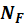<![endif]><![endif]>) through the sum <!--[if gte msEquation 12]><m:oMath><m:sSub><m:sSubPr><m:ctrlPr></m:ctrlPr></m:sSubPr><m:e><i
   style='mso-bidi-font-style:normal'><m:r><m:rPr><m:scr
      m:val="roman"/><m:sty m:val="bi"/></m:rPr>N</m:r></i></m:e><m:sub><i
   style='mso-bidi-font-style:normal'><m:r><m:rPr><m:scr
      m:val="roman"/><m:sty m:val="bi"/></m:rPr>T</m:r></i></m:sub></m:sSub><i
 style='mso-bidi-font-style:normal'><m:r><m:rPr><m:scr
    m:val="roman"/><m:sty m:val="bi"/></m:rPr>=</m:r></i><m:sSub><m:sSubPr><m:ctrlPr></m:ctrlPr></m:sSubPr><m:e><i
   style='mso-bidi-font-style:normal'><m:r><m:rPr><m:scr
      m:val="roman"/><m:sty m:val="bi"/></m:rPr>N</m:r></i></m:e><m:sub><i
   style='mso-bidi-font-style:normal'><m:r><m:rPr><m:scr
      m:val="roman"/><m:sty m:val="bi"/></m:rPr>F</m:r></i></m:sub></m:sSub><i
 style='mso-bidi-font-style:normal'><m:r><m:rPr><m:scr
    m:val="roman"/><m:sty m:val="bi"/></m:rPr>+</m:r></i><m:sSub><m:sSubPr><m:ctrlPr></m:ctrlPr></m:sSubPr><m:e><i
   style='mso-bidi-font-style:normal'><m:r><m:rPr><m:scr
      m:val="roman"/><m:sty m:val="bi"/></m:rPr>N</m:r></i></m:e><m:sub><i
   style='mso-bidi-font-style:normal'><m:r><m:rPr><m:scr
      m:val="roman"/><m:sty m:val="bi"/></m:rPr>M</m:r></i></m:sub></m:sSub></m:oMath><![endif]--><![if !msEquation]><!--[if gte vml 1]><v:shape
 id="_x0000_i1025" type="#_x0000_t75" style='width:77.4pt;height:13.8pt'>
 <v:imagedata src="DiyabcRandomForestUserManual21-01-2021_fichiers/image005.png"
  o:title="" chromakey="white"/>
</v:shape><![endif]--><![if !vml]><![endif]><![endif]>&nbsp;and the ratio <!--[if gte msEquation 12]><m:oMath><i
 style='mso-bidi-font-style:normal'><m:r><m:rPr><m:scr
    m:val="roman"/><m:sty m:val="bi"/></m:rPr>r</m:r><m:r><m:rPr><m:scr m:val="roman"/><m:sty
    m:val="bi"/></m:rPr>=</m:r></i><m:f><m:fPr><m:type m:val="lin"/><m:ctrlPr></m:ctrlPr></m:fPr><m:num><m:sSub><m:sSubPr><m:ctrlPr></m:ctrlPr></m:sSubPr><m:e><i
     style='mso-bidi-font-style:normal'><m:r><m:rPr><m:scr m:val="roman"/><m:sty m:val="bi"/></m:rPr>N</m:r></i></m:e><m:sub><i
     style='mso-bidi-font-style:normal'><m:r><m:rPr><m:scr m:val="roman"/><m:sty m:val="bi"/></m:rPr>M</m:r></i></m:sub></m:sSub></m:num><m:den><m:d><m:dPr><m:ctrlPr></m:ctrlPr></m:dPr><m:e><m:sSub><m:sSubPr><m:ctrlPr></m:ctrlPr></m:sSubPr><m:e><i
       style='mso-bidi-font-style:normal'><m:r><m:rPr><m:scr m:val="roman"/><m:sty m:val="bi"/></m:rPr>N</m:r></i></m:e><m:sub><i
       style='mso-bidi-font-style:normal'><m:r><m:rPr><m:scr m:val="roman"/><m:sty m:val="bi"/></m:rPr>F</m:r></i></m:sub></m:sSub><i
     style='mso-bidi-font-style:normal'><m:r><m:rPr><m:scr m:val="roman"/><m:sty m:val="bi"/></m:rPr>+</m:r></i><m:sSub><m:sSubPr><m:ctrlPr></m:ctrlPr></m:sSubPr><m:e><i
       style='mso-bidi-font-style:normal'><m:r><m:rPr><m:scr m:val="roman"/><m:sty m:val="bi"/></m:rPr>N</m:r></i></m:e><m:sub><i
       style='mso-bidi-font-style:normal'><m:r><m:rPr><m:scr m:val="roman"/><m:sty m:val="bi"/></m:rPr>M</m:r></i></m:sub></m:sSub></m:e></m:d></m:den></m:f></m:oMath><![endif]--><![if !msEquation]><!--[if gte vml 1]><v:shape
 id="_x0000_i1025" type="#_x0000_t75" style='width:102.6pt;height:13.8pt'>
 <v:imagedata src="DiyabcRandomForestUserManual21-01-2021_fichiers/image007.png"
  o:title="" chromakey="white"/>
</v:shape><![endif]--><![if !vml]><![endif]><![endif]>. We use the following formulae for the
probability of coalescence (<i style='mso-bidi-font-style:normal'>p</i>) of two
lineages within this population:

<o:p>&nbsp;</o:p>

Autosomal
diploid loci:<o:p></o:p>

<!--[if gte msEquation 12]><m:oMathPara><m:oMath><i
  style='mso-bidi-font-style:normal'><m:r>p</m:r><m:r>=</m:r></i><m:f><m:fPr><m:ctrlPr></m:ctrlPr></m:fPr><m:num><i
    style='mso-bidi-font-style:normal'><m:r>1</m:r></i></m:num><m:den><i
    style='mso-bidi-font-style:normal'><m:r>8</m:r><m:r>r</m:r></i><m:d><m:dPr><m:ctrlPr></m:ctrlPr></m:dPr><m:e><i
      style='mso-bidi-font-style:normal'><m:r>1-</m:r><m:r>r</m:r></i></m:e></m:d><m:sSub><m:sSubPr><m:ctrlPr></m:ctrlPr></m:sSubPr><m:e><i
      style='mso-bidi-font-style:normal'><m:r>N</m:r></i></m:e><m:sub><i
      style='mso-bidi-font-style:normal'><m:r>T</m:r></i></m:sub></m:sSub></m:den></m:f></m:oMath></m:oMathPara><![endif]--><![if !msEquation]><!--[if gte vml 1]><v:shape
 id="_x0000_i1025" type="#_x0000_t75" style='width:86.4pt;height:29.4pt'>
 <v:imagedata src="DiyabcRandomForestUserManual21-01-2021_fichiers/image009.png"
  o:title="" chromakey="white"/>
</v:shape><![endif]--><![if !vml]>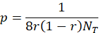<![endif]><![endif]><o:p></o:p>

Autosomal
haploid loci:<o:p></o:p>

<!--[if gte msEquation 12]><m:oMathPara><m:oMath><i
  style='mso-bidi-font-style:normal'><m:r>p</m:r><m:r>=</m:r></i><m:f><m:fPr><m:ctrlPr></m:ctrlPr></m:fPr><m:num><i
    style='mso-bidi-font-style:normal'><m:r>1</m:r></i></m:num><m:den><i
    style='mso-bidi-font-style:normal'><m:r>4</m:r><m:r>r</m:r></i><m:d><m:dPr><m:ctrlPr></m:ctrlPr></m:dPr><m:e><i
      style='mso-bidi-font-style:normal'><m:r>1-</m:r><m:r>r</m:r></i></m:e></m:d><m:sSub><m:sSubPr><m:ctrlPr></m:ctrlPr></m:sSubPr><m:e><i
      style='mso-bidi-font-style:normal'><m:r>N</m:r></i></m:e><m:sub><i
      style='mso-bidi-font-style:normal'><m:r>T</m:r></i></m:sub></m:sSub></m:den></m:f></m:oMath></m:oMathPara><![endif]--><![if !msEquation]><!--[if gte vml 1]><v:shape
 id="_x0000_i1025" type="#_x0000_t75" style='width:86.4pt;height:29.4pt'>
 <v:imagedata src="DiyabcRandomForestUserManual21-01-2021_fichiers/image011.png"
  o:title="" chromakey="white"/>
</v:shape><![endif]--><![if !vml]>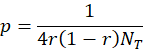<![endif]><![endif]><o:p></o:p>

X-linked loci
/ haplo-diploid loci:<o:p></o:p>

<!--[if gte msEquation 12]><m:oMathPara><m:oMath><i
  style='mso-bidi-font-style:normal'><m:r>p</m:r><m:r>=</m:r></i><m:f><m:fPr><m:ctrlPr></m:ctrlPr></m:fPr><m:num><i
    style='mso-bidi-font-style:normal'><m:r>1+</m:r><m:r>r</m:r></i></m:num><m:den><i
    style='mso-bidi-font-style:normal'><m:r>9</m:r><m:r>r</m:r></i><m:d><m:dPr><m:ctrlPr></m:ctrlPr></m:dPr><m:e><i
      style='mso-bidi-font-style:normal'><m:r>1-</m:r><m:r>r</m:r></i></m:e></m:d><m:sSub><m:sSubPr><m:ctrlPr></m:ctrlPr></m:sSubPr><m:e><i
      style='mso-bidi-font-style:normal'><m:r>N</m:r></i></m:e><m:sub><i
      style='mso-bidi-font-style:normal'><m:r>T</m:r></i></m:sub></m:sSub></m:den></m:f></m:oMath></m:oMathPara><![endif]--><![if !msEquation]><!--[if gte vml 1]><v:shape
 id="_x0000_i1025" type="#_x0000_t75" style='width:86.4pt;height:29.4pt'>
 <v:imagedata src="DiyabcRandomForestUserManual21-01-2021_fichiers/image013.png"
  o:title="" chromakey="white"/>
</v:shape><![endif]--><![if !vml]>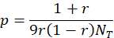<![endif]><![endif]><o:p></o:p>

Y-linked
loci:<o:p></o:p>

<!--[if gte msEquation 12]><m:oMathPara><m:oMath><i
  style='mso-bidi-font-style:normal'><m:r>p</m:r><m:r>=</m:r></i><m:f><m:fPr><m:ctrlPr></m:ctrlPr></m:fPr><m:num><i
    style='mso-bidi-font-style:normal'><m:r>1</m:r></i></m:num><m:den><i
    style='mso-bidi-font-style:normal'><m:r>r</m:r></i><m:sSub><m:sSubPr><m:ctrlPr></m:ctrlPr></m:sSubPr><m:e><i
      style='mso-bidi-font-style:normal'><m:r>N</m:r></i></m:e><m:sub><i
      style='mso-bidi-font-style:normal'><m:r>T</m:r></i></m:sub></m:sSub></m:den></m:f></m:oMath></m:oMathPara><![endif]--><![if !msEquation]><!--[if gte vml 1]><v:shape
 id="_x0000_i1025" type="#_x0000_t75" style='width:42.6pt;height:29.4pt'>
 <v:imagedata src="DiyabcRandomForestUserManual21-01-2021_fichiers/image015.png"
  o:title="" chromakey="white"/>
</v:shape><![endif]--><![if !vml]>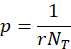<![endif]><![endif]><o:p></o:p>

Mitochondrial
loci:<o:p></o:p>

<!--[if gte msEquation 12]><m:oMathPara><m:oMath><i
  style='mso-bidi-font-style:normal'><m:r>p</m:r><m:r>=</m:r></i><m:f><m:fPr><m:ctrlPr></m:ctrlPr></m:fPr><m:num><i
    style='mso-bidi-font-style:normal'><m:r>1</m:r></i></m:num><m:den><m:d><m:dPr><m:ctrlPr></m:ctrlPr></m:dPr><m:e><i
      style='mso-bidi-font-style:normal'><m:r>1-</m:r><m:r>r</m:r></i></m:e></m:d><m:sSub><m:sSubPr><m:ctrlPr></m:ctrlPr></m:sSubPr><m:e><i
      style='mso-bidi-font-style:normal'><m:r>N</m:r></i></m:e><m:sub><i
      style='mso-bidi-font-style:normal'><m:r>T</m:r></i></m:sub></m:sSub></m:den></m:f></m:oMath></m:oMathPara><![endif]--><![if !msEquation]><!--[if gte vml 1]><v:shape
 id="_x0000_i1025" type="#_x0000_t75" style='width:73.8pt;height:29.4pt'>
 <v:imagedata src="DiyabcRandomForestUserManual21-01-2021_fichiers/image017.png"
  o:title="" chromakey="white"/>
</v:shape><![endif]--><![if !vml]>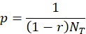<![endif]><![endif]><o:p></o:p>

Users have to provide a (total) effective
size <!--[if gte msEquation 12]><m:oMath><m:sSub><m:sSubPr><m:ctrlPr></m:ctrlPr></m:sSubPr><m:e><i
   style='mso-bidi-font-style:normal'><m:r>N</m:r></i></m:e><m:sub><i
   style='mso-bidi-font-style:normal'><m:r>T</m:r></i></m:sub></m:sSub></m:oMath><![endif]--><![if !msEquation]><!--[if gte vml 1]><v:shape
 id="_x0000_i1025" type="#_x0000_t75" style='width:14.4pt;height:13.8pt'>
 <v:imagedata src="DiyabcRandomForestUserManual21-01-2021_fichiers/image019.png"
  o:title="" chromakey="white"/>
</v:shape><![endif]--><![if !vml]><![endif]><![endif]>&nbsp;(on which inferences
will be made) and a sex-ratio <!--[if gte msEquation 12]><m:oMath><i
 style='mso-bidi-font-style:normal'><m:r>r</m:r></i></m:oMath><![endif]--><![if !msEquation]><!--[if gte vml 1]><v:shape
 id="_x0000_i1025" type="#_x0000_t75" style='width:6pt;height:13.8pt'>
 <v:imagedata src="DiyabcRandomForestUserManual21-01-2021_fichiers/image021.png"
  o:title="" chromakey="white"/>
</v:shape><![endif]--><![if !vml]><![endif]><![endif]>. If no sex ratio is provided, the default value of <!--[if gte msEquation 12]><m:oMath><i
 style='mso-bidi-font-style:normal'><m:r>r</m:r></i></m:oMath><![endif]--><![if !msEquation]><!--[if gte vml 1]><v:shape
 id="_x0000_i1025" type="#_x0000_t75" style='width:6pt;height:13.8pt'>
 <v:imagedata src="DiyabcRandomForestUserManual21-01-2021_fichiers/image021.png"
  o:title="" chromakey="white"/>
</v:shape><![endif]--><![if !vml]><![endif]><![endif]>&nbsp;is taken as 0.5.

<h2><a name=historical-model-parameterization>2.3 Historical model
parameterization</a></h2>

The evolutionary scenario, which is
characterized by the historical model, can be described in a dedicated panel of
the interface of the program as a succession in time of &quot;events&quot; and
&quot;inter event periods&quot;. In the current version of the program, we
consider 4 categories of events: population divergence, discrete change of
effective population size, admixture and sampling (the last one allow considering samples taken at different times). Between
two successive events affecting a population, we assume that populations evolve
independently (e.g.&nbsp;without migration) and with a fixed effective size.
The usual parameters of the historical model are the times of occurrence of the
various events (counted in number of generations), the effective sizes of
populations and the admixture rates. <b style='mso-bidi-font-weight:normal'>When
writing the scenario, events have to be coded sequentially backward in time</b>
(see section 2.3.2 for examples). Although this choice may not be natural at
first sight, it is coherent with coalescence theory on which are based all data
simulations in the program. For that reason, the keywords for a divergence or
an admixture event are merge and split, respectively. Two keywords varNe and sample correspond to a discrete change
in effective population size and a gene sampling within a given population,
respectively. A scenario takes the form of a succession of lines (one line per
event), each line starting with the time of the event, then the nature of the
event, and ending with several other data depending on the nature of the event.
Following is the syntax used for each category of event:

Population sample<o:p></o:p>

<!--[if gte msEquation 12]><m:oMath><i
 style='mso-bidi-font-style:normal'><m:r>&#10216;</m:r><m:r>time</m:r><m:r>&#10217;</m:r></i></m:oMath><![endif]--><![if !msEquation]><!--[if gte vml 1]><v:shape
 id="_x0000_i1025" type="#_x0000_t75" style='width:33.6pt;height:13.8pt'>
 <v:imagedata src="DiyabcRandomForestUserManual21-01-2021_fichiers/image023.png"
  o:title="" chromakey="white"/>
</v:shape><![endif]--><![if !vml]><![endif]><![endif]>&nbsp;sample <!--[if gte msEquation 12]><m:oMath><i
 style='mso-bidi-font-style:normal'><m:r>&#10216;</m:r><m:r>pop</m:r><m:r>&#10217;</m:r></i></m:oMath><![endif]--><![if !msEquation]><!--[if gte vml 1]><v:shape
 id="_x0000_i1025" type="#_x0000_t75" style='width:28.8pt;height:13.8pt'>
 <v:imagedata src="DiyabcRandomForestUserManual21-01-2021_fichiers/image025.png"
  o:title="" chromakey="white"/>
</v:shape><![endif]--><![if !vml]><![endif]><![endif]>&nbsp;<o:p></o:p>

Where
<!--[if gte msEquation 12]><m:oMath><i style='mso-bidi-font-style:normal'><m:r>&#10216;</m:r><m:r>time</m:r><m:r>&#10217;</m:r></i></m:oMath><![endif]--><![if !msEquation]><!--[if gte vml 1]><v:shape
 id="_x0000_i1025" type="#_x0000_t75" style='width:33.6pt;height:13.8pt'>
 <v:imagedata src="DiyabcRandomForestUserManual21-01-2021_fichiers/image023.png"
  o:title="" chromakey="white"/>
</v:shape><![endif]--><![if !vml]><![endif]><![endif]>&nbsp;is the time (always
counted in number of generations) at which the sample was collected and <!--[if gte msEquation 12]><m:oMath><i
 style='mso-bidi-font-style:normal'><m:r>&#10216;</m:r><m:r>pop</m:r><m:r>&#10217;</m:r></i></m:oMath><![endif]--><![if !msEquation]><!--[if gte vml 1]><v:shape
 id="_x0000_i1025" type="#_x0000_t75" style='width:28.8pt;height:13.8pt'>
 <v:imagedata src="DiyabcRandomForestUserManual21-01-2021_fichiers/image025.png"
  o:title="" chromakey="white"/>
</v:shape><![endif]--><![if !vml]><![endif]><![endif]>&nbsp;is the population number
from which is taken the sample. It is worth stressing here that <b
style='mso-bidi-font-weight:normal'>samples are considered in the same order as
they appear in the data file</b>. The number of lines will thus be exactly
equal to the number of samples in the datafile. 
<![if !supportLineBreakNewLine]> 
<![endif]><b style='mso-bidi-font-weight:normal'><o:p></o:p></b>

<b
style='mso-bidi-font-weight:normal'>Population size variation<o:p></o:p></b>

<!--[if gte msEquation 12]><m:oMath><i
 style='mso-bidi-font-style:normal'><m:r>&#10216;</m:r><m:r>time</m:r><m:r>&#10217;</m:r></i></m:oMath><![endif]--><![if !msEquation]><!--[if gte vml 1]><v:shape
 id="_x0000_i1025" type="#_x0000_t75" style='width:33.6pt;height:13.8pt'>
 <v:imagedata src="DiyabcRandomForestUserManual21-01-2021_fichiers/image023.png"
  o:title="" chromakey="white"/>
</v:shape><![endif]--><![if !vml]><![endif]><![endif]>&nbsp;varNe <!--[if gte msEquation 12]><m:oMath><i
 style='mso-bidi-font-style:normal'><m:r>&#10216;</m:r><m:r>pop</m:r><m:r>&#10217;</m:r></i></m:oMath><![endif]--><![if !msEquation]><!--[if gte vml 1]><v:shape
 id="_x0000_i1025" type="#_x0000_t75" style='width:28.8pt;height:13.8pt'>
 <v:imagedata src="DiyabcRandomForestUserManual21-01-2021_fichiers/image025.png"
  o:title="" chromakey="white"/>
</v:shape><![endif]--><![if !vml]><![endif]><![endif]>&nbsp;<!--[if gte msEquation 12]><m:oMath><i
 style='mso-bidi-font-style:normal'><m:r>&#10216;</m:r><m:r>Ne</m:r><m:r>&#10217;</m:r></i></m:oMath><![endif]--><![if !msEquation]><!--[if gte vml 1]><v:shape
 id="_x0000_i1025" type="#_x0000_t75" style='width:23.4pt;height:13.8pt'>
 <v:imagedata src="DiyabcRandomForestUserManual21-01-2021_fichiers/image027.png"
  o:title="" chromakey="white"/>
</v:shape><![endif]--><![if !vml]><![endif]><![endif]> 
From time <!--[if gte msEquation 12]><m:oMath><i style='mso-bidi-font-style:
 normal'><m:r>&#10216;</m:r><m:r>time</m:r><m:r>&#10217;</m:r></i></m:oMath><![endif]--><![if !msEquation]><!--[if gte vml 1]><v:shape
 id="_x0000_i1025" type="#_x0000_t75" style='width:33.6pt;height:13.8pt'>
 <v:imagedata src="DiyabcRandomForestUserManual21-01-2021_fichiers/image023.png"
  o:title="" chromakey="white"/>
</v:shape><![endif]--><![if !vml]><![endif]><![endif]>, looking backward in time, population <!--[if gte msEquation 12]><m:oMath><i
 style='mso-bidi-font-style:normal'><m:r>&#10216;</m:r><m:r>pop</m:r><m:r>&#10217;</m:r></i></m:oMath><![endif]--><![if !msEquation]><!--[if gte vml 1]><v:shape
 id="_x0000_i1025" type="#_x0000_t75" style='width:28.8pt;height:13.8pt'>
 <v:imagedata src="DiyabcRandomForestUserManual21-01-2021_fichiers/image025.png"
  o:title="" chromakey="white"/>
</v:shape><![endif]--><![if !vml]><![endif]><![endif]>&nbsp;will have an effective
size <!--[if gte msEquation 12]><m:oMath><i style='mso-bidi-font-style:
 normal'><m:r>&#10216;</m:r><m:r>Ne</m:r><m:r>&#10217;</m:r></i></m:oMath><![endif]--><![if !msEquation]><!--[if gte vml 1]><v:shape
 id="_x0000_i1025" type="#_x0000_t75" style='width:23.4pt;height:13.8pt'>
 <v:imagedata src="DiyabcRandomForestUserManual21-01-2021_fichiers/image027.png"
  o:title="" chromakey="white"/>
</v:shape><![endif]--><![if !vml]><![endif]><![endif]>.

<o:p>&nbsp;</o:p>

Population divergence

<!--[if gte msEquation 12]><m:oMath><i style='mso-bidi-font-style:
 normal'><m:r>&#10216;</m:r><m:r>time</m:r><m:r>&#10217;</m:r></i></m:oMath><![endif]--><![if !msEquation]><!--[if gte vml 1]><v:shape
 id="_x0000_i1025" type="#_x0000_t75" style='width:33.6pt;height:13.8pt'>
 <v:imagedata src="DiyabcRandomForestUserManual21-01-2021_fichiers/image023.png"
  o:title="" chromakey="white"/>
</v:shape><![endif]--><![if !vml]><![endif]><![endif]>&nbsp;merge <!--[if gte msEquation 12]><m:oMath><i
 style='mso-bidi-font-style:normal'><m:r>&#10216;</m:r><m:r>pop</m:r><m:r>1</m:r><m:r>&#10217;</m:r></i></m:oMath><![endif]--><![if !msEquation]><!--[if gte vml 1]><v:shape
 id="_x0000_i1025" type="#_x0000_t75" style='width:34.8pt;height:13.8pt'>
 <v:imagedata src="DiyabcRandomForestUserManual21-01-2021_fichiers/image029.png"
  o:title="" chromakey="white"/>
</v:shape><![endif]--><![if !vml]><![endif]><![endif]>&nbsp;<!--[if gte msEquation 12]><m:oMath><i
 style='mso-bidi-font-style:normal'><m:r>&#10216;</m:r><m:r>pop</m:r><m:r>0</m:r><m:r>&#10217;</m:r></i></m:oMath><![endif]--><![if !msEquation]><!--[if gte vml 1]><v:shape
 id="_x0000_i1025" type="#_x0000_t75" style='width:34.8pt;height:13.8pt'>
 <v:imagedata src="DiyabcRandomForestUserManual21-01-2021_fichiers/image031.png"
  o:title="" chromakey="white"/>
</v:shape><![endif]--><![if !vml]><![endif]><![endif]> 
At time <!--[if gte msEquation 12]><m:oMath><i style='mso-bidi-font-style:
 normal'><m:r>&#10216;</m:r><m:r>time</m:r><m:r>&#10217;</m:r></i></m:oMath><![endif]--><![if !msEquation]><!--[if gte vml 1]><v:shape
 id="_x0000_i1025" type="#_x0000_t75" style='width:33.6pt;height:13.8pt'>
 <v:imagedata src="DiyabcRandomForestUserManual21-01-2021_fichiers/image023.png"
  o:title="" chromakey="white"/>
</v:shape><![endif]--><![if !vml]><![endif]><![endif]>, looking backward in time, population <!--[if gte msEquation 12]><m:oMath><i
 style='mso-bidi-font-style:normal'><m:r>&#10216;</m:r><m:r>pop</m:r><m:r>0</m:r><m:r>&#10217;</m:r></i></m:oMath><![endif]--><![if !msEquation]><!--[if gte vml 1]><v:shape
 id="_x0000_i1025" type="#_x0000_t75" style='width:34.8pt;height:13.8pt'>
 <v:imagedata src="DiyabcRandomForestUserManual21-01-2021_fichiers/image031.png"
  o:title="" chromakey="white"/>
</v:shape><![endif]--><![if !vml]><![endif]><![endif]>&nbsp;&quot;merges&quot; with
population <!--[if gte msEquation 12]><m:oMath><i style='mso-bidi-font-style:
 normal'><m:r>&#10216;</m:r><m:r>pop</m:r><m:r>1</m:r><m:r>&#10217;</m:r></i></m:oMath><![endif]--><![if !msEquation]><!--[if gte vml 1]><v:shape
 id="_x0000_i1025" type="#_x0000_t75" style='width:34.8pt;height:13.8pt'>
 <v:imagedata src="DiyabcRandomForestUserManual21-01-2021_fichiers/image029.png"
  o:title="" chromakey="white"/>
</v:shape><![endif]--><![if !vml]><![endif]><![endif]>. Hereafter, only <!--[if gte msEquation 12]><m:oMath><i
 style='mso-bidi-font-style:normal'><m:r>&#10216;</m:r><m:r>pop</m:r><m:r>1</m:r><m:r>&#10217;</m:r></i></m:oMath><![endif]--><![if !msEquation]><!--[if gte vml 1]><v:shape
 id="_x0000_i1025" type="#_x0000_t75" style='width:34.8pt;height:13.8pt'>
 <v:imagedata src="DiyabcRandomForestUserManual21-01-2021_fichiers/image029.png"
  o:title="" chromakey="white"/>
</v:shape><![endif]--><![if !vml]><![endif]><![endif]>&nbsp;&quot;remains&quot;.

Population admixture

<!--[if gte msEquation 12]><m:oMath><i style='mso-bidi-font-style:
 normal'><m:r>&#10216;</m:r><m:r>time</m:r><m:r>&#10217;</m:r></i></m:oMath><![endif]--><![if !msEquation]><!--[if gte vml 1]><v:shape
 id="_x0000_i1025" type="#_x0000_t75" style='width:33.6pt;height:13.8pt'>
 <v:imagedata src="DiyabcRandomForestUserManual21-01-2021_fichiers/image023.png"
  o:title="" chromakey="white"/>
</v:shape><![endif]--><![if !vml]><![endif]><![endif]>&nbsp;split <!--[if gte msEquation 12]><m:oMath><i
 style='mso-bidi-font-style:normal'><m:r>&#10216;</m:r><m:r>pop</m:r><m:r>0</m:r><m:r>&#10217;</m:r></i></m:oMath><![endif]--><![if !msEquation]><!--[if gte vml 1]><v:shape
 id="_x0000_i1025" type="#_x0000_t75" style='width:34.8pt;height:13.8pt'>
 <v:imagedata src="DiyabcRandomForestUserManual21-01-2021_fichiers/image031.png"
  o:title="" chromakey="white"/>
</v:shape><![endif]--><![if !vml]><![endif]><![endif]>&nbsp;<!--[if gte msEquation 12]><m:oMath><i
 style='mso-bidi-font-style:normal'><m:r>&#10216;</m:r><m:r>pop</m:r><m:r>1</m:r><m:r>&#10217;</m:r></i></m:oMath><![endif]--><![if !msEquation]><!--[if gte vml 1]><v:shape
 id="_x0000_i1025" type="#_x0000_t75" style='width:34.8pt;height:13.8pt'>
 <v:imagedata src="DiyabcRandomForestUserManual21-01-2021_fichiers/image029.png"
  o:title="" chromakey="white"/>
</v:shape><![endif]--><![if !vml]><![endif]><![endif]>&nbsp;<!--[if gte msEquation 12]><m:oMath><i
 style='mso-bidi-font-style:normal'><m:r>&#10216;</m:r><m:r>pop</m:r><m:r>2</m:r><m:r>&#10217;</m:r></i></m:oMath><![endif]--><![if !msEquation]><!--[if gte vml 1]><v:shape
 id="_x0000_i1025" type="#_x0000_t75" style='width:34.8pt;height:13.8pt'>
 <v:imagedata src="DiyabcRandomForestUserManual21-01-2021_fichiers/image033.png"
  o:title="" chromakey="white"/>
</v:shape><![endif]--><![if !vml]><![endif]><![endif]>&nbsp;<!--[if gte msEquation 12]><m:oMath><i
 style='mso-bidi-font-style:normal'><m:r>&#10216;</m:r><m:r>rate</m:r><m:r>&#10217;</m:r></i></m:oMath><![endif]--><![if !msEquation]><!--[if gte vml 1]><v:shape
 id="_x0000_i1025" type="#_x0000_t75" style='width:31.8pt;height:13.8pt'>
 <v:imagedata src="DiyabcRandomForestUserManual21-01-2021_fichiers/image035.png"
  o:title="" chromakey="white"/>
</v:shape><![endif]--><![if !vml]><![endif]><![endif]> 
At time <!--[if gte msEquation 12]><m:oMath><i style='mso-bidi-font-style:
 normal'><m:r>&#10216;</m:r><m:r>time</m:r><m:r>&#10217;</m:r></i></m:oMath><![endif]--><![if !msEquation]><!--[if gte vml 1]><v:shape
 id="_x0000_i1025" type="#_x0000_t75" style='width:33.6pt;height:13.8pt'>
 <v:imagedata src="DiyabcRandomForestUserManual21-01-2021_fichiers/image023.png"
  o:title="" chromakey="white"/>
</v:shape><![endif]--><![if !vml]><![endif]><![endif]>, looking backward in time, population <!--[if gte msEquation 12]><m:oMath><i
 style='mso-bidi-font-style:normal'><m:r>&#10216;</m:r><m:r>pop</m:r><m:r>0</m:r><m:r>&#10217;</m:r></i></m:oMath><![endif]--><![if !msEquation]><!--[if gte vml 1]><v:shape
 id="_x0000_i1025" type="#_x0000_t75" style='width:34.8pt;height:13.8pt'>
 <v:imagedata src="DiyabcRandomForestUserManual21-01-2021_fichiers/image031.png"
  o:title="" chromakey="white"/>
</v:shape><![endif]--><![if !vml]><![endif]><![endif]>&nbsp;&quot;splits&quot;
between populations <!--[if gte msEquation 12]><m:oMath><i
 style='mso-bidi-font-style:normal'><m:r>&#10216;</m:r><m:r>pop</m:r><m:r>1</m:r><m:r>&#10217;</m:r></i></m:oMath><![endif]--><![if !msEquation]><!--[if gte vml 1]><v:shape
 id="_x0000_i1025" type="#_x0000_t75" style='width:34.8pt;height:13.8pt'>
 <v:imagedata src="DiyabcRandomForestUserManual21-01-2021_fichiers/image029.png"
  o:title="" chromakey="white"/>
</v:shape><![endif]--><![if !vml]><![endif]><![endif]>&nbsp;and <!--[if gte msEquation 12]><m:oMath><i
 style='mso-bidi-font-style:normal'><m:r>&#10216;</m:r><m:r>pop</m:r><m:r>2</m:r><m:r>&#10217;</m:r></i></m:oMath><![endif]--><![if !msEquation]><!--[if gte vml 1]><v:shape
 id="_x0000_i1025" type="#_x0000_t75" style='width:34.8pt;height:13.8pt'>
 <v:imagedata src="DiyabcRandomForestUserManual21-01-2021_fichiers/image033.png"
  o:title="" chromakey="white"/>
</v:shape><![endif]--><![if !vml]><![endif]><![endif]>. A gene lineage from population <!--[if gte msEquation 12]><m:oMath><i
 style='mso-bidi-font-style:normal'><m:r>&#10216;</m:r><m:r>pop</m:r><m:r>0</m:r><m:r>&#10217;</m:r></i></m:oMath><![endif]--><![if !msEquation]><!--[if gte vml 1]><v:shape
 id="_x0000_i1025" type="#_x0000_t75" style='width:34.8pt;height:13.8pt'>
 <v:imagedata src="DiyabcRandomForestUserManual21-01-2021_fichiers/image031.png"
  o:title="" chromakey="white"/>
</v:shape><![endif]--><![if !vml]><![endif]><![endif]>&nbsp;joins population <!--[if gte msEquation 12]><m:oMath><i
 style='mso-bidi-font-style:normal'><m:r>&#10216;</m:r><m:r>pop</m:r><m:r>1</m:r><m:r>&#10217;</m:r></i></m:oMath><![endif]--><![if !msEquation]><!--[if gte vml 1]><v:shape
 id="_x0000_i1025" type="#_x0000_t75" style='width:34.8pt;height:13.8pt'>
 <v:imagedata src="DiyabcRandomForestUserManual21-01-2021_fichiers/image029.png"
  o:title="" chromakey="white"/>
</v:shape><![endif]--><![if !vml]><![endif]><![endif]>&nbsp;(respectively <!--[if gte msEquation 12]><m:oMath><i
 style='mso-bidi-font-style:normal'><m:r>&#10216;</m:r><m:r>pop</m:r><m:r>2</m:r><m:r>&#10217;</m:r></i></m:oMath><![endif]--><![if !msEquation]><!--[if gte vml 1]><v:shape
 id="_x0000_i1025" type="#_x0000_t75" style='width:34.8pt;height:13.8pt'>
 <v:imagedata src="DiyabcRandomForestUserManual21-01-2021_fichiers/image033.png"
  o:title="" chromakey="white"/>
</v:shape><![endif]--><![if !vml]><![endif]><![endif]>) with probability <!--[if gte msEquation 12]><m:oMath><i
 style='mso-bidi-font-style:normal'><m:r>&#10216;</m:r><m:r>rate</m:r><m:r>&#10217;</m:r></i></m:oMath><![endif]--><![if !msEquation]><!--[if gte vml 1]><v:shape
 id="_x0000_i1025" type="#_x0000_t75" style='width:31.8pt;height:13.8pt'>
 <v:imagedata src="DiyabcRandomForestUserManual21-01-2021_fichiers/image035.png"
  o:title="" chromakey="white"/>
</v:shape><![endif]--><![if !vml]><![endif]><![endif]>&nbsp;(respectively 1-<!--[if gte msEquation 12]><m:oMath><i
 style='mso-bidi-font-style:normal'><m:r>&#10216;</m:r><m:r>rate</m:r><m:r>&#10217;</m:r></i></m:oMath><![endif]--><![if !msEquation]><!--[if gte vml 1]><v:shape
 id="_x0000_i1025" type="#_x0000_t75" style='width:31.8pt;height:13.8pt'>
 <v:imagedata src="DiyabcRandomForestUserManual21-01-2021_fichiers/image035.png"
  o:title="" chromakey="white"/>
</v:shape><![endif]--><![if !vml]><![endif]><![endif]>). Hereafter, only <!--[if gte msEquation 12]><m:oMath><i
 style='mso-bidi-font-style:normal'><m:r>&#10216;</m:r><m:r>pop</m:r><m:r>1</m:r><m:r>&#10217;</m:r></i></m:oMath><![endif]--><![if !msEquation]><!--[if gte vml 1]><v:shape
 id="_x0000_i1025" type="#_x0000_t75" style='width:34.8pt;height:13.8pt'>
 <v:imagedata src="DiyabcRandomForestUserManual21-01-2021_fichiers/image029.png"
  o:title="" chromakey="white"/>
</v:shape><![endif]--><![if !vml]><![endif]><![endif]>&nbsp;and <!--[if gte msEquation 12]><m:oMath><i
 style='mso-bidi-font-style:normal'><m:r>&#10216;</m:r><m:r>pop</m:r><m:r>2</m:r><m:r>&#10217;</m:r></i></m:oMath><![endif]--><![if !msEquation]><!--[if gte vml 1]><v:shape
 id="_x0000_i1025" type="#_x0000_t75" style='width:34.8pt;height:13.8pt'>
 <v:imagedata src="DiyabcRandomForestUserManual21-01-2021_fichiers/image033.png"
  o:title="" chromakey="white"/>
</v:shape><![endif]--><![if !vml]><![endif]><![endif]>&nbsp;&quot;remain&quot;.

Note that one needs to write a first
line giving the <b style='mso-bidi-font-weight:normal'>effective sizes of the
sampled populations before the first event described</b>, looking backward in
time. Expressions between arrows, other than population numbers, can be either
a numeric value (e.g.&nbsp;25) or a character string (e.g.&nbsp;t0). In the latter case, it is
considered as a parameter of the model. The program offers the possibility to
add or remove scenarios, by just clicking on the corresponding buttons. The
usual shortcuts (e.g. CTRL+C, CTRL+V and CTRL+X) can be used to edit the
different scenarios. Some or all parameters can be in common among scenarios.

<h3 style='margin-top:0cm;margin-right:0cm;margin-bottom:10.0pt;margin-left:
0cm'><a name="_Toc62127936">2.3.1 Key notes</a></h3>

<![if !supportLists]>1.&nbsp;&nbsp;&nbsp;&nbsp;&nbsp;&nbsp;&nbsp;&nbsp;
<![endif]>There are two ways of giving a
fixed value to effective population sizes, times and admixture rates. Either
the fixed value appears as a numeric value in the scenario windows or it is
given as a string value like any parameter. In the latter case, one gives this
parameter a fixed value by choosing a Uniform distribution and setting the
minimum and maximum to that value in the prior setting of the corresponding
interface panel.

<![if !supportLists]>2.&nbsp;&nbsp;&nbsp;&nbsp;&nbsp;&nbsp;&nbsp;&nbsp;
<![endif]>All expressions must be
separated by at least one space.

<![if !supportLists]>3.&nbsp;&nbsp;&nbsp;&nbsp;&nbsp;&nbsp;&nbsp;&nbsp;
<![endif]>All expressions relative to
parameters can include sums or differences of parameters of the same type (e.g.
divergence times or effective population size but not a mixture of both). For
instance, it is possible to write: 
t0 merge 2 3 
t0+t1 merge 1 2 
This means that t1 is the time elapsed between the two merge events. Note that one
cannot mix a parameter and a numeric value (e.g.&nbsp;t1+150 will result in an error). This
can be done by writing t1+t2 and fixing t2 by choosing a uniform distribution with lower and upper bounds both
equal to 150 in the interface.

<![if !supportLists]>4.&nbsp;&nbsp;&nbsp;&nbsp;&nbsp;&nbsp;&nbsp;&nbsp;
<![endif]><b style='mso-bidi-font-weight:normal'>Time is always given in generations</b>.
Since we look backward, time increases towards past.

<![if !supportLists]>5.&nbsp;&nbsp;&nbsp;&nbsp;&nbsp;&nbsp;&nbsp;&nbsp;
<![endif]>Negative times are allowed
(e.g.&nbsp;the example given in section 2.3.2), but not recommended.

<![if !supportLists]>6.&nbsp;&nbsp;&nbsp;&nbsp;&nbsp;&nbsp;&nbsp;&nbsp;
<![endif]>Population numbers must be
consecutive natural integers starting at 1. The number of population
can exceed the number of samples and vice versa: in other words, <i
style='mso-bidi-font-style:normal'>unsampled populations</i> can be considered
in the scenario on one hand, and the same population can be sampled more than
once on the other hand.

<![if !supportLists]>7.&nbsp;&nbsp;&nbsp;&nbsp;&nbsp;&nbsp;&nbsp;&nbsp;
<![endif]><b style='mso-bidi-font-weight:normal'>Multi-furcating population trees</b> can be
considered, by writing <b style='mso-bidi-font-weight:normal'>several
divergence events occurring at the same time.</b> However, one has to be
careful to the order of the merge events. For instance, the following piece of scenario will fail: 
100 merge 1 2 
100 merge 2 3 
This is because, after the first line, population 2, which has merged with
population 1, does not &quot;exist&quot; anymore (the remaining population is
population 1). So, it cannot receive lineages of population 3 as it should as a
result of the second line. The correct ways are either to put line 2 before
line 1, or to change line 2 to: 
100 merge 1 3.

<![if !supportLists]>8.&nbsp;&nbsp;&nbsp;&nbsp;&nbsp;&nbsp;&nbsp;&nbsp;
<![endif]>Since times of events can be
parameters, the order of events can change according to the values taken by the
time parameters. In any case, before simulating a dataset, the program sorts
out events by increasing times. Note that sorting out events by increasing times
can only be done when all time values are known, i.e.&nbsp;when simulating
datasets. When checking scenarios in the interface, all time values are not yet
defined, so that when visualizing a scenario, events are represented in the
same order as they appear in the window used to define the scenario. If two or
more events occur at the same time, the order is that of the scenario as it is
written by the user.

<![if !supportLists]>9.&nbsp;&nbsp;&nbsp;&nbsp;&nbsp;&nbsp;&nbsp;&nbsp;
<![endif]>Most scenarios begin with
sampling events. We then need to know the effective size of the populations to
perform the simulation of coalescences until the next event concerning each
population. We decided to provide the effective size (first line) and the
sampling description (following lines) on distinct lines.

<a
name="_Toc62127937"><b>2.3.2 Examples</b></a><b><o:p></o:p></b>

Below are some usual scenarios with
increasing complexity. Each scenario is coded (as in the corresponding
interface panel of the program) on the left side and a graphic representation
(given by DIYABC Random Forest) is printed on the right side

<![if !supportLists]>1.&nbsp;&nbsp;&nbsp;&nbsp;&nbsp;&nbsp;&nbsp;&nbsp;
<![endif]>One population from which
several samples have been taken at various generations: 0, 3 and 10. Generation
0 could correspond for instance to the most recent sampling date. The only
unknown historical-demographical parameter of the scenario is the (constant)
effective population size which is defined in the first line at sampling time. 
<![if !supportLineBreakNewLine]> 
<![endif]>

<table class=Table border=0 cellspacing=0 cellpadding=0 width=476
 style='width:356.85pt;border-collapse:collapse;mso-yfti-tbllook:1984;
 mso-padding-alt:0cm 5.4pt 0cm 5.4pt'>
 <tr style='mso-yfti-irow:0;mso-yfti-firstrow:yes;mso-yfti-lastrow:yes'>
  <td width=150 valign=top style='width:112.8pt;padding:0cm 5.4pt 0cm 5.4pt'>
  
<![if !supportLists]>&nbsp;&nbsp;&nbsp;&nbsp;&nbsp;&nbsp;&nbsp;&nbsp;&nbsp;&nbsp;&nbsp;&nbsp;
  <![endif]><!--[if gte vml 1]><v:shape id="Picture" o:spid="_x0000_i1075"
   type="#_x0000_t75" alt="image" style='width:78pt;height:58.8pt;visibility:visible;
   mso-wrap-style:square'>
   <v:imagedata src="DiyabcRandomForestUserManual21-01-2021_fichiers/image037.png"
    o:title="image"/>
  </v:shape><![endif]--><![if !vml]>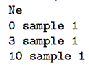<![endif]>

  </td>
  <td width=325 valign=top style='width:244.0pt;padding:0cm 5.4pt 0cm 5.4pt'>
  
<![if !supportLists]>&nbsp;&nbsp;&nbsp;&nbsp;&nbsp;&nbsp;&nbsp;&nbsp;&nbsp;&nbsp;&nbsp;&nbsp;
  <![endif]><!--[if gte vml 1]><v:shape id="Image1" o:spid="_x0000_i1074"
   type="#_x0000_t75" alt="image" style='width:189.6pt;height:155.4pt;
   visibility:visible;mso-wrap-style:square'>
   <v:imagedata src="DiyabcRandomForestUserManual21-01-2021_fichiers/image039.png"
    o:title="image"/>
  </v:shape><![endif]--><![if !vml]>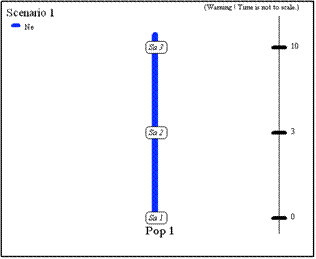<![endif]>

  </td>
 </tr>
</table>

<![if !supportLists]>2.&nbsp;&nbsp;&nbsp;&nbsp;&nbsp;&nbsp;&nbsp;&nbsp;
<![endif]>Two populations of size N1 and N2 (defined in the first line at sampling time) have diverged t generations in the past from an
ancestral population of size N1+N2. 
<![if !supportLineBreakNewLine]> 
<![endif]>

<table class=Table border=0 cellspacing=0 cellpadding=0 width=491
 style='width:368.4pt;border-collapse:collapse;mso-yfti-tbllook:1984;
 mso-padding-alt:0cm 5.4pt 0cm 5.4pt'>
 <tr style='mso-yfti-irow:0;mso-yfti-firstrow:yes;mso-yfti-lastrow:yes'>
  <td width=186 valign=top style='width:139.8pt;padding:0cm 5.4pt 0cm 5.4pt'>
  
<![if !supportLists]>&nbsp;&nbsp;&nbsp;&nbsp;&nbsp;&nbsp;&nbsp;&nbsp;&nbsp;&nbsp;&nbsp;&nbsp;
  <![endif]><!--[if gte vml 1]><v:shape id="Image2" o:spid="_x0000_i1073"
   type="#_x0000_t75" alt="image" style='width:105pt;height:61.8pt;
   visibility:visible;mso-wrap-style:square'>
   <v:imagedata src="DiyabcRandomForestUserManual21-01-2021_fichiers/image041.png"
    o:title="image"/>
  </v:shape><![endif]--><![if !vml]>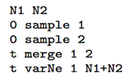<![endif]>

  </td>
  <td width=305 valign=top style='width:228.55pt;padding:0cm 5.4pt 0cm 5.4pt'>
  
<![if !supportLists]>&nbsp;&nbsp;&nbsp;&nbsp;&nbsp;&nbsp;&nbsp;&nbsp;&nbsp;&nbsp;&nbsp;&nbsp;
  <![endif]><!--[if gte vml 1]><v:shape id="Image3" o:spid="_x0000_i1072"
   type="#_x0000_t75" alt="image" style='width:193.8pt;height:153.6pt;
   visibility:visible;mso-wrap-style:square'>
   <v:imagedata src="DiyabcRandomForestUserManual21-01-2021_fichiers/image043.png"
    o:title="image"/>
  </v:shape><![endif]--><![if !vml]>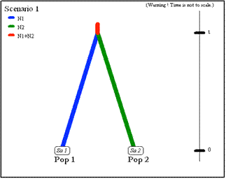<![endif]>

  </td>
 </tr>
</table>

<![if !supportLists]>3.&nbsp;&nbsp;&nbsp;&nbsp;&nbsp;&nbsp;&nbsp;&nbsp;
<![endif]>Two parental populations (1 and
1) with constant effective population sizes N1 and N2 have diverged at time td from an ancestral population of size NA. At time ta, there has been an <u>admixture event</u>
between the two populations giving birth to an admixed population (3) with
effective size N3 and with an admixture rate ra relative to population 1. 
<![if !supportLineBreakNewLine]> 
<![endif]>

<table class=Table border=0 cellspacing=0 cellpadding=0 width=561
 style='width:421.1pt;border-collapse:collapse;mso-yfti-tbllook:1984;
 mso-padding-alt:0cm 5.4pt 0cm 5.4pt'>
 <tr style='mso-yfti-irow:0;mso-yfti-firstrow:yes;mso-yfti-lastrow:yes'>
  <td width=192 valign=top style='width:144.3pt;padding:0cm 5.4pt 0cm 5.4pt'>
  
<![if !supportLists]>&nbsp;&nbsp;&nbsp;&nbsp;&nbsp;&nbsp;&nbsp;&nbsp;&nbsp;&nbsp;&nbsp;&nbsp;
  <![endif]><!--[if gte vml 1]><v:shape id="Image4" o:spid="_x0000_i1071"
   type="#_x0000_t75" alt="image" style='width:109.2pt;height:88.2pt;
   visibility:visible;mso-wrap-style:square'>
   <v:imagedata src="DiyabcRandomForestUserManual21-01-2021_fichiers/image045.png"
    o:title="image"/>
  </v:shape><![endif]--><![if !vml]>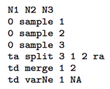<![endif]>

  </td>
  <td width=369 valign=top style='width:276.75pt;padding:0cm 5.4pt 0cm 5.4pt'>
  
<![if !supportLists]>&nbsp;&nbsp;&nbsp;&nbsp;&nbsp;&nbsp;&nbsp;&nbsp;&nbsp;&nbsp;&nbsp;&nbsp;
  <![endif]><!--[if gte vml 1]><v:shape id="Image5" o:spid="_x0000_i1070"
   type="#_x0000_t75" alt="image" style='width:242.4pt;height:187.2pt;
   visibility:visible;mso-wrap-style:square'>
   <v:imagedata src="DiyabcRandomForestUserManual21-01-2021_fichiers/image047.png"
    o:title="image"/>
  </v:shape><![endif]--><![if !vml]>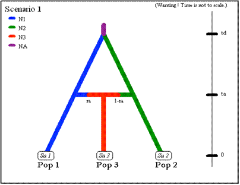<![endif]>

  </td>
 </tr>
</table>

<![if !supportLists]>4.&nbsp;&nbsp;&nbsp;&nbsp;&nbsp;&nbsp;&nbsp;&nbsp;
<![endif]>The next scenario includes <u>four
population samples and two admixture events</u>. All populations have identical
effective sizes (Ne). 
<![if !supportLineBreakNewLine]> 
<![endif]>

<table class=Table border=0 cellspacing=0 cellpadding=0 width=561
 style='width:421.1pt;border-collapse:collapse;mso-yfti-tbllook:1984;
 mso-padding-alt:0cm 5.4pt 0cm 5.4pt'>
 <tr style='mso-yfti-irow:0;mso-yfti-firstrow:yes;mso-yfti-lastrow:yes'>
  <td width=192 valign=top style='width:144.3pt;padding:0cm 5.4pt 0cm 5.4pt'>
  
<![if !supportLists]>&nbsp;&nbsp;&nbsp;&nbsp;&nbsp;&nbsp;&nbsp;&nbsp;&nbsp;&nbsp;&nbsp;&nbsp;
  <![endif]><!--[if gte vml 1]><v:shape id="Image6" o:spid="_x0000_i1069"
   type="#_x0000_t75" alt="image" style='width:109.2pt;height:88.2pt;
   visibility:visible;mso-wrap-style:square'>
   <v:imagedata src="DiyabcRandomForestUserManual21-01-2021_fichiers/image049.png"
    o:title="image"/>
  </v:shape><![endif]--><![if !vml]>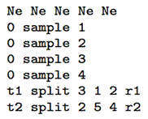<![endif]>

  </td>
  <td width=369 valign=top style='width:276.75pt;padding:0cm 5.4pt 0cm 5.4pt'>
  
<![if !supportLists]>&nbsp;&nbsp;&nbsp;&nbsp;&nbsp;&nbsp;&nbsp;&nbsp;&nbsp;&nbsp;&nbsp;&nbsp;
  <![endif]><!--[if gte vml 1]><v:shape id="Image7" o:spid="_x0000_i1068"
   type="#_x0000_t75" alt="image" style='width:242.4pt;height:196.8pt;
   visibility:visible;mso-wrap-style:square'>
   <v:imagedata src="DiyabcRandomForestUserManual21-01-2021_fichiers/image051.png"
    o:title="image"/>
  </v:shape><![endif]--><![if !vml]><![endif]>

  </td>
 </tr>
</table>

<![if !supportLists]>&nbsp;&nbsp;&nbsp;&nbsp;&nbsp;&nbsp;&nbsp;&nbsp;&nbsp;&nbsp;&nbsp;&nbsp;
<![endif]>Note that although there are
only four samples, the scenario includes a fifth <u>unsampled population</u>.
This unsampled population which diverged from population 1 at time t3 was a parent in the admixture event
occurring at time t2. Note also that the first line must include the effective sizes of
the <i style='mso-bidi-font-style:normal'>five</i> populations.

<![if !supportLists]>5.&nbsp;&nbsp;&nbsp;&nbsp;&nbsp;&nbsp;&nbsp;&nbsp;
<![endif]>Example of DIYABC-RF code for <u>unidirectional
admixture/introgression</u> where a fraction r2 of genes from population 'Pop
2' (with an effective population size N2) introgresses
into population 'Pop 1' (with a population size N1) at time t1. The code also
describes the merge of the two populations 'Pop 1' and 'Pop 2' into a common
ancestor (with a population size Na) at time t2. It is worth noting that: (i) in the observed datafile, there are only two sampled
populations (Pop 1 and Pop 2) and the user will need to define two (additional)
<u>unsampled</u> populations in the first line of code (Pop 3 and Pop 4); (ii) we
advise in this case to draw the fraction of genes transferred during the unidirectional
admixture (r2) into a uniform distribution with min and max bounds equal to eg. 0.01 (very weak introgression from 'Pop 2' into 'Pop
1') and 0.5 (strong introgression from 'Pop 2' into 'Pop 1'), respectively.

<o:p>&nbsp;</o:p>

<!--[if gte vml 1]><v:shape id="Image_x0020_24" o:spid="_x0000_s1026"
 type="#_x0000_t75" style='position:absolute;left:0;text-align:left;
 margin-left:263.85pt;margin-top:-21.15pt;width:225.6pt;height:204.25pt;
 z-index:-251658240;visibility:visible;mso-wrap-style:square;
 mso-width-percent:0;mso-height-percent:0;mso-wrap-distance-left:9pt;
 mso-wrap-distance-top:0;mso-wrap-distance-right:9pt;
 mso-wrap-distance-bottom:0;mso-position-horizontal:absolute;
 mso-position-horizontal-relative:text;mso-position-vertical:absolute;
 mso-position-vertical-relative:text;mso-width-percent:0;mso-height-percent:0;
 mso-width-relative:margin;mso-height-relative:margin'>
 <v:imagedata src="DiyabcRandomForestUserManual21-01-2021_fichiers/image053.jpg"
  o:title=""/>
 <w:wrap type="through"/>
</v:shape><![endif]--><![if !vml]>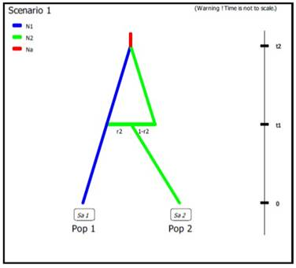<![endif]><b style='mso-bidi-font-weight:
normal'>N1 N2 N2 N2&nbsp;&nbsp; &nbsp;&nbsp;&nbsp;&nbsp;&nbsp; </b><i
style='mso-bidi-font-style:normal'># comment 1</i><b style='mso-bidi-font-weight:
normal'><o:p></o:p></b>

<b style='mso-bidi-font-weight:normal'>0 sample
1<o:p></o:p></b>

<b style='mso-bidi-font-weight:normal'>0 sample
2<o:p></o:p></b>

<b style='mso-bidi-font-weight:normal'>t</b><b
style='mso-bidi-font-weight:normal'>1 split 2 3 4 r2&nbsp;&nbsp; </b><i style='mso-bidi-font-style:
normal'># comment 2<b style='mso-bidi-font-weight:normal'> </b></i><b style='mso-bidi-font-weight:normal'>&nbsp;&nbsp;&nbsp;&nbsp;&nbsp;&nbsp;&nbsp;&nbsp;&nbsp;&nbsp;&nbsp; <o:p></o:p></b>

<b style='mso-bidi-font-weight:normal'>t</b><b
style='mso-bidi-font-weight:normal'>1 merge 1 3&nbsp; &nbsp;&nbsp;&nbsp;&nbsp; &nbsp;</b><i style='mso-bidi-font-style:
normal'># comment 3</i><b style='mso-bidi-font-weight:normal'><o:p></o:p></b>

<b style='mso-bidi-font-weight:normal'>t</b><b
style='mso-bidi-font-weight:normal'>2 merge 1 4&nbsp;&nbsp;&nbsp;&nbsp;&nbsp;&nbsp; &nbsp;</b><i style='mso-bidi-font-style:
normal'># comment 4</i><b style='mso-bidi-font-weight:normal'><o:p></o:p></b>

<b style='mso-bidi-font-weight:normal'>t</b><b
style='mso-bidi-font-weight:normal'>2 VarNe 1 Na&nbsp;&nbsp;&nbsp; &nbsp;&nbsp;&nbsp;</b><i style='mso-bidi-font-style:
normal'># comment 5</i><b style='mso-bidi-font-weight:normal'><o:p></o:p></b>

<o:p>&nbsp;</o:p>

<o:p>&nbsp;</o:p>

<o:p>&nbsp;</o:p>

<o:p>&nbsp;</o:p>

<o:p>&nbsp;</o:p>

<o:p>&nbsp;</o:p>

<o:p>&nbsp;</o:p>

<o:p>&nbsp;</o:p>

<o:p>&nbsp;</o:p>

<i style='mso-bidi-font-style:normal'># comment 1: both unsampled populations 'Pop
3' and 'Pop 4' correspond to 'Pop 2', hence their population sizes N2. 
</i><i style='mso-bidi-font-style:normal'># comment 2: at time t1 a fraction r2 of genes from
'Pop 2' goes into the unsampled population 'Pop 3' and a fraction 1-r2 goes
into the unsampled population 'Pop 4' ('Pop 2' disappears)<o:p></o:p></i>

<i style='mso-bidi-font-style:normal'># comment 3: we immediately merge (cf. still
time t1) the unsampled population 'Pop 3' (with the fraction r2 of genes from
'Pop 2') into the population 'Pop 1' - hence the unidirectional admixture of r2
genes from 'Pop 2' into 'Pop 1' ('Pop 3' disappears)<o:p></o:p></i>

<i style='mso-bidi-font-style:normal'># comment 4: 'Pop 4' - which now corresponds
to the ex-'Pop 2' with the fraction 1-r2 of genes - can be merge into 'Pop 1'<o:p></o:p></i>

<i
style='mso-bidi-font-style:normal'>#
comment 5: the population ancestral to 'Pop 1' and 'Pop 2' now has its own
population size Na<o:p></o:p></i>

<o:p>&nbsp;</o:p>

<![if !supportLists]>6.&nbsp;&nbsp;&nbsp;&nbsp;&nbsp;&nbsp;&nbsp;&nbsp;
<![endif]>The following three scenarios
correspond to a classic invasion history from an ancestral population
(population 1<u>). In scenario 1, population 3 is derived from population 2,
itself derived from population 1. In scenario 2, population 2 derived from
population 3, itself derived from population 1. In scenario 3, both populations
2 and 3 derived independently from population 1.</u> Note that when a new
population is created from its ancestral population, there is an initial size
reduction (noted here N2b for population 2 and N3b for population 3) for a given number of generation (here db for both populations) mimicking a
demographic bottleneck since the invasive population generally starts with a
few immigrants. For instance, a low number of Nxb
individuals for db generations could corresponds to Nxb values ranging between 5 to 100 individuals and db values ranging from 1 to 10 generations (e.g. Fraimout et al. 2017). If db = 0
then no bottleneck occurs which can be also a coding choice.

&nbsp;
Scenario 1

<table class=Table border=0 cellspacing=0 cellpadding=0 width=601
 style='width:450.6pt;border-collapse:collapse;mso-yfti-tbllook:1984;
 mso-padding-alt:0cm 5.4pt 0cm 5.4pt'>
 <tr style='mso-yfti-irow:0;mso-yfti-firstrow:yes;mso-yfti-lastrow:yes'>
  <td width=166 valign=top style='width:124.8pt;padding:0cm 5.4pt 0cm 5.4pt'>
  
<!--[if gte vml 1]><v:shape
   id="Image8" o:spid="_x0000_i1067" type="#_x0000_t75" alt="image" style='width:113.4pt;
   height:121.2pt;visibility:visible;mso-wrap-style:square'>
   <v:imagedata src="DiyabcRandomForestUserManual21-01-2021_fichiers/image055.png"
    o:title="image"/>
  </v:shape><![endif]--><![if !vml]>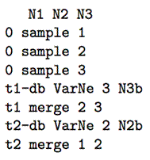<![endif]>

  </td>
  <td width=434 valign=top style='width:325.75pt;padding:0cm 5.4pt 0cm 5.4pt'>
  
<!--[if gte vml 1]><v:shape
   id="Image9" o:spid="_x0000_i1066" type="#_x0000_t75" alt="image" style='width:238.2pt;
   height:223.2pt;visibility:visible;mso-wrap-style:square'>
   <v:imagedata src="DiyabcRandomForestUserManual21-01-2021_fichiers/image057.png"
    o:title="image"/>
  </v:shape><![endif]--><![if !vml]>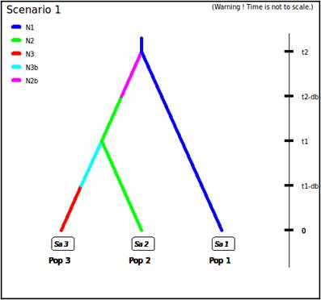<![endif]>

  </td>
 </tr>
</table>

&nbsp;
Scenario 2

<table class=Table border=0 cellspacing=0 cellpadding=0 width=600
 style='width:449.85pt;border-collapse:collapse;mso-yfti-tbllook:1984;
 mso-padding-alt:0cm 5.4pt 0cm 5.4pt'>
 <tr style='mso-yfti-irow:0;mso-yfti-firstrow:yes;mso-yfti-lastrow:yes'>
  <td width=171 valign=top style='width:128.35pt;padding:0cm 5.4pt 0cm 5.4pt'>
  
<!--[if gte vml 1]><v:shape
   id="Image10" o:spid="_x0000_i1065" type="#_x0000_t75" alt="image" style='width:117.6pt;
   height:111pt;visibility:visible;mso-wrap-style:square'>
   <v:imagedata src="DiyabcRandomForestUserManual21-01-2021_fichiers/image059.png"
    o:title="image"/>
  </v:shape><![endif]--><![if !vml]>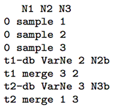<![endif]>

  </td>
  <td width=429 valign=top style='width:321.45pt;padding:0cm 5.4pt 0cm 5.4pt'>
  
<!--[if gte vml 1]><v:shape
   id="Image11" o:spid="_x0000_i1064" type="#_x0000_t75" alt="image" style='width:234.6pt;
   height:220.2pt;visibility:visible;mso-wrap-style:square'>
   <v:imagedata src="DiyabcRandomForestUserManual21-01-2021_fichiers/image061.png"
    o:title="image"/>
  </v:shape><![endif]--><![if !vml]><![endif]>

  </td>
 </tr>
</table>

&nbsp;

&nbsp;Scenario 3

<table class=Table border=0 cellspacing=0 cellpadding=0 width=583
 style='width:437.4pt;border-collapse:collapse;mso-yfti-tbllook:1984;
 mso-padding-alt:0cm 5.4pt 0cm 5.4pt'>
 <tr style='mso-yfti-irow:0;mso-yfti-firstrow:yes;mso-yfti-lastrow:yes'>
  <td width=161 valign=top style='width:120.55pt;padding:0cm 5.4pt 0cm 5.4pt'>
  
<!--[if gte vml 1]><v:shape
   id="Image12" o:spid="_x0000_i1063" type="#_x0000_t75" alt="image" style='width:109.8pt;
   height:94.8pt;visibility:visible;mso-wrap-style:square'>
   <v:imagedata src="DiyabcRandomForestUserManual21-01-2021_fichiers/image063.png"
    o:title="image"/>
  </v:shape><![endif]--><![if !vml]>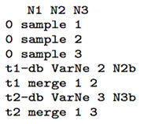<![endif]>

  </td>
  <td width=422 valign=top style='width:316.8pt;padding:0cm 5.4pt 0cm 5.4pt'>
  
<!--[if gte vml 1]><v:shape
   id="Image13" o:spid="_x0000_i1062" type="#_x0000_t75" alt="image" style='width:255pt;
   height:204.6pt;visibility:visible;mso-wrap-style:square'>
   <v:imagedata src="DiyabcRandomForestUserManual21-01-2021_fichiers/image065.png"
    o:title="image"/>
  </v:shape><![endif]--><![if !vml]>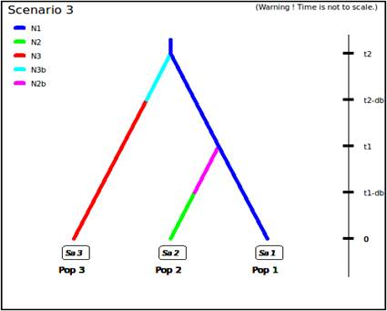<![endif]>

  </td>
 </tr>
</table>

<h2><a
name=Xc43f7bb58de29b50adf97c1b0251e0ff311883c>2.4 Mutation model parameterization (microsatellite and DNA sequence
loci)</a></h2>

The program can analyze microsatellite
data and DNA sequence data altogether as well as separately. SNP loci can be
also analyzed separately from microsatellite data and DNA sequence data. It is
worth stressing that all loci in an analysis must be <u>genetically independent</u>.
Second, for DNA sequence loci, intralocus
recombination is not considered. Loci are grouped by the user according to its
needs. For microsatellite and DNA sequence, a different mutation model can be
defined for each group. For instance, one group can include all microsatellites
with motifs that are 2 bp long and another group those with a 4 bp long motif.
Also, with DNA sequence loci, nuclear loci can be grouped together and a
mitochondrial locus form a separate group. <u>SNPs do not require mutation
model parameterization (see below for details)</u>.

We now describe the parameterization
of microsatellite and DNA sequence markers.

<h3><a name=microsatellite-loci>2.4.1 Microsatellite loci</a></h3>

Although a variety of mutation models have been proposed for
microsatellite loci, it is usually sufficient to consider only the simplest
models (e.g. Estoup et al. 2002). This has the non-negligible advantage of
reducing the number of parameters. This is why we chose the Generalized
Stepwise Mutation model (GSM). Under this model, a mutation increases or
decreases the length of the microsatellite by a number of repeated motifs
following a geometric distribution. This model necessitates only two
parameters: the mutation rate (&micro;) and the parameter of the geometric distribution (P). The same mutation model is imposed
to all loci of a given group. However, each locus has its own parameters
(&micro;i and Pi) and, following a hierarchical scheme,
each locus parameter is drawn from a gamma distribution with mean equal to the
mean parameter value. 

Note also that:

<![if !supportLists]>1.&nbsp;&nbsp;&nbsp;&nbsp;
<![endif]>Individual loci parameters
(&micro;i and Pi) are considered as nuisance
parameters and hence are never recorded. Only mean parameters are recorded.

<![if !supportLists]>2.&nbsp;&nbsp;&nbsp;&nbsp;
<![endif]>The variance or shape parameter
of the gamma distributions are set by the user and are NOT considered as
parameters.

<![if !supportLists]>3.&nbsp;&nbsp;&nbsp;&nbsp;
<![endif]>The SMM or Stepwise Mutation
Model is a special case of the GSM in which the number of repeats involved in a
mutation is always one. Such a model can be easily achieved by setting the
maximum value of mean P (<!--[if gte msEquation 12]><m:oMath><m:bar><m:barPr><m:pos
    m:val="top"/><m:ctrlPr></m:ctrlPr></m:barPr><m:e><i
   style='mso-bidi-font-style:normal'><m:r>P</m:r></i></m:e></m:bar></m:oMath><![endif]--><![if !msEquation]><!--[if gte vml 1]><v:shape
 id="_x0000_i1025" type="#_x0000_t75" style='width:7.8pt;height:16.2pt'>
 <v:imagedata src="DiyabcRandomForestUserManual21-01-2021_fichiers/image067.png"
  o:title="" chromakey="white"/>
</v:shape><![endif]--><![if !vml]><![endif]><![endif]>) to 0. In this case, all loci have their <!--[if gte msEquation 12]><m:oMath><m:sSub><m:sSubPr><m:ctrlPr></m:ctrlPr></m:sSubPr><m:e><i
   style='mso-bidi-font-style:normal'><m:r>P</m:r></i></m:e><m:sub><i
   style='mso-bidi-font-style:normal'><m:r>i</m:r></i></m:sub></m:sSub></m:oMath><![endif]--><![if !msEquation]><!--[if gte vml 1]><v:shape
 id="_x0000_i1025" type="#_x0000_t75" style='width:10.2pt;height:13.8pt'>
 <v:imagedata src="DiyabcRandomForestUserManual21-01-2021_fichiers/image069.png"
  o:title="" chromakey="white"/>
</v:shape><![endif]--><![if !vml]><![endif]><![endif]>&nbsp;set equal to 0 whatever
the shape of the gamma distribution.

<![if !supportLists]>4.&nbsp;&nbsp;&nbsp;&nbsp;
<![endif]>All loci can be given the same
value of a parameter by setting the shape of the corresponding gamma
distribution to 0 (this is NOT a limiting case of the gamma, but only a way of
telling the program).

To give more flexibility to the mutation model, the program offers
the possibility to consider <u>mutations that insert or delete a single
nucleotide</u> to the microsatellite sequence by using a mean parameter (named <!--[if gte msEquation 12]><m:oMath><m:sSub><m:sSubPr><m:ctrlPr></m:ctrlPr></m:sSubPr><m:e><i
   style='mso-bidi-font-style:normal'><m:r>&#956;</m:r></i></m:e><m:sub><m:d><m:dPr><m:ctrlPr></m:ctrlPr></m:dPr><m:e><i
     style='mso-bidi-font-style:normal'><m:r>SNI</m:r></i></m:e></m:d></m:sub></m:sSub></m:oMath><![endif]--><![if !msEquation]><!--[if gte vml 1]><v:shape
 id="_x0000_i1025" type="#_x0000_t75" style='width:28.8pt;height:24.6pt'>
 <v:imagedata src="DiyabcRandomForestUserManual21-01-2021_fichiers/image071.png"
  o:title="" chromakey="white"/>
</v:shape><![endif]--><![if !vml]>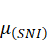<![endif]><![endif]>) with a prior to be defined and individual loci having either
values identical to the mean parameter or drawn from a Gamma distribution.

<h3><a name=dna-sequence-loci>2.4.2 DNA sequence loci</a></h3>

The program does not consider
insertion-deletion mutations, mainly because there does not seem to be much
consensus on this topic. Concerning substitutions, only the simplest models are
considered. We chose the Jukes-Cantor (1969) one parameter model, the Kimura
(1980) two parameter model, the Hasegawa-Kishino-Yano
(1985) and the Tamura-Nei (1993) models. The last two
models include the ratios of each nucleotide as parameters. In order to reduce
the number of parameters, these ratios have been fixed to the values calculated
from the observed dataset for each DNA sequence locus. Consequently, this
leaves two and three parameters for the Hasegawa-Kishino-Yano
(HKY) and Tamura-Nei (TN), respectively. Also, two
adjustments are possible: one can fix the fraction of constant sites (those
that cannot mutate) on the one hand and the shape of the Gamma distribution of
mutations among sites on the other hand. As for microsatellites, all sequence
loci of the same group are given the same mutation model with mean parameter(s)
drawn from priors and each locus has its own parameter(s) drawn from a Gamma
distribution (same hierarchical scheme). Notes 1, 2 and 4 of previous
subsection (2.4.1) apply also for sequence loci.

<h3><a
name=X967a0daa6c052f45bf185add8c047b9aac1fd89>2.4.3 SNPs do not require mutation model parameterization</a> &#8211; notion of MAF and
MRC</h3>

SNPs have two characteristics that
allow to get rid of mutation models: they are (necessarily) polymorphic and
they present only two allelic states (ancestral and derived). In order to be
sure that all analyzed SNP loci have the two characteristics, <u>non-polymorphic
loci are discarded right from the beginning of analyses</u>. Note that a
warning message will appear if the observed dataset include monomorphic loci,
the latter being automatically removed from further analyses by the program.
Consequently, one can assume that there occurred one and only one mutation in
the coalescence tree of sampled genes. We will see below that this largely
simplifies (and speeds up) SNP data simulation as one can use in this case the
efficient &#8220;-s&#8221; algorithm of Hudson (2002) (Cornuet
et al.&nbsp;2014). Also, this advantageously reduces the dimension of the
parameter space as mutation parameters are not needed in this case. There is
however a potential drawback which is the absence of any calibration generally
brought by priors on mutation parameters. <u>Consequently, time/effective size
ratios rather than original time or effective size parameters will be
informative</u>.

It is worth
noting that, using the Hudson&#8217;s simulation algorithm for SNP markers
leads to applying a default <u>MAF (minimum allele frequency)</u> criterion on
the simulated dataset. As a matter of fact, each locus in both the observed and
simulated datasets will be characterized by the presence of at least one copy
of the SNP alleles over all genes sampled from all studied populations (i.e.
pooling all genes genotyped at the locus). In DIYABC Random Forest v1.0, it is
possible to impose a given MAF criterion on the observed and simulated
datasets. This MAF is computed pooling all genes genotyped over all studied
population samples. For instance, the specification of a MAF equal to 5% will
automatically select a subset of <i style='mso-bidi-font-style:normal'>m</i>
loci characterized by a minimum allele frequency &gt; 5% out of the <i
style='mso-bidi-font-style:normal'>l</i> loci of the observed dataset. In
agreement with this, only <i style='mso-bidi-font-style:normal'>m</i> loci with
a MAF&gt;5% will be retained in a simulated dataset. In practice, the instruction for a given MAF
has to be indicated directly in the headline of the file of the observed
dataset (see section 7.1.1 for data file examples). For instance, if one wants
to consider only loci with a MAF equal to 5% one will write &lt;MAF=0.05&gt; in the headline. Writing &lt;MAF=hudson&gt; (or omitting to write any instruction with
respect to the MAF) will bring the program to use the standard Hudson's
algorithm without further selection. The selection of a subset of loci fitting
a given MAF allows: (i) to remove the loci with very
low level of polymorphism from the dataset and hence increase the mean level of
genetic variation of both the observed and simulated datasets, without producing
any bias in the analyses; and (ii) to reduce the proportion of loci for which
the observed variation may corresponds to sequencing errors. In practice MAF values &#8804;10% are considered. To check for the
consistency/robustness of the ABC results obtained, it may be useful to treat a
SNP dataset considering different MAFs (for instance MAF=hudson,
MAF=1% and MAF=5%).

It is worth
stressing that the MAF criterion applies to standard Individual sequencing
(hereafter <b style='mso-bidi-font-weight:normal'>IndSeq</b>)
SNP data.&nbsp; In addition to IndSeq data, DIYABC Random Forest v1.0 allows the
simulation and analyses of pool-sequencing SNP data (hereafter <b style='mso-bidi-font-weight:normal'>PoolSeq</b> data),
which basically consist of whole-genome sequences of pools of tens to hundreds
of individual DNAs (Gautier et al., 2013; Schl&ouml;tterer
et al., 2014). In practice, the simulation of PoolSeq
data consists first in simulating individual SNP genotypes for all individuals
in each population pool, and then generating pool read counts from a binomial
distribution parameterized with the simulated allele counts (obtained from
individual SNP genotypes) and the total pool read coverage (e.g., Hivert, et al. 2018). A criterion somewhat similar to the
MAF was implemented for PoolSeq data: <u>the minimum
read count (MRC)</u>. The MRC is the number of sequence reads of the minor
allele frequency allele when pooling the reads over all
population samples. The specification of a MRC equal for instance to 5 will
automatically select a subset of <i style='mso-bidi-font-style:normal'>m</i> PoolSeq loci characterized by more than five reads over all
studied pools among the <i style='mso-bidi-font-style:normal'>l</i> loci of the
observed dataset. In agreement with this, only <i style='mso-bidi-font-style:
normal'>m</i> loci with more than five reads will be retained in a simulated
dataset.

<h2><a name=prior-distributions>2.5 Prior distributions</a></h2>

The Bayesian aspect of the ABC-RF
approach implies that parameter estimations use prior knowledge about these
parameters that is given by prior distributions of parameters. The program
offers a choice among usual probability distributions, i.e.&nbsp;Uniform,
Log-Uniform, Normal or Log-Normal for historical parameters and Uniform,
Log-Uniform or Gamma for mutation parameters. Extremum values (min and max) and
other parameters (e. g. mean and standard deviation) must be filled in by the
user. It is worth noting that one can impose some simple conditions on
historical parameters. For instance, there can be two times parameters with
overlapping prior distributions. However, we want that the first one, say t1, to always be larger than the second
one, say t2. For that,
we just need to set t1&gt;t2 in the corresponding edit-windows. Such a condition needs to be
between two parameters and more precisely between two parameters of the same
category (i.e.&nbsp;two effective sizes, two times or two admixture rates). The
limit to the number of conditions is imposed by the logics, not by the program.
The only binary relationships accepted here are &lt;, &gt;, &#8804;, and
&#8805;.

<h2><a name=summary-statistics>2.6 Summary statistics</a> as components of the
feature vector </h2>

<o:p>&nbsp;</o:p>

The training set includes values of a feature vector which is a
multidimensional representation of any data point (i.e. simulated or observed
datasets) made up of measurements (or features) taken from it. More
specifically, the feature vector includes a large number of statistics that
summarize genetic variation in the way that they allow capturing different
aspects of gene genealogies and hence various features of molecular patterns
generated by selectively neutral population histories (e.g. Beaumont 2010; Cornuet et al. 2014). For each category (microsatellite,
DNA sequences or SNP) of loci, the program proposes a series of summary
statistics among those used by population geneticists. 

Note: The code name of each statistic
mentioned in the various program outputs is given between brackets [XXX] in
sections 2.6.1, 2.6.2 and 2.6.3.

<o:p>&nbsp;</o:p>

<h3 style='margin-top:0cm;margin-right:0cm;margin-bottom:10.0pt;margin-left:
0cm'><a name=for-microsatellite-loci>2.6.1 For microsatellite
loci</a></h3>

<o:p>&nbsp;</o:p>

Single sample statistics:

<![if !supportLists]>1.&nbsp;&nbsp;&nbsp;&nbsp;&nbsp;&nbsp;&nbsp;&nbsp;&nbsp;&nbsp;&nbsp;&nbsp;&nbsp;&nbsp;
<![endif]>[NAL] - mean number of alleles
across loci

<![if !supportLists]>2.&nbsp;&nbsp;&nbsp;&nbsp;&nbsp;&nbsp;&nbsp;&nbsp;
<![endif]>&nbsp;&nbsp;&nbsp;&nbsp;[HET] - mean gene
diversity across loci (Nei 1987)

<![if !supportLists]>3.&nbsp;&nbsp;&nbsp;&nbsp;&nbsp;&nbsp;&nbsp;&nbsp;
<![endif]>&nbsp;&nbsp;&nbsp;&nbsp;[VAR] - mean allele
size variance across loci

<![if !supportLists]>4.&nbsp;&nbsp;&nbsp;&nbsp;&nbsp;&nbsp;&nbsp;&nbsp;
<![endif]>&nbsp;&nbsp;&nbsp;&nbsp;[MGW] - mean M index
across loci (Garza and Williamson 2001; Excoffier et
al. 2005)

<o:p>&nbsp;</o:p>

Two sample statistics:

<![if !supportLists]>1.&nbsp;&nbsp;&nbsp;&nbsp;&nbsp;&nbsp;&nbsp;&nbsp;&nbsp;&nbsp;&nbsp;&nbsp;&nbsp;&nbsp;
<![endif]>[N2P] - mean number of alleles
across loci (two samples)

<![if !supportLists]>2.&nbsp;&nbsp;&nbsp;&nbsp;&nbsp;&nbsp;&nbsp;&nbsp;&nbsp;&nbsp;&nbsp;&nbsp;&nbsp;&nbsp;
<![endif]>[H2P] - mean gene diversity
across loci (two samples)

<![if !supportLists]>3.&nbsp;&nbsp;&nbsp;&nbsp;&nbsp;&nbsp;&nbsp;&nbsp;&nbsp;&nbsp;&nbsp;&nbsp;&nbsp;&nbsp;
<![endif]>[V2P] - mean allele size
variance across loci (two samples)

<![if !supportLists]>4.&nbsp;&nbsp;&nbsp;&nbsp;&nbsp;&nbsp;&nbsp;&nbsp;
<![endif]>&nbsp;&nbsp;&nbsp;&nbsp;[FST] -<!--[if gte msEquation 12]><m:oMath><m:sSub><m:sSubPr><m:ctrlPr></m:ctrlPr></m:sSubPr><m:e><i
   style='mso-bidi-font-style:normal'><m:r>F</m:r></i></m:e><m:sub><i
   style='mso-bidi-font-style:normal'><m:r>ST</m:r></i></m:sub></m:sSub></m:oMath><![endif]--><![if !msEquation]><!--[if gte vml 1]><v:shape
 id="_x0000_i1025" type="#_x0000_t75" style='width:16.2pt;height:13.8pt'>
 <v:imagedata src="DiyabcRandomForestUserManual21-01-2021_fichiers/image073.png"
  o:title="" chromakey="white"/>
</v:shape><![endif]--><![if !vml]><![endif]><![endif]>&nbsp;between two samples
(Weir and Cockerham 1984)

<![if !supportLists]>5.&nbsp;&nbsp;&nbsp;&nbsp;&nbsp;&nbsp;&nbsp;&nbsp;
<![endif]>&nbsp;&nbsp;&nbsp;&nbsp;[LIK] - mean index of
classification (two samples) 

&nbsp;&nbsp; (Rannala and Moutain 1997; Pascual et al. 2007)<o:p></o:p>

<![if !supportLists]>6.&nbsp;&nbsp;&nbsp;&nbsp;&nbsp;&nbsp;&nbsp;&nbsp;
<![endif]>&nbsp;&nbsp;&nbsp;&nbsp;[DAS] - shared allele distance between two samples (Chakraborty and Jin 1993)

<![if !supportLists]>7.&nbsp;&nbsp;&nbsp;&nbsp;&nbsp;&nbsp;&nbsp;&nbsp;
<![endif]>&nbsp;&nbsp;&nbsp;&nbsp;[DM2] -&nbsp; distance between
two samples (Golstein et al. 1995)

<o:p>&nbsp;</o:p>

Three sample statistics:

<![if !supportLists]>1.&nbsp;&nbsp;&nbsp;&nbsp;&nbsp;&nbsp;&nbsp;&nbsp;
<![endif]>[AML] - Maximum likelihood
coefficient of admixture (Choisy et al. 2004)

<o:p>&nbsp;</o:p>

<h3 style='margin-top:0cm;margin-right:0cm;margin-bottom:10.0pt;margin-left:
0cm'><a name=for-dna-sequence-loci>2.6.2 For DNA sequence loci</a></h3>

<o:p>&nbsp;</o:p>

Single sample statistics:

<![if !supportLists]>1.&nbsp;&nbsp;&nbsp;&nbsp;&nbsp;&nbsp;&nbsp;&nbsp;&nbsp;&nbsp;&nbsp;&nbsp;&nbsp;&nbsp;
<![endif]>[NHA] - number of distinct
haplotypes

<![if !supportLists]>2.&nbsp;&nbsp;&nbsp;&nbsp;&nbsp;&nbsp;&nbsp;&nbsp;&nbsp;&nbsp;&nbsp;&nbsp;&nbsp;&nbsp;
<![endif]>[NSS] - number of segregating
sites

<![if !supportLists]>3.&nbsp;&nbsp;&nbsp;&nbsp;&nbsp;&nbsp;&nbsp;&nbsp;&nbsp;&nbsp;&nbsp;&nbsp;&nbsp;&nbsp;
<![endif]>[MPD] - mean pairwise
difference

<![if !supportLists]>4.&nbsp;&nbsp;&nbsp;&nbsp;&nbsp;&nbsp;&nbsp;&nbsp;&nbsp;&nbsp;&nbsp;&nbsp;&nbsp;&nbsp;
<![endif]>[VPD] - variance of the number
of pairwise differences

<![if !supportLists]>5.&nbsp;&nbsp;&nbsp;&nbsp;&nbsp;&nbsp;&nbsp;&nbsp;
<![endif]>&nbsp;&nbsp;&nbsp;&nbsp;[DTA] - Tajima&#8217;s
D statistics (Tajima 1989)

<![if !supportLists]>6.&nbsp;&nbsp;&nbsp;&nbsp;&nbsp;&nbsp;&nbsp;&nbsp;&nbsp;&nbsp;&nbsp;&nbsp;&nbsp;&nbsp;
<![endif]>[PSS] - Number of private
segregating sites 

(=number of segregating sites if there is only one
sample)

<![if !supportLists]>7.&nbsp;&nbsp;&nbsp;&nbsp;&nbsp;&nbsp;&nbsp;&nbsp;&nbsp;&nbsp;&nbsp;&nbsp;&nbsp;&nbsp;
<![endif]>[MNS] - Mean of the numbers of
the rarest nucleotide at segregating sites

<![if !supportLists]>8.&nbsp;&nbsp;&nbsp;&nbsp;&nbsp;&nbsp;&nbsp;&nbsp;&nbsp;&nbsp;&nbsp;&nbsp;&nbsp;&nbsp;
<![endif]>[VNS] - Variance of the numbers
of the rarest nucleotide at segregating sites

<o:p>&nbsp;</o:p>

Two sample statistics:

<![if !supportLists]>1.&nbsp;&nbsp;&nbsp;&nbsp;&nbsp;&nbsp;&nbsp;&nbsp;&nbsp;&nbsp;&nbsp;&nbsp;&nbsp;&nbsp;
<![endif]>[NH2] - number of distinct
haplotypes in the pooled sample

<![if !supportLists]>2.&nbsp;&nbsp;&nbsp;&nbsp;&nbsp;&nbsp;&nbsp;&nbsp;&nbsp;&nbsp;&nbsp;&nbsp;&nbsp;&nbsp;
<![endif]>[NS2] - number of segregating
sites in the pooled sample

<![if !supportLists]>3.&nbsp;&nbsp;&nbsp;&nbsp;&nbsp;&nbsp;&nbsp;&nbsp;&nbsp;&nbsp;&nbsp;&nbsp;&nbsp;&nbsp;
<![endif]>[MP2] - mean of within sample
pairwise differences

<![if !supportLists]>4.&nbsp;&nbsp;&nbsp;&nbsp;&nbsp;&nbsp;&nbsp;&nbsp;&nbsp;&nbsp;&nbsp;&nbsp;&nbsp;&nbsp;
<![endif]>[MPB] - mean of between sample
pairwise differences

<![if !supportLists]>5.&nbsp;&nbsp;&nbsp;&nbsp;&nbsp;&nbsp;&nbsp;&nbsp;
<![endif]>&nbsp;&nbsp;&nbsp;&nbsp;&nbsp;[HST] -<!--[if gte msEquation 12]><m:oMath><m:sSub><m:sSubPr><m:ctrlPr></m:ctrlPr></m:sSubPr><m:e><i
   style='mso-bidi-font-style:normal'><m:r>F</m:r></i></m:e><m:sub><i
   style='mso-bidi-font-style:normal'><m:r>ST</m:r></i></m:sub></m:sSub></m:oMath><![endif]--><![if !msEquation]><!--[if gte vml 1]><v:shape
 id="_x0000_i1025" type="#_x0000_t75" style='width:16.2pt;height:13.8pt'>
 <v:imagedata src="DiyabcRandomForestUserManual21-01-2021_fichiers/image073.png"
  o:title="" chromakey="white"/>
</v:shape><![endif]--><![if !vml]><![endif]><![endif]>&nbsp;between two samples
(Hudson et al. 1992)

<o:p>&nbsp;</o:p>

Three
sample statistics:

<![if !supportLists]>1.&nbsp;&nbsp;&nbsp;&nbsp;&nbsp;&nbsp;&nbsp;&nbsp;
<![endif]>[SML] Maximum likelihood
coefficient of admixture (adapted from Choisy et al.
2004)

<o:p>&nbsp;</o:p>

<h3 style='margin-top:0cm;margin-right:0cm;margin-bottom:10.0pt;margin-left:
2.85pt'><a name=for-snp-loci>2.6.3 For SNP loci</a></h3>

<o:p>&nbsp;</o:p>

In addition to
&#8220;standard&#8221; individual-sequencing SNP data (i.e. <b
style='mso-bidi-font-weight:normal'>IndSeq</b> data), the program allows
the simulation and analyses of pool-sequencing SNP data (i.e. <b style='mso-bidi-font-weight:normal'>PoolSeq</b> data),
which basically consist of whole-genome sequences of pools of tens to hundreds
of individual DNAs (Gautier et al., 2013; Schl&ouml;tterer
et al., 2014). For both IndSeq and PoolSeq SNPs, we have implemented the following (same) set
of summary statistics. 

<o:p>&nbsp;</o:p>

1. &nbsp;&nbsp;&nbsp;&nbsp;&nbsp;&nbsp;&nbsp;&nbsp; [ML1p]
[ML2p] [ML3p] [ML4p] - <i style='mso-bidi-font-style:normal'>Proportion of
monomorphic loci</i> for each population, as well as for each pair, triplet and
quadruplet of populations. 

<o:p>&nbsp;</o:p>

<b style='mso-bidi-font-weight:normal'>Mean (m suffix added to the code name) and variance (v suffix) over
loci values are computed for all subsequent summary statistics<o:p></o:p></b>

2. &nbsp;&nbsp;&nbsp;&nbsp;&nbsp;&nbsp;&nbsp;&nbsp; [HWm] [HWv] [HBm]
[HBv] - <i style='mso-bidi-font-style:normal'>Heterozygosity</i>
for each population and for each pair of populations (Hivert
et al. 2018). 

3.&nbsp;&nbsp;&nbsp;&nbsp;&nbsp;&nbsp;&nbsp;&nbsp;&nbsp; [FST1m]
[FST1v] [FST2m] [FST2v] [FST3m] [FST3v] [FST4m] [FST4v] [FSTGm]
[FSTGv] - <i style='mso-bidi-font-style:normal'>FST</i>-<i
style='mso-bidi-font-style:normal'>related statistics</i> for each population
(i.e., population-specific FST; Weir &amp; Goudet
2017), for each pair, triplet, quadruplet and overall populations (when the
dataset includes more than four populations) (Hivert
et al. 2018). 

4. &nbsp;&nbsp;&nbsp;&nbsp;&nbsp;&nbsp;&nbsp;&nbsp; [F3m]
[F3v] [F4m] [F4v] - <i style='mso-bidi-font-style:normal'>Patterson&#8217;s
f-statistics</i> for each triplet (f3-statistics) and quadruplet
(f4-statistics) of populations (Patterson et al. 2012 and Leblois
et al. 2018 for the PoolSeq unbiased f3-statistics) 

5. &nbsp;&nbsp;&nbsp;&nbsp;&nbsp;&nbsp;&nbsp;&nbsp; [NEIm] [NEIv] - <i style='mso-bidi-font-style:normal'>Nei&#8217;s</i><i
style='mso-bidi-font-style:normal'> (1972) distance</i> for each pair of
populations

6. &nbsp;&nbsp;&nbsp;&nbsp;&nbsp;&nbsp;&nbsp;&nbsp; [AMLm] [AMLv] - <i
style='mso-bidi-font-style:normal'>Maximum likelihood coefficient of admixture</i>
computed for each triplet of populations (adapted from Choisy
et al. 2004).

<h2><a name="_Toc62127947">2.7 Generating the training set</a></h2>

The training set can include as many scenarios as desired. The prior
probability of each scenario is uniform so that each scenario will have
approximately the same number of simulated datasets. Only parameters that are
defined for the drawn scenario are generated from their respective prior
distribution. Scenarios may or may not share parameters. When conditions apply
to some parameters (see section 2.3), parameter sets are drawn in their
respective prior distributions until all conditions are fulfilled. The simulated
datasets (summarized with the statistics detailed in section 2.6) of the
training set are recorded for further statistical analyses (using Random Forest
algorithms) in a key binary file named <u>reftableRF.bin</u>.
<a name=the-graphic-user-interface><b><o:p></o:p></b></a>

<h1>3. <a
name="_Toc62127948">RANDOM FOREST ANALYSIS</a></h1>

<h1>Once the training set has been generated, one
can start various statistical treatments using the Random Forest (RF)
algorithms implemented in the program and by running the &#8220;Random Forest
analyses&#8221; module</h1>

<h1><a name="_Toc62127950">3.1 Addition of linear combinations of summary statistics to the vector
feature</a> </h1>

For scenario choice, the feature vector can be enriched before
processing RF predictions (default option that can be disabled) by values of
the <i style='mso-bidi-font-style:normal'>d</i> axes of a linear discriminant
analysis (LDA) processed on the above summary statistics (with <i
style='mso-bidi-font-style:normal'>d</i> equal to the number of scenarios minus
1; Pudlo et al. 2016). In the same spirit, for
parameter estimation, the feature vector can be completed (default option that
can be disabled) by values of a subset of the <i style='mso-bidi-font-style:
normal'>s</i> axes of a Partial Least Squares Regression analysis (PLS) also
processed on the above summary statistics (with <i style='mso-bidi-font-style:
normal'>s</i> equal to the number of summary statistics). The number of PLS
axes added to the feature vector is determined as the number of PLS axes
providing a given fraction of the maximum amount of variance explained by all
PLS axes (i.e., 95% by default, but this parameter can be adjusted). Note that,
according to our own experience on this issue, the addition into the feature
vector of LDA or PLS axes better extract genetic information from the training
set and hence globally improved statistical inferences. While the inferential
gain turned out to be systematic and substantial for LDA axes (scenario
choice), we found that including PLS axes improved parameter estimation in a
heterogeneous way, with a negligible gain in some cases (e.g. Collin et al.
2020).

<h1><a name="_Toc62127951">3.2 Prediction using Random Forest: scenario choice</a></h1>

For scenario choice, the outcome of the first step of RF prediction
applied to a given target dataset is a <u>classification vote for each scenario</u>
which represents the number of times a scenario is selected in a forest of <i
style='mso-bidi-font-style:normal'>n</i> trees. The scenario with the highest
classification vote corresponds to the scenario best suited to the target
dataset among the set of compared scenarios. This first RF predictor is good
enough to select the most likely scenario but not to derive directly the
associated posterior probabilities. A second analytical step based on a second
Random Forest in regression is necessary to provide an estimation of the <u>posterior
probability of the best supported scenario</u> (Pudlo
et al. 2016). 

<h1><a name="_Toc62127952">3.3 Prediction using Random Forest: parameter estimation</a></h1>

For parameter estimation, Raynal et al.
(2019) extended the RF approach developed in the context of (non-parametric)
regression to estimate the posterior distributions of a given parameter under a
given scenario. The approach requires the derivation of a new Random Forest for
each component of interest of the parameter vector (i.e. &#8220;one parameter,
one forest strategy&#8221;; Raynal et al. 2019).
Quite often, practitioners of Bayesian inference report the posterior mean,
posterior variance or posterior quantiles, rather than the full posterior
distribution, since the former are easier to interpret than the latter. We
implemented in DIYABC Random Forest the methodologies detailed in Raynal et al. (2019) to provide estimations of the <u>posterior
mean, variance, median (i.e. 50% quantile) as well as 5% and 95% quantiles (and
hence 90% credibility interval) of each parameter of interest</u>. The
posterior distribution of each parameter of interest is also inferred using
importance weights following Meinshausen
(2006)&#8217;s work on quantile regression forests.

<h1><a name="_Toc62127953">3.4 Assessing the quality of predictions</a>
</h1>

To evaluate the robustness of inferences, DIYABC Random Forest
provides:

<![if !supportLists]>(i)&nbsp;&nbsp;&nbsp;&nbsp;&nbsp;&nbsp;&nbsp;&nbsp;&nbsp;&nbsp;&nbsp;&nbsp;
<![endif]>Global (i.e. prior)
error/accuracy indices corresponding to prediction quality measures computed <i
style='mso-bidi-font-style:normal'>over the entire data space</i>;

<![if !supportLists]>(ii)&nbsp;&nbsp;&nbsp;&nbsp;&nbsp;&nbsp;&nbsp;&nbsp;&nbsp;&nbsp;
<![endif]>Local (i.e. posterior)
error/accuracy indices computed conditionally on the observed dataset and hence
corresponding to prediction quality <i style='mso-bidi-font-style:normal'>exactly
at the position of the observed dataset</i>. 

Note that the program used the out-of-bag prediction method for
estimating global and local error/accuracy measures (Pudlo
et al. 2016; Raynal et al. 2019; Chapuis
et al. 2020). This method is computationally efficient as it makes use of the
datasets already present in the training set and hence avoids the
(computationally costly) simulations of additional test datasets.

<h3 style='margin-top:0cm;margin-right:0cm;margin-bottom:10.0pt;margin-left:
2.85pt'><a
name="_Toc62127954">3.4.1 Indices for scenario choice</a></h3>

<![if !supportLists]>&middot;&nbsp;&nbsp;&nbsp;&nbsp;&nbsp;&nbsp;
<![endif]><u>Global prior errors</u> including the <i style='mso-bidi-font-style:normal'>confusion
matrix</i> (i.e. the contingency table of the true and predicted classes
&#8211; here scenarios - for each example in the training set) and the <i
style='mso-bidi-font-style:normal'>mean misclassification error rate</i> (over
all scenarios).

<![if !supportLists]>&middot;&nbsp;&nbsp;&nbsp;&nbsp;&nbsp;&nbsp;
<![endif]><u>Local posterior error</u> which corresponds to 1 minus the posterior probability of the
selected scenario (Chapuis et al. 2020). 

<h3 style='margin-top:0cm;margin-right:0cm;margin-bottom:10.0pt;margin-left:
2.85pt'><a
name="_Toc62127955">3.4.2 Indices for parameter estimation</a></h3>

<![if !supportLists]>&middot;&nbsp;&nbsp;&nbsp;&nbsp;&nbsp;&nbsp;
<![endif]><u>Global (prior) and local
(posterior) NMAE</u> (i.e. normalized mean absolute
error): it is the average absolute difference between the point estimate and
the true simulated value divided by the true simulated value, with the mean or
the median taken as point estimate.

<![if !supportLists]>&middot;&nbsp;&nbsp;&nbsp;&nbsp;&nbsp;&nbsp;
<![endif]><u>Global (prior) and local
(posterior) MSE and NMSE</u> (i.e. the mean square
error): it is the average squared difference between the point estimate and the
true simulated value for MSE, divided by the true simulated value for NMSE,
again with the mean or the median taken as point estimate.

<![if !supportLists]>&middot;&nbsp;&nbsp;&nbsp;&nbsp;&nbsp;&nbsp;
<![endif]><u>Several confidence interval
measures</u> computed only at the global (prior) scale:

- <i style='mso-bidi-font-style:normal'>90% coverage</i>: it is the
proportion of true simulated values located between the estimated 5% and 95%
quantiles.

- <i style='mso-bidi-font-style:normal'>Mean or median of the 90%
amplitude</i>: it is the mean or median of the difference between the estimated
5% and 95% quantiles.

- <i style='mso-bidi-font-style:normal'>Mean or median of the
relative 90% amplitude</i>: it is the mean or median of the difference between
the estimated 5% and 95% divided by the true simulated value.

<h1><a name="_Toc62127956">4. PRACTICAL CONSIDERATIONS FOR ABC-RF TREATMENTS</a></h1>

Random Forest is often (positively) considered as a
&#8220;tuning-free&#8221; method in the sense that it does not require
meticulous calibrations. This represents an important advantage of this method,
especially for non-expect users. In practice, we nevertheless advise users to
consider several checking points, thereafter formalized as questions, before
finalizing inferential treatments using DIYABC Random Forest v1.0.

<h1><a name="_Toc62127957">4.1 Are my scenarios and/or associated
priors compatible with the observed dataset?</a><o:p></o:p></h1>

This question is of prime interest and applies to ABC-RF as well as
to any alternative ABC treatments. This issue is particularly crucial, given
that complex scenarios and high dimensional datasets (i.e., large and hence
very informative datasets) are becoming the norm in population genomics.
Basically, if none of the proposed scenario / prior combinations produces some
simulated datasets in a reasonable vicinity of the observed dataset, this is a
signal of incompatibility and it is not recommended to attempt any inferences.
In such situations, we strongly advise reformulating the compared scenarios
and/or the associated prior distributions in order to achieve some
compatibility in the above sense. DIYABC Random Forest v1.0 proposes a visual
way to address this issue through the simultaneous projection of datasets of
the training database and of the observed dataset on the first Linear
Discriminant Analysis (LDA) axes. In the LDA projection, the (target) observed
dataset has to be reasonably located within the clouds of simulated datasets.
The program also proposes some complementary dedicated tools: (i) a Principal Component Analysis (PCA) representing on
2-axes plans the simulated dataset from the training set and the observed
dataset; and (ii), <u>for each summary statistics</u>, the proportion of
simulated data (considering the total training set) that have a value below the
value of the observed dataset. A star indicates proportions lower than 5% or
greater than 95% (two stars, &lt;1% or &gt;1%; three stars, &lt;0.1% or &gt;0.1%).
The latter numerical results can help users to reformulating the compared
scenarios and/or the associated prior distributions in order to achieve some
compatibility (see e.g. Cornuet et al. 2010).

<h1><a name="_Toc62127958">4.2 Did I simulate enough datasets for my
training set?</a><o:p></o:p></h1>

A rule of thumb is, for scenario choice to simulate between 2,000
and 20,000 datasets per scenario among those compared (Pudlo
et al. 2016; Estoup et al. 2018), and for parameter estimation to simulate
between 10,000 and 100,000 datasets under a given scenario (Raynal
et al. 2019; Chapuis et al. 2020). To evaluate
whether or not this number is sufficient for RF analysis, we recommend to
compute error/accuracy metrics such as those proposed by DIYABC Random Forest
v1.0 from both the entire training set and a subset of the latter (for instance
from a subset of 80,000 simulated datasets if the training set includes a total
of 100,000 simulated datasets). If error (accuracy) metrics from the subset are
similar, or only slightly higher (lower) than the value obtained from the
entire database, one can consider that the training set contains enough
simulated datasets. If a substantial difference is observed between both
values, then we recommend increasing the number of simulated datasets in the
training set.

<h1><a name="_Toc62127959">4.3 Did my forest grow enough trees?</a><o:p></o:p></h1>

According to our experience, a forest made of 500 to 2,000 trees
often constitutes an interesting trade-off between computation efficiency and
statistical precision (Breiman, 2001; Chapuis et al. 2020; Pudlo et al.
2016; Raynal et al. 2019). To evaluate whether or not
this number is sufficient, we recommend plotting error/accuracy metrics as a
function of the number of trees in the forest. The shapes of the curves provide
a visual diagnostic of whether such key metrics stabilize when the number of
trees tends to a given value. DIYABC Random Forest v1.0 provides such a
plot-figure as output.<b><o:p></o:p></b>

<h1><a name="_Toc62127960">5. RUNNING (EXAMPLE) DATASET TREATMENTS USING
THE GRAPHIC USER INTERFACE</a> (GUI)<o:p></o:p></h1>

<a
name="_Toc62127961"><b>5.1 Launching the GUI</b></a><b><o:p></o:p></b>

<ul style='margin-top:0cm' type=disc>
 <li class=MsoNormal style='color:black;mso-themecolor:text1;margin-top:9.0pt;
     margin-bottom:9.0pt;mso-list:l14 level1 lfo42'>The GUI is the standard and
     user-friendly interface to use the software DIYABC-RF. You can configure
     the required parameters and follow the progress directly in the interface
     and through log files. A given GUI session (i.e. a window) allows working
     on a single project. You can launch several GUI sessions (i.e. several
     windows) on a single computer hence allowing working on several projects
     in parallel. <o:p></o:p></li>
 <li class=MsoNormal style='color:black;mso-themecolor:text1;margin-top:9.0pt;
     margin-bottom:9.0pt;mso-list:l14 level1 lfo42'>When using the operating system
     Microsoft Windows, launch the GUI by double-clicking on <s>the icon of </s>the
     file DIYABC-RF_GUI.bat included in the DIYABC-RF_GUI_xxx_windows.zip file
     available from <a
     href="https://diyabc.github.io/">h</a><a
     href="https://diyabc.github.io/">ttps://diyabc.github.io</a> .
     When using MacOS, launch the GUI by double-clicking on the icon of the
     file DIYABC-RF_GUI.command included in the
     DIYABC-RF_GUI_xxx_macos.zip file available from <a
     href="https://diyabc.github.io/">https://diyabc.github.io</a> <o:p></o:p></li>
</ul>

It is worth stressing that
the program can also be run locally as any shiny application using R (only
possibility on Linux). You can visit <a
href="https://diyabc.github.io/gui/#r-package-installation">https://diyabc.github.io/gui/#r-package-installation</a> for more details. <o:p></o:p>

The main pipeline of
DIYABC-RF includes two <s>main</s> modules corresponding to the two main
phases:<o:p></o:p>

<ul style='margin-top:0cm' type=disc>
 <li class=MsoNormal style='color:black;mso-themecolor:text1;margin-top:9.0pt;
     margin-bottom:9.0pt;mso-list:l29 level1 lfo40'>Module 1 = &#8220;<u>Training
     set simulation</u>&#8221; where users specify how simulated data will be
     generated under the ABC framework to produce a training set.<o:p></o:p></li>
</ul>

<ul style='margin-top:0cm' type=disc>
 <li class=MsoNormal style='color:black;mso-themecolor:text1;margin-top:9.0pt;
     margin-bottom:9.0pt;mso-list:l7 level1 lfo41'>Module 2 = &#8220;<u>Random
     Forest analysis</u>&#8221; (necessitating the presence of a training set)
     which guides users through scenario choice and parameter inference by
     providing a simple interface for the supervised learning framework based
     on Random Forest methodologies.&nbsp;&nbsp;&nbsp;&nbsp;&nbsp;&nbsp;&nbsp; <o:p></o:p></li>
</ul>

An additional (auxiliary)
module named &#8220;<u>Synthetic data file generation</u>&#8221; is also
available from the GUI (cf. section 8). It can be used to easily generate data
file(s) corresponding to synthetic &#8220;ground truth&#8221; raw data (not
summarized through statistics) under a given historical scenario and a set of
fixed parameter values, for instance for benchmarking purpose. The formats of
such simulated data files are the same as those described in section 7.1 for
observed (i.e. real) datasets for which one usually wants to make inferences.<o:p></o:p>

<a name="doc_openProjectButton"><b>5.2 What is a DIYABC Random Forest
project?</b></a><b><o:p></o:p></b>

A DIYABC-RF project
consists of different files, related to the training set simulation and random
forest analyses. A project includes at least one <u>observed dataset</u> and
one <u>header file</u> associated to a (already generated or not) <u>training
set</u>. The header file, always named headerRF.txt, contains all information
necessary to compute a training set associated with the data: i.e. the
scenarios, the scenario parameter priors, the characteristics of loci, the loci
parameter priors and the list of summary statistics to compute using the <i
style='mso-bidi-font-style:normal'>Training set simulation</i> module. As soon
as the first records of the training set have been simulated, they are saved in
the training set file, always named reftableRF.bin. In addition, the file statobsRF.txt,
stores the value of the summary statistics computed from the observed dataset.<o:p></o:p>

Outputs of Random forest
analyses are available in sub-directories (each one corresponding to a specific
setting that you may have configured for the random forest analyses) in the
project directory (please see the corresponding section 7.3 for more details
regarding the content of outputs generated by a Random Forest analysis).<o:p></o:p>

It is worth stressing that
you need to SAVE a project to avoid losing your work before quitting the GUI. A
project zip file will be generated and can be saved. If you want to later
continue with a project, or clone/modify an existing project, you can provide
an existing project zip file in the GUI when starting a project.<o:p></o:p>

Finally, we strongly
advised NOT to manually edit project-related files, unless you know what you
are doing!<o:p></o:p>

<h2><a name="_Toc62127963">5.3 Main options of the home screen</a></h2>

When launching the GUI, the home
screen appears like this:

<!--[if gte vml 1]><v:shape id="Image_x0020_25" o:spid="_x0000_i1061"
 type="#_x0000_t75" style='width:574.8pt;height:323.4pt;visibility:visible;
 mso-wrap-style:square'>
 <v:imagedata src="DiyabcRandomForestUserManual21-01-2021_fichiers/image075.png"
  o:title=""/>
</v:shape><![endif]--><![if !vml]>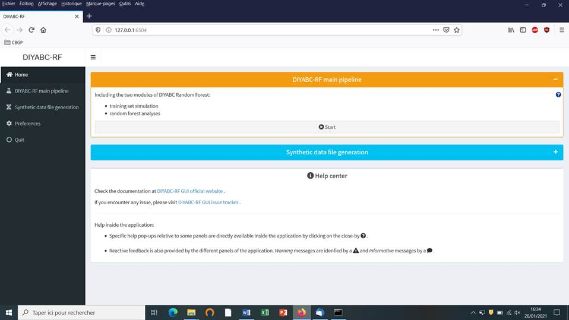<![endif]>

<![if !supportLists]>&middot;&nbsp;&nbsp;&nbsp;&nbsp;&nbsp;&nbsp;
<![endif]>Access to main functionalities:
you can access to the two main functionalities of the program (i.e. training
set simulation and random forest analyses) in two ways: (i)
by clicking on the &#8220;Start&#8221; button in the middle of the Home panel
or (ii) by clicking on the &#8220;DIYABC-RF main pipeline&#8221; button in the
upper-left part of the panel.

<![if !supportLists]>&middot;&nbsp;&nbsp;&nbsp;&nbsp;&nbsp;&nbsp;
<![endif]>Access to other
functionalities: 

<![if !supportLists]>-&nbsp;&nbsp;&nbsp;&nbsp;&nbsp;&nbsp;&nbsp;
<![endif]>To access to the panels
allowing generating files corresponding to full in silico datasets (also called
pseudo-observed datasets) click on the &#8220;Synthetic data file
generation&#8221; button in the middle of the panel or on the &#8220;Synthetic
data file generation&#8221; button in the upper-left part of the panel.

<![if !supportLists]>-&nbsp;&nbsp;&nbsp;&nbsp;&nbsp;&nbsp;&nbsp;
<![endif]>Clicking on the
&#8220;Preference&#8221; button (upper left) gives access to the following
screen

<!--[if gte vml 1]><v:shape id="Image_x0020_29"
 o:spid="_x0000_i1060" type="#_x0000_t75" style='width:554.4pt;height:312pt;
 visibility:visible;mso-wrap-style:square'>
 <v:imagedata src="DiyabcRandomForestUserManual21-01-2021_fichiers/image077.png"
  o:title=""/>
</v:shape><![endif]--><![if !vml]>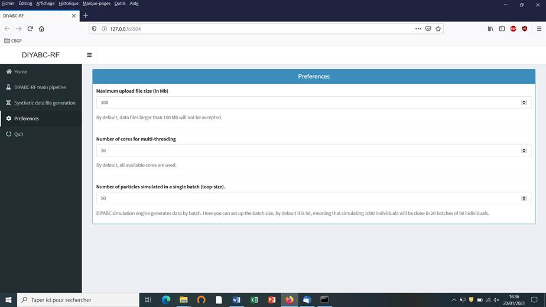<![endif]>

The different
options proposed are self-meaning. Default values can be changed by the user.
Note that the loop-size option corresponds to the number of simulated datasets
distributed over all computer threads and stored in RAM before writing them
into the training set file (reftableRF.bin).

<h2><a name="_Toc62127964">5.4 How to generate a new </a>IndSeq SNP training set</h2>

<h2><a name=defining-a-new-project>5.4.1
Step 1: defining a new </a>IndSeq SNP project<o:p></o:p></h2>

Defining a new project requires
different steps which are not strictly the same whether the data are
microsatellites/DNA sequences (MSS) or SNP (IndSeq or
PoolSeq). Let&#8217;s start with an IndSeq SNP project. Click on the &#8220;Start&#8221; button
in the middle of the Home panel (or on the &#8220;DIYABC-RF main
pipeline&#8221; button). The following panel appears.

<!--[if gte vml 1]><v:shape id="Image_x0020_32" o:spid="_x0000_i1059"
 type="#_x0000_t75" style='width:555.6pt;height:312.6pt;visibility:visible;
 mso-wrap-style:square'>
 <v:imagedata src="DiyabcRandomForestUserManual21-01-2021_fichiers/image079.png"
  o:title=""/>
</v:shape><![endif]--><![if !vml]>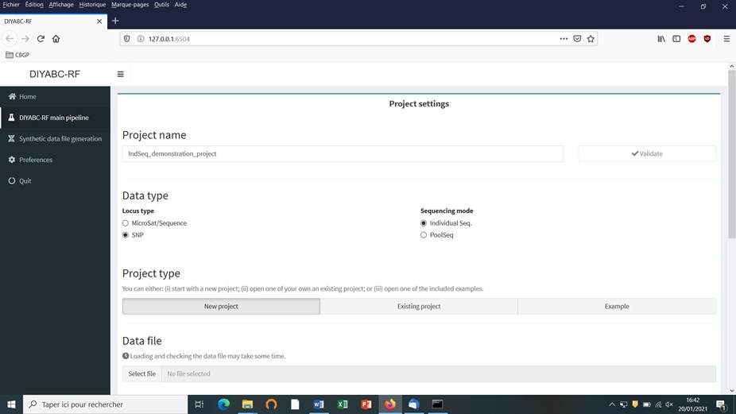<![endif]>

<![if !supportLists]>&middot;&nbsp;&nbsp;&nbsp;&nbsp;&nbsp;&nbsp;
<![endif]>Enter and validate a project
name in the &#8220;Project name&#8221; window (here IndSeq_demonstration_project)

<![if !supportLists]>&middot;&nbsp;&nbsp;&nbsp;&nbsp;&nbsp;&nbsp;
<![endif]>Select the Data type including
the locus type (Microsat/sequence or SNP) and the
sequencing mode (for SNP only; IndSeq or PoolSeq). Here select SNP and Individual Seq.

<![if !supportLists]>&middot;&nbsp;&nbsp;&nbsp;&nbsp;&nbsp;&nbsp;
<![endif]>Select the &#8220;New
project&#8221; button as we want to implement a new project from scratch.

<h2><a name="_Toc62127966">5.4.2 Step
2: choosing the data file</a><o:p></o:p></h2>

<![if !supportLists]>&middot;&nbsp;&nbsp;&nbsp;&nbsp;&nbsp;&nbsp;
<![endif]>Choose a data file (an IndSeq format data file in this case) using the
&#8220;Select file&#8221; browser (here INDSNP_sim_dataset_4POP_001.snp). A
large size dataset might take some times to be uploaded and checked by the
program. A short summary of the specificities of the loaded datafile appears:
here the total number of loci (30000), the minimum allele frequency chosen for
simulation (MAF=0.05), the sex ratio indicated by the user (NM=1NF), the total
number of individuals and populations, the locus type and their corresponding
numbers (A= autosomal, M=mitochondrial&#8230;; see section 7.1 for details
about datafile format), and the number of available loci
based on the MAF criterion (here 15617 &lt;A&gt;, as14383 loci, including 0
monomorphic loci, have been filtered out by the program after scanning the
proposed observed dataset).

<!--[if gte vml 1]><v:shape id="Image_x0020_33"
 o:spid="_x0000_i1058" type="#_x0000_t75" style='width:555.6pt;height:312.6pt;
 visibility:visible;mso-wrap-style:square'>
 <v:imagedata src="DiyabcRandomForestUserManual21-01-2021_fichiers/image081.png"
  o:title=""/>
</v:shape><![endif]--><![if !vml]><![endif]>

<![if !supportLists]>&middot;&nbsp;&nbsp;&nbsp;&nbsp;&nbsp;&nbsp;
<![endif]>A &#8220;Project set up is
ok&#8221; message appears at the bottom of the panel if all items have gone
correctly. You can then go the next steps by clicking on the large blue color
&#8220;Training set simulation&#8221; &#8220;+&#8221; button&#8221;. The
following panel appears.

<!--[if gte vml 1]><v:shape id="Image_x0020_37" o:spid="_x0000_i1057"
 type="#_x0000_t75" style='width:555.6pt;height:312.6pt;visibility:visible;
 mso-wrap-style:square'>
 <v:imagedata src="DiyabcRandomForestUserManual21-01-2021_fichiers/image083.png"
  o:title=""/>
</v:shape><![endif]--><![if !vml]><![endif]>

<h2><a name="_Toc62127967">5.4.3 Step
3: Inform the Historical model</a><o:p></o:p></h2>

Click on the &#8220;Add&#8221; button
of the &#8220;Define historical models&#8221; section. The following panel
appears:

<!--[if gte vml 1]><v:shape id="Image_x0020_38" o:spid="_x0000_i1056"
 type="#_x0000_t75" style='width:475.2pt;height:267.6pt;visibility:visible;
 mso-wrap-style:square'>
 <v:imagedata src="DiyabcRandomForestUserManual21-01-2021_fichiers/image085.png"
  o:title=""/>
</v:shape><![endif]--><![if !vml]><![endif]>

Write the code of a first scenario
(scenario 1) in the edit window &#8221;Describe your
scenario&#8221; and click on the &#8220;Validate&#8221; button. 

<![if !supportLists]>&middot;&nbsp;&nbsp;&nbsp;&nbsp;&nbsp;&nbsp;
<![endif]>If we click on the &#8220;Draw
scenario&#8221; button, the logic of the scenario is checked and if it is found
OK, and if the scenario is draw-able, a graphical representation of the
scenario appears. You can save it by clicking on the &#8220;Save image&#8221;
button. Figures are saved in 'fig' sub-folder in the project directory.
Possible extensions are: 'eps', 'ps', 'tex', 'pdf', 'jpeg', 'tiff', 'png',
'bmp', 'svg'.

<!--[if gte vml 1]><v:shape id="Image_x0020_42" o:spid="_x0000_i1055"
 type="#_x0000_t75" style='width:483.6pt;height:272.4pt;visibility:visible;
 mso-wrap-style:square'>
 <v:imagedata src="DiyabcRandomForestUserManual21-01-2021_fichiers/image087.png"
  o:title=""/>
</v:shape><![endif]--><![if !vml]><![endif]>

<![if !supportLists]>&middot;&nbsp;&nbsp;&nbsp;&nbsp;&nbsp;&nbsp;
<![endif]>The &#8220;Priors and
conditions&#8221; frame which appears below allows choosing the prior distribution
of each parameter of the scenario. A parameter is anything in the scenario that
is not a keyword (here sample, merge and split),
nor a numeric value. In our example scenario, parameters are hence: N1, N2, N3,
N4, ra, t21, t32 and t423. We choose a
uniform distribution and change the min and max values (100 and 10000 for N
values - 10 and 1000 for t values; see panel below). 

<!--[if gte vml 1]><v:shape id="Image_x0020_43" o:spid="_x0000_i1054"
 type="#_x0000_t75" style='width:524.4pt;height:294.6pt;visibility:visible;
 mso-wrap-style:square'>
 <v:imagedata src="DiyabcRandomForestUserManual21-01-2021_fichiers/image089.png"
  o:title=""/>
</v:shape><![endif]--><![if !vml]>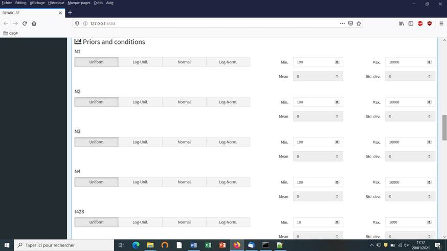<![endif]>

<![if !supportLists]>&middot;&nbsp;&nbsp;&nbsp;&nbsp;&nbsp;&nbsp;
<![endif]>&nbsp;In our example, we also need to specify
conditions for the priors on t21, t32 and t432 such that t21&gt;t32 and t32&gt;t423.

<!--[if gte vml 1]><v:shape id="Image_x0020_55" o:spid="_x0000_i1053"
 type="#_x0000_t75" style='width:490.8pt;height:276pt;visibility:visible;
 mso-wrap-style:square'>
 <v:imagedata src="DiyabcRandomForestUserManual21-01-2021_fichiers/image091.png"
  o:title=""/>
</v:shape><![endif]--><![if !vml]><![endif]>

To do this we write t21&gt;t32 and t32&gt;t432
on two successive lines in the &#8220;Condition setting&#8221; frame. As noted
in the panel, conditions should have the following format: XX&lt;YY. where
&#8216;XX' and 'YY' are parameters of the same type. You can use the standard
comparison signs: '&gt;', '&gt;=', '&lt;', '=&lt;'. It is worth stressing that
the omission of such conditional constraints on merge times (cf.&nbsp;a
population needs to exist in the past to allow coalescence events in it) is one
of the most frequent implementation error made by DIYABC-RF users. If forgotten
a message &quot;Error in simulation process: check your scenarios, priors and
conditions&quot;&quot; appears. Note that the occurrence of a too large number
of time conditional constraints within a scenario may substantially slow down
simulations as a valid t parameter vector will be retain and run only once all
conditions are fulfilled.

<![if !supportLists]>&middot;&nbsp;&nbsp;&nbsp;&nbsp;&nbsp;&nbsp;
<![endif]>We then can <u>add some other
scenarios in additional windows</u> by clicking on the button &#8220;Add&#8221;
(one or several times if one wants to add a single or several other scenarios).
In the present example, we simulate datasets from six different scenarios that
we want to compare (see Collin et al. 2020 example based on pseudo-observed
datasets for details), hence the six scenario windows that we have completed
with instructions for each one. For the sixth scenario the panel looks like
this:

<!--[if gte vml 1]><v:shape id="Image_x0020_62" o:spid="_x0000_i1052"
 type="#_x0000_t75" style='width:555.6pt;height:312.6pt;visibility:visible;
 mso-wrap-style:square'>
 <v:imagedata src="DiyabcRandomForestUserManual21-01-2021_fichiers/image093.png"
  o:title=""/>
</v:shape><![endif]--><![if !vml]>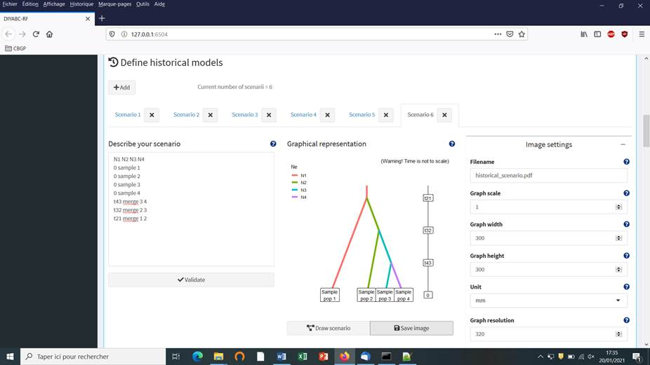<![endif]>

Complete time
conditions for the six scenarios are: t21&gt;t32,
t42&lt;t21, t43&lt;t32, t32&gt;t423, t431&lt;t32 and t421&lt;t21<o:p></o:p>

<a name="_Toc62127968"><b>5.4.4 Step 4: Inform number of loci to simulate (and
chromosome type)</b></a><b><o:p></o:p></b>

Choose the number of SNP locus that you
want to simulate for each chromosome type define in the data file (<i
style='mso-bidi-font-style:normal'>A</i> for autosomal diploid loci, <i
style='mso-bidi-font-style:normal'>H</i> for autosomal haploid loci, <i
style='mso-bidi-font-style:normal'>X</i> for X-linked or haplo-diploid loci,<i
style='mso-bidi-font-style:normal'> Y</i> for Y-linked loci and <i
style='mso-bidi-font-style:normal'>M</i> for mitochondrial loci; see section
7.1.1). Here we have only type &lt;A&gt; SNP loci. According to our own
experience, analyzing (evolutionary neutral) scenarios using 5000 to 20000 SNP
loci is sufficient to obtain robust results. In this example, we choose to
consider simulations based on a subset of 5000 SNP loci (with MAF=0.05 as
indicated previously) taken in order from the <u>first</u> SNP locus of the
data file, by replacing 30000 by 5000 in the corresponding frame. Click on the
button &#8220;Validate&#8221;. 

It is worth stressing that choosing a
subset of 5000 SNP loci taken from the SNP locus 5001 of the data file would
lead to a training set generated from a set of 5000 loci completely independent
from the previous one. Generating by this way different training sets is a way
to process independent analyses of a given dataset (a sufficiently large number
of SNP loci available in the observed dataset is obviously needed to do that).

<!--[if gte vml 1]><v:shape id="Image_x0020_68" o:spid="_x0000_i1051"
 type="#_x0000_t75" style='width:531.6pt;height:298.8pt;visibility:visible;
 mso-wrap-style:square'>
 <v:imagedata src="DiyabcRandomForestUserManual21-01-2021_fichiers/image095.png"
  o:title=""/>
</v:shape><![endif]--><![if !vml]><![endif]>

<a name="_Toc62127969"><b>5.4.5 Step 5: Summary statistics</b></a><b><o:p></o:p></b>

In the present
version of the program, all available summary statistics are computed as
mentioned in the interface below the &#8220;Summary statistics&#8221; item (see
previous panel-copy) and as detailed when clicking on the button &#8220;?&#8221;
on the right:<o:p></o:p>

<o:p>&nbsp;</o:p>

<b style='mso-bidi-font-weight:normal'>For both IndSeq and PoolSeq
SNP loci, the following set of summary statistics has been implemented.<o:p></o:p></b>

<o:p>&nbsp;</o:p>

1. &nbsp;&nbsp;&nbsp;&nbsp;&nbsp;&nbsp;&nbsp;&nbsp; <i
style='mso-bidi-font-style:normal'>Proportion of monomorphic loci</i> for each
population, as well as for each pair and triplet of populations (ML1p, ML2p,
ML3p)

<o:p>&nbsp;</o:p>

<b style='mso-bidi-font-weight:normal'>Mean and variance (over loci) values are computed for all subsequent
summary statistics. <o:p></o:p></b>

2. &nbsp;&nbsp;&nbsp;&nbsp;&nbsp;&nbsp;&nbsp;&nbsp; <i
style='mso-bidi-font-style:normal'>Heterozygosity</i> for each population (HW)
and for each pair of populations (HB)

3.&nbsp;&nbsp;&nbsp;&nbsp;&nbsp;&nbsp;&nbsp;&nbsp;&nbsp; <i
style='mso-bidi-font-style:normal'>FST</i>-<i style='mso-bidi-font-style:normal'>related
statistics</i> for each population (FST1), for each pair (FST2), triplet
(FST3), quadruplet (FST4) and overall (FSTG) populations (when the dataset
includes more than four populations)

4. &nbsp;&nbsp;&nbsp;&nbsp;&nbsp;&nbsp;&nbsp;&nbsp; <i
style='mso-bidi-font-style:normal'>Patterson&#8217;s f-statistics</i> for each
triplet (f3-statistics; F3) and quadruplet (f4-statistics; F4) of populations 

5. &nbsp;&nbsp;&nbsp;&nbsp;&nbsp;&nbsp;&nbsp;&nbsp; <i style='mso-bidi-font-style:normal'>Nei&#8217;s</i><i
style='mso-bidi-font-style:normal'> distance</i> (NEI) for each pair of
populations

6. &nbsp;&nbsp;&nbsp;&nbsp;&nbsp;&nbsp;&nbsp;&nbsp; <i
style='mso-bidi-font-style:normal'>Maximum likelihood coefficient of admixture</i>
(AML) computed for each triplet of populations.

<o:p>&nbsp;</o:p>

Note the short code
name for each type of summary statistics (MLP1p, HW, FST2, F3,&#8230;).
Such code names of statistics (plus the suffix m and v for mean and variance
over loci, respectively; see section 2.6.3) will be used in most files produced
by the program, including the key files headerRF.txt, reftableRF.bin
and statobsRF.txt.

<h2><a name=building-the-reference-table>5.4.6
Step 6: Simulate the training set</a><o:p></o:p></h2>

You can access the &#8220;training set
simulation&#8221; module by clicking on the corresponding + button on the far
right of the box blue title bar &#8220;Training set simulation&#8221;. The
following &#8220;Run&#8221; panel appears.

<!--[if gte vml 1]><v:shape id="Image_x0020_69" o:spid="_x0000_i1050"
 type="#_x0000_t75" style='width:555.6pt;height:312.6pt;visibility:visible;
 mso-wrap-style:square'>
 <v:imagedata src="DiyabcRandomForestUserManual21-01-2021_fichiers/image097.png"
  o:title=""/>
</v:shape><![endif]--><![if !vml]>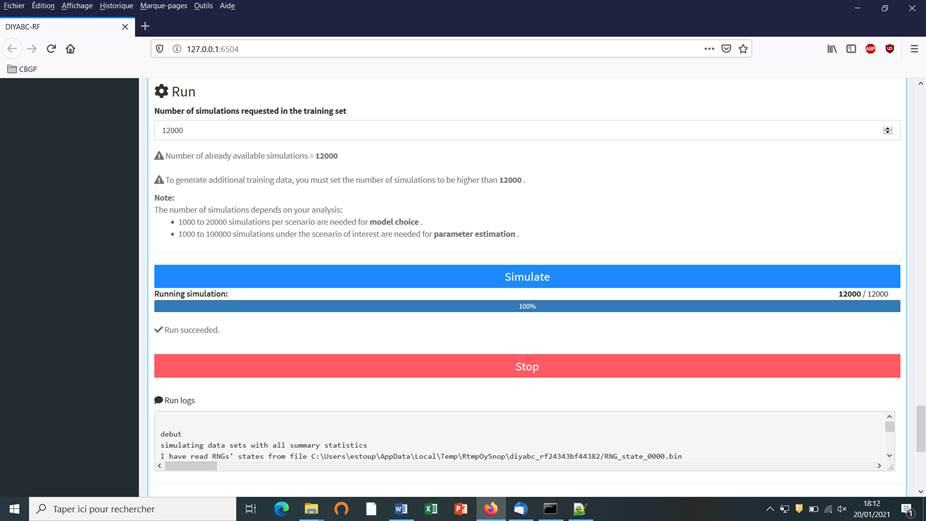<![endif]>&nbsp;

<![if !supportLists]>&middot;&nbsp;&nbsp;&nbsp;&nbsp;&nbsp;&nbsp;
<![endif]>Indicate the required number of
datasets to simulate in the training set: we here change the default value of
100 into 12000 (in order to simulate 2000 datasets for each of the six
scenarios)

<![if !supportLists]>&middot;&nbsp;&nbsp;&nbsp;&nbsp;&nbsp;&nbsp;
<![endif]>Launch the generation of the
simulated datasets of the training set by clicking on the large blue color
button &#8220;Simulate&#8221;. The number of datasets already simulated is
given in the &#8220;Running simulation&#8221; progress bar below.

<![if !supportLists]>&middot;&nbsp;&nbsp;&nbsp;&nbsp;&nbsp;&nbsp;
<![endif]>You can stop the generation of
simulated datasets by clicking on the &#8220;STOP&#8221; button. Both a &#8220;Run
succeeded&#8221; message appears when all requested simulations have been
processed.

<![if !supportLists]>&middot;&nbsp;&nbsp;&nbsp;&nbsp;&nbsp;&nbsp;
<![endif]><u>Do not forget to click on
the &#8220;Save&#8221; button in the &#8220;Project administration&#8221; lower
panel to implement and save a concatenated zip file including various input and
output files</u> (see section 7 for a description of
the content of some of those files) on your computer. The name of the
implemented/saved concatenated .zip file is the one given at the start in the
&#8220;Project name&#8221; window (here IndSeq_demonstration_project).

<!--[if gte vml 1]><v:shape id="Image_x0020_70" o:spid="_x0000_i1049"
 type="#_x0000_t75" style='width:555.6pt;height:312.6pt;visibility:visible;
 mso-wrap-style:square'>
 <v:imagedata src="DiyabcRandomForestUserManual21-01-2021_fichiers/image099.png"
  o:title=""/>
</v:shape><![endif]--><![if !vml]><![endif]>

<![if !supportLists]>&middot;&nbsp;&nbsp;&nbsp;&nbsp;&nbsp;&nbsp;
<![endif]>Warning: The button &#8220;Reset&#8221;
at the very bottom part of the &#8220;Project administration&#8221; panel
restart the pipeline from scratch removing all configurations previously set up
and all data and result files generated.

<h2><a name="_Toc62127971">5.4.7 Step
7: Prior-scenario checking PRE-ANALYSIS (optional but recommended)</a><o:p></o:p></h2>

Before performing a full ABC-RF analysis
on a large size training set, we advise using the prior-scenario checking
option on a training set of small size (e.g. including 500 to 1000 simulated
dataset per scenarios). As a matter of fact, this pre-analysis option is a
convenient way to reveal potential mis-specification of models (scenarios)
and/or prior distributions of parameters (and correct it). This action requires
a training set file (`reftableRF.bin`) and a
statobsRF.txt file either generated when clicking on 'Simulate' or uploaded
with an existing project. When clicking on the button <u>&#8220;Run&#8221; of
the &#8220;Prior and scenario checking&#8221; option (see previous/above panel
copy)</u> the program will use the statobsRF.txt and reftableRF.bin
files to generate two specific outputs:

<![if !supportLists]>&middot;&nbsp;&nbsp;&nbsp;&nbsp;&nbsp;&nbsp;
<![endif]>A Principal Component Analysis
(PCA) representing on 2-axes plans the simulated dataset from the training set
and the observed dataset as graphical output. Note that this figure is somewhat
similar in its spirit to the graphical output
LDA_training_set_and_obs_dataset.png obtained when running the scenario choice
option in &#8220;Random Forest Analyses&#8221;. The latter output is different,
however, as it corresponds to the projection of the datasets from the training
set linear discriminant analysis (LDA) axes (see section 7.3 for details).

<![if !supportLists]>&middot;&nbsp;&nbsp;&nbsp;&nbsp;&nbsp;&nbsp;
<![endif]>A numerical output file, named
pcaloc1_locate.txt, which includes for each summary statistics and for each
scenario, the proportion of simulated data (considering the total training set)
that have a summary statistics value below the value of the observed dataset. A
star indicates proportions lower than 5% or greater than 95% (two stars, &lt;1%
or &gt;1%; three stars, &lt;0.1% or &gt;0.1%). The presence of such star
symbols is a sign of substantial mismatch between the observed dataset and the
simulated datasets. The latter numerical results can help users to
reformulating the compared scenarios and/or the associated prior distributions
in order to achieve some compatibility (see e.g. Cornuet
et al. 2010). If only a few stars are observed at a few summary statistics for
one or several scenarios, one can conclude that prior-scenario conditions are
suitable enough to further process Random Forest analysis, and this potentially
on a training set including more simulated datasets.

<h2><a name="_Toc62127972">5.5 How to generate a new </a>PoolSeq SNP training set</h2>

Follow the same five steps described in
section 5.4 for IndSeq SNPs.

<![if !supportLists]>&middot;&nbsp;&nbsp;&nbsp;&nbsp;&nbsp;&nbsp;
<![endif]><i style='mso-bidi-font-style:normal'>Step 1</i>: Defining a new PoolSeq SNP project &agrave; see section 5.4.1 

Click on the &#8220;Launch project&#8221;
button of the home screen. Select SNP as project type and PoolSeq
as sequencing mode 

<![if !supportLists]>&middot;&nbsp;&nbsp;&nbsp;&nbsp;&nbsp;&nbsp;
<![endif]><i style='mso-bidi-font-style:normal'>Step 2</i>: Choosing the data file &agrave; see section
5.4.2 and select a dataset file characterized by a PoolSeq
format (format detailed in section 7.1.2).

<![if !supportLists]>&middot;&nbsp;&nbsp;&nbsp;&nbsp;&nbsp;&nbsp;
<![endif]><i style='mso-bidi-font-style:normal'>Step 3</i>: Inform the Historical model &agrave; see section
5.4.3 

<![if !supportLists]>&middot;&nbsp;&nbsp;&nbsp;&nbsp;&nbsp;&nbsp;
<![endif]><i style='mso-bidi-font-style:normal'>Step 4</i>: Inform chromosome type and
number of loci &agrave; see
section 5.4.4 

Note: The panel for PoolSeq
SNPs is simpler than for IndSeq SNPs because PoolSeq SNPs are considered as located on <b
style='mso-bidi-font-weight:normal'>autosomal chromosomes only</b>.

<![if !supportLists]>&middot;&nbsp;&nbsp;&nbsp;&nbsp;&nbsp;&nbsp;
<![endif]><i style='mso-bidi-font-style:normal'>Step 5</i>: Summary statistics: &agrave; see section
5.4.5

<![if !supportLists]>&middot;&nbsp;&nbsp;&nbsp;&nbsp;&nbsp;&nbsp;
<![endif]><i style='mso-bidi-font-style:normal'>Step 6</i>: Simulate the training set &agrave; see section
5.4.6 

<![if !supportLists]>&middot;&nbsp;&nbsp;&nbsp;&nbsp;&nbsp;&nbsp;
<![endif]><i style='mso-bidi-font-style:normal'>Step 7</i> (optional but recommended):
Prior-scenario checking PRE-ANALYSIS &agrave; see section 5.4.7

<h2><a name="_Toc62127973">5.6 How to generate a new
microsatellite (and/or DNA sequence) training set</a></h2>

Follow the same steps described in
section 5.4 for IndSeq SNPs.

<![if !supportLists]>&middot;&nbsp;&nbsp;&nbsp;&nbsp;&nbsp;&nbsp;
<![endif]><i style='mso-bidi-font-style:normal'>Step 1</i>: Defining a new or
microsatellites/DNA sequences project &agrave; see section 5.4.1 

Click on the
&#8220;Launch project&#8221; button of the home screen. Select Microsat/Sequences as project type (not any sequencing mode
is needed)

<![if !supportLists]>&middot;&nbsp;&nbsp;&nbsp;&nbsp;&nbsp;&nbsp;
<![endif]><i style='mso-bidi-font-style:normal'>Step 2</i>: Choosing the data file &agrave; see section
5.4.2 and select a dataset file characterized by a Microsatellite and/or DNA
Sequences format (format detailed in section 7.1.3).

<![if !supportLists]>&middot;&nbsp;&nbsp;&nbsp;&nbsp;&nbsp;&nbsp;
<![endif]><i style='mso-bidi-font-style:normal'>Step 3</i>: Inform the Historical model &agrave; see section
5.4.3 

<![if !supportLists]>&middot;&nbsp;&nbsp;&nbsp;&nbsp;&nbsp;&nbsp;
<![endif]><b style='mso-bidi-font-weight:normal'><i
style='mso-bidi-font-style:normal'>Step 4</i>: The panel &#8220;Inform chromosome type and number of loci&#8221;
is replaced by the panel &#8220;Inform the genetic model&#8221; </b><b
style='mso-bidi-font-weight:normal'>&agrave; see details below in section 5.6.1</b>

<![if !supportLists]>&middot;&nbsp;&nbsp;&nbsp;&nbsp;&nbsp;&nbsp;
<![endif]><b style='mso-bidi-font-weight:normal'><i
style='mso-bidi-font-style:normal'>Step 5</i>: Summary statistics: different sets of summary statistics are
computed as compared to SNP summary statistics </b><b style='mso-bidi-font-weight:
normal'>&agrave; see
details below in section 5.6.2<o:p></o:p></b>

<![if !supportLists]>&middot;&nbsp;&nbsp;&nbsp;&nbsp;&nbsp;&nbsp;
<![endif]><i style='mso-bidi-font-style:normal'>Step 6</i>: Simulate the training set &agrave; see section
5.4.6 

<![if !supportLists]>&middot;&nbsp;&nbsp;&nbsp;&nbsp;&nbsp;&nbsp;
<![endif]><i style='mso-bidi-font-style:normal'>Step 7</i> (optional but recommended):
Prior-scenario checking PRE-ANALYSIS &agrave; see section 5.4.7

<h3 style='margin-left:18.0pt'><a name="_Toc62127974">5.6.1
Step 4: Inform the genetic model</a> </h3>

<b style='mso-bidi-font-weight:
normal'><u>For microsatellite markers</u>: Informing the genetic model can be done using the following panels
(implemented here from a toy example including microsatellites + DNA sequences named
TOY_EXAMPLE2_microsatellites_DNAsequence_two_pops_ancient_admixture; see
section 10. TOY EXAMPLES for details about this toy example).<o:p></o:p></b>

<![if !supportLists]>&middot;&nbsp;&nbsp;&nbsp;&nbsp;&nbsp;&nbsp;
<![endif]>First:&nbsp; define the number of groups of markers
(a group been defined by different mutational modalities). By default, all
microsatellite loci are grouped together, same for all DNA sequence loci. If
you want to define more than a single group then configure
the number of groups (cf button &#8220;Add
group&#8221;) and then assign each locus to one of those groups using the Group
arrow on the right.

<!--[if gte vml 1]><v:shape id="Image_x0020_16" o:spid="_x0000_i1048"
 type="#_x0000_t75" style='width:442.2pt;height:248.4pt;visibility:visible;
 mso-wrap-style:square'>
 <v:imagedata src="DiyabcRandomForestUserManual21-01-2021_fichiers/image101.png"
  o:title=""/>
</v:shape><![endif]--><![if !vml]><![endif]><o:p></o:p>

<![if !supportLists]>&middot;&nbsp;&nbsp;&nbsp;&nbsp;&nbsp;&nbsp; <![endif]>Second: define the motif size and
range of motif variation. By
default, all microsatellite loci are supposed to be dinucleotidic
(motif = 2) with a range of 40.<o:p></o:p>

<!--[if gte vml 1]><v:shape id="Image_x0020_17" o:spid="_x0000_i1047"
 type="#_x0000_t75" style='width:440.4pt;height:247.8pt;visibility:visible;
 mso-wrap-style:square'>
 <v:imagedata src="DiyabcRandomForestUserManual21-01-2021_fichiers/image103.png"
  o:title=""/>
</v:shape><![endif]--><![if !vml]><![endif]><o:p></o:p>

It is worth
stressing that the values for motif size and allelic range are just default
values and do not necessarily correspond to the actual data. The user who knows
the real values for its data is required to set the correct values at this
stage. If the range is too short to include all values observed in the analyzed
dataset, a message appears in a box asking to enlarge the corresponding allelic
range. Note that the allelic range is measured in number of motifs, so that a
range of 40 for a motif length of 2 bp means that the difference between the
smallest and the longest alleles should not exceed 80 bp. It is worth stressing
that the indicated allelic range (expressed in number of continuous allelic
states) corresponds to a potential range which is usually larger than the range
observed from the analyzed dataset (cf.&nbsp;all possible allelic states have usually
not been sampled). In practice it is difficult to assess the actual
microsatellite constraints on the allelic range; to do that one needs allelic
data from several distantly related populations/sub-species as well as related
species which is rarely the case(see Pollack et al. 1998; Estoup et al. 2002).
We achieved a meta-analysis from numerous primer notes documenting the
microsatellite allelic ranges of many (i.e.&nbsp;&gt; 100) different species
(and related species). We used the corrective statistical treatment on such
data proposed by (Pollack et al. 1998). Our results pointed to a mean
microsatellite allelic range of 40 continuous states (hence the default allelic
range value of 40 mentioned in the program). We also found, however, that range
values greatly varied among species and among loci within species (unpublished
results). We therefore recommend the following pragmatic behavior when
considering the allelic range of your analysed
microsatellite dataset: (i) if the difference in
number of motif of your locus is &lt; 40 motifs in the analysed
dataset then leave the default allelic range value of 40. (ii) if the
difference in number of motif of your locus is &gt;40 motifs in your dataset
then take Max_allele_size <!--[if gte msEquation 12]><m:oMath><i
 style='mso-bidi-font-style:normal'><m:r>-</m:r></i></m:oMath><![endif]--><![if !msEquation]><!--[if gte vml 1]><v:shape
 id="_x0000_i1025" type="#_x0000_t75" style='width:9pt;height:22.8pt'>
 <v:imagedata src="DiyabcRandomForestUserManual21-01-2021_fichiers/image105.png"
  o:title="" chromakey="white"/>
</v:shape><![endif]--><![if !vml]><![endif]><![endif]>&nbsp;Min_allele_size)/motif
size + say 10 additional motifs to re-define the
allelic range of the locus in the corresponding DIYABC panel (e.g.&nbsp;(200 nu
<!--[if gte msEquation 12]><m:oMath><i style='mso-bidi-font-style:normal'><m:r>-</m:r></i></m:oMath><![endif]--><![if !msEquation]><!--[if gte vml 1]><v:shape
 id="_x0000_i1025" type="#_x0000_t75" style='width:9pt;height:22.8pt'>
 <v:imagedata src="DiyabcRandomForestUserManual21-01-2021_fichiers/image105.png"
  o:title="" chromakey="white"/>
</v:shape><![endif]--><![if !vml]><![endif]><![endif]>&nbsp;100 nu)/2
+ 10 = 50 + 10 = 60 as allelic range).

<![if !supportLists]>&middot;&nbsp;&nbsp;&nbsp;&nbsp;&nbsp;&nbsp;
<![endif]>Third: adjust the prior
specificities of mutational modalities as you want using the corresponding buttons
in the panel below. Otherwise keep the default values as the latter have been
reported for many eukaryote species (e.g. Estoup et al. 2002; but see Fraimout et al. 2017).

<!--[if gte vml 1]><v:shape id="Image_x0020_19" o:spid="_x0000_i1046"
 type="#_x0000_t75" style='width:555.6pt;height:312.6pt;visibility:visible;
 mso-wrap-style:square'>
 <v:imagedata src="DiyabcRandomForestUserManual21-01-2021_fichiers/image107.png"
  o:title=""/>
</v:shape><![endif]--><![if !vml]><![endif]>

<b style='mso-bidi-font-weight:normal'><u><o:p>&nbsp;</o:p></u></b>

<b style='mso-bidi-font-weight:normal'><u>For DNA sequence markers</u>: Informing the
genetic model can be done using the following panels (implemented here from the
same toy example as above). <o:p></o:p></b>

<![if !supportLists]>&middot;&nbsp;&nbsp;&nbsp;&nbsp;&nbsp;&nbsp;
<![endif]>We need to define at least one
group of DNA sequence loci. 

<!--[if gte vml 1]><v:shape id="Image_x0020_18"
 o:spid="_x0000_i1045" type="#_x0000_t75" style='width:555.6pt;height:312.6pt;
 visibility:visible;mso-wrap-style:square'>
 <v:imagedata src="DiyabcRandomForestUserManual21-01-2021_fichiers/image109.png"
  o:title=""/>
</v:shape><![endif]--><![if !vml]><![endif]>

<![if !supportLists]>&middot;&nbsp;&nbsp;&nbsp;&nbsp;&nbsp;&nbsp;
<![endif]>Suppose that we want all DNA
sequence loci in the same group because we consider that they all have similar
mutational modalities. We then put &#8220;2&#8221; in the button
&#8220;Group&#8221; for all loci (Group 1 is for the previous microsatellite
markers). Otherwise you can associate some loci to additional groups (after
clicking on the button &#8220;Add group&#8221;) if you consider that such loci
have different mutational modalities (for instance here Locus_S_M_16_).

<![if !supportLists]>&middot;&nbsp;&nbsp;&nbsp;&nbsp;&nbsp;&nbsp;
<![endif]>Adjust the prior specificities
of mutational modalities (for the different DNA sequence groups you have
defined previously) using the corresponding buttons in the panel below.
Otherwise keep the default values as the latter have been reported for many
eukaryote species (e.g. Cornuet et al. 2010).

<!--[if gte vml 1]><v:shape id="Image_x0020_21"
 o:spid="_x0000_i1044" type="#_x0000_t75" style='width:510pt;height:286.8pt;
 visibility:visible;mso-wrap-style:square'>
 <v:imagedata src="DiyabcRandomForestUserManual21-01-2021_fichiers/image111.png"
  o:title=""/>
</v:shape><![endif]--><![if !vml]><![endif]>

The default
values are indicated in the panel. Note that the default mean mutation rate is
not suited to mitochondrial DNA which generally evolves at a faster rate than
nuclear DNA (Haag-Liautard et al., 2008). So we set its value to 10-8. For all other
mutation model parameters, one can just keep the default values. <u>See section
2.4.2 &#8220;DNA sequence loci&#8221; for details about the mutation models
proposed for DNA sequences</u>.

<![if !supportLists]>&middot;&nbsp;&nbsp;&nbsp;&nbsp;&nbsp;&nbsp;
<![endif]>Before launching a run to simulate the training set, do not forget to <u>validate
your microsatellite and/or DNA settings by clicking on the blue-color button
&#8220;Validate&#8221;</u>. Indicate the number of simulations in the
corresponding button (here 30000) and click on the button
&#8220;Simulate&#8221; to launch the simulation of the training set.<o:p></o:p>

<!--[if gte vml 1]><v:shape id="Image_x0020_22" o:spid="_x0000_i1043"
 type="#_x0000_t75" style='width:457.8pt;height:256.8pt;visibility:visible;
 mso-wrap-style:square'>
 <v:imagedata src="DiyabcRandomForestUserManual21-01-2021_fichiers/image113.png"
  o:title=""/>
</v:shape><![endif]--><![if !vml]><![endif]>

<o:p>&nbsp;</o:p>

<h3><a name="_Toc62127975">5.6.2 Step 5: Summary statistics</a></h3>

In the present
version of the program, <u>all</u> available summary statistics are computed as
mentioned in the interface below the &#8220;Summary statistics&#8221; item (see
previous panel-copy) and as detailed when clicking on the button &#8220;?&#8221;
on the right:<o:p></o:p>

<b style='mso-bidi-font-weight:normal'><u>For microsatellite loci<o:p></o:p></u></b>

The following set of
summary statistics has been implemented. 

<o:p>&nbsp;</o:p>

Single sample statistics:

1. mean number of alleles across loci (NAL)

2. mean gene diversity across loci (HET)

3. mean allele size variance across loci (VAR)

3. mean M index across loci (MGW)

<o:p>&nbsp;</o:p>

Two sample statistics:

1. mean number of alleles across loci (two samples) (N2P)

2. mean gene diversity across loci (two samples) (H2P)

3. mean allele size variance across loci (two samples) (V2P)

<!--[if gte msEquation 12]><m:oMath><m:sSub><m:sSubPr><m:ctrlPr></m:ctrlPr></m:sSubPr><m:e><i
   style='mso-bidi-font-style:normal'><m:r>3.</m:r><m:r>F</m:r></i></m:e><m:sub><i
   style='mso-bidi-font-style:normal'><m:r>ST</m:r></i></m:sub></m:sSub></m:oMath><![endif]--><![if !msEquation]><!--[if gte vml 1]><v:shape
 id="_x0000_i1025" type="#_x0000_t75" style='width:27.6pt;height:13.8pt'>
 <v:imagedata src="DiyabcRandomForestUserManual21-01-2021_fichiers/image115.png"
  o:title="" chromakey="white"/>
</v:shape><![endif]--><![if !vml]><![endif]><![endif]>&nbsp;between two samples
(FST)

4. mean index of classification (two samples) (LIK)

5. shared allele distance between two samples (DAS)

6. distance between two samples (DM2)

<o:p>&nbsp;</o:p>

Three sample statistics:

1. Maximum likelihood coefficient of admixture (AML)

<b style='mso-bidi-font-weight:normal'><u><o:p>&nbsp;</o:p></u></b>

<b style='mso-bidi-font-weight:normal'><u>For DNA sequence loci<o:p></o:p></u></b>

The following set of
summary statistics has been implemented. 

<o:p>&nbsp;</o:p>

Single sample statistics:

1. number of distinct haplotypes (NHA)

2. number of segregating sites (NSS)

3. mean pairwise difference (MPD)

4. variance of the number of pairwise differences (VPD)

5. Tajima&#8217;s D statistics (DTA)

6. Number of private segregating sites (PSS)

7. Mean of the numbers of the rarest nucleotide at segregating sites
(MNS)

8. Variance of the numbers of the rarest nucleotide at segregating
sites (VNS)

<o:p>&nbsp;</o:p>

Two sample statistics:

1. number of distinct haplotypes in the pooled sample (NH2)

2. number of segregating sites in the pooled sample (NS2)

3. mean of within sample pairwise differences (MP2)

4. mean of between sample pairwise differences (MPB)

&nbsp;<!--[if gte msEquation 12]><m:oMath><m:sSub><m:sSubPr><m:ctrlPr></m:ctrlPr></m:sSubPr><m:e><i
   style='mso-bidi-font-style:normal'><m:r>5.</m:r><m:r>F</m:r></i></m:e><m:sub><i
   style='mso-bidi-font-style:normal'><m:r>ST</m:r></i></m:sub></m:sSub></m:oMath><![endif]--><![if !msEquation]><!--[if gte vml 1]><v:shape
 id="_x0000_i1025" type="#_x0000_t75" style='width:27.6pt;height:13.8pt'>
 <v:imagedata src="DiyabcRandomForestUserManual21-01-2021_fichiers/image117.png"
  o:title="" chromakey="white"/>
</v:shape><![endif]--><![if !vml]><![endif]><![endif]>&nbsp;between two samples
(HST)

<o:p>&nbsp;</o:p>

Three
sample statistics:

<![if !supportLists]>1.&nbsp;&nbsp;&nbsp;&nbsp;&nbsp;&nbsp;&nbsp;&nbsp;
<![endif]>Maximum likelihood coefficient
of admixture (SML)

<o:p>&nbsp;</o:p>

<a name="_Toc62127976"><b>5.7 How to work from an &#8220;Existing project&#8221;
(for any type of markers)</b></a><b><o:p></o:p></b>

Working from an existing project is
particularly appealing when that one wants to:

(i) <b
style='mso-bidi-font-weight:normal'>objective 1</b>: simply add more
simulations in the training set of the reftableRF.bin
of an existing project without changing anything in the headerRF.txt. 

&nbsp;(ii) <b style='mso-bidi-font-weight:normal'>objective
2</b>: use the headerRF.txt content of an existing project as a base to
generate a new headerRF.txt file including different changes for instance in
the scenarios formulated, in the definition of priors, the number of loci to
simulate&#8230;

Let&#8217;s consider that one wants to work
from the IndSeq_demonstration_project previously
generated (and including a training set with 12000 simulation records) as
described in the above section 5.4.

<![if !supportLists]>&middot;&nbsp;&nbsp;&nbsp;&nbsp;&nbsp;&nbsp;
<![endif]>Click on the &#8220;Start&#8221;
button in the middle of the Home panel. The following panel appears.

<!--[if gte vml 1]><v:shape id="Image_x0020_23" o:spid="_x0000_i1042"
 type="#_x0000_t75" style='width:555.6pt;height:312.6pt;visibility:visible;
 mso-wrap-style:square'>
 <v:imagedata src="DiyabcRandomForestUserManual21-01-2021_fichiers/image119.png"
  o:title=""/>
</v:shape><![endif]--><![if !vml]>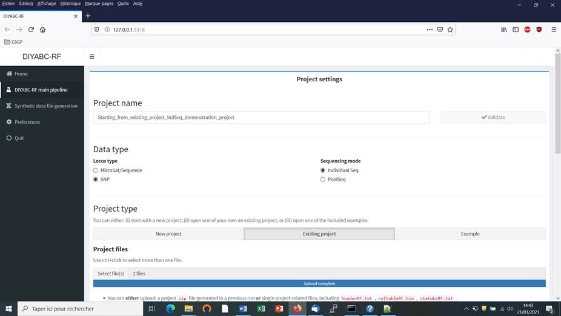<![endif]>

<ul style='margin-top:0cm' type=disc>
 <li class=MsoNormal style='margin-top:9.0pt;margin-bottom:9.0pt;mso-list:l6 level1 lfo32'>Enter a project name in the &#8220;Project name&#8221; window
     (here &#8220;Starting_from_existing_project_IndSeq_demonstration_project&#8221;)
     and validate the project name.</li>
 <li class=MsoNormal style='margin-top:9.0pt;margin-bottom:9.0pt;mso-list:l6 level1 lfo32'>Select the project type (Microsat/sequence
     or SNP) and the sequencing mode (for SNP only; IndSeq
     or PoolSeq). As we will start from a
     pre-existing IndSeq project, select SNP and
     Individual Seq.</li>
 <li class=MsoNormal style='margin-top:9.0pt;margin-bottom:9.0pt;mso-list:l6 level1 lfo32'>Click on the &#8220;Existing project&#8221; button of the &#8221;Project type&#8221; item as we want to work
     from an existing project.</li>
</ul>

<![if !supportLists]>&middot;&nbsp;&nbsp;&nbsp;&nbsp;&nbsp;&nbsp; <![endif]>Use the browser of the &#8221;Project files&#8221; item to select key files in
the Existing project directory (here a directory named &#8220;IndSeq_demonstration_project&#8221;). Key files are <u>headerRF.txt</u>
(mandatory), <u>reftableRF.bin</u> (if one simply
wants to add more simulations in the training set of the reftableRF.bin
of an existing project without changing anything in the headerRF.txt cf.
objective 1 above), and <u>statobsRF.txt</u> (optional). If the objective 2 is
concerned then only the file headerRF.txt is needed (avoid loading the reftableRF.bin file as the latter might not be in agreement with the new headerRF.txt file that you will
generate). <o:p></o:p>

<!--[if gte vml 1]><v:shape id="Image_x0020_31" o:spid="_x0000_i1041"
 type="#_x0000_t75" style='width:555.6pt;height:312.6pt;visibility:visible;
 mso-wrap-style:square'>
 <v:imagedata src="DiyabcRandomForestUserManual21-01-2021_fichiers/image121.png"
  o:title=""/>
</v:shape><![endif]--><![if !vml]><![endif]><o:p></o:p>

<ul style='margin-top:0cm' type=disc>
 <li class=MsoNormal style='margin-top:9.0pt;margin-bottom:9.0pt;mso-list:l27 level1 lfo26'>Browse and choose a data file (an IndSeq
     format data file in this case) in the &#8220;Data file&#8221; window (here
     INDSNP_sim_dataset_4POP_001.snp). A short summary of the specificities of
     the loaded datafile appears: here the total number of loci (30000), the
     minimum allele frequency chosen for simulation (MAF=0.05), the sex ratio
     indicated by the user (NM=1NF), the total number of individuals and
     populations, and finally the locus type and their corresponding numbers
     (A= autosomal, M=mitochondrial,&#8230;; see
     section 7.1 for details about data file format).</li>
 <li class=MsoNormal style='margin-top:9.0pt;margin-bottom:9.0pt;mso-list:l27 level1 lfo26'>A &#8220;Project set up is ok&#8221; message appears at the
     bottom of the panel if all items have gone correctly. You can then go the
     next steps by clicking on the large blue color &#8220;Training set
     simulation&#8221; &#8220;+&#8221; button&#8221;. The following panel
     appears.</li>
</ul>

<!--[if gte vml 1]><v:shape id="Image_x0020_40" o:spid="_x0000_i1040"
 type="#_x0000_t75" style='width:483.6pt;height:272.4pt;visibility:visible;
 mso-wrap-style:square'>
 <v:imagedata src="DiyabcRandomForestUserManual21-01-2021_fichiers/image123.png"
  o:title=""/>
</v:shape><![endif]--><![if !vml]>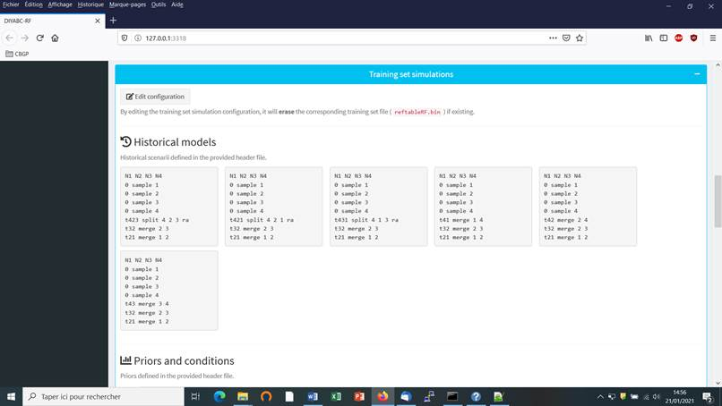<![endif]>

The panel displays all information
included in the headerRF.txt file (historical models, priors and conditions,
number of SNP loci to simulate). Warning: such information cannot be changed. 

To change information in the headerRF.txt
(cf. <b style='mso-bidi-font-weight:normal'>objective 2</b>) click on the
&#8220;Edit configuration&#8221; button located at the top of the panel and changes
for instance the scenarios formulated, the definition of priors, the number of
loci to simulate etc. In this case a new reftableRF.bin
file will be generated from scratch following the instruction included in the
newly generated headerRF.txt file. 

<![if !supportLists]>&middot;&nbsp;&nbsp;&nbsp;&nbsp;&nbsp;&nbsp;
<![endif]>Following <b style='mso-bidi-font-weight:
normal'>objective 1</b>, you can launch new simulations that will be added to
those already present in the pre-existing training set (i.e. reftableRF.bin file). As we have already 12000 simulations
in the initial reftableRF.bin file we put the number
of simulation to a number &gt; 12000 (here 24000).
Then click on the large blue color button &#8220;Simulate&#8221;.

<o:p>&nbsp;</o:p>

<!--[if gte vml 1]><v:shape
 id="Image_x0020_41" o:spid="_x0000_i1039" type="#_x0000_t75" style='width:435pt;
 height:244.8pt;visibility:visible;mso-wrap-style:square'>
 <v:imagedata src="DiyabcRandomForestUserManual21-01-2021_fichiers/image125.png"
  o:title=""/>
</v:shape><![endif]--><![if !vml]><![endif]>

You can stop
the generation of simulated datasets by clicking on the &#8220;STOP&#8221;
button. A &#8220;Run succeeded&#8221; message
appears when all requested simulations have been processed.

<![if !supportLists]>&middot;&nbsp;&nbsp;&nbsp;&nbsp;&nbsp;&nbsp;
<![endif]><u>Do not forget to click on
the &#8220;Save&#8221; button in the &#8220;Project administration&#8221; lower
panel to implement and save a concatenated zip file including various input and
output files</u> (see section 7 for a description of
the content of some of those files) on your computer. The name of the
implemented/saved concatenated .zip file is the one given at the start in the
&#8220;Project name&#8221; window (here Starting_from_existing_project_IndSeq_demonstration_project).

<!--[if gte vml 1]><v:shape id="Image_x0020_44"
 o:spid="_x0000_i1038" type="#_x0000_t75" style='width:501pt;height:282pt;
 visibility:visible;mso-wrap-style:square'>
 <v:imagedata src="DiyabcRandomForestUserManual21-01-2021_fichiers/image127.png"
  o:title=""/>
</v:shape><![endif]--><![if !vml]><![endif]>

<![if !supportLists]>&middot;&nbsp;&nbsp;&nbsp;&nbsp;&nbsp;&nbsp;
<![endif]>You might also want to launch
the optional but recommended option &#8220;Prior and scenario checking&#8221;.
For details see section 5.4.7.

<a
name="_Toc62127977"><![if !supportLists]>&middot;&nbsp;&nbsp;&nbsp;&nbsp;&nbsp;&nbsp;
<![endif]>Warning: The button
&#8220;Reset&#8221; at the very bottom part of the &#8220;Project
administration&#8221; panel restart the pipeline from scratch removing all
configurations previously set up and all data and result files generated.</a>

<h1>6.
PERFORMING RANDOM FOREST ANALYSES<o:p></o:p></h1>

<h2><a name="_Toc62127978">6.1 Files needed</a></h2>

Four files are needed at this stage: 

<![if !supportLists]>&middot;&nbsp;&nbsp;&nbsp;&nbsp;&nbsp;&nbsp;
<![endif]>the file <b style='mso-bidi-font-weight:
normal'>headerRF.txt</b> which describes the full settings of the generation of
the training set

<![if !supportLists]>&middot;&nbsp;&nbsp;&nbsp;&nbsp;&nbsp;&nbsp;
<![endif]>the training set file <b style='mso-bidi-font-weight:normal'>reftableRF.bin</b>
(generated from the headerRF.txt file), 

<![if !supportLists]>&middot;&nbsp;&nbsp;&nbsp;&nbsp;&nbsp;&nbsp; <![endif]>the file <b style='mso-bidi-font-weight:normal'>statobsRF.txt</b>
which corresponds to the values of the summary statistics computed for the observed dataset and which was
generated when producing the headerRF.txt and reftableRF.bin
files.<o:p></o:p>

<![if !supportLists]>&middot;&nbsp;&nbsp;&nbsp;&nbsp;&nbsp;&nbsp;
<![endif]><u>Warning</u>: although not necessary <i style='mso-bidi-font-style:normal'>per
se</i> for Random Forest analyses as the later only need the statobsRF.txt file
as data point to analyze, the <b style='mso-bidi-font-weight:normal'>observed (here
IndSeq SNP) data file</b> has to be present.

<![if !supportLists]>&middot;&nbsp;&nbsp;&nbsp;&nbsp;&nbsp;&nbsp; <![endif]><b
style='mso-bidi-font-weight:normal'>It is worth stressing that these files are: (i) already available following an in-course (and
terminated) training set simulation or (ii) they can be selected and loaded
independently by clicking on the &#8220;Existing project&#8221; button and
using the &#8221;Project files&#8221; and &#8220;Data file&#8221; browsers</b>.<o:p></o:p>

&nbsp;<!--[if gte vml 1]><v:shape id="Image_x0020_71"
 o:spid="_x0000_i1037" type="#_x0000_t75" style='width:555.6pt;height:312.6pt;
 visibility:visible;mso-wrap-style:square'>
 <v:imagedata src="DiyabcRandomForestUserManual21-01-2021_fichiers/image129.png"
  o:title=""/>
</v:shape><![endif]--><![if !vml]><![endif]><o:p></o:p>

<h2><a name=performing-analyses>6.2. Scenario choice
analysis</a></h2>

<![if !supportLists]>&middot;&nbsp;&nbsp;&nbsp;&nbsp;&nbsp;&nbsp;
<![endif]>Click on the large orange color
&#8220;Random Forest Analyses&#8221; button (&#8220;+&#8221; on the right). 

<![if !supportLists]>&middot;&nbsp;&nbsp;&nbsp;&nbsp;&nbsp;&nbsp;
<![endif]>Click on the button
&#8220;Check input&#8221;: useful information about the training set (cf. reftableRF.bin file) content is provided (nbr of scenarios, total nbr of
simulated datasets, nbr of simulated dataset
available per scenario, nbr of parameters, nbr of summary statistics). 

<!--[if gte vml 1]><v:shape id="Image_x0020_73" o:spid="_x0000_i1036"
 type="#_x0000_t75" style='width:547.2pt;height:307.8pt;visibility:visible;
 mso-wrap-style:square'>
 <v:imagedata src="DiyabcRandomForestUserManual21-01-2021_fichiers/image131.png"
  o:title=""/>
</v:shape><![endif]--><![if !vml]><![endif]>

<![if !supportLists]>&middot;&nbsp;&nbsp;&nbsp;&nbsp;&nbsp;&nbsp;
<![endif]>Provide an Analysis
(sub-project) name (here &#8220;Scenario_choice_demonstration&#8221;)
and validate it. 

<![if !supportLists]>&middot;&nbsp;&nbsp;&nbsp;&nbsp;&nbsp;&nbsp;
<![endif]>Activate the &#8220;Scenario
choice&#8221; button in the mode setting (button activated by default). The
observed dataset that will be analyzed is the one described in the file
&#8220;statobsRF.txt&#8221;.

<!--[if gte vml 1]><v:shape id="Image_x0020_76" o:spid="_x0000_i1035"
 type="#_x0000_t75" style='width:547.2pt;height:307.8pt;visibility:visible;
 mso-wrap-style:square'>
 <v:imagedata src="DiyabcRandomForestUserManual21-01-2021_fichiers/image133.png"
  o:title=""/>
</v:shape><![endif]--><![if !vml]><![endif]>

<![if !supportLists]>&middot;&nbsp;&nbsp;&nbsp;&nbsp;&nbsp;&nbsp;
<![endif]>Modify the RF analysis settings
in the following frames or keep default settings

<![if !supportLists]>&middot;&nbsp;&nbsp;&nbsp;&nbsp;&nbsp;&nbsp;
<![endif]>Indicate the number of samples
(i.e. simulated datasets) in the training set to consider for analyses (default
= 0 = total number of simulated datasets available in the training set). This
number should be lower or equal to the total number of simulated datasets
available in the training set. See section 4.2 for useful insights about this
number.

<![if !supportLists]>&middot;&nbsp;&nbsp;&nbsp;&nbsp;&nbsp;&nbsp;
<![endif]>Indicate the number of noise
variables to add (default = 5). Noise variables (corresponding to values
randomly drawn into uniform distributions bounded between 0 and 1) allows
evaluating which components of the feature vector (i.e. summary statistics) are
informative (see section 7.3 and Collin et al. 2020 for details).

<![if !supportLists]>&middot;&nbsp;&nbsp;&nbsp;&nbsp;&nbsp;&nbsp;
<![endif]>Enable/disable the addition of
linear combinations axes (LDA for model choice) (default = enable)

<![if !supportLists]>&middot;&nbsp;&nbsp;&nbsp;&nbsp;&nbsp;&nbsp;
<![endif]>You may 'group' your models in
several groups. For instance, if you have six models, labeled from 1 to 6, you
can specify '1,2,3;4,5,6' to make 2 groups of 3. Leave blank to not group
scenarios and analyzed them separately (see Collin et al. 2020). (default =
blank). Note that if you write &#8216;1;3;5&#8217; then the RF scenario choice
analysis will concern only the scenarios 1, 3 and 5 of the training set.

<![if !supportLists]>&middot;&nbsp;&nbsp;&nbsp;&nbsp;&nbsp;&nbsp;
<![endif]>Indicate the number of tress in
the forest (default = 500). See section 4.3 for useful insights about this
number.

<![if !supportLists]>&middot;&nbsp;&nbsp;&nbsp;&nbsp;&nbsp;&nbsp;
<![endif]>Click on the button
&#8220;RUN&#8221; to launch the RF analysis for scenario choice 

<!--[if gte vml 1]><v:shape id="Image_x0020_75" o:spid="_x0000_i1034"
 type="#_x0000_t75" style='width:555.6pt;height:312.6pt;visibility:visible;
 mso-wrap-style:square'>
 <v:imagedata src="DiyabcRandomForestUserManual21-01-2021_fichiers/image135.png"
  o:title=""/>
</v:shape><![endif]--><![if !vml]><![endif]>

<![if !supportLists]>&middot;&nbsp;&nbsp;&nbsp;&nbsp;&nbsp;&nbsp;
<![endif]>Follow the progress bar. You
can stop the RF analysis by clicking on the &#8220;STOP&#8221; button. A
&#8220;RF run succeeded&#8221; label appears when the RF analysis has been
entirely processed.

<![if !supportLists]>&middot;&nbsp;&nbsp;&nbsp;&nbsp;&nbsp;&nbsp;
<![endif]>Do not forget to click on the
&#8220;Save&#8221; button in the &#8220;Project administration&#8221; panel to
implement and save a concatenated zip file including various input and output
files (see section 7.3 for a description of the content of some of those files)
on your computer. The name of the implemented/saved concatenated zip file is
the one given at the start of the analysis (i.e. Analysis (sub-project) name;
here &#8220;Scenario_choice_demonstration.zip&#8221;).

<![if !supportLists]>&middot;&nbsp;&nbsp;&nbsp;&nbsp;&nbsp;&nbsp;
<![endif]>Warning: The button
&#8220;Reset&#8221; in the &#8220;Project administration&#8221; panel restart
the pipeline from scratch removing all configurations previously set up and all
data and result files generated.

<h2><a name="_Toc62127980">6.3. Parameter estimation analysis</a></h2>

<![if !supportLists]>&middot;&nbsp;&nbsp;&nbsp;&nbsp;&nbsp;&nbsp;
<![endif]>Click on the large orange color
&#8220;Random Forest Analyses&#8221; button (&#8220;+&#8221; on the right). 

<![if !supportLists]>&middot;&nbsp;&nbsp;&nbsp;&nbsp;&nbsp;&nbsp;
<![endif]>Activate the &#8220;Parameter
estimation&#8221; button in the mode setting. 

<![if !supportLists]>&middot;&nbsp;&nbsp;&nbsp;&nbsp;&nbsp;&nbsp;
<![endif]>Click on the button
&#8220;Check input&#8221;: Useful information about the training set (cf. reftableRF.bin file) content is provided (nbr of scenarios, total nbr of
simulated datasets, nbr of simulated dataset
available per scenario, nbr of parameters, nbr of summary statistics). 

<![if !supportLists]>&middot;&nbsp;&nbsp;&nbsp;&nbsp;&nbsp;&nbsp;
<![endif]>Provide an Analysis
(sub-project) name (here &#8220;Parameter_estimation_ra_demonstration&#8221;)
and validate it. 

<!--[if gte vml 1]><v:shape id="Image_x0020_78" o:spid="_x0000_i1033"
 type="#_x0000_t75" style='width:555.6pt;height:312.6pt;visibility:visible;
 mso-wrap-style:square'>
 <v:imagedata src="DiyabcRandomForestUserManual21-01-2021_fichiers/image137.png"
  o:title=""/>
</v:shape><![endif]--><![if !vml]><![endif]>

<![if !supportLists]>&middot;&nbsp;&nbsp;&nbsp;&nbsp;&nbsp;&nbsp;
<![endif]>Activate the &#8220;Parameter
choice&#8221; button in the mode setting. The observed dataset that will be
analyzed is the one described in the file &#8220;statobsRF.txt&#8221;.

<o:p>&nbsp;</o:p>

<o:p>&nbsp;</o:p>

<o:p>&nbsp;</o:p>

<o:p>&nbsp;</o:p>

<!--[if gte vml 1]><v:shape id="Image_x0020_79" o:spid="_x0000_i1032"
 type="#_x0000_t75" style='width:555.6pt;height:312.6pt;visibility:visible;
 mso-wrap-style:square'>
 <v:imagedata src="DiyabcRandomForestUserManual21-01-2021_fichiers/image139.png"
  o:title=""/>
</v:shape><![endif]--><![if !vml]>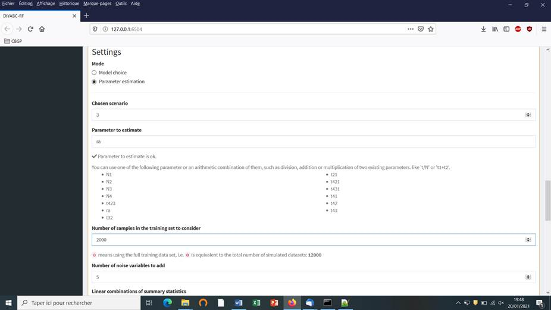<![endif]>

<![if !supportLists]>&middot;&nbsp;&nbsp;&nbsp;&nbsp;&nbsp;&nbsp;
<![endif]>Indicate the Scenario ID number
for parameter estimation (default = 1)

<![if !supportLists]>&middot;&nbsp;&nbsp;&nbsp;&nbsp;&nbsp;&nbsp;
<![endif]>Indicate the name of the
parameter to estimate (here the admixture rate &#8220;ra&#8221;): a list of
parameter names available for estimation according to the header and training
set files is provided. Give a single name or a combination of names as
explained in the interface. One analysis has to be processed for each parameter
of interest.

<![if !supportLists]>&middot;&nbsp;&nbsp;&nbsp;&nbsp;&nbsp;&nbsp;
<![endif]>Indicate the number of
simulated datasets in the training set to consider for analyses (default = 0 =
total number of simulated datasets available in the training set). <u>Warning: this
number should be lower or equal to the total number of simulated datasets
available in the training set for the scenario of interest.</u> Here we put
this number to 2000 as only 2028 simulated datasets are available for scenario
3 in the reftableRF.bin file previously used for
scenario choice and also loaded in the present illustration. See section 4.2
for useful insights about the number of simulated datasets in the training set
to consider for parameter estimation. In practice, it might be useful to
generate a (second) training set including only the selected scenario to
process parameter estimation from a larger number of simulated datasets (e.g.
10000 as in Collin et al. 2020).

<![if !supportLists]>&middot;&nbsp;&nbsp;&nbsp;&nbsp;&nbsp;&nbsp;
<![endif]>Indicate the number of noise
variables to add (default = 5). Noise variables (corresponding to values
randomly drawn into uniform distributions bounded between 0 and 1) allows
evaluating which components of the feature vector (i.e. summary statistics) are
informative (see section 7.3 and Collin et al. 2020 for details).

<!--[if gte vml 1]><v:shape id="Image_x0020_81" o:spid="_x0000_i1031"
 type="#_x0000_t75" style='width:555.6pt;height:312.6pt;visibility:visible;
 mso-wrap-style:square'>
 <v:imagedata src="DiyabcRandomForestUserManual21-01-2021_fichiers/image141.png"
  o:title=""/>
</v:shape><![endif]--><![if !vml]><![endif]>

<![if !supportLists]>&middot;&nbsp;&nbsp;&nbsp;&nbsp;&nbsp;&nbsp;
<![endif]>Enable/Disable the addition of linear
combinations axes (PLS for parameter estimation) (default = enable)

<![if !supportLists]>&middot;&nbsp;&nbsp;&nbsp;&nbsp;&nbsp;&nbsp;
<![endif]>Indicate the threshold of
percentage of explained variance by the PLS components you will keep in the
analysis (default = 0.95)

<![if !supportLists]>&middot;&nbsp;&nbsp;&nbsp;&nbsp;&nbsp;&nbsp;
<![endif]>Indicate the number of
out-of-bag (oob) testing samples (default = 10 but a
minimum of 1000 oob testing samples is often
necessary to obtained stable estimation of accuracy indices; see section
3.4.2). This number should be equal or lower to the number of datasets
available in the training set for the scenario under study.

<![if !supportLists]>&middot;&nbsp;&nbsp;&nbsp;&nbsp;&nbsp;&nbsp;
<![endif]>Indicate the number of trees in
the forest &#8211; here 1000 - (default = 500). See section 4.3 for useful
insights about this number.

<![if !supportLists]>&middot;&nbsp;&nbsp;&nbsp;&nbsp;&nbsp;&nbsp;
<![endif]>Click on the button &#8220;Run&#8221;
to launch the parameter estimation analyses focusing on the single parameter
(or parameter combination) indicated above.

<!--[if gte vml 1]><v:shape id="Image_x0020_82"
 o:spid="_x0000_i1030" type="#_x0000_t75" style='width:555.6pt;height:312.6pt;
 visibility:visible;mso-wrap-style:square'>
 <v:imagedata src="DiyabcRandomForestUserManual21-01-2021_fichiers/image143.png"
  o:title=""/>
</v:shape><![endif]--><![if !vml]>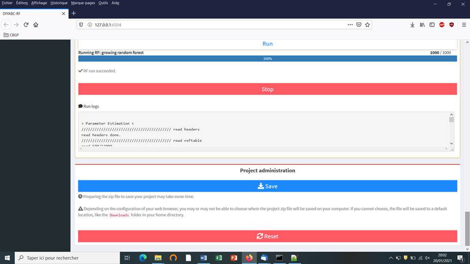<![endif]>

<![if !supportLists]>&middot;&nbsp;&nbsp;&nbsp;&nbsp;&nbsp;&nbsp;
<![endif]>Follow the progress bar. You
can stop the RF analysis by clicking on the &#8220;STOP&#8221; button. A
&#8220;RF run succeeded&#8221; label appears when the RF analysis has been
entirely processed.

<![if !supportLists]>&middot;&nbsp;&nbsp;&nbsp;&nbsp;&nbsp;&nbsp;
<![endif]>Do not forget to click on the
&#8220;Save&#8221; button in the &#8220;Project administration&#8221; panel to
implement and save a concatenated zip file including various input and output
files (see section 7.3 for a description of the content of some of those files)
on your computer. The name of the implemented/saved concatenated zip file is
the one given at the start of the analysis (i.e. Analysis (sub-project) name;
here &#8220;Parameter_estimation_ra_demonstration.zip&#8221;).

<![if !supportLists]>&middot;&nbsp;&nbsp;&nbsp;&nbsp;&nbsp;&nbsp;
<![endif]>Warning: The button
&#8220;Reset&#8221; in the &#8220;Project administration&#8221; panel restart
the pipeline from scratch removing all configurations previously set up and all
data and result files generated.

<h1><a name="_Toc62127981">7. KEY FILES</a><o:p></o:p></h1>

The program uses and produces various
files which we will describe now.

<h2><a name="_Toc62127982">7.1 Data files</a> </h2>

<a name="_Toc62127983"><b>7.1.1 </b></a><b>IndSeq</b><b> SNP data</b><b><o:p></o:p></b>

The data file format includes:

<![if !supportLists]>&middot;&nbsp;&nbsp;&nbsp;&nbsp;&nbsp;&nbsp;&nbsp;
<![endif]>A first line (headline)
providing the sex-ratio as above (e.g. <!--[if gte msEquation 12]><m:oMath><i
 style='mso-bidi-font-style:normal'><m:r>NM</m:r><m:r>=1.0</m:r><m:r>NF</m:r><m:r>&gt;</m:r></i></m:oMath><![endif]--><![if !msEquation]><!--[if gte vml 1]><v:shape
 id="_x0000_i1025" type="#_x0000_t75" style='width:79.8pt;height:13.8pt'>
 <v:imagedata src="DiyabcRandomForestUserManual21-01-2021_fichiers/image145.png"
  o:title="" chromakey="white"/>
</v:shape><![endif]--><![if !vml]><![endif]><![endif]>), the required MAF (minimum allele frequency criterion; e.g.
MAF=0.05 or MAF=hudson&gt;), and any text that can be used as a title. The sex
ratio of the analyzed species is noted under the form &lt;NM=rNF&gt;, in which r is the ratio of the number of females
per male (e.g. &lt;NM=2.5NF&gt; means that the number of males is 2.5 times the
number of females; for a balanced sex ratio one should write &lt;NM=1.0NF&gt;).
The MAF is computed pooling all genes genotyped over all studied population
samples. For instance, the specification of a MAF equal to 5% (i.e. MAF=0.05)
will automatically select a subset of m loci characterized by a minimum allele
frequency 5% among the <i style='mso-bidi-font-style:normal'>l</i> locus of the
observed dataset. In agreement with this, only <i style='mso-bidi-font-style:
normal'>m</i> locus with a MAF&gt;5%. Writing &lt;MAF = Hudson&gt; (or omitting
to write any instruction with respect to the MAF) will bring the program to use
the standard Hudson&#8217;s algorithm without further selection; see also the
above section 2.4.2.

<![if !supportLists]>&middot;&nbsp;&nbsp;&nbsp;&nbsp;&nbsp;&nbsp;&nbsp;&nbsp;&nbsp;&nbsp;
<![endif]>A second line starting with the
three keywords IND SEX POP, separated by at least one space, followed by as many letters as
SNP loci, the letter giving the location of the locus as above <i
style='mso-bidi-font-style:normal'>A</i> for autosomal diploid loci, <i
style='mso-bidi-font-style:normal'>H</i> for autosomal haploid loci, <i
style='mso-bidi-font-style:normal'>X</i> for X-linked (or haplo-diploid) loci,<i
style='mso-bidi-font-style:normal'> Y</i> for Y-linked loci and <i
style='mso-bidi-font-style:normal'>M</i> for mitochondrial loci. Letters are
separated by a single space.

<![if !supportLists]>&middot;&nbsp;&nbsp;&nbsp;&nbsp;&nbsp;&nbsp;&nbsp;&nbsp;&nbsp;&nbsp;
<![endif]>As many lines as there are
genotyped individuals, with the code-name of the individual, a letter (M or F;
or 9 if the sex of the individual is unknown) indicating its sex, and a
code-name for its population. <b style='mso-bidi-font-weight:normal'><u>A
genotype is defined by the values 0, 1 or 2 which correspond to the number of
the (arbitrarily chosen) reference allele composing the genotype</u></b><u> </u>at
each SNP locus. For instance, in the case autosomal diploid SNP loci (denoted
A), we have: 2 = homozygous genotype for the reference allele (cf. 2 copies of
the reference allele), 1 = heterozygous genotype (cf. 1 copy of the reference
allele), and 0 = homozygous genotype for the variant allele, with 0 copy of the
reference allele. <u>It is worth noting that for autosomal haploid loci
(denoted H), as well as for mitochondrial loci (denoted M) and Y-linked loci
(denoted Y), the SNP genotypes will be 0 or 1, which is coherent with our logic
of defining a genotype according to the number of the reference allele
composing the genotype.<o:p></o:p></u>

<![if !supportLists]>&middot;&nbsp;&nbsp;&nbsp;&nbsp;&nbsp;&nbsp;&nbsp;&nbsp;&nbsp;&nbsp;
<![endif]>Missing SNP genotypes are noted
9 for all type of SNP loci.

<![if !supportLists]>&middot;&nbsp;&nbsp;&nbsp;&nbsp;&nbsp;&nbsp;&nbsp;&nbsp;&nbsp;&nbsp;
<![endif]>Only a subset of the SNP loci
included in the data file can be considered (selected) in the simulations and
hence in subsequent analyses, without modifying the original dataset. For
instance, one can choose to select in the corresponding panel the SNP loci 1 to
1000 of a data file including a total of say 10000 loci (see the above section
5.4.4). This allows running faster simulations and processing independent replicate
analyses of sets of 1000 SNP loci by considering loci 1 to 1000 and then 1001
to 2000, and so on, in separate analyses.

<![if !supportLists]>&middot;&nbsp;&nbsp;&nbsp;&nbsp;&nbsp;&nbsp;&nbsp;&nbsp;&nbsp;&nbsp;
<![endif]>Following Hudson&#8217;s (2002)
criterion, only polymorphic SNP loci (over the entire dataset) are considered.
Monomorphic SNP loci (over the entire dataset) are automatically filtered by
the program. It is preferable, however, that the user removes himself all
monomorphic loci from his/her (observed) dataset before submitting it to DIYABC
Random Forest.

<![if !supportLists]>&middot;&nbsp;&nbsp;&nbsp;&nbsp;&nbsp;&nbsp;&nbsp;&nbsp;&nbsp;&nbsp;
<![endif]>Before running any simulation,
DIYABC Random Forest provides a text file including the set of SNP loci
selected from the observed dataset (e.g. polymorphic loci 1 to 1000 with a
MAF=0.05). This file is named &#8220;UserDataFileName.bin.txt&#8221;.

<b style='mso-bidi-font-weight:normal'>EXAMPLE<o:p></o:p></b>

In our example below, the species is
diploid, has an unbalanced sex ration the sex-ratio as above (i.e.
&lt;NM=1.5NF&gt;) and two of its populations were genotyped at 23 SNP loci: 20
autosomal loci, 1 X-linked locus, 1 Y-linked locus and 1 mitochondrial locus. The
first line provides the title which includes the species sex-ratio and the MAF
(minimum allele frequency). The second line indicates: individual name in
column 1, individual sex in column 2 (M for male, F for female, 9 or any other letter if unknown), population name in column 3 and
one column per SNP locus (letter A for an autosomal locus, X for an X-linked locus, Y for a Y-linked locus and M for a mitochondrial locus). Columns are separated by one or more
spaces. SNP genotypes are coded 0, 1 or 2 (9 for missing data) according to the number of reference alleles at
the corresponding locus. Note that the sex has no influence on simulations for
autosomal, mitochondrial or haploid loci (any sex can be hence declared). For
individuals with an unknown sex (denoted 9, see IND P1_2, P1_3 and P2_15), data for autosomal (as well as mitochondrial and haploid) loci will
be taken into account and simulated. On the other
hand, the genotypes of X-linked and Y-linked loci for the same IND P1_2, P1_3 and P2_15 with unknown
sex cannot be safely determined and are hence noted 9 for missing data (i.e. they are not
simulated).

<!--[if gte vml 1]><v:shape id="Image14" o:spid="_x0000_i1029"
 type="#_x0000_t75" alt="image" style='width:348pt;height:313.2pt;visibility:visible;
 mso-wrap-style:square'>
 <v:imagedata src="DiyabcRandomForestUserManual21-01-2021_fichiers/image147.png"
  o:title="image"/>
</v:shape><![endif]--><![if !vml]>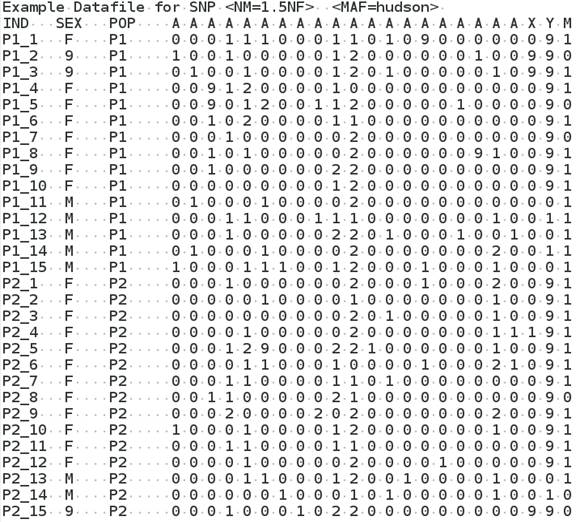<![endif]>

<a name="_Toc62127984"><b>7.1.2 </b></a><b>PoolSeq</b><b> SNP data</b><b><o:p></o:p></b>

The data file format includes:

<![if !supportLists]>&middot;&nbsp;&nbsp;&nbsp;&nbsp;&nbsp;&nbsp;&nbsp;&nbsp;&nbsp;&nbsp;
<![endif]>A first line (headline)
providing the sex-ratio of the analyzed species (e.g.&lt;NM=1.0NF&gt;), the required
MRC (minimum read count criterion; e.g. &lt;MRC=5&gt;), and any text that can
be used as a title. The sex ratio is noted under the form &lt;NM=rNF&gt;, in which r is the ratio of the number of females
per male (e.g. &lt;NM=2.5NF&gt; means that the number of males is 2.5 times the
number of females; for a balanced sex ratio one should write &lt;NM=1.0NF&gt;).
The MRC is the number of sequence reads of the minor allele frequency allele
when pooling the reads over all population samples.
The specification of a MRC equal for instance to 5 (as in the present example)
will automatically select a subset of <i style='mso-bidi-font-style:normal'>m</i>
PoolSeq loci characterized by more than five reads
over all studied pools among the l loci of the observed dataset. For instance,
the first locus of the list (cf. third line of the file) will not be selected.
In agreement with this, only <i style='mso-bidi-font-style:normal'>m</i> loci
with more than five reads will be retained in a simulated dataset. We advise
using MRC values of 2, 3, 4 or 5.

<![if !supportLists]>&middot;&nbsp;&nbsp;&nbsp;&nbsp;&nbsp;&nbsp;&nbsp;&nbsp;&nbsp;&nbsp;
<![endif]>Remember that (in contrast to IndSeq SNP) only PoolSeq SNPs
located on autosomal chromosomes of diploid individuals can be considered by
the program.

<![if !supportLists]>&middot;&nbsp;&nbsp;&nbsp;&nbsp;&nbsp;&nbsp;&nbsp;&nbsp;&nbsp;&nbsp;
<![endif]>A second line provides the
haploid sample size of each population pool.&nbsp; 

<![if !supportLists]>&middot;&nbsp;&nbsp;&nbsp;&nbsp;&nbsp;&nbsp;&nbsp;&nbsp;&nbsp;&nbsp;
<![endif]>The following lines correspond
to the PoolSeq SNP genotypes (given in read counts).
Each line represents a SNP and each pair of columns points to a population pool
in the same order as in the second line. For
each SNP-pool combination, the number of read counts is indicated for the first
and second allele in the first and second column, respectively. 

<![if !supportLists]>&middot;&nbsp;&nbsp;&nbsp;&nbsp;&nbsp;&nbsp;&nbsp;&nbsp;&nbsp;&nbsp;
<![endif]>Warning: no missing data (i.e.
&#8220;0 0&#8221; data; cf. no read count for any allele) is allowed in the PoolSeq data file and this for any pools in the data file.

<![if !supportLists]>&middot;&nbsp;&nbsp;&nbsp;&nbsp;&nbsp;&nbsp;&nbsp;&nbsp;&nbsp;&nbsp;
<![endif]>We advise to put only SNP loci
with a coverage &gt; 10 reads for each analyzed pool of the dataset in order to
ensure descent allele frequency estimation within each pool. SNP loci with an
abnormally high coverage should be also removed as those loci can be duplicated
loci.

<![if !supportLists]>&middot;&nbsp;&nbsp;&nbsp;&nbsp;&nbsp;&nbsp;&nbsp;&nbsp;&nbsp;&nbsp;
<![endif]>Only a subset of the SNP loci
included in the data file can be considered (selected) in the simulations and
hence in subsequent analyses, without modifying the original dataset. For
instance, one can choose to select in the corresponding panel the SNP loci 1 to
1000 of a data file including a total of say 10000 loci (see the above section
5.4.4). This allows running faster simulations and processing independent
replicate analyses of sets of 1000 SNP loci by considering loci 1 to 1000 and
then 1001 to 2000, and so on, in separate analyses.

<b style='mso-bidi-font-weight:normal'>EXAMPLE<o:p></o:p></b>

In our example below, the species is
diploid and was genotyped using the PoolSeq
technology at several thousands of autosomal SNPs in four population pools; <u>only
the first 13 SNPs are shown here </u>for sake of concision.&nbsp; The species sex-ratio is balanced and
hence equal 1 and the MRC (minimum read count) is 5. Each population pool is
composed of 100 diploid individuals (haploid sample size = 200).&nbsp; The second line provides the haploid
sample size of each population pool. It has to start with the explicit
terminology POOL POP_NAME:HAPLOID_SAMPLE_SIZE. Here the haploid sample size is
200 for each &#8220;POPx&#8221;. Note that you can
write any sample name, e.g. MONTPELLIER, instead of POPx.&nbsp; Columns are separated by one or more
spaces. Each line represents a SNP (hence the 13 lines) and each pair of
columns points to a population pool (hence the 4 pairs of column).
For each SNP-pool combination, the number of read counts is indicated for the
first and second allele in the first and second column, respectively. For
instance, we have 2 reads of the first allele and 114 reads of the second
allele for the first SNP genotyped in the POOL-POP3. Note that because the
MRC=5 several SNP of the present example data file, e.g. the first SNP for
which only two read counts are present over all pools, will not be selected
when generating simulated datasets.

<!--[if gte vml 1]><v:shape id="Picture_x0020_4" o:spid="_x0000_i1028"
 type="#_x0000_t75" style='width:469.8pt;height:313.2pt;visibility:visible;
 mso-wrap-style:square'>
 <v:imagedata src="DiyabcRandomForestUserManual21-01-2021_fichiers/image149.emz"
  o:title=""/>
</v:shape><![endif]--><![if !vml]>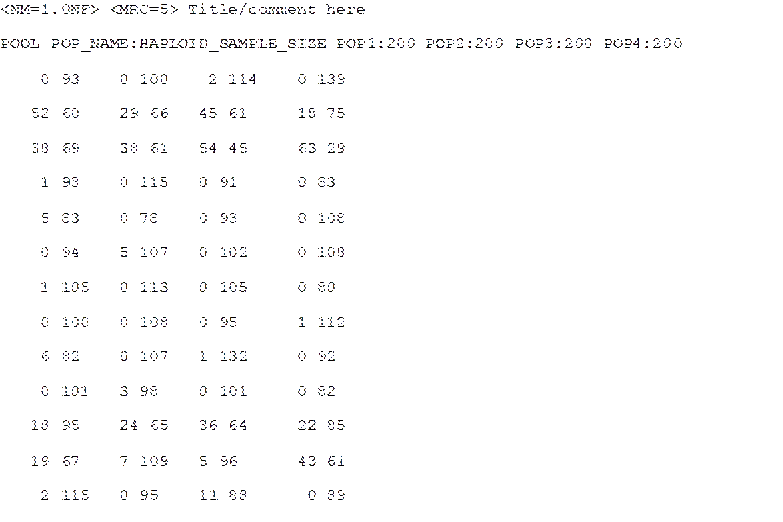<![endif]>

<a name="_Toc62127985"><b>7.1.3 Microsatellite and DNA sequence data</b></a><b><o:p></o:p></b>

The data file format is an extended
format of the file used in the classical population genetics program Genepop (Rousset et al. 1995).
The additional features are:

<![if !supportLists]>&middot;&nbsp;&nbsp;&nbsp;&nbsp;&nbsp;
<![endif]>In the title line appears the
sex ratio noted <!--[if gte msEquation 12]><m:oMath><i style='mso-bidi-font-style:
 normal'><m:r>NM</m:r><m:r>=</m:r><m:r>rNF</m:r><m:r>&gt;</m:r></i></m:oMath><![endif]--><![if !msEquation]><!--[if gte vml 1]><v:shape
 id="_x0000_i1025" type="#_x0000_t75" style='width:69.6pt;height:13.8pt'>
 <v:imagedata src="DiyabcRandomForestUserManual21-01-2021_fichiers/image151.png"
  o:title="" chromakey="white"/>
</v:shape><![endif]--><![if !vml]><![endif]><![endif]>, in which <!--[if gte msEquation 12]><m:oMath><i
 style='mso-bidi-font-style:normal'><m:r>r</m:r></i></m:oMath><![endif]--><![if !msEquation]><!--[if gte vml 1]><v:shape
 id="_x0000_i1025" type="#_x0000_t75" style='width:6pt;height:13.8pt'>
 <v:imagedata src="DiyabcRandomForestUserManual21-01-2021_fichiers/image021.png"
  o:title="" chromakey="white"/>
</v:shape><![endif]--><![if !vml]><![endif]><![endif]>&nbsp;is the ratio of the
number of females per male (<!--[if gte msEquation 12]><m:oMath><i
 style='mso-bidi-font-style:normal'><m:r>e</m:r><m:r>.</m:r><m:r>g</m:r><m:r>.</m:r></i></m:oMath><![endif]--><![if !msEquation]><!--[if gte vml 1]><v:shape
 id="_x0000_i1025" type="#_x0000_t75" style='width:20.4pt;height:13.8pt'>
 <v:imagedata src="DiyabcRandomForestUserManual21-01-2021_fichiers/image153.png"
  o:title="" chromakey="white"/>
</v:shape><![endif]--><![if !vml]><![endif]><![endif]>&nbsp;<!--[if gte msEquation 12]><m:oMath><i
 style='mso-bidi-font-style:normal'><m:r>NM</m:r><m:r>=2.5</m:r><m:r>NF</m:r><m:r>&gt;</m:r></i></m:oMath><![endif]--><![if !msEquation]><!--[if gte vml 1]><v:shape
 id="_x0000_i1025" type="#_x0000_t75" style='width:79.8pt;height:13.8pt'>
 <v:imagedata src="DiyabcRandomForestUserManual21-01-2021_fichiers/image155.png"
  o:title="" chromakey="white"/>
</v:shape><![endif]--><![if !vml]><![endif]><![endif]>&nbsp;means that the number of
males is 2.5 times the number of females; for a balanced sex ratio one should
write <!--[if gte msEquation 12]><m:oMath><i style='mso-bidi-font-style:
 normal'><m:r>NM</m:r><m:r>=1.0</m:r><m:r>NF</m:r><m:r>&gt;</m:r></i></m:oMath><![endif]--><![if !msEquation]><!--[if gte vml 1]><v:shape
 id="_x0000_i1025" type="#_x0000_t75" style='width:79.8pt;height:13.8pt'>
 <v:imagedata src="DiyabcRandomForestUserManual21-01-2021_fichiers/image145.png"
  o:title="" chromakey="white"/>
</v:shape><![endif]--><![if !vml]><![endif]><![endif]>). Since the title is generally only copied, this addition should
not interfere with other programs using Genepop datafiles. Also
if there is no such sex ratio addition, DIYABC will consider by default that
NM=1.0NF.

<![if !supportLists]>&middot;&nbsp;&nbsp;&nbsp;&nbsp;&nbsp;&nbsp;
<![endif]>After the locus name, there is
an indication for the category of the locus which is <!--[if gte msEquation 12]><m:oMath><i
 style='mso-bidi-font-style:normal'><m:r>A</m:r><m:r>&gt;</m:r></i></m:oMath><![endif]--><![if !msEquation]><!--[if gte vml 1]><v:shape
 id="_x0000_i1025" type="#_x0000_t75" style='width:19.8pt;height:13.8pt'>
 <v:imagedata src="DiyabcRandomForestUserManual21-01-2021_fichiers/image157.png"
  o:title="" chromakey="white"/>
</v:shape><![endif]--><![if !vml]><![endif]><![endif]>&nbsp;for autosomal diploid
loci, <!--[if gte msEquation 12]><m:oMath><i style='mso-bidi-font-style:
 normal'><m:r>H</m:r><m:r>&gt;</m:r></i></m:oMath><![endif]--><![if !msEquation]><!--[if gte vml 1]><v:shape
 id="_x0000_i1025" type="#_x0000_t75" style='width:21.6pt;height:13.8pt'>
 <v:imagedata src="DiyabcRandomForestUserManual21-01-2021_fichiers/image159.png"
  o:title="" chromakey="white"/>
</v:shape><![endif]--><![if !vml]><![endif]><![endif]>&nbsp;for autosomal haploid
loci, <!--[if gte msEquation 12]><m:oMath><i style='mso-bidi-font-style:
 normal'><m:r>X</m:r><m:r>&gt;</m:r></i></m:oMath><![endif]--><![if !msEquation]><!--[if gte vml 1]><v:shape
 id="_x0000_i1025" type="#_x0000_t75" style='width:20.4pt;height:13.8pt'>
 <v:imagedata src="DiyabcRandomForestUserManual21-01-2021_fichiers/image161.png"
  o:title="" chromakey="white"/>
</v:shape><![endif]--><![if !vml]><![endif]><![endif]>&nbsp;for X-linked (or
haplo-diploid) loci, <!--[if gte msEquation 12]><m:oMath><i
 style='mso-bidi-font-style:normal'><m:r>Y</m:r><m:r>&gt;</m:r></i></m:oMath><![endif]--><![if !msEquation]><!--[if gte vml 1]><v:shape
 id="_x0000_i1025" type="#_x0000_t75" style='width:19.8pt;height:13.8pt'>
 <v:imagedata src="DiyabcRandomForestUserManual21-01-2021_fichiers/image163.png"
  o:title="" chromakey="white"/>
</v:shape><![endif]--><![if !vml]><![endif]><![endif]>&nbsp;for Y-linked loci and <!--[if gte msEquation 12]><m:oMath><i
 style='mso-bidi-font-style:normal'><m:r>M</m:r><m:r>&gt;</m:r></i></m:oMath><![endif]--><![if !msEquation]><!--[if gte vml 1]><v:shape
 id="_x0000_i1025" type="#_x0000_t75" style='width:22.8pt;height:13.8pt'>
 <v:imagedata src="DiyabcRandomForestUserManual21-01-2021_fichiers/image165.png"
  o:title="" chromakey="white"/>
</v:shape><![endif]--><![if !vml]><![endif]><![endif]>&nbsp;for mitochondrial loci.
If no category is noted, DIYABC will consider the locus as autosomal diploid or
autosomal haploid depending on the corresponding genotype of the first typed
individual.

<![if !supportLists]>&middot;&nbsp;&nbsp;&nbsp;&nbsp;&nbsp;&nbsp;
<![endif]>Genotypes of microsatellite
loci are noted with <b style='mso-bidi-font-weight:normal'>six digit numbers</b>
if diploid (e.g.&nbsp;190188 for a heterozygous genotype with one allele 190
and one allele 188, and 200200 for a homozygous genotype with two alleles 200)
and by <b style='mso-bidi-font-weight:normal'>three digit numbers</b>
(e.g.&nbsp;190) if haploid. <u>The three digit numbers correspond to the length
in nucleotides of the corresponding PCR products</u>.

<![if !supportLists]>&middot;&nbsp;&nbsp;&nbsp;&nbsp;&nbsp;&nbsp;
<![endif]>Sequence locus are noted
between &lt; and &gt;. In addition, each sequence alleles/haplotypes is noted between brackets. For instance, a haploid sequence
locus will be noted &lt;[GTCTA]&gt; and a diploid sequence locus &lt;[GTCTA][GTCTT]&gt;.
Sequences may contain undetermined nucleotides which will be denoted &quot;N
&quot; or &quot; - &quot;. Note that all sequence alleles/haplotypes have to be
of same length. The length of shorter sequence allele/haplotypes needs to be
adjusted to the larger sequence allele/haplotype by adding &quot;N &quot; or
&quot; - &quot; symbols at the end of the sequences. It is worth stressing
that, at a given locus, only the portion of the sequence shared by all
individuals of the dataset will be used for computing summary statistics. We
therefore advise removing locus-individual sequence data with too many
&#8220;N&#8221; and replace them by missing data. Finally, remember that this
version of the program does not consider insertion-deletion mutations, mainly
because there does not seem to be much consensus on this topic.

<![if !supportLists]>&middot;&nbsp;&nbsp;&nbsp;&nbsp;&nbsp;&nbsp;
<![endif]>Missing microsatellite
genotypes are noted 000 if haploid or 000000 if diploid.

<![if !supportLists]>&middot;&nbsp;&nbsp;&nbsp;&nbsp;&nbsp;&nbsp;
<![endif]>Missing sequence
alleles/haplotypes are noted &lt;[ ]&gt; if haploid or
&lt;[ ][ ]&gt; if diploid.

<![if !supportLists]>&middot;&nbsp;&nbsp;&nbsp;&nbsp;&nbsp;&nbsp;
<![endif]>Missing data are taken into account in the following way. For each appearance
of a missing genotype in the observed dataset, the program records the
individual and the locus. When simulating datasets, the program replaces the
simulated genotype (obtained through the coalescence process algorithm) by the
missing data code at all corresponding locations. All summary statistics are
thus computed with the same missing data as for the observed dataset. <i
style='mso-bidi-font-style:normal'>WARNING</i>: data files with virtually any
amount of missing data can be analyzed by DIYABC Random Forest. <u>However, for
each locus a minimum of one genotyped individual per population is required.</u>
This is because summary statistics cannot be computed at a given locus in a
given population if only missing data are present.

<b style='mso-bidi-font-weight:normal'>EXAMPLES<o:p></o:p></b>

<u>Example 1</u>:&nbsp; the example dataset below includes two
population samples, each of 12 diploid individuals (8 females and 4 males in
the first sample and 5 females and 7 males in the second sample). As deduced
from the letter between&nbsp; and&nbsp; on the locus name lines (see page 25),
these individuals have been genotyped at 3 microsatellite loci (1 autosomal <!--[if gte msEquation 12]><m:oMath><i
 style='mso-bidi-font-style:normal'><m:r>A</m:r><m:r>&gt;</m:r></i></m:oMath><![endif]--><![if !msEquation]><!--[if gte vml 1]><v:shape
 id="_x0000_i1025" type="#_x0000_t75" style='width:19.8pt;height:22.8pt'>
 <v:imagedata src="DiyabcRandomForestUserManual21-01-2021_fichiers/image167.png"
  o:title="" chromakey="white"/>
</v:shape><![endif]--><![if !vml]><![endif]><![endif]>, 1 X-linked <!--[if gte msEquation 12]><m:oMath><i
 style='mso-bidi-font-style:normal'><m:r>X</m:r><m:r>&gt;</m:r></i></m:oMath><![endif]--><![if !msEquation]><!--[if gte vml 1]><v:shape
 id="_x0000_i1025" type="#_x0000_t75" style='width:20.4pt;height:22.8pt'>
 <v:imagedata src="DiyabcRandomForestUserManual21-01-2021_fichiers/image169.png"
  o:title="" chromakey="white"/>
</v:shape><![endif]--><![if !vml]><![endif]><![endif]>&nbsp;and 1 Y-linked <!--[if gte msEquation 12]><m:oMath><i
 style='mso-bidi-font-style:normal'><m:r>Y</m:r><m:r>&gt;</m:r></i></m:oMath><![endif]--><![if !msEquation]><!--[if gte vml 1]><v:shape
 id="_x0000_i1025" type="#_x0000_t75" style='width:19.8pt;height:22.8pt'>
 <v:imagedata src="DiyabcRandomForestUserManual21-01-2021_fichiers/image171.png"
  o:title="" chromakey="white"/>
</v:shape><![endif]--><![if !vml]><![endif]><![endif]>) and 3 DNA sequence loci (1 autosomal. 1 X-linked and 1
mitochondrial <!--[if gte msEquation 12]><m:oMath><i style='mso-bidi-font-style:
 normal'><m:r>M</m:r><m:r>&gt;</m:r></i></m:oMath><![endif]--><![if !msEquation]><!--[if gte vml 1]><v:shape
 id="_x0000_i1025" type="#_x0000_t75" style='width:22.8pt;height:22.8pt'>
 <v:imagedata src="DiyabcRandomForestUserManual21-01-2021_fichiers/image173.png"
  o:title="" chromakey="white"/>
</v:shape><![endif]--><![if !vml]><![endif]><![endif]>). The species sex-ratio, given in the title line, is of three males
for one female (<!--[if gte msEquation 12]><m:oMath><i style='mso-bidi-font-style:
 normal'><m:r>NM</m:r><m:r>=3</m:r><m:r>NF</m:r><m:r>&gt;</m:r></i></m:oMath><![endif]--><![if !msEquation]><!--[if gte vml 1]><v:shape
 id="_x0000_i1025" type="#_x0000_t75" style='width:70.2pt;height:22.8pt'>
 <v:imagedata src="DiyabcRandomForestUserManual21-01-2021_fichiers/image175.png"
  o:title="" chromakey="white"/>
</v:shape><![endif]--><![if !vml]><![endif]><![endif]>) or in other words, the number of males equals three times the
number of females.

<a name="_Toc62034937"><!--[if gte vml 1]><v:shape id="Image16"
 o:spid="_x0000_i1027" type="#_x0000_t75" alt="image" style='width:387.6pt;
 height:301.8pt;visibility:visible;mso-wrap-style:square'>
 <v:imagedata src="DiyabcRandomForestUserManual21-01-2021_fichiers/image177.png"
  o:title="image"/>
</v:shape><![endif]--><![if !vml]>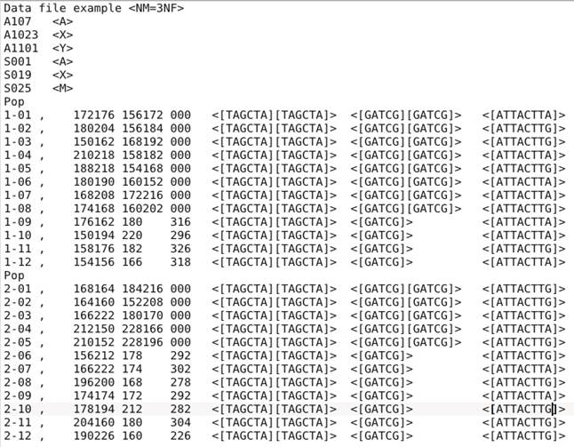<![endif]></a>

<u>Example 2</u>:
in this second example, the species is haploid. Individuals have been genotyped
at three autosomal microsatellite loci and one mitochondrial DNA sequence
locus. The species being haploid (deduced from the presence of autosomal
haploid loci), no indication of the sex-ratio appears in the title line.

<!--[if gte vml 1]><v:shape id="Image26" o:spid="_x0000_i1026"
 type="#_x0000_t75" alt="image" style='width:353.4pt;height:196.8pt;
 visibility:visible;mso-wrap-style:square'>
 <v:imagedata src="DiyabcRandomForestUserManual21-01-2021_fichiers/image179.png"
  o:title="image"/>
</v:shape><![endif]--><![if !vml]>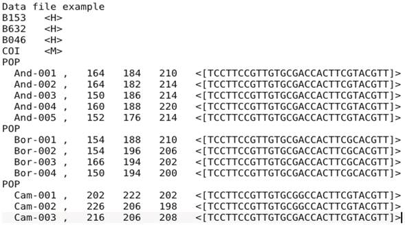<![endif]><b><o:p></o:p></b>

<h2><a name="_Toc62127986">7.2 Training set file(s)</a></h2>

Training set files are binary files
which include two successive parts:

<![if !supportLists]>&middot;&nbsp;&nbsp;&nbsp;&nbsp;&nbsp;&nbsp;&nbsp;&nbsp;&nbsp;&nbsp;
<![endif]>The first file is a header
(named <b style='mso-bidi-font-weight:normal'>headerRF.txt</b>) which contains
information necessary to read the second part (file), such as the number of
scenarios, or the number of parameters of each scenario.

<![if !supportLists]>&middot;&nbsp;&nbsp;&nbsp;&nbsp;&nbsp;&nbsp;&nbsp;&nbsp;&nbsp;&nbsp;
<![endif]>The second file (named <b style='mso-bidi-font-weight:normal'>reftableRF.bin</b>)
corresponds to the training set per se, as this file contains simulated dataset
records, each record containing on the same line the scenario number, the
parameter values and summary statistics values.

Each time a training set (reftableRF.bin) is created or increased (each time the
training set &#8220;Run&#8221; button is pressed), two text files are created
in the project directory:

<![if !supportLists]>&middot;&nbsp;&nbsp;&nbsp;&nbsp;&nbsp;&nbsp;
<![endif]><b style='mso-bidi-font-weight:normal'>statobsRF.txt</b>: this text file contains
the values of summary statistics for the observed data set.

<![if !supportLists]>&middot;&nbsp;&nbsp;&nbsp;&nbsp;&nbsp;&nbsp;
<![endif]><b style='mso-bidi-font-weight:
normal'>first_records_of_the_reference_table_X.txt</b> in which X is an integer number starting at 0 and increasing
each time the training set &#8220;Run&#8221; button is pressed. This file
provides a text version of the first <!--[if gte msEquation 12]><m:oMath><i
 style='mso-bidi-font-style:normal'><m:r>n</m:r></i></m:oMath><![endif]--><![if !msEquation]><!--[if gte vml 1]><v:shape
 id="_x0000_i1025" type="#_x0000_t75" style='width:7.2pt;height:22.8pt'>
 <v:imagedata src="DiyabcRandomForestUserManual21-01-2021_fichiers/image181.png"
  o:title="" chromakey="white"/>
</v:shape><![endif]--><![if !vml]><![endif]><![endif]>&nbsp;newly created records of
the training set reftableRF.bin (<!--[if gte msEquation 12]><m:oMath><i
 style='mso-bidi-font-style:normal'><m:r>n</m:r></i></m:oMath><![endif]--><![if !msEquation]><!--[if gte vml 1]><v:shape
 id="_x0000_i1025" type="#_x0000_t75" style='width:7.2pt;height:22.8pt'>
 <v:imagedata src="DiyabcRandomForestUserManual21-01-2021_fichiers/image181.png"
  o:title="" chromakey="white"/>
</v:shape><![endif]--><![if !vml]><![endif]><![endif]>&nbsp;being equal to the <i
style='mso-bidi-font-style:normal'>Particle loop size</i>, see section 3.7.3).

<h2><a name="_Toc62127987">7.3 Output files produced by a
Random Forest analysis</a></h2>

DIYABC Random Forest provides various
numerical and graphical outputs. The integration of the various graphical
outputs is managed with the ggplot2 R package (Wickham 2016), allowing user to
create and export high-quality graphics related to the analyses. Non-graphical
outputs are saved in text files. Graphs are saved as images, and user can
choose the image format among png, jpg, etc. Once a
Random Forest analysis is terminated, do not forget to click on the
&#8220;Save&#8221; button in the &#8220;Project housekeeping&#8221; panel to
implement and save a concatenated .zip file including various input and output
files (see section 7 for a description of the content of some of those files)
on your computer. The name of the implemented/saved concatenated .zip file is
the one given at the start in the &#8220;Project name&#8221; window.

We now describe all the files produced
by each Random Forest analysis.

<b style='mso-bidi-font-weight:normal'>abcranger_call.log</b>: log files with votes and posterior probability of the selected (i.e.
best) scenario (i.e. model) for a model choice analysis and with the main
outputs of parameter estimation (including predictions and accuracy of
estimation indices) for a parameter estimation analysis.

<o:p>&nbsp;</o:p>

<u><o:p>&nbsp;</o:p></u>

<u>Scenario choice analysis<o:p></o:p></u>

<![if !supportLists]>&middot;&nbsp;&nbsp;&nbsp;&nbsp;&nbsp;&nbsp;
<![endif]><i style='mso-bidi-font-style:normal'>Numerical outputs<o:p></o:p></i>

<b style='mso-bidi-font-weight:normal'>modelchoice_out.settings</b>: this
file summarizes the settings associated to the RF analysis processed for
scenario choice.

<b style='mso-bidi-font-weight:normal'>modelchoice_out.confusion</b>: mean
misclassification error rate and confusion matrix (i.e. the contingency table
of the true and predicted classes for each example in the training set). These
indices are computed using the out-of-bag (a.k.a. out-of-bootstrap or oob) training data as free test dataset.

<b style='mso-bidi-font-weight:normal'>modelchoice_out.predictions</b>: votes,
prediction of the selected scenario and posterior probability of the selected
scenario (i.e. model).

<b style='mso-bidi-font-weight:normal'>modelchoice_out.ooberror</b>: Evolution of prediction power relatively to the number of trees in
the forest. Line number is the number of trees. Power is the global (prior)
error rate for scenario choice with the mean taken as point estimate (computed
using oob). See the file
modelchoice_out_graph_error_versus_ntrees.png for a graphical representation.

<b style='mso-bidi-font-weight:normal'>modelchoice_out.importance</b>:
variables importance (sorted) which correspond to the contributions of the
statistics to the Random Forest when choosing among scenarios. The variable
importance of each statistics is computed as the mean decrease of impurity
across the trees, where the impurity measure is the Gini index. Note that the
scale is irrelevant: only the relative values matter. The variable importance
was computed for each of the summary statistics provided by DIYABC Random
Forest, plus the LDA axes (denoted LDA) if they have been added to the feature
vector. The higher the variable importance the more informative is the
statistic. Variable importance of noise variables (denoted NOISEx
and corresponding to values randomly drawn into uniform distributions bounded
between 0 and 1) are also provided. Such noise variable can be added to the
feature vector processed by RF in order to evaluate the threshold of variable
importance values below which components of the vector are not informative
anymore. More details about summary statistics including their code names can
be found in section 2.6.3. Population index(s) are also indicated at the end of
each statistic. See Collin et al. 2020 for examples. See the file
modelchoice_out_graph_variable_importance.png for a graphical representation.

<b style='mso-bidi-font-weight:normal'>modelchoice_out.lda</b><b style='mso-bidi-font-weight:
normal'>:</b>&nbsp; coordinates for the projection of the
datasets from the training set and from the observed dataset on the first two
linear discriminant analysis (LDA) axes when analyzing more than two scenarios
(models) and on a single LDA axis when analyzing a pair of scenarios (or two
groups of scenarios); See the file modelchoice_out_graph_lda.png for a
graphical representation.

<![if !supportLists]>&middot;&nbsp;&nbsp;&nbsp;&nbsp;&nbsp;&nbsp;
<![endif]><i style='mso-bidi-font-style:normal'>Graphical outputs</i>

<b style='mso-bidi-font-weight:normal'>modelchoice_out_graph_lda.png:</b> Projection of the datasets from the training set on the first two
linear discriminant analysis (LDA) axes when analyzing more than two scenarios
(models) and on a single LDA axis when analyzing a pair of scenarios (or two
groups of scenarios). The location of the observed dataset in the LDA
projection is indicated by a star symbol or a vertical line. Graphical
representation obtained from the text file modelchoice_out.lda;
see also Figure 2 in Collin et al. 2020.

<b style='mso-bidi-font-weight:normal'>modelchoice_out_graph_error_versus_ntrees.png:</b> Evolution of prediction power relatively to the number of trees in
the forest. Graphical representation obtained from the text file modelchoice_out.ooberror ; see
also Figure S1 in Collin et al. 2020.

<b style='mso-bidi-font-weight:normal'>modelchoice_out_graph_variable_importance.png:</b> Contributions of the 50 most informative statistics (including LDA
axes if computed) to the Random Forest when choosing among scenarios. Graphical
representation obtained from the text file modelchoice_out.importance;
see also Figure 3 in Collin et al. 2020.

<o:p>&nbsp;</o:p>

<u>Parameter estimation analysis<o:p></o:p></u>

<![if !supportLists]>&middot;&nbsp;&nbsp;&nbsp;&nbsp;&nbsp;&nbsp;
<![endif]><i style='mso-bidi-font-style:normal'>Numerical outputs<o:p></o:p></i>

<b style='mso-bidi-font-weight:normal'>estim_param_out.settings</b>: this
file summarizes the settings associated to the RF analysis processed to
estimate a given parameter

<b style='mso-bidi-font-weight:normal'>estim_param_out.predictions</b>:
expectation, median, quantiles 0.05, quantile 0.95, and variance for prediction
of parameter estimation

<b style='mso-bidi-font-weight:normal'>estim_param_out.ooberror</b>: Evolution of prediction power relatively to the number of trees in
the forest. Line number is the number of trees. Power is the global (prior)
mean squared error with the mean taken as point estimate (computed using oob). See the file
estim_param_out_graph_error_versus_ntrees.png for a graphical representation.

<b style='mso-bidi-font-weight:normal'>estim_param_out.oobstats</b>: this
file contains various accuracy indices of parameter estimation (computed using oob). Both global (prior) error indices and Local
(posterior) error indices are provided (see Collin et al. 2020 for details).

<b style='mso-bidi-font-weight:normal'>estim_param_out.importance</b>:
variables importance (sorted) which correspond to the contributions of the
statistics to the Random Forest when processing parameter estimation. The
variable importance of each statistics is computed as the mean decrease of
impurity across the trees, where the impurity measure is the residual sum of
squares. Note that the scale is irrelevant: only the relative values matter.
The variable importance was computed for each of the summary statistics
provided by DIYABC Random Forest, plus the PLS axes (denoted Comp.) if they
have been added to the feature vector. The higher the variable importance the
more informative is the statistic. Variable importance of noise variables
(denoted NOISEx and corresponding to values randomly
drawn into uniform distributions bounded between 0 and 1) are also provided.
Such noise variable can be added to the feature vector processed by RF in order
to evaluate the threshold of variable importance values below which components
of the vector are not informative anymore. More details about summary
statistics including their code names can be found in section 2.6.3. Population
index(s) are also indicated at the end of each statistic. See Collin et al.
2020 for examples. See the file estim_param_out_graph_variable_importance.png
for a graphical representation.

<b style='mso-bidi-font-weight:normal'>estim_param_out.predweights</b>:
pairs of parameter value - weight value inferred during prediction. Such
pairwise values can be used to do density plot of parameter estimation. See the
file estim_param_out_graph_density_plot.png for a graphical representation.

<i style='mso-bidi-font-style:normal'>If
a Partial Least Squares Regression analysis (PLS) is processed on the summary
statistics then two additional output files are provided.<o:p></o:p></i>

<b style='mso-bidi-font-weight:normal'>estim_param_out.plsvar</b>: variance
explained by number of the <i style='mso-bidi-font-style:normal'>c</i> selected
PLS components (from component 1 to <i style='mso-bidi-font-style:normal'>c,</i>
with c the number of PLS axes providing a given fraction of the maximum amount
of variance explained by all PLS axes - 95% by default-).

<b style='mso-bidi-font-weight:normal'>estim_param_out.plsweights</b>:
weight of each variable (i.e. summary statistics) for the first PLS component
(sorted by absolute value)

<![if !supportLists]>&middot;&nbsp;&nbsp;&nbsp;&nbsp;&nbsp;&nbsp;
<![endif]><i style='mso-bidi-font-style:normal'>Graphical outputs</i>

<b style='mso-bidi-font-weight:normal'>estim_param_out_graph_density_plot.png</b>: density plot graphical representation for the estimated parameter
(obtained from the text file estim_param_out.predweights).

<b style='mso-bidi-font-weight:normal'>estim_param_out_graph_error_versus_ntrees.png:</b> Evolution of prediction power relatively to the number of trees in
the forest. Graphical representation obtained from the text file estim_param_out.ooberror; see also Figure S1 in Collin et
al. 2020.

<b style='mso-bidi-font-weight:normal'>estim_param_out_graph_variable_importance.png</b>: Contributions of the 50 most informative statistics (including PLS
components &#8211; denoted as Comp - if computed) to the Random Forest when
choosing among scenarios. Graphical representation obtained from the text file estim_param_out.ooberror; see also Figure 3 in Collin et
al. 2020.

<h2><a name="_Toc62127988">7.4 Other files</a></h2>

The program writes several additional
files in the saved project directory:

diyabc_run_call.log: this text file contains information
about the first steps of the training set production, including the reading of
the observed data file and the interpretation of the headerRF.txt file.<o:p></o:p>

reftable.log:
this file contains information
about the progress of computations (achieved number of records)<o:p></o:p>

<b style='mso-bidi-font-weight:
normal'>RNG_state_0000.bin</b>: this
binary file contains the current state of the random generator.

<b style='mso-bidi-font-weight:
normal'>diyabc_seed_init_call.log: </b>this text file contains information about the initialization of the
random generator

<b style='mso-bidi-font-weight:
normal'>Files produced with IndSeq
analysis</b>  
&nbsp;&nbsp;&nbsp; - &lt;observed_dataset_name&gt;.bin
and &lt;observed_dataset_name&gt;.txt: observed
dataset file in bin and txt format, respectively  
&nbsp;&nbsp;&nbsp; - maf.txt: file in which the minimum allele frequency value
(maf) has been recorded

<a name="_Toc62127989"><b>8. GENERATE SYNTHETIC DATAFILES</b></a><b> </b>

An (auxiliary)
module named &#8220;<b style='mso-bidi-font-weight:normal'>Synthetic data file
generation</b>&#8221; (based on the DIYABC simulation engine) is available in
DIYABC Random Forest v1.0. You can use this module to generate datafile(s) for
various types of genetic markers corresponding to synthetic &#8220;ground
truth&#8221; raw data (not summarized through statistics) under a given
historical scenario and a set of parameter values <b style='mso-bidi-font-weight:
normal'>fixed by the user</b>. Such <b style='mso-bidi-font-weight:normal'>pseudo-observed
dataset</b> does not refer to any (actual) observed dataset. <b
style='mso-bidi-font-weight:normal'>The formats of the generated datafiles are
similar to those of the observed input datafiles read by DIYABC Random Forest
v1.0 (see sections 7.1.1, 7.1.2 and 7.1.3).</b>

To access to the panels allowing generating
files corresponding to full in silico datasets (also called pseudo-observed
datasets) click on the &#8220;Synthetic data file generation&#8221; button in
the middle of the main panel of the GUI or on the &#8220;Synthetic data file
generation&#8221; button in the upper-left part of the same panel.

<!--[if gte vml 1]><v:shape id="Image_x0020_128" o:spid="_x0000_i1025"
 type="#_x0000_t75" style='width:502.8pt;height:282.6pt;visibility:visible;
 mso-wrap-style:square'>
 <v:imagedata src="DiyabcRandomForestUserManual21-01-2021_fichiers/image183.png"
  o:title=""/>
</v:shape><![endif]--><![if !vml]><![endif]>

The panels following such clicking are very
similar to those detailed in the sections 5.4 (IndSeq
data), 5.5 (PoolSeq data) and 5.6 (microsatellite
and/or DNA sequence data). <u>Their self-meaning content allows defining a
scenario, fixing prior values for historical (and genetic) parameters, and the
number (and type) of loci to simulate</u>. Note that those panels are completed
by two (also self-meaning) additional panels in which you indicate the sample
sizes for each population (with the proportion of males and females in each
sample), the sex ratio of the studied species, and the number of datafiles that
you want to simulate.

<a name="_Toc62127990"><b>9. USING DIYABC RANDOM FOREST ON A
COMPUTER SERVER AND EXAMPLES OF COMMAND LINES</b></a>

The computing effort is considerably reduced
for ABC Random Forest, as the method requires a substantially smaller training
set compared to ABC methods (e.g., a few thousands of simulated datasets versus
hundreds of thousands of simulations per scenario for most ABC approaches; Blum
&amp; Fran&ccedil;ois, 2010; Fraimout et al., 2017; Pudlo et al., 2016; Raynal et
al., 2019). Given the ever-increasing dimensionality of modern genetic data
generated using NGS technologies, this is a particularly appealing property of
this method. Your personal computer or any local server should hence represent
sufficient computer resources to run most of your DIYABC Random Forest analyses
in a descent time. However, in some cases (for instance when very large SNP
datasets have to be simulated), it might be useful to take advantage of <u>a
compute server (single node of a cluster, or even a powerful workstation),
especially to generate the training set (i.e. the file reftableRF.bin)</u>.

To do this (i.e. generate the reftableRF.bin training set), go to the DIYABC Random
Forest main site <a href="https://diyabc.github.io/">https://diyabc.github.io/</a>
at the <i style='mso-bidi-font-style:normal'>Command line tools</i> section to
find the diyabc v3.0 binary (executable) file corresponding to your
Operating System. Compilation and command line instructions
are also available at <a href="https://github.com/diyabc/diyabc">the github repository for diyabc RF</a>. 

Similarly, compilation, command line
instructions as well as the sources and various binary versions of the program abcranger, which is the Random Forest inference engine of
the program DIYABC Random Forest, are also available at <a
href="https://github.com/diyabc/abcranger">the github
repository for abcranger</a>. However, this might be
less crucial as
Random Forest treatments with abcranger (using a
given training set) are much more rapid than the generation of the training set
with diyabc v3.0 (e.g. Collin et al. 2020).<o:p></o:p>

<b style='mso-bidi-font-weight:normal'>EXAMPLES
OF COMMAND LINES <o:p></o:p></b>

&agrave;Warning: for more details and options see instructions in <a
href="https://diyabc.github.io/cli/">Commande line
tools - DIYABC RF</a> 

<![if !supportLists]>&Oslash;&nbsp; <![endif]><i
style='mso-bidi-font-style:normal'>Simulation of a training
set using the (linux) executable file diyabc_vXXX (where XXX is the version)<o:p></o:p></i>

Put in a given directory the following files:

<![if !supportLists]>-&nbsp;&nbsp;&nbsp;&nbsp;&nbsp;&nbsp;&nbsp;
<![endif]>The file corresponding to your
(observed) dataset

<![if !supportLists]>-&nbsp;&nbsp;&nbsp;&nbsp;&nbsp;&nbsp;&nbsp;
<![endif]>The header file (<u>that you
will have to name <b style='mso-bidi-font-weight:normal'>header.txt</b></u> as
a headerRF.txt file will be automatically produced) 

<![if !supportLists]>-&nbsp;&nbsp;&nbsp;&nbsp;&nbsp;&nbsp;&nbsp;
<![endif]>The file RNG_state_0000.bin,
which you should generate at first in a terminal window with:

./diyabc_vXXX -p ./ -n
&quot;t:8&quot;<o:p></o:p>

where you can replace 8 by the number of
computing cores of your server.

You can then launch the simulation in a
terminal window with:

./diyabc_vXXX -p ./ -R ALL -r 12000 -g 50 -m -t
8<o:p></o:p>

By doing so you will simulate of a training
set including 12000 datasets with <u>all</u> summary statistics available in diyabcrf (plus LDA axes added to the feature vector) and
using a loop size of 50 simulated datasets and a total of 8 cores (you can
specify at most the number of cores specified by the previously generated RNG_state_***.bin file) .

<![if !supportLists]>&Oslash;&nbsp; <![endif]><i
style='mso-bidi-font-style:normal'>Random Forest analyses</i> <i style='mso-bidi-font-style:normal'>using the (linux) executable file abcranger_vXXX<o:p></o:p></i>

Put in a given directory the following files:

<![if !supportLists]>-&nbsp;&nbsp;&nbsp;&nbsp;&nbsp;&nbsp;&nbsp;
<![endif]>The file headerRF.txt
(previously generated by diyabc_vXXX) 

<![if !supportLists]>-&nbsp;&nbsp;&nbsp;&nbsp;&nbsp;&nbsp;&nbsp;
<![endif]>The file reftableRF.bin
(previously generated by diyabc_vXXX) corresponding
to the training set<o:p></o:p>

<![if !supportLists]>-&nbsp;&nbsp;&nbsp;&nbsp;&nbsp;&nbsp;&nbsp;
<![endif]>The file statobsRF.txt
(previously generated by diyabc_vXXX) which contains
the values of summary statistics for the observed data set.<o:p></o:p>

<ul style='margin-top:0cm' type=disc>
 <li class=MsoNormal style='margin-top:9.0pt;margin-bottom:9.0pt;mso-list:l25 level1 lfo45'>Model (scenario)
     choice using RF<o:p></o:p></li>
</ul>

You
can then launch the analysis in a terminal window with:<o:p></o:p>

./abcranger_vXXX -n 12000 -t 1000 -j 8 -o modelchoice_analysis<o:p></o:p>

By
doing so you will process a model choice analysis on 12000 datasets of the
training set with a forest including 1000 trees, with error metrics computed
from 12000 &#8220;out-of-bag (oob) datasets, and
using a total of 8 cores. All output files names will have &#8220;modelchoice_analysis&#8221; as prefix.<o:p></o:p>

<ul style='margin-top:0cm' type=disc>
 <li class=MsoNormal style='margin-top:9.0pt;margin-bottom:9.0pt;mso-list:l25 level1 lfo45'>Parameter
     estimation (t) using RF<o:p></o:p></li>
</ul>

You
can launch the analysis in a terminal window with:<o:p></o:p>

./abcranger_vXXX -n 2000 -t 1000 -j 8 --parameter
t --chosenscen 1 --plsmaxvar
0.95 --noob 10000 -o estim_param_t_with_PLS<o:p></o:p>

By
doing so you will process an estimation of the parameter t from 2000 datasets
(if available in the training set) with a forest including 1000 trees, with a
number of PLS components explaining 95% of variance added to the feature
vector, with accuracy metrics computed from 10000 out-of-bag (oob) datasets, and using a total of 8 cores. All output
files names will have &#8220;estim_param_t_with_PLS&#8221;
as prefix.<o:p></o:p>

<i style='mso-bidi-font-style:normal'>Note: The pipeline and command
lines used to generate and analyze the example datasets in Collin et al. (2020)
can be consulted at </i><a
href="https://github.com/diyabc/MER_publication_materials/tree/main/MER_2021_DATASET_EXAMPLES">https://github.com/diyabc/MER_publication_materials/tree/main/MER_2021_DATASET_EXAMPLES</a> <o:p></o:p>

It is worth stressing that
abcranger is not limited to population genetics
applications as you can use the program as a Random Forest inference engine
independently from the diyabc simulator. However, for
the moment, the binary standalone used by the DIYABC Random Forest interface
handles only outputs produced by the diyabc
simulator. A python wrapper (and example notebooks) is available at the <a
href="https://github.com/diyabc/abcranger">notebook directory in the github repository</a> and a R wrapper will be soon provided at the same site.

<a name="_Toc62127991"><b>10. TOY EXAMPLES</b></a><b><o:p></o:p></b>

Five toy examples to process run-tests with DIYABC-RF (i.e. for a
quick generation of a training set and rapid Random Forest analyses) can be
downloaded from https://diyabc.github.io/toy_examples/.
Each toy example illustrates crucial aspects such as the formats of different
types of observed datasets, the formalization of different types of scenarios
and the using of various types of molecular markers. Each toy example includes
two files: <b style='mso-bidi-font-weight:normal'>an observed dataset file and
a &#8220;ready to use&#8221; headerRF.txt file</b>. You can launch directly the
ABC-RF standalone by choosing the &#8220;Existing project&#8221; option and
loading these two files.

<b style='mso-bidi-font-weight:
normal'>TOY_EXAMPLE1_microsatellites_one_pop_bottlenecked<o:p></o:p></b>

The
pseudo-observed dataset includes a single population bottlenecked at time tbn in the past with 4 samples (20 inds
per sample) taken at different times. Note that NM=1.0NF, Npresent=
200, tbn=300, Npass=20000. The
dataset includes 45 autosomal microsatellite loci and 5 mitochondrial microsatellite
loci with 2 groups of mutation parameters. 

The headerRF.txt
file formalizes two scenarios: one with and one without bottleneck events.

<b style='mso-bidi-font-weight:
normal'>TOY_EXAMPLE2_microsatellites_DNAsequence_two_pops_ancient_admixture<o:p></o:p></b>

The
pseudo-observed dataset includes 2 populations with ancestral admixture between
2 unsampled pops at time ta=5000 (ra=0.5) that diverged at time t2=6000 with
N1=5000 and t1=1000 for 10 autosomal microsatellites 5 autosomal DNA sequences
and 5 mitochondrial DNA sequences with 3 groups of mutation parameters. 

The headerRF.txt
file formalizes two scenarios: one with and one without an ancestral admixture
event.

<b style='mso-bidi-font-weight:
normal'>TOY_EXAMPLE3_SNP_INDSEQ_scenario3_MER_light_configuration<o:p></o:p></b>

This toy example
is similar to the IndSeq SNP illustration of the
paper Collin et al. (2020) based on the pseudo-observed dataset generated from
scenario 3, except that only 100 SNP (instead of 5000) are requested for
simulation in the headerRF.txt file formalizing 6 scenarios to speed-up simulations.

Warning: because
only 100 SNP are simulated, do not expect to obtain the same results as those
described in Collin et al. (2020).

<b style='mso-bidi-font-weight:
normal'>TOY_EXAMPLE4_SNP_POOLSEQ_scenario3_MER_light_configuration<o:p></o:p></b>

This toy example
is similar to the PoolSeq SNP illustration of the
paper Collin et al. (2020) based on the pseudo-observed dataset generated from
scenario 3, except that only 100 SNP (instead of 5000) are requested for
simulation in the headerRF.txt file formalizing 6 scenarios to speed-up
simulations.

Warning: because
only 100 SNP are simulated, do not expect to obtain the same results as those
described in Collin et al. (2020).

<b style='mso-bidi-font-weight:
normal'>TOY_EXAMPLE5_SNP_INDSEQ_several_groups_of_loci_admixture<o:p></o:p></b>

The IndSeq SNP pseudo-observed dataset includes 3 populations
with pop 3 admixed between pops 1 and 2 at time ta=100 (r=0.4) and pops 1 and 2
diverging at time ts=10000 (N1=20000, N2=5000,
N3=10000, N4=10000). Note that NM=0.428571NF and MAF=Hudson. The dataset
includes SNP loci of different types: A=700 loci, X=100, Y=100 and M=100.

The headerRF.txt
file formalizes three scenarios: one with and two without admixture event. The
headerRF.txt file requests only A=70 loci, X=10, Y=10 and M=10 to speed-up
simulations.

<a name="_Toc62127992"><b>11. REFERENCES CITED</b></a><b><o:p></o:p></b>

<b><o:p>&nbsp;</o:p></b>

Beaumont
M. 2010. Approximate Bayesian computation in evolution and ecology. <i
style='mso-bidi-font-style:normal'>Annual Review of Ecology, Evolution, and
Systematics</i>, 41, 379&#8211;406.

Breiman, L., 2001.
Random forests. <i style='mso-bidi-font-style:normal'>Machine Learning</i>,
45(1), 5&#8211;32.

Blum
MGB, Fran&ccedil;ois O. 2010.Non-linear regression models for Approximate
Bayesian Computation. <i style='mso-bidi-font-style:normal'>Statistics and
computing</i>. 20(1):63&#8211;73. https://doi.10.1007/s11222-009-9116-0

Chang W, Cheng J, Allaire JJ, Xie Y, McPherson J
,2019. Shiny: Web Application Framework for R. R
package version 1.4.0. https://CRAN.R-project.org/package=shiny

Chapuis M-P, R. Raynal, L, Plantamp, C, Meynard, CN, Blondin, L. Marin
J-M, Estoup A. 2020. A young age of subspecific divergence in the desert locust
<i style='mso-bidi-font-style:normal'>Schistocerca gregaria</i>,
inferred by ABC Random Forest. <i style='mso-bidi-font-style:normal'>Molecular
Ecology</i> 29(23), 4542-4558. https//doi:10.1111/mec.15663. Previous version
reviewed and recommended by Peer Community in Evolutionary Biology, bioRxiv, 671867, 10.24072/pci.evolbiol.100091

Choisy M, P. Franck, Cornuet J-M. 2004. Estimating admixture proportions with microsatellites: comparison of
methods based on simulated data. <i style='mso-bidi-font-style:normal'>Molecular.
Ecology</i> 13, 955-968.

Chakraborty
R, L Jin, 1993. A unified approach to study
hypervariable polymorphisms: statistical considerations of determining relatedness
and population distances. <i style='mso-bidi-font-style:normal'>EXS</i>. <i
style='mso-bidi-font-style:normal'>67</i>, 153?175.

Collin
F-D, Raynal L, Durif G, Gautier M, Vitalis R, Marin
J-M, Estoup A. 2020. DIYABC Random Forest v1.0: extending approximate Bayesian
computation with supervised machine learning to infer demographic history from
genetic polymorphisms. <i style='mso-bidi-font-style:
normal'>Molecular</i><i
style='mso-bidi-font-style:normal'> Ecology Resources</i>. https://doi:
10.22541/au.159480722.26357192<o:p></o:p>

Cornuet J.M, Ravign&eacute;
V, Estoup A. 2010. Inference on population history and
model checking using DNA sequence and microsatellite data with the sofware DIYABC (v1.0). <i style='mso-bidi-font-style:normal'>BMC
Bioinformatics</i> 11,401.

Cornuet J.M., F.
Santos, M.A.&nbsp;Beaumont, C.P. Robert, J.M. Marin, D.J. Balding, T. Guillemaud, Estoup A. 2008. Infering
population history with DIYABC: a user-friendly approach to Approximate
Bayesian Computations. <i style='mso-bidi-font-style:
normal'>Bioinformatics</i>, 24 (23), 2713-2719.<o:p></o:p>

Cornuet J-M, Pudlo P, Veyssier J, Dehne-Garcia A,
Gautier M, Leblois R, Marin J-M, Estoup A. 2014. DIYABC v2.0: a software to make approximate Bayesian computation
inferences about population history using single nucleotide polymorphism, DNA
sequence and microsatellite data. <i style='mso-bidi-font-style:normal'>Bioinformatics</i>.
Vol. 30, no. 8, p11871189, doi:
10.1093/bioinformatics/btt763.

Jarne P, Cornuet J-M. 2002. Homoplasy and mutation model at
microsatellite loci and their consequences for population genetics analysis. <i
style='mso-bidi-font-style:normal'>Molecular Ecology.</i>, 11, 1591-1604.

Estoup
A, Raynal L, Verdu P, Marin
J-M. 2018. Model choice using Approximate Bayesian Computation and Random Forests:
analyzes based on model grouping to make inferences about the genetic history
of Pygmy human populations. <i style='mso-bidi-font-style:normal'>Journal de la Soci&eacute;t&eacute;
Fran&ccedil;aise de Statistiques</i>,
159(3), 167-190.<o:p></o:p>

Excoffier L, Estoup A, Cornuet J-M. 2005. Bayesian analysis of an admixture model with mutations and
arbitrarily linked markers. <i style='mso-bidi-font-style:normal'>Genetics</i>
169, 1727-1738.

Fraimout A, Debat V, Fellous S, Hufbauer RA, Foucaud J, Pudlo P, Estoup A. 2017. Deciphering the routes of invasion
of Drosophila suzukii by means of ABC Random Forest. Molecular
biology and evolution, 34(4), 980&#8211;996. https:// doi.10.1093/molbev/msx050

Garza
JC, Williamson E. 2001. Detection of reduction in population size using data
from microsatellite DNA. <i style='mso-bidi-font-style:normal'>Molecular Ecology</i>
10,305-318.

Gautier
M, Foucaud J, Gharbi K, Cezard T, Galan M, Loiseau A, &#8230;, Estoup A. 2013. Estimation
of population allele frequencies from next-generation sequencing data:
pool-versus individual-based genotyping. <i style='mso-bidi-font-style:normal'>Molecular
Ecology</i>, 22(14), 3766-3779. https://doi.10.1111/mec.12360 

Goldstein
DB, Linares AR, Cavalli-Sforza LL, Feldman MW. 1995. An evaluation of genetic
distances for use with microsatellite loci. <i style='mso-bidi-font-style:normal'>Genetics</i>
139, 463-471.

Hasegawa
M, Kishino H, Yano T. 1985. Dating the human-ape
splitting by a molecular clock of mitochondrial DNA. <i style='mso-bidi-font-style:
normal'>Journal of Molecular Evolution</i> 22:160-174.

Hivert V, Leblois R, Petit E J, Gautier M,
Vitalis, R, 2018. Measuring genetic differentiation
from pool-seq data. Genetics 210(1): 31-330.
https://doi.10.1534/genetics.118.300900

Hudson
R, Slatkin M, Maddison WP. 1992. Estimation of levels
of gene flow fom DNA sequence data. <i
style='mso-bidi-font-style:normal'>Genetics</i>, 132, 583-589.

Hudson,
R. 2002. Generating samples under a Wright-Fisher neutral model of genetic
variation. <i style='mso-bidi-font-style:normal'>Bioinformatics</i>, 18:
337-338.

Jukes
TH, Cantor CR, 1969. Evolution of protein molecules. Pp. 21-123 in H. N. Munro,
ed.&nbsp;<i style='mso-bidi-font-style:normal'>Mammalian protein metabolism</i>.
Academic Press, New York.

Kimura
M. 1980. A simple method for estimating evolutionary rate of base substitution
through comparative studies of nucleotide sequences. <i style='mso-bidi-font-style:
normal'>Journal of Molecular Evolution</i> 16:111-120.

Leblois R, Gautier
M, Rohfritsch A, Foucaud J,
Burban C, Galan M,&#8230;,Kerdelhu&eacute;
C. 2018. Deciphering the demographic history of allochronic differentiation in
the pine processionary moth Thaumetopoea pityocampa. <i style='mso-bidi-font-style:normal'>Molecular
Ecology</i>, 27(1), 264-278. doi.10.1111/mec.14411

Meinshausen N 2006.
Quantile regression forests. Journal of Machine Learning Research, 7,
983&#8211;999. https://dl.acm.org/doi/10.5555/1248547.1248582

Nei M 1972.
Genetic distance between populations. <i style='mso-bidi-font-style:normal'>American.
Naturalist.</i> 106:283-292

Nei M 1987. <i
style='mso-bidi-font-style:normal'>Molecular Evolutionary Genetics</i>.
Columbia University Press, New York, 512 pp.

Patterson
N, Moorjani P, Luo Y, Mallick S, Rohland
N, Zhan Y, Reich D. 2012. Ancient admixture in human history. Genetics, 192
,3), 1065&#8211;1093. https://doi.org/10.1534/genetics.112.145037

Pascual M., MP Chapuis, F Mestres, J Balany&aacute;, RB Huey, GW Gilchrist, L Serra, Estoup A.
2007. Introduction history of <i style='mso-bidi-font-style:
normal'>Drosophila subobscura</i> in the New World: a
microsatellite based survey using ABC methods. <i style='mso-bidi-font-style:
normal'>Molecular Ecology</i>, 16, 3069-3083.

Pollock
DD, Bergman A, Feldman MW, Goldstein DB. 1998. Microsatellite behavior with
range constraints: parameter estimation and improved distances for use in
phylogenetic reconstruction. <i style='mso-bidi-font-style:normal'>Theoretical
Population Biology</i>, 53, 256-271.

Pudlo, P, Marin,
J.-M, Estoup, A, Cornuet J.-M, Gautier, M, Robert CP.
2016. Reliable ABC model choice via random forests. <i style='mso-bidi-font-style:
normal'>Bioinformatics</i>, 32(6), 859&#8211;866.
https://doi.10.1093/bioinformatics/btv684

Rannala, B,
Mountain JL 1997. Detecting immigration by using multilocus
genotypes. <i style='mso-bidi-font-style:normal'>Pro. Nat. Acad. Sci. USA</i>
94, 9197-9201.

Raymond
M, F. Rousset F 1995. Genepop
(version 1.2), population genetics software for exact tests and ecumenicism. <i
style='mso-bidi-font-style:normal'>Journal of Heredity</i>, 86, 248-249

Raynal ., Marin J-M, Pudlo P, Ribatet M, Robert C.P,
Estoup A 2019. ABC random forests for Bayesian parameter inference. <i
style='mso-bidi-font-style:normal'>Bioinformatics</i>, 35(10), 1720&#8211;1728.
https://doi.10.1093/bioinformatics/bty867

Schl&ouml;tterer
C, Tobler R, Kofler R, Nolte V. 2014. Sequencing
pools of individuals - mining genome-wide polymorphism data without big
funding.<i style='mso-bidi-font-style:normal'> Nature Reviews Genetics</i>,
15(11), 749-763. doi.10.1038/nrg3803

Schrider DR, Kern
AD 2018. Supervised machine learning for population genetics: a new paradigm. <i
style='mso-bidi-font-style:normal'>Trends in Genetics</i>, 34(4), 301-312.
https://doi.org/10.1016/j.tig.2017.12.005

Tajima
F 1989. Statistical method for testing the neutral mutationhypothesis
by DNA polymorphism. <i style='mso-bidi-font-style:normal'>Genetics</i> 123:
585-595

Tamura
K, Nei M. 1993. Estimation of the number of
nucleotide substitutions in the control region of mitochondrial DNA in humans
and chimpanzees. <i style='mso-bidi-font-style:normal'>Molecular Biology and
Evolution</i> 10:512-526.

Weir
BS, Cockerham CC. 1984. Estimating F-statistics for the analysis of population
structure. <i style='mso-bidi-font-style:normal'>Evolution</i> 38: 1358-1370.

Weir
BS, Goudet J. 2017. A unified characterization of
population structure and relatedness. Genetics, 206(4), 2085-2103.
https://doi.10.1534/genetics.116.198424

Wickham
H. 2016. &nbsp;ggplot2: Elegant Graphics
for Data Analysis. Springer-Verlag New York. ISBN 978-0-387-98141-3

<o:p>&nbsp;</o:p>

</body>

</html>

