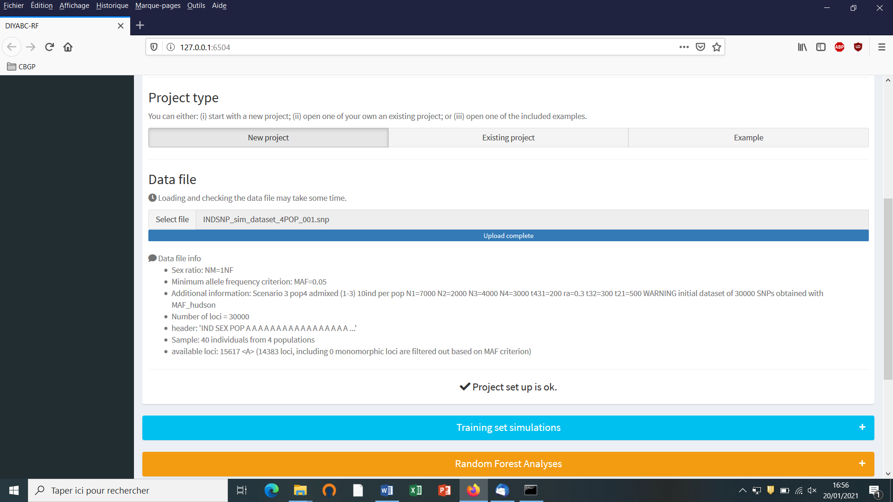
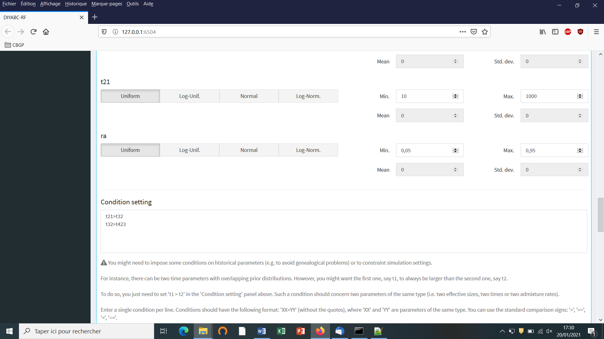
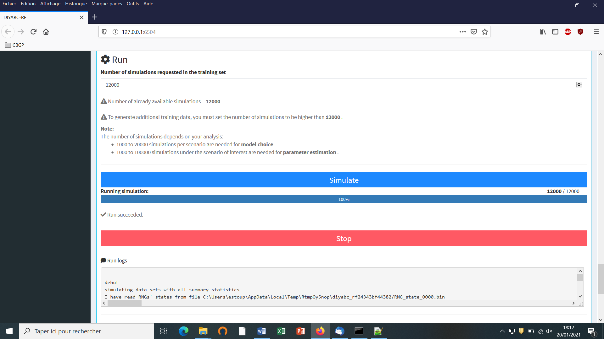
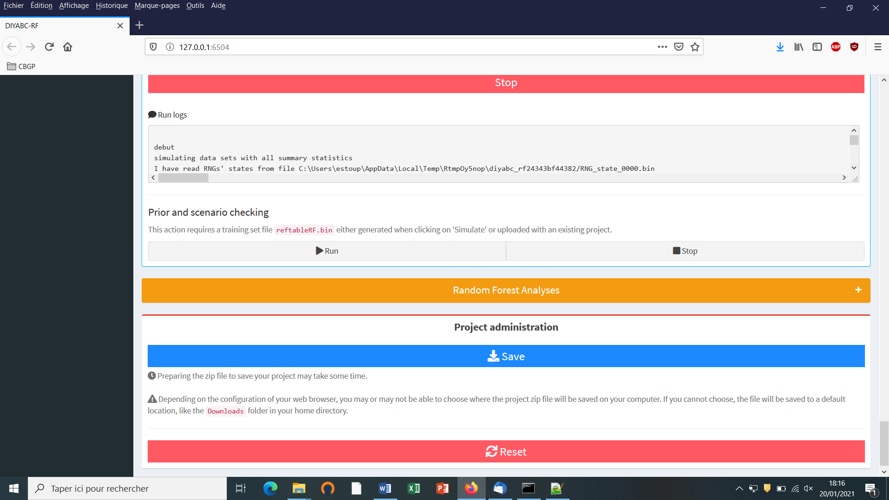
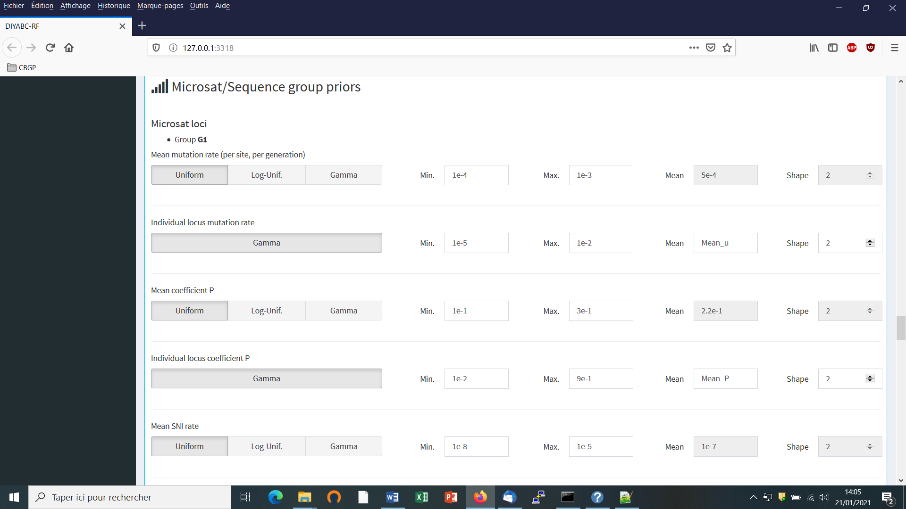
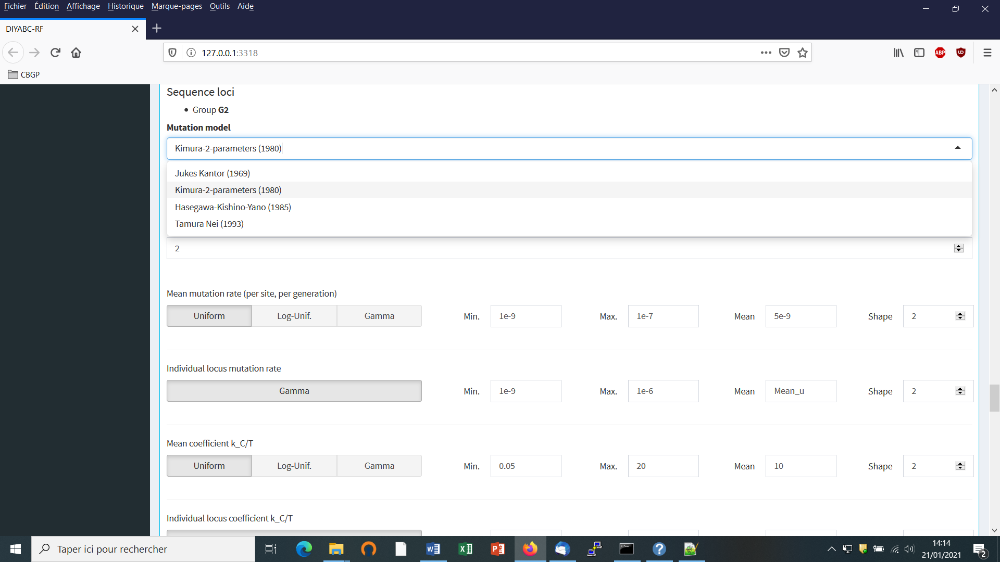
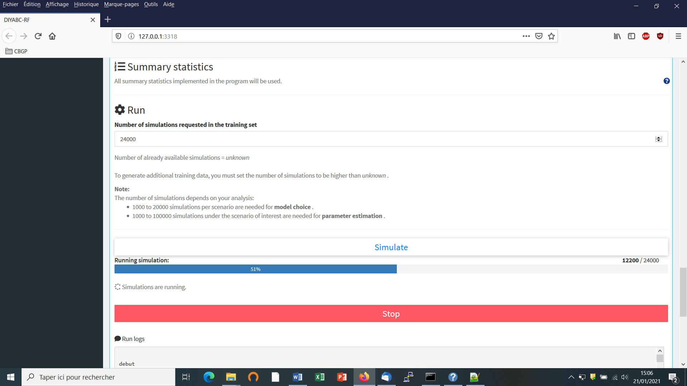

# USER MANUAL for DIYABC Random Forest v1.0

# - 23th of March 2021 -

François-David Collin 1,\*, Ghislain Durif 1,\*,
Louis Raynal 1, Eric Lombaert 2, Mathieu Gautier
3, Renaud Vitalis 3, Jean-Michel Marin
1,&, Arnaud Estoup 3,&

1 IMAG, Univ Montpellier, CNRS, UMR 5149, Montpellier, France

2 ISA, INRAE, CNRS, Univ Côte d’Azur, Sophia Antipolis,
France

3 CBGP, Univ Montpellier, CIRAD, INRAE, Institut Agro, IRD,
Montpellier, France

\* Equal contribution (F-D.C.: computation part of the
program; S.D.: interface part of the program)

& These authors are joint senior authors on this work

Corresponding authors:

Arnaud Estoup. E-mail: <arnaud.estoup@.inrae.fr>

Francois-David.Collin: Francois-David.Collin@umontpellier.fr

Ghislain Durif: ghislain.durif@umontpellier.fr

# CONTENTS

*Warning: You might want to activate the option “Navigation panel”
(accessible through the “Display” tab) after opening the present manual
file under Word. This navigation panel, visible on the left size of the
document once activated, will allow you reaching directly through simple
click actions the different sections and sub-sections described below.
You can navigate just by directly clicking on the titles of the content
below when using the pdf format of the present document.*

[1. (BRIEF) INTRODUCTION 4](#brief-introduction)

[1.1 General context 4](#general-context)

[1.2 How to cite the program DIYABC Random Forest v1.0
4](#how-to-cite-the-program-diyabc-random-forest-v1.0)

[1.3 Web site 4](#web-site)

[1.4. System requirements, installing and launching the program
4](#system-requirements-installing-and-launching-the-program)

[1.5 Acknowledgements 5](#acknowledgements-1)

[2. FORMALIZATION OF SCENARIOS AND GENERATION OF THE TRAINING SET
5](#formalization-of-scenarios-and-generation-of-the-training-set)

[2.1 Basic notions 5](#basic-notions)

[2.2 Main features of algorithms for data simulation
5](#main-features-of-algorithms-for-data-simulation)

[2.3 Historical model parameterization
7](#historical-model-parameterization)

[2.3.1 Key notes 8](#key-notes)

[2.3.2 Examples 9](#_Toc67674922)

[2.4 Mutation model parameterization (microsatellite and DNA sequence
loci)
12](#mutation-model-parameterization-microsatellite-and-dna-sequence-loci)

[2.4.1 Microsatellite loci 13](#microsatellite-loci)

[2.4.2 DNA sequence loci 13](#dna-sequence-loci)

[2.4.3 SNPs do not require mutation model parameterization – notion of
MAF and MRC
13](#snps-do-not-require-mutation-model-parameterization-notion-of-maf-and-mrc)

[2.5 Prior distributions 15](#prior-distributions)

[2.6 Summary statistics as components of the feature vector
15](#summary-statistics-as-components-of-the-feature-vector)

[2.6.1 For microsatellite loci 15](#for-microsatellite-loci)

[2.6.2 For DNA sequence loci 16](#for-dna-sequence-loci)

[2.6.3 For SNP loci 16](#for-snp-loci)

[2.7 Generating the training set 16](#generating-the-training-set)

[3. RANDOM FOREST ANALYSIS 17](#_Toc67674933)

[3.1 Addition of linear combinations of summary statistics to the vector
feature
17](#addition-of-linear-combinations-of-summary-statistics-to-the-vector-feature)

[3.2 Prediction using Random Forest: scenario choice 17](#_Toc67674936)

[3.3 Prediction using Random Forest: parameter estimation
17](#_Toc67674937)

[3.4 Assessing the quality of predictions 18](#_Toc67674938)

[3.4.1 Metrics for scenario choice 18](#metrics-for-scenario-choice)

[3.4.2 Metrics for parameter estimation
18](#metrics-for-parameter-estimation)

[4. PRACTICAL CONSIDERATIONS FOR ABC-RF TREATMENTS 18](#_Toc67674941)

[4.1 Are my scenarios and/or associated priors compatible with the
observed dataset? 19](#_Toc67674942)

[4.2 Did I simulate enough datasets for my training set?
19](#_Toc67674943)

[4.3 Did my forest frow enough trees? 19](#_Toc67674944)

[5. RUNNING (EXAMPLE) DATASET TREATMENTS USING THE GRAPHIC USER
INTERFACE (GUI)
20](#running-example-dataset-treatments-using-the-graphic-user-interface-gui)

[5.1 Launching the GUI 20](#_Toc67674946)

[5.2 What is a DIYABC-RF project? 20](#doc_openProjectButton)

[5.3 Main options of the home screen
21](#main-options-of-the-home-screen)

[5.4 How to generate a new IndSeq SNP training set
22](#how-to-generate-a-new-indseq-snp-training-set)

[5.4.1 Step 1: defining a new IndSeq project 22](#_Toc67674950)

[5.4.2 Step 2: choosing the data file
23](#step-2-choosing-the-data-file)

[5.4.3 Step 3: Inform the historical model 25](#_Toc67674952)

[5.4.4 Step 4: Inform number of loci to simulate (and chromosome type)
27](#_Toc67674953)

[5.4.5 Step 5: Summary statistics 28](#_Toc67674954)

[5.4.6 Step 6: Simulate the training set 29](#_Toc67674955)

[5.4.7 Step 7:Prior-scenario checking PRE-ANALYSIS (optional but
recommended) 30](#_Toc67674956)

[5.5 How to generate a new PoolSeq SNP training set
31](#how-to-generate-a-new-poolseq-snp-training-set)

[5.6 How to generate a new microsatellite (and/or DNA sequence) training
set
31](#how-to-generate-a-new-microsatellite-andor-dna-sequence-training-set)

[5.6.1 Step 4: Inform the genetic model
31](#step-4-inform-the-genetic-model)

[5.6.2 Step 5: Summary statistics 36](#step-5-summary-statistics)

[5.7 How to work from an “Existing project” (for any type of markers)
37](#_Toc67674961)

[6. PERFORMING RANDOM FOREST ANALYSES
40](#performing-random-forest-analyses)

[6.1 Files needed 40](#files-needed)

[6.2. Scenario choice analysis 41](#scenario-choice-analysis)

[6.3. Parameter estimation analysis 44](#parameter-estimation-analysis)

[7. KEY FILES 47](#key-files)

[7.1 Data files 47](#data-files)

[7.1.1 IndSeq SNP data 47](#_Toc67674968)

[7.1.2 PoolSeq SNP data 49](#_Toc67674969)

[7.3.1 Microsatellite and DNA sequence data 51](#_Toc67674970)

[7.2 Training set file(s) 53](#training-set-files)

[7.3 Output files produced by a Random Forest analysis
53](#output-files-produced-by-a-random-forest-analysis)

[7.4 Other files 56](#other-files)

[8. GENERATE SYNTHETIC DATAFILES 56](#_Toc67674974)

[9. USING DIYABC-RF ON A COMPUTER SERVER AND EXAMPLES OF COMMAND LINES
57](#_Toc67674975)

[10. TOY EXAMPLES 59](#_Toc67674976)

[11. REFERENCES CITED 60](#_Toc67674977)

# 1. (BRIEF) INTRODUCTION

## 1.1 General context 

> Simulation-based methods such as Approximate Bayesian Computation
> (ABC) are well adapted to the analysis of complex models of
> populations and species genetic history (Beaumont 2010). In this
> context, supervised machine learning (SML) methods provide attractive
> statistical solutions to conduct efficient inferences about both
> scenario choice and parameter estimation (Schrider & Kern 2018). The
> Random Forest methodology (RF) is a powerful ensemble of SML
> algorithms used for both classification and/or regression problems
> (Breiman 2001). RF allows conducting inferences at a lower
> computational cost than ABC, without preliminary selection of the
> relevant components of the ABC summary statistics, and bypassing the
> derivation of ABC tolerance levels (Pudlo et al. 2018; Raynal et al.
> 2019). We have implemented a set of RF algorithms to process
> inferences using simulated datasets generated from an extended version
> of the population genetic simulator implemented in DIYABC v2.1.0
> (Cornuet et al. 2014). The resulting computer package, named DIYABC
> Random Forest v1.0, integrates two functionalities into a
> user-friendly interface: the simulation under custom evolutionary
> scenarios of different types of molecular data (microsatellites, DNA
> sequences or SNPs – including traditional **IndSeq** and more recent
> **PoolSeq** SNP data) and RF treatments including statistical tools to
> **evaluate the power and accuracy of inferences (Collin et al. 2020).
> Because of the properties inherent of** the implemented RF methods and
> the large feature vector (including various summary statistics and
> their linear combinations) available for SNP data, DIYABC Random
> Forest v1.0 can efficiently contribute to the analysis of large-size
> SNP (and other molecular markers) datasets to make inferences about
> complex population genetic histories.

## 1.2 How to cite the program DIYABC Random Forest v1.0

> Collin F-D, Durif G, Raynal L, Lombaert E, Gautier M, Vitalis R, Marin
> J-M, Estoup A (2021) DIYABC Random Forest v1.0: extending approximate
> Bayesian computation with supervised machine learning to infer
> demographic history from genetic polymorphisms. *Molecular Ecology
> Resources*. DOI: 10.22541/au.159480722.26357192

## 1.3 Web site

[https://diyabc.github.io](https://diyabc.github.io/).

You can get from this github site the executable files for different
operating systems, the latest version of this manual document, as well
as examples of DIYABC Random Forest analyses for different types of
markers.

## 1.4. System requirements, installing and launching the program

-   The software DIYABC Random Forest (hereafter DIYABC-RF) v1.0 is
    composed of three parts: the dataset simulator, the Random Forest
    inference engine and the graphical user interface. The whole is
    packaged as a standalone and user-friendly graphical application
    named DIYABC-RF GUI and available at
    [https://diyabc.github.io](https://diyabc.github.io/). The different
    developer and user manuals for each component of the software are
    available on the same website. DIYABC-RF is a multithreaded software
    which can be run on three operating systems: GNU/Linux, Microsoft
    Windows and MacOS. The program can be used through a modern and
    user-friendly graphical interface designed as an R shiny application
    (Chang et al. 2019). For a fluid and simplified user experience,
    this interface is available through a standalone application, which
    does not require installing R or any dependencies and hence can be
    used independently. The application is also implemented in an R
    package providing a standard shiny web application (with the same
    graphical interface) that can be run locally as any shiny
    application, or hosted as a web service to provide a DIYABC-RF
    server for multiple users.

-   To install and run the program, please check the instructions
    available on the website https://diyabc.github.io/

-   Minimum 4GB of RAM; 6GB of RAM recommended

-   From 1 to 10 GB free disk space for each DIYABC-RF project depending
    on the project configuration and the number of simulated datasets
    recorded in the training set file (reftableRF.bin file).

## 1.5 Acknowledgements

We thank Pierre Pudlo for useful discussions and Jean-Marie Cornuet for
computer code expertise at the onset of the ABC Random Forest project.
We also thank several “beta-users”, especially XXXNAMEXXX, who tested
the software DIYABC Random Forest v1.0 with their data. This work was
supported by funds from the French Agence National pour la Recherche
(ANR projects SWING and GANDHI), the INRAE scientific division SPE
(AAP-SPE 2016), and the LabEx NUMEV (NUMEV, ANR10-LABX-20).

# 2. FORMALIZATION OF SCENARIOS AND GENERATION OF THE TRAINING SET

## 2.1 Basic notions

Before processing Random Forest analyses, one need to generate a
*training set* which corresponds to the so called *reference table* in a
standard ABC framework (Cornuet et al. 2014 and see the associated
program DIYABC v2.1.0). The datasets composing the training set can be
simulated under different models (hereafter referred to as scenarios)
and samples (i.e. nb of markers and sampled individuals) configurations,
using parameter values drawn from prior distributions. Each resulting
dataset is summarized using a set of descriptive statistics. Scenarios
and prior distributions are formalized in the main pipeline of the
software DIYABC-RF and summary statistics are computed using the
“<u>Training set simulation</u>” module of the main pipeline of
DIYABC-RF, which essentially corresponds to an extended version of the
population genetics simulator implemented in DIYABC v2.1.0 (Cornuet et
al. 2014). As in the latter program, DIYABC-RF allows considering
complex population histories including any combination of population
divergence events, symmetrical or asymmetrical admixture events (but not
any continuous gene flow between populations) and changes in past
population size, with population samples potentially collected at
different times. Statistical analysis based on Random Forest algorithms
of an observed dataset using a given training set are computed using the
“<u>Random Forest Analysis”</u> module of the main pipeline of
DIYABC-RF.

## 2.2 Main features of algorithms for data simulation

The ABC part of DIYABC-RF is a simulation-based method. Data simulation
is based on the Wright-Fisher model. It consists in generating the
genealogy of all sampled genes until their most recent common ancestor
using (backward in time) coalescence theory. This begins by randomly
drawing a complete set of parameters from their own prior distributions
and that satisfy all imposed conditions. Then, once events have been
ordered by increasing times, a sequence of *actions* is constructed. If
there is more than one locus, the same sequence of actions is used for
all successive loci.

Possible *actions* fall into four categories:

\- **adding a sample to a population** = Add as many gene lineages to
the population as there are genes in the sample.

\- **merge two populations** = Move the lineages of the second
population into the first population.

\- **split between two populations** = Distribute the lineages of the
admixed population among the two parental populations according to the
admixture rate.

\- **coalesce and mutate lineages within a population** = There are two
possibilities here, depending on whether the population is *terminal* or
not. We call *terminal* the population including the most recent common
ancestor of the whole genealogy. In a terminal population, coalescences
and mutations stop when the MRCA is reached whereas in a non-terminal
population, coalescence and mutations stop when the upper (most ancient)
limit is reached. In the latter case, coalescences can stop before the
upper limit is reached because there remains a single lineage, but this
single remaining lineage can still mutate.

Two different coalescence algorithms are implemented: a generation by
generation simulation or a continuous time simulation. The choice,
automatically performed by the program, is based on an empirical
criterion which ensures that the continuous time algorithm is chosen
whenever it is faster than generation by generation while keeping the
relative error on the coalescence rate below 5% (see Cornuet et al. 2008
for a description of this criterion). In any case, a coalescent tree is
generated over all sampled genes.

Then the mutational simulation process diverges depending on the type of
markers: for microsatellite or DNA sequence loci, mutations are
distributed over the branches according to a Poisson process whereas for
SNP loci, one mutation is applied to a single branch of the coalescent
tree, this branch being drawn at random with probability proportional to
its length. Eventually, starting from an ancestral allelic state
(established as explained below), all allelic states of the genealogy
are deduced forward in time according to the mutation process. For
microsatellite loci, the ancestral allelic state is taken at random in
the stationary distribution of the mutation model (not considering
potential single nucleotide indel mutations). For DNA sequence loci, the
procedure is slightly more complicated. First, the total number of
mutations over the entire tree is evaluated. Then according to the
proportion of constant sites and the gamma distribution of individual
site mutation rates, the number and position of mutated sites are
generated. Finally, these mutated sites are given ‘A’, ‘T’, ‘G’ or ‘C’
states according to the selected mutation model. For SNP loci, the
ancestral allelic state is arbitrarily set to 0 and it becomes equal to
1 after mutation.

Each category of loci has its own coalescence rate deduced from male and
female effective population sizes. In order to combine different
categories (e.g. autosomal and mitochondrial), we have to take into
account the relationships among the corresponding effective population
sizes. This can be achieved by linking the different effective
population sizes to the effective number of males (NM) and
females (NF) through the sum
NT=NF+NM and the ratio
r=NM/(NF+NM). We use the following
formulae for the probability of coalescence (*p*) of two lineages within
this population:

Autosomal diploid loci:

N_{T}}")

Autosomal haploid loci:

N_{T}}")

X-linked loci / haplo-diploid loci:

N_{T}}")

Y-linked loci:

Mitochondrial loci:

N_{T}}")

Users have to provide a (total) effective size NT (on which
inferences will be made) and a sex-ratio r. If no sex ratio is provided,
the default value of r is taken as 0.5.

## 2.3 Historical model parameterization

The evolutionary scenario, which is characterized by the historical
model, can be described in a dedicated panel of the interface of the
program as a succession in time of "events" and "inter event periods".
In the current version of the program, we consider four categories of
events: population divergence, discrete change of effective population
size, admixture and sampling (the last one allow considering samples
taken at different times). Between two successive events affecting a
population, we assume that populations evolve independently (e.g.
without migration) and with a fixed effective size. The usual parameters
of the historical model are the times of occurrence of the various
events (counted in number of generations), the effective sizes of
populations and the admixture rates. **When writing the scenario, events
have to be coded sequentially backward in time** (see section 2.3.2 for
examples). Although this choice may not be natural at first sight, it is
coherent with coalescence theory on which are based all data simulations
in the program. For that reason, the keywords for a divergence or an
admixture event are `merge` and `split`, respectively. Two keywords
`varNe` and `sample` correspond to a discrete change in effective
population size and a gene sampling within a given population,
respectively. A scenario takes the form of a succession of lines (one
line per event), each line starting with the time of the event, then the
nature of the event, and ending with several other data depending on the
nature of the event. Following is the syntax used for each category of
event:

Population sample  

`sample`

Where

is the time (always counted in number of generations) at which the
sample was collected and

is the population number from which is taken the sample. It is worth
stressing here that **samples are considered in the same order as they
appear in the data file**. The number of lines will thus be exactly
equal to the number of samples in the datafile.

**Population size variation**

`varNe`

  
From time
,
looking backward in time, population

will have an effective size
.

Population divergence  

`merge`

  
At time
,
looking backward in time, population

"merges" with population
.
Hereafter, only

"remains".

Population admixture  

`split`

  
At time
,
looking backward in time, population

"splits" between populations

and
.
A gene lineage from population

joins population

(respectively
)
with probability

(respectively
1-).
Hereafter, only

and

"remain".

Note that one needs to write a first line giving the **effective sizes
of the sampled populations before the first event described**, looking
backward in time. Expressions between arrows, other than population
numbers, can be either a numeric value (e.g. 25) or a character string
(e.g. `t0`). In the latter case, it is considered as a parameter of the
model. The program offers the possibility to add or remove scenarios, by
just clicking on the corresponding buttons. The usual shortcuts (e.g.
CTRL+C, CTRL+V and CTRL+X) can be used to edit the different scenarios.
Some or all parameters can be in common among scenarios.

### 2.3.1 Key notes

1.  There are two ways of giving a fixed value to effective population
    sizes, times and admixture rates. Either the fixed value appears as
    a numeric value in the scenario windows or it is given as a string
    value like any parameter. In the latter case, one gives this
    parameter a fixed value by choosing a Uniform distribution and
    setting the minimum and maximum to that value in the prior setting
    of the corresponding interface panel.

2.  All expressions must be separated by at least one space.

3.  All expressions relative to parameters can include sums or
    differences of parameters of the same type (e.g. divergence times or
    effective population size but not a mixture of both). For instance,
    it is possible to write:  
    `t0 merge 2 3`  
    `t0+t1 merge 1 2`  
    This means that `t1` is the time elapsed between the two merge
    events. Note that one cannot mix a parameter and a numeric value
    (e.g. `t1+150` will result in an error). This can be done by writing
    `t1+t2` and fixing `t2` by choosing a uniform distribution with
    lower and upper bounds both equal to 150 in the interface.

4.  **Time is always given in generations**. Since we look backward,
    time increases towards past.

5.  Negative times are allowed (e.g. the example given in section
    2.3.2), but not recommended.

6.  Population numbers must be consecutive natural integers starting
    at 1. The number of population can exceed the number of samples and
    vice versa: in other words, *unsampled populations* can be
    considered in the scenario on one hand, and the same population can
    be sampled more than once on the other hand.

7.  **Multi-furcating population trees** can be considered, by writing
    **several divergence events occurring at the same time.** However,
    one has to be careful to the order of the `merge` events. For
    instance, the following piece of scenario will fail:  
    `100 merge 1 2`  
    `100 merge 2 3`  
    This is because, after the first line, population 2, which has
    merged with population 1, does not "exist" anymore (the remaining
    population is population 1). So, it cannot receive lineages of
    population 3 as it should as a result of the second line. The
    correct ways are either to put line 2 before line 1, or to change
    line 2 to: `100 merge 1 ``3`.

8.  Since times of events can be parameters, the order of events can
    change according to the values taken by the time parameters. In any
    case, before simulating a dataset, the program sorts out events by
    increasing times. Note that sorting out events by increasing times
    can only be done when all time values are known, i.e. when
    simulating datasets. When checking scenarios in the interface, all
    time values are not yet defined, so that when visualizing a
    scenario, events are represented in the same order as they appear in
    the window used to define the scenario. If two or more events occur
    at the same time, the order is that of the scenario as written by
    the user.

9.  Most scenarios begin with sampling events. We then need to know the
    effective size of the populations to perform the simulation of
    coalescences until the next event concerning each population. We
    decided to provide the effective size (first line) and the sampling
    description (following lines) on distinct lines.

**2.3.2 Examples**

Below are some usual scenarios with increasing complexity. Each scenario
is coded (as in the corresponding interface panel of the program) on the
left side and a graphic representation (given by DIYABC-RF) is printed
on the right side

1.  One population from which several samples have been taken at various
    generations: 0, 3 and 10. Generation 0 could correspond for instance
    to the most recent sampling date. The only unknown
    historical-demographical parameter of the scenario is the (constant)
    effective population size which is defined in the first line at
    sampling time.

<table>
<tbody>
<tr class="odd">
<td><ul>
<li></li>
</ul></td>
<td><ul>
<li></li>
</ul></td>
</tr>
</tbody>
</table>

1.  Two populations of size `N1` and `N2` (defined in the first line at
    sampling time) have diverged `t` generations in the past from an
    ancestral population of size `N1+N2`.

<table>
<tbody>
<tr class="odd">
<td><ul>
<li></li>
</ul></td>
<td><ul>
<li></li>
</ul></td>
</tr>
</tbody>
</table>

1.  Two parental populations (1 and 2) with constant effective
    population sizes `N1` and `N2` have diverged at time `td` from an
    ancestral population of size `NA`. At time `ta`, there has been an
    <u>admixture event</u> between the two populations giving birth to
    an admixed population (3) with effective size `N3` and with an
    admixture rate `ra` corresponding to the proportion of genes from
    population 1.

<table>
<tbody>
<tr class="odd">
<td><ul>
<li></li>
</ul></td>
<td><ul>
<li></li>
</ul></td>
</tr>
</tbody>
</table>

1.  The next scenario includes <u>four population samples and two
    admixture events</u>. All populations have identical effective sizes
    (`Ne`).

<table>
<tbody>
<tr class="odd">
<td><ul>
<li></li>
</ul></td>
<td><ul>
<li></li>
</ul></td>
</tr>
</tbody>
</table>

-   Note that although there are only four samples, the scenario
    includes a fifth <u>unsampled population (also called “ghost
    population”)</u>. This unsampled population which diverged from
    population 1 at time `t3` was a parent in the admixture event
    occurring at time `t2`. Note also that the first line must include
    the effective sizes (here Ne) of the *five* populations. (i.e. the
    four sampled population and the single unsampled population here at
    position 5).

1.  Example of DIYABC-RF code for <u>unidirectional
    admixture/introgression</u> where a fraction r2 of genes from
    population 'Pop 2' (with an effective population size N2)
    introgresses into population 'Pop 1' (with a population size N1) at
    time t1. The code also describes the merge of the two populations
    'Pop 1' and 'Pop 2' into a common ancestor (with a population size
    Na) at time t2. It is worth noting that: (i) in the observed
    datafile, there are only two sampled populations (Pop 1 and Pop 2)
    and the user will need to define two (additional) <u>unsampled</u>
    populations in the first line of code (Pop 3 and Pop 4 with
    effective population size N2); (ii) we advise in this case to draw
    the fraction of genes transferred during the unidirectional
    admixture (r2) into a uniform distribution with min and max bounds
    equal to e.g.. 0.01 (very weak introgression from 'Pop 2' into 'Pop
    1') and 0.5 (strong introgression from 'Pop 2' into 'Pop 1'),
    respectively.

> **N1
> N2 N2 N2** *\# comment 1*
>
> **0 sample 1**
>
> **0 sample 2**
>
> **t1 split 2 3 4 r2** *\# comment 2*
>
> **t1 merge 1 3** *\# comment 3*
>
> **t2 merge 1 4** *\# comment 4*
>
> **t2 VarNe 1 Na** *\# comment 5*
>
> *\# comment 1: both unsampled populations 'Pop 3' and 'Pop 4'
> correspond to 'Pop 2', hence their population sizes N2.  
> \# comment 2: at time t1 a fraction r2 of genes from 'Pop 2' goes into
> the unsampled population 'Pop 3' and a fraction 1-r2 goes into the
> unsampled population 'Pop 4' ('Pop 2' disappears)*
>
> *\# comment 3: we immediately merge (cf. still at time t1) the
> unsampled population 'Pop 3' (with the fraction r2 of genes from 'Pop
> 2') into the population 'Pop 1' - hence the unidirectional admixture
> of r2 genes from 'Pop 2' into 'Pop 1' ('Pop 3' disappears)*
>
> *\# comment 4: 'Pop 4' which now corresponds to the ex-'Pop 2' with
> the fraction 1-r2 of genes - can be merge into 'Pop 1'*
>
> *\# comment 5: the population ancestral to 'Pop 1' and 'Pop 2' now has
> its own population size Na*

1.  The following three scenarios correspond to a classic invasion
    history from an ancestral population (population 1<u>). In scenario
    1, population 3 is derived from population 2, itself derived from
    population 1. In scenario 2, population 2 derived from population 3,
    itself derived from population 1. In scenario 3, both populations 2
    and 3 derived independently from population 1.</u> Note that when a
    new population is created from its ancestral population, there is an
    initial size reduction (noted here `N2b` for population 2 and `N3b`
    for population 3) for a given number of generation (here db for both
    populations) mimicking a demographic bottleneck since the invasive
    population generally starts with a few immigrants. For instance, a
    low number of Nxb individuals for db generations could corresponds
    to Nxb values ranging between 5 to 100 individuals and db values
    ranging from 1 to 10 generations (e.g. Fraimout et al. 2017). If db
    = 0 then no bottleneck occurs which can be also a coding choice.

Scenario 1

<table>
<tbody>
<tr class="odd">
<td></td>
<td></td>
</tr>
</tbody>
</table>

Scenario 2

<table>
<tbody>
<tr class="odd">
<td></td>
<td></td>
</tr>
</tbody>
</table>

Scenario 3

<table>
<tbody>
<tr class="odd">
<td></td>
<td></td>
</tr>
</tbody>
</table>

## 2.4 Mutation model parameterization (microsatellite and DNA sequence loci)

The program can analyze microsatellite data and DNA sequence data
altogether as well as separately. SNP loci can only be also analyzed
separately from microsatellite data and DNA sequence data. It is worth
stressing that all loci in an analysis must be <u>genetically
independent</u>. Second, for DNA sequence loci, intra-locus
recombination is not considered. Loci are grouped by the user according
to its needs. For microsatellite and DNA sequence, a different mutation
model can be defined for each group. For instance, one group can include
all microsatellites with motifs that are 2 bp long and another group
those with a 4 bp long motif. Also, with DNA sequence loci, nuclear loci
can be grouped together and a mitochondrial locus form a separate group.
<u>SNPs do not require mutation model parameterization (see below for
details)</u>.

We now describe the parameterization of microsatellite and DNA sequence
markers.

### 2.4.1 Microsatellite loci

Although a variety of mutation models have been proposed for
microsatellite loci, it is usually sufficient to consider only the
simplest models (e.g. Estoup et al. 2002). This has the non-negligible
advantage of reducing the number of parameters. This is why we chose the
Generalized Stepwise Mutation model (GSM). Under this model, a mutation
increases or decreases the length of the microsatellite by a number of
repeated motifs following a geometric distribution. This model
necessitates only two parameters: the mutation rate (`µ`) and the
parameter of the geometric distribution (`P`). The same mutation model
is imposed to all loci of a given group. However, each locus has its own
parameters (µi and Pi`) `and, following a
hierarchical scheme, each locus parameter is drawn from a gamma
distribution with mean equal to the mean parameter value.

Note also that:

1.  Individual loci parameters (µi and Pi) are considered as nuisance
    parameters and hence are never recorded. Only mean parameters are
    recorded.

2.  The variance or shape parameter of the gamma distributions are set
    by the user and are NOT considered as parameters.

3.  The SMM or Stepwise Mutation Model is a special case of the GSM in
    which the number of repeats involved in a mutation is always one.
    Such a model can be easily achieved by setting the maximum value of
    mean P
    ()
    to 0. In this case, all loci have their
    
    set equal to 0 whatever the shape of the gamma distribution.

4.  All loci can be given the same value of a parameter by setting the
    shape of the corresponding gamma distribution to 0 (this is NOT a
    limiting case of the gamma, but only a way of telling the program).

To give more flexibility to the mutation model, the program offers the
possibility to consider <u>mutations that insert or delete a single
nucleotide</u> to the microsatellite sequence by using a mean parameter
(named
}"))
with a prior to be defined and individual loci having either values
identical to the mean parameter or drawn from a Gamma distribution.

### 2.4.2 DNA sequence loci

The program does not consider insertion-deletion mutations, mainly
because there does not seem to be much consensus on this topic.
Concerning substitutions, only the simplest models are considered. We
chose the Jukes-Cantor (1969) one parameter model, the Kimura (1980) two
parameter model, the Hasegawa-Kishino-Yano (1985) and the Tamura-Nei
(1993) models. The last two models include the ratios of each nucleotide
as parameters. In order to reduce the number of parameters, these ratios
have been fixed to the values calculated from the observed dataset for
each DNA sequence locus. Consequently, this leaves two and three
parameters for the Hasegawa-Kishino-Yano (HKY) and Tamura-Nei (TN),
respectively. Also, two adjustments are possible: one can fix the
fraction of constant sites (those that cannot mutate) on the one hand
and the shape of the Gamma distribution of mutations among sites on the
other hand. As for microsatellites, all sequence loci of the same group
are given the same mutation model with mean parameter(s) drawn from
priors and each locus has its own parameter(s) drawn from a Gamma
distribution (same hierarchical scheme). Notes 1, 2 and 4 of previous
subsection (2.4.1) apply also for sequence loci.

### 2.4.3 SNPs do not require mutation model parameterization – notion of MAF and MRC

SNPs have two characteristics that allow to get rid of mutation models:
they are (necessarily) polymorphic and they present only two allelic
states (ancestral and derived). In order to be sure that all analyzed
SNP loci have the two characteristics, <u>monomorphic loci are discarded
right from the beginning of analyses</u> (when the observed dataset is
scanned by the program). Note that a warning message will appear if the
observed dataset include monomorphic loci, the latter being
automatically removed from further analyses by the program. It is
assumed that there occurred one and only one mutation in the coalescence
tree of sampled genes. We will see below that this largely simplifies
(and speeds up) SNP data simulation as one can use in this case the
efficient “-s” algorithm of Hudson (2002) (Cornuet et al. 2014). Also,
this advantageously reduces the dimension of the parameter space as
mutation parameters are not needed in this case. There is however a
potential drawback which is the absence of any calibration generally
brought by priors on mutation parameters. <u>Consequently,
time/effective size ratios rather than original time or effective size
parameters can be accurately estimated (e.g. Collin et al. 2021)</u>.

It is worth noting that, using the Hudson’s simulation algorithm for SNP
markers leads to applying a kind of default <u>MAF (minimum allele
frequency)</u> criterion on the simulated dataset. As a matter of fact,
with this simulation algorithm each locus in both the observed and
simulated datasets will be characterized by the presence of at least one
copy of the SNP alleles over all genes sampled from all studied
populations (i.e. pooling all genes genotyped at the locus). In
DIYABC-RF, it is possible to impose a different MAF criterion on both
the observed and simulated datasets. For each SNP, the MAF is computed
pooling all genes genotyped over all studied population samples. For
instance, the specification of a MAF equal to 5% will automatically
select a subset of *m* loci characterized by a minimum allele frequency
≥ 5% out of the *l* loci of the observed dataset and only *m* loci with
a MAF ≥ 5% will be retained in a simulated dataset. In practice, the
instruction for a given MAF has to be indicated directly in the headline
of the file of the observed dataset (see section 7.1.1 for data file
examples). For instance, if one wants to consider only loci with a MAF
equal to 5% one will write &lt;MAF=0.05&gt; in the headline. Writing
&lt;MAF=hudson&gt; (or omitting to write any instruction with respect to
the MAF) will bring the program to use the standard Hudson's algorithm
without further selection. The selection of a subset of loci fitting a
given MAF allows: (i) to remove loci with very low level of polymorphism
from the dataset and hence increase the mean level of genetic variation
of both the observed and simulated datasets, without producing any bias
in the analyses; and (ii) to reduce the proportion of loci for which the
observed variation may corresponds to sequencing errors. In practice MAF
values ≤10% are considered. To check for the consistency/robustness of
the ABC results obtained, it may be useful to treat a SNP dataset
considering different MAFs (for instance MAF=hudson, MAF=1% and MAF=5%).
Note that increasing the MAF leads to increase the simulation times of
SNP datasets as more loci need to be simulated with the Hudson’s
algorithm to obtain a given number of loci fitting the required MAF.

It is worth stressing that the MAF criterion applies to standard
Individual sequencing (hereafter **IndSeq**) SNP data. In addition to
IndSeq data, DIYABC-RF allows the simulation and analyses of
pool-sequencing SNP data (hereafter **PoolSeq** data), which basically
consist of whole-genome sequences of pools of tens to hundreds of
individual DNAs (Gautier et al. 2013; Schlötterer et al. 2014). In
practice, the simulation of PoolSeq data consists first in simulating
individual SNP genotypes for all individuals in each population pool,
and then generating pool read counts from a binomial distribution
parameterized with the simulated allele counts (obtained from individual
SNP genotypes) and the total pool read coverage (e.g., Hivert et al.
2018). A criterion somewhat similar to the MAF was implemented for
PoolSeq data: <u>the minimum read count (MRC)</u>. The MRC is the
minimum number of sequence reads for each alleles of a SNP when pooling
the reads overall population samples. The specification of a MRC equal
for instance to 5 will automatically select a subset of *m* PoolSeq loci
for which both alleles have at least five reads among the *l* loci of
the observed dataset and only *m* loci with a MRC ≥ 5 will be retained
in a simulated dataset. In practice, the instruction for a given MRC has
to be indicated directly in the headline of the file of the observed
dataset (see section 7.1.2 for data file examples). For instance, if one
wants to consider only loci with a MRC equal to 5 one will write
&lt;MRC=5&gt; in the headline. The selection of a subset of loci fitting
a given MRC allows to reduce the proportion of loci for which the
observed variation may corresponds to sequencing errors. If MRC is large
enough (e.g. MRC=5 or 10), it also removes the loci with very low level
of polymorphism from the dataset and hence increase the mean level of
genetic variation of both the observed and simulated datasets, without
producing any bias in the analyses; In practice MRC values of 2, 3,4 and
5 are recommended. To check for the consistency/robustness of the ABC
results obtained, it may be useful to treat a SNP dataset considering
different MAFs (for instance MRC=2 and MRC=5). As for the MAF,
increasing the MRC leads to increase the simulation times of PoolSeq SNP
datasets as more loci need to be simulated with the Hudson’s algorithm
to obtain a given number of loci fitting the required MRC.

## 2.5 Prior distributions

The Bayesian aspect of the ABC-RF approach implies that parameter
estimations use prior knowledge about these parameters that is given by
prior distributions of parameters. The program offers a choice among
usual probability distributions, i.e. Uniform, Log-Uniform, Normal or
Log-Normal for historical parameters and Uniform, Log-Uniform or Gamma
for mutation parameters. Extremum values (min and max) and other
parameters (e. g. mean and standard deviation) must be filled in by the
user. It is worth noting that one can impose some simple conditions on
historical parameters. For instance, there can be two times parameters
with overlapping prior distributions. However, we want that the first
one, say `t1`, to always be larger than the second one, say `t2`. For
that, we just need to set `t1`&gt;`t2` in the corresponding
edit-windows. Such a condition needs to be between two parameters and
more precisely between two parameters of the same category (i.e. two
effective sizes, two times or two admixture rates). The limit to the
number of conditions is imposed by the logics, not by the program. The
only binary relationships accepted here are &lt;, &gt;, ≤, and ≥.

## 2.6 Summary statistics as components of the feature vector 

The training set includes values of a feature vector which is a
multidimensional representation of any data point (i.e. simulated or
observed datasets) made up of measurements (or features) taken from it.
More specifically, the feature vector includes a large number of
statistics that summarize genetic variation in the way that they allow
capturing different aspects of gene genealogies and hence various
features of molecular patterns generated by selectively neutral
population histories (e.g. Beaumont 2010; Cornuet et al. 2014). For each
category (microsatellite, DNA sequences or SNP) of loci, the program
proposes a series of summary statistics among those used by population
geneticists.

Note: The code name of each statistic mentioned in the various program
outputs is given between brackets \[XXX\] in sections 2.6.1, 2.6.2 and
2.6.3.

### 2.6.1 For microsatellite loci

Single sample statistics:

1.  \[NAL\] - mean number of alleles across loci

2.  \[HET\] - mean gene diversity across loci (Nei 1987)

3.  \[VAR\] - mean allele size variance across loci

4.  \[MGW\] - mean M index across loci (Garza and Williamson 2001;
    Excoffier et al. 2005)

Two sample statistics:

1.  \[N2P\] - mean number of alleles across loci (two samples)

2.  \[H2P\] - mean gene diversity across loci (two samples)

3.  \[V2P\] - mean allele size variance across loci (two samples)

4.  \[FST\]
    -
    between two samples (Weir and Cockerham 1984)

5.  \[LIK\] - mean index of classification (two samples)

> (Rannala and Moutain 1997; Pascual et al. 2007)

1.  \[DAS\] - shared allele distance between two samples (Chakraborty
    and Jin 1993)

2.  \[DM2\] - distance between two samples (Golstein et al. 1995)

Three sample statistics:

1.  \[AML\] - Maximum likelihood coefficient of admixture (Choisy et
    al. 2004)

### 2.6.2 For DNA sequence loci

Single sample statistics:

1.  \[NHA\] - number of distinct haplotypes

2.  \[NSS\] - number of segregating sites

3.  \[MPD\] - mean pairwise difference

4.  \[VPD\] - variance of the number of pairwise differences

5.  \[DTA\] - Tajima’s D statistics (Tajima 1989)

6.  \[PSS\] - Number of private segregating sites

(=number of segregating sites if there is only one sample)

1.  \[MNS\] - Mean of the numbers of the rarest nucleotide at
    segregating sites

2.  \[VNS\] - Variance of the numbers of the rarest nucleotide at
    segregating sites

Two sample statistics:

1.  \[NH2\] - number of distinct haplotypes in the pooled sample

2.  \[NS2\] - number of segregating sites in the pooled sample

3.  \[MP2\] - mean of within sample pairwise differences

4.  \[MPB\] - mean of between sample pairwise differences

5.  \[HST\]
    -
    between two samples (Hudson et al. 1992)

> Three sample statistics:

1.  \[SML\] Maximum likelihood coefficient of admixture (adapted from
    Choisy et al. 2004)

### 2.6.3 For SNP loci

> For both IndSeq and PoolSeq SNPs, we have implemented the following
> (same) set of summary statistics.
>
> 1\. \[ML1p\] \[ML2p\] \[ML3p\] \[ML4p\] - *Proportion of monomorphic
> loci* for each population, as well as for each pair, triplet and
> quadruplet of populations.
>
> **Mean (m suffix added to the code name) and variance (v suffix) over
> loci values are computed for all subsequent summary statistics**
>
> 2\. \[HWm\] \[HWv\] \[HBm\] \[HBv\] - Heterozygosity for each
> population and for each pair of populations (Hivert et al. 2018).
>
> 3\. \[FST1m\] \[FST1v\] \[FST2m\] \[FST2v\] \[FST3m\] \[FST3v\]
> \[FST4m\] \[FST4v\] \[FSTGm\] \[FSTGv\] - FST-related statistics for
> each population (i.e., population-specific FST; Weir & Goudet 2017),
> for each pair, triplet, quadruplet and overall populations (when the
> dataset includes more than four populations) (Hivert et al. 2018).
>
> 4\. \[F3m\] \[F3v\] \[F4m\] \[F4v\] – allele shared Patterson’s
> f-statistics for each triplet (f3-statistics) and quadruplet
> (f4-statistics) of populations (Patterson et al. 2012 and Leblois et
> al. 2018 for the PoolSeq unbiased f3-statistics)
>
> 5\. \[NEIm\] \[NEIv\] - Nei’s (1972) distance for each pair of
> populations
>
> 6\. \[AMLm\] \[AMLv\] - Maximum likelihood coefficient of admixture
> computed for each triplet of populations (adapted from Choisy et al.
> 2004).

## 2.7 Generating the training set

The training set can include as many scenarios as desired. The prior
probability of each scenario is uniform so that each scenario will have
approximately the same number of simulated datasets. Only parameters
that are defined for the drawn scenario are generated from their
respective prior distribution. Scenarios may or may not share
parameters. When conditions apply to some parameters (see section 2.3),
parameter sets are drawn in their respective prior distributions until
all conditions are fulfilled. The simulated datasets (summarized with
the statistics detailed in section 2.6) of the training set are recorded
for further statistical analyses (using Random Forest algorithms) in a
key binary file named <u>reftableRF.bin</u>.

**3. RANDOM FOREST
ANALYSIS**

Once the training set has been generated, one can start various
statistical treatments using the Random Forest (RF) algorithms
implemented in the program and by running the “Random Forest analyses”
module.

## 3.1 Addition of linear combinations of summary statistics to the vector feature 

For scenario choice, the feature vector can be enriched before
processing RF predictions (default option that can be disabled) by
values of the *d* axes of a linear discriminant analysis (LDA) processed
on the above summary statistics (with *d* equal to the number of
scenarios minus 1; Pudlo et al. 2016). In the same spirit, for parameter
estimation, the feature vector can be completed (default option that can
be disabled) by values of a subset of the *s* axes of a Partial Least
Squares Regression analysis (PLS) also processed on the above summary
statistics (with *s* equal to the number of summary statistics). The
number of PLS axes added to the feature vector is determined as the
number of PLS axes providing a given fraction of the maximum amount of
variance explained by all PLS axes (i.e., 95% by default, but this
parameter can be adjusted). Note that, according to our own experience
on this issue, the addition into the feature vector of LDA or PLS axes
better extract genetic information from the training set and hence
globally improved statistical inferences. While the inferential gain
turned out to be systematic and substantial for LDA axes (scenario
choice), we found that including PLS axes improved parameter estimation
in a heterogeneous way, with a negligible gain in some cases (e.g.
Collin et al. 2020).

**3.2 Prediction using
Random Forest: scenario choice**

For scenario choice, the outcome of the first step of RF prediction
applied to a given target dataset is a <u>classification vote for each
scenario</u> which represents the number of times a scenario is selected
in a forest of *n* trees. The scenario with the highest classification
vote corresponds to the scenario best suited to the target dataset among
the set of compared scenarios. This first RF predictor is good enough to
select the most likely scenario but not to derive directly the
associated posterior probabilities. A second analytical step based on a
second Random Forest in regression is necessary to provide an estimation
of the <u>posterior probability of the best supported scenario</u>
(Pudlo et al. 2016).

**3.3 Prediction using
Random Forest: parameter estimation**

For parameter estimation, Raynal et al. (2019) extended the RF approach
developed in the context of (non-parametric) regression to estimate the
posterior distributions of a given parameter under a given scenario. The
approach requires the derivation of a new Random Forest for each
component of interest of the parameter vector (i.e. “one parameter, one
forest strategy”; Raynal et al. 2019). Quite often, practitioners of
Bayesian inference report the posterior mean, posterior variance or
posterior quantiles, rather than the full posterior distribution, since
the former are easier to interpret than the latter. We implemented in
DIYABC-RF the methodologies detailed in Raynal et al. (2019) to provide
estimations of the <u>posterior mean, variance, median (i.e. 50%
quantile) as well as 5% and 95% quantiles (and hence 90% credibility
interval) of each parameter of interest</u>. The posterior distribution
of each parameter of interest is also inferred using importance weights
following Meinshausen (2006)’s work on quantile regression forests.

**3.4 Assessing the
quality of predictions**

To evaluate the robustness of inferences, DIYABC-RFt provides:

1.  Global (i.e. prior) error/accuracy metrics corresponding to
    prediction quality measures computed <u>over the entire data
    space</u>;

2.  Local (i.e. posterior) error/accuracy metrics computed conditionally
    on the observed dataset and hence corresponding to prediction
    quality <u>exactly at the position of the observed dataset.</u>

> Note that the program used the out-of-bag prediction method for
> estimating global and local error/accuracy measures (Pudlo et al.
> 2016; Raynal et al. 2019; Chapuis et al. 2020). The out-of-bag dataset
> corresponds to the data of the training set that were not selected
> when creating the different tree bootstrap samples and is hence
> equivalent to using an independent test dataset (Breiman, 2001; Pudlo
> et al. 2016; Raynal et al. 2019). Using the out-of-bag prediction
> method for estimating global and local error/accuracy measures is
> computationally efficient as this approach makes use of the datasets
> already present in the training set and hence avoids the
> computationally costly simulations (especially for large SNP datasets)
> of additional test datasets.

### 3.4.1 Metrics for scenario choice

-   <u>Global prior errors</u> including the *confusion matrix* (i.e.
    the contingency table of the true and predicted classes – here
    scenarios - for each example in the training set) and the *mean
    misclassification error rate* (over all scenarios).

-   <u>Local posterior error</u> which corresponds to 1 minus the
    posterior probability of the selected scenario (Chapuis et al.
    2020).

### 3.4.2 Metrics for parameter estimation

-   <u>Global (prior) and local (posterior) NMAE</u> (i.e. normalized
    mean absolute error): it is the average absolute difference between
    the point estimate and the true simulated value divided by the true
    simulated value, with the mean or the median taken as point
    estimate.

-   <u>Global (prior) and local (posterior) MSE and NMSE</u> (i.e. the
    mean square error): it is the average squared difference between the
    point estimate and the true simulated value for MSE, divided by the
    true simulated value for NMSE, again with the mean or the median
    taken as point estimate.

-   <u>Several confidence interval measures</u> computed only at the
    global (prior) scale:

> \- *90% coverage*: it is the proportion of true simulated values
> located between the estimated 5% and 95% quantiles.
>
> \- *Mean or median of the 90% amplitude*: it is the mean or median of
> the difference between the estimated 5% and 95% quantiles.
>
> \- *Mean or median of the relative 90% amplitude*: it is the mean or
> median of the difference between the estimated 5% and 95% divided by
> the true simulated value.

**4. PRACTICAL
CONSIDERATIONS FOR ABC-RF TREATMENTS**

Random Forest is often (positively) considered as a “tuning-free” method
in the sense that it does not require meticulous calibrations. This
represents an important advantage of this method (for instance compared
to standard ABC methods, Neural Network methods and more sophisticated
Deep Learning methods; Collin et al. 2020), especially for non-expert
users. In practice, we nevertheless advise users to consider several
checking points, thereafter formalized as questions, before finalizing
inferential treatments using DIYABC-RF.

**4.1 Are my scenarios
and/or associated priors compatible with the observed dataset?**

This question is of prime interest and applies to ABC-RF as well as to
any alternative ABC treatments. This issue is particularly crucial,
given that complex scenarios and high dimensional datasets (i.e., large
and hence very informative datasets) are becoming the norm in population
genomics. Basically, if none of the proposed scenario / prior
combinations produces some simulated datasets in a reasonable vicinity
of the observed dataset, this is a signal of incompatibility and it is
not recommended to attempt any inferences. In such situations, we
strongly advise reformulating the compared scenarios and/or the
associated prior distributions in order to achieve some compatibility in
the above sense. DIYABC-RF proposes a visual way to address this issue
through the simultaneous projection of datasets of the training database
and of the observed dataset on the first Linear Discriminant Analysis
(LDA) axes. In the LDA projection, the (target) observed dataset has to
be reasonably located within the clouds of simulated datasets. The
program also proposes some complementary dedicated tools: (i) a
Principal Component Analysis (PCA) representing on 2-axes plans the
simulated dataset from the training set and the observed dataset; and
(ii), <u>for each summary statistics</u>, the proportion of simulated
data (considering the total training set) that have a value below the
value of the observed dataset. A star indicates proportions lower than
5% or greater than 95% (two stars, &lt;1% or &gt;1%; three stars,
&lt;0.1% or &gt;0.1%). The latter numerical results can help users to
reformulating the compared scenarios and/or the associated prior
distributions in order to achieve some compatibility (see e.g. Cornuet
et al. 2010). See also the complementary and more basic procedure based
on Principal Component Analysis (PCA) proposed in section “5.4.7 Step 7:
Prior-scenario checking PRE-ANALYSIS (optional but recommended)”.

**4.2 Did I simulate
enough datasets for my training set?**

A rule of thumb is, for scenario choice to simulate between 2,000 and
20,000 datasets per scenario among those compared (Pudlo et al. 2016;
Estoup et al. 2018), and for parameter estimation to simulate between
10,000 and 100,000 datasets under a given scenario (Raynal et al. 2019;
Chapuis et al. 2020). To evaluate whether or not this number is
sufficient for RF analysis, we recommend to compute error/accuracy
metrics such as those proposed by DIYABC-RF from both the entire
training set and a subset of the latter (for instance from a subset of
80,000 simulated datasets if the training set includes a total of
100,000 simulated datasets). If error (accuracy) metrics from the subset
are similar, or only slightly higher (lower) than the value obtained
from the entire database, one can consider that the training set
contains enough simulated datasets. If a substantial difference is
observed between both values, then we recommend increasing the number of
simulated datasets in the training set.

**4.3 Did my forest frow
enough trees?**

According to our experience, a forest made of 500 to 2,000 trees often
constitutes an interesting trade-off between computation efficiency and
statistical precision (Breiman, 2001; Chapuis et al. 2020; Pudlo et al.
2016; Raynal et al. 2019). To evaluate whether or not this number is
sufficient, we recommend plotting error/accuracy metrics as a function
of the number of trees in the forest. The shapes of the curves provide a
visual diagnostic of whether such key metrics stabilize when the number
of trees tends to a given value. DIYABC-RF provides such a plot-figure
as output.

# 5. RUNNING (EXAMPLE) DATASET TREATMENTS USING THE GRAPHIC USER INTERFACE (GUI)

**5.1 Launching the GUI**

-   The GUI is the standard and user-friendly interface to use the
    software DIYABC-RF. You can configure the required parameters and
    follow the progress directly in the interface and through log files.
    A given GUI session (i.e. a window) allows working on a single
    project. You can launch several GUI sessions (i.e. several windows)
    on a single computer hence allowing working on several projects in
    parallel.

-   When using the operating system Microsoft Windows, launch the GUI by
    double-clicking on the file DIYABC-RF\_GUI.bat included in the
    DIYABC-RF\_GUI\_xxx\_windows.zip file available from
    [https://diyabc.github.io](https://diyabc.github.io/). When using
    MacOS, launch the GUI by double-clicking on the icon of the file
    DIYABC-RF\_GUI.command included in the
    DIYABC-RF\_GUI\_xxx\_macos.zip file available from
    [https://diyabc.github.io](https://diyabc.github.io/)

It is worth stressing that the program can also be run locally as any
shiny application using R (only possibility on Linux). You can visit
<https://diyabc.github.io/gui/#r-package-installation> for more details.

The main pipeline of DIYABC-RF includes two modules corresponding to the
two main phases:

-   Module 1 = “<u>Training set simulation</u>” where users specify how
    simulated data will be generated under the ABC framework to produce
    a training set.

<!-- -->

-   Module 2 = “<u>Random Forest analysis</u>” (necessitating the
    presence of a training set) which guides users through scenario
    choice and parameter inference by providing a simple interface for
    the supervised learning framework based on Random Forest
    methodologies.

An additional (auxiliary) module named “<u>Synthetic data file
generation</u>” is also available from the GUI (cf. section 8). It can
be used to easily generate data file(s) corresponding to synthetic
“ground truth” raw data (not summarized through statistics) under a
given historical scenario and a set of fixed parameter values, for
instance for benchmarking purpose. The formats of such simulated data
files are the same as those described in section 7.1 for observed (i.e.
real) datasets for which one usually wants to make inferences.

**5.2 What is a
DIYABC-RF project?**

A DIYABC-RF project consists of different files, related to the training
set simulation and random forest analyses. A project includes at least
one <u>observed dataset</u> and one <u>header file</u> associated to a
(already generated or not) <u>training set</u>. The header file, named
headerRF.txt, contains all information necessary to compute a training
set associated with the data: i.e. the scenarios, the scenario parameter
priors, the characteristics of loci, the loci parameter priors and the
list of summary statistics to compute using the Training set simulation
module. As soon as the first records of the training set have been
simulated, they are saved in the training set file, named
reftableRF.bin. In addition, the file statobsRF.txt, stores the value of
the summary statistics computed from the observed dataset.

Outputs of Random forest analyses are available in sub-directories (each
one corresponding to a specific setting that you may have configured for
the random forest analyses) in the project directory; see the
corresponding section 7.3 for more details regarding the content of
outputs generated by a Random Forest analysis.

It is worth stressing that you need to **SAVE** a project to avoid
losing your work before quitting the GUI. A project zip file will be
generated and can be saved. If you want to later continue with a
project, or clone/modify an existing project, you can provide the key
files of an existing projec in the GUI when starting a project.

Finally, we strongly advised NOT to manually edit project-related files
in a text editor, unless you know what you are doing!

## 5.3 Main options of the home screen

When launching the GUI, the home screen appears like this:

-   Access to main functionalities: you can access to the two main
    functionalities of the program (i.e. training set simulation and
    random forest analyses) in two ways: (i) by clicking on the “Start”
    button in the middle of the Home panel or (ii) by clicking on the
    “DIYABC-RF main pipeline” button in the upper-left part of the
    panel.

-   Access to other functionalities:

<!-- -->

-   To access to the panels allowing generating files corresponding to
    full in silico datasets (also called pseudo-observed datasets) click
    on the “Synthetic data file generation” button in the middle of the
    panel or on the “Synthetic data file generation” button in the
    upper-left part of the panel.

-   Clicking on the “Preference” button (upper left) gives access to the
    following screen

> 
>
> The different options proposed are self-meaning. Default values can be
> changed by the user. Note that the loop-size option corresponds to the
> number of simulated datasets distributed over all computer threads and
> stored in the RAM before writing them into the training set file
> (reftableRF.bin).

## 5.4 How to generate a new IndSeq SNP training set

> **5.4.1 Step 1: defining
> a new IndSeq project**

Defining a new project requires different steps which are not strictly
the same whether the data are microsatellites/DNA sequences (MSS) or SNP
(IndSeq or PoolSeq). Let’s start with an IndSeq SNP project. Click on
the “Start” button in the middle of the Home panel (or on the “DIYABC-RF
main pipeline” button). The following panel appears.

-   Enter a project name in the “Project name” window (here
    IndSeq\_demonstration\_project). Validate the project name.

-   Select the Data type including the locus type (Microsat/sequence or
    SNP) and the sequencing mode (for SNP only; IndSeq or PoolSeq). Here
    select SNP and Individual Seq.

-   Select the “New project” button as we want to implement a new
    project from scratch.

### 5.4.2 Step 2: choosing the data file 

-   Choose a data file (an IndSeq format data file in this case) using
    the “Select file” browser (here
    INDSNP\_sim\_dataset\_4POP\_001.snp). A large size dataset might
    take some times to be uploaded and checked by the program. A short
    summary of the specificities of the loaded datafile appears: here
    the total number of loci (30000), the minimum allele frequency
    chosen for simulation (MAF=0.05), the sex ratio indicated by the
    user (NM=1NF), the total number of individuals and populations, the
    locus type and their corresponding numbers (A= autosomal,
    M=mitochondrial…; see section 7.1 for details about datafile
    format), and the number of available loci based on the MAF criterion
    (here 15617 &lt;A&gt;, as14383 loci, including 0 monomorphic loci,
    have been filtered out due to a MAF&lt;5% by the program after
    scanning the proposed observed dataset).

> 

-   A “Project set up is ok” message appears at the bottom of the panel
    if all items have gone correctly. You can then go the next steps by
    clicking on the large blue color “Training set simulation” “+”
    button”. The following panel appears.

> **5.4.3 Step 3: Inform
> the historical model**

Click on the “Add” button of the “Define historical models” section. The
following panel appears:

Write the code of a first scenario (scenario 1) in the edit window
”Describe your scenario” and click on the “Validate” button.

-   If we click on the “Draw scenario” button, the logic of the scenario
    is checked and if it is found OK, and if the scenario is draw-able,
    a graphical representation of the scenario appears. You can save it
    by clicking on the “Save image” button. Figures are saved in 'fig'
    sub-folder in the project directory. Possible extensions are: 'eps',
    'ps', 'tex', 'pdf', 'jpeg', 'tiff', 'png', 'bmp', 'svg'.

-   The “Priors and conditions” frame which appears below allows
    choosing the prior distribution of each parameter of the scenario. A
    parameter is anything in the scenario that is not a keyword (here
    `sample`, `merge and split`), nor a numeric value. In our example
    scenario, parameters are hence: `N1, N2, N3, N4, ``ra``, t21, t32`
    and `t423`. We choose a uniform distribution and change the min and
    max values (100 and 10000 for N values - 10 and 1000 for t values;
    see panel below).

-   In our example, we also need to specify conditions for the priors on
    `t21, t32 and t432`` such that `t21&gt;t32 and t32&gt;t423.

To do this we write t21&gt;t32 and t32&gt;t432 on two successive lines
in the “Condition setting” frame. As noted in the panel, conditions
should have the following format: XX&lt;YY. where ‘XX' and 'YY' are
parameters of the same type. You can use the standard comparison signs:
'&gt;', '&gt;=', '&lt;', '=&lt;'. It is worth stressing that the
omission of such conditional constraints on merge times (cf. a
population needs to exist in the past to allow coalescence events in it)
is one of the most frequent implementation error made by DIYABC-RF
users. If forgotten a message "Error in simulation process: check your
scenarios, priors and conditions" appears. Note that the occurrence of a
too large number of time conditional constraints within a scenario may
substantially slow down simulations as a valid t parameter vector will
be retain and run only once all conditions are fulfilled.

-   We then can <u>add some other scenarios in additional windows</u> by
    clicking on the button “Add” (one or several times if one wants to
    add a single or several other scenarios). In the present example, we
    simulate datasets from six different scenarios that we want to
    compare (see Collin et al. 2020 example based on pseudo-observed
    datasets for details); hence the six scenario windows that we have
    completed with instructions for each one. For the last sixth
    scenario the panel looks like this:

You need to complete time conditions for the six scenarios by writing
t21&gt;t32, t42&lt;t21, t43&lt;t32, t32&gt;t423, t431&lt;t32 and
t421&lt;t21 on successive lines in the “Condition setting” frame.

> **5.4.4 Step 4: Inform
> number of loci to simulate (and chromosome type)**

Choose the number of SNP locus that you want to simulate for each
chromosome type define in the data file (*A* for autosomal diploid loci,
*H* for autosomal haploid loci, *X* for X-linked or haplo-diploid loci,
*Y* for Y-linked loci and *M* for mitochondrial loci; see section
7.1.1). Here we have only type &lt;A&gt; SNP loci. According to our own
experience, analyzing (evolutionary neutral) scenarios using 5000 to
20000 SNP loci is sufficient to obtain robust results. In this example,
we choose to consider simulations based on a subset of 5000 SNP loci
(with &lt;MAF=0.05&gt; as indicated previously in the headline of the
observed dataset file) taken in order f<u>rom the first SNP locus of the
data file</u> (users may want to change this stating point), by
replacing 30000 by 5000 in the corresponding frame. Click on the button
“Validate”.

It is worth stressing that choosing a subset of 5000 SNP loci taken from
the SNP locus 5001 of the data file would lead to a training set
generated from a set of 5000 loci completely independent from the
previous one. Generating by this way different training sets is a way to
process independent analyses of a given dataset (a sufficiently large
number of SNP loci available in the observed dataset is obviously needed
to do that).

> **5.4.5 Step 5: Summary
> statistics**
>
> In the present version of the program, all available summary
> statistics are computed as mentioned in the interface below the
> “Summary statistics” item (see previous panel-copy) and as detailed
> when clicking on the button “?” on the right:
>
> **For both IndSeq and PoolSeq SNP loci, the following set of summary
> statistics has been implemented.**
>
> 1\. *Proportion of monomorphic loci* for each population, as well as
> for each pair and triplet of populations (ML1p, ML2p, ML3p)
>
> **Mean and variance (over loci) values are computed for all subsequent
> summary statistics.**
>
> 2\. *Heterozygosity* for each population (HW) and for each pair of
> populations (HB)
>
> 3\. *FST*-*related statistics* for each population (FST1), for each
> pair (FST2), triplet (FST3), quadruplet (FST4) and overall (FSTG)
> populations (when the dataset includes more than four populations)
>
> 4\. *Patterson’s f-statistics* for each triplet (f3-statistics; F3)
> and quadruplet (f4-statistics; F4) of populations
>
> 5\. *Nei’s distance* (NEI) for each pair of populations
>
> 6\. *Maximum likelihood coefficient of admixture* (AML) computed for
> each triplet of populations.
>
> Note the short code name for each type of summary statistics (MLP1p,
> HW, FST2, F3,…). Such code names of statistics (plus the suffix m and
> v for mean and variance over loci, respectively; see section 2.6.3)
> will be used in most files produced by the program, including the key
> files headerRF.txt, reftableRF.bin and statobsRF.txt.
>
> **5.4.6 Step 6: Simulate
> the training set**

You can access the “training set simulation” module by clicking on the
corresponding + button on the far right of the box blue title bar
“Training set simulation”. The following “Run” panel appears.

-   Indicate the required number of datasets to simulate in the training
    set: we here change the default value of 100 into 12000 (in order to
    simulate 2000 datasets for each of the six scenarios)

-   Launch the generation of the simulated datasets of the training set
    by clicking on the large blue color button “Simulate”. The number of
    datasets already simulated is given in the “Running simulation”
    progress bar below.

<!-- -->

-   You can stop the generation of simulated datasets by clicking on the
    “STOP” button. Both a “Run succeeded” message appears when all
    requested simulations have been processed.

-   <u>Do not forget to click on the “Save” button in the “Project
    administration” lower panel (see panel below) to implement and save
    a concatenated zip file including various input and output files</u>
    (see section 7 for a description of the content of some of those
    files) on your computer. The name of the implemented/saved
    concatenated .zip file is the one given at the start in the “Project
    name” window (here IndSeq\_demonstration\_project).

-   <u>Warning</u>: The “Reset” button at the very bottom part of the
    “Project administration” panel restart the pipeline from scratch
    removing all configurations previously set up and all data and
    result files generated.

> **5.4.7 Step
> 7:Prior-scenario checking PRE-ANALYSIS (optional but recommended)**

Before performing a full ABC-RF analysis on a large size training set,
we advise using the prior-scenario checking option on a training set of
small size (e.g. including 500 to 1000 simulated dataset per scenarios).
As a matter of fact, this pre-analysis option is a convenient way to
reveal potential mis-specification of models (scenarios) and/or prior
distributions of parameters (and correct it). This action requires a
training set file (reftableRF.bin) and a statobsRF.txt file either
generated when clicking on the “Simulate” button or uploaded with an
existing project. When clicking on the “Run” button of the “Prior and
scenario checking” option (see previous panel copy) the program will
generate two specific outputs:

-   A Principal Component Analysis (PCA) representing on 2-axes plans
    the simulated dataset from the training set and the observed dataset
    as graphical output. Note that this figure is somewhat similar in
    its spirit to the graphical output
    LDA\_training\_set\_and\_obs\_dataset.png obtained when running the
    scenario choice option in “Random Forest Analyses”. The latter
    output is different, however, as it corresponds to the projection of
    the datasets from the training set linear discriminant analysis
    (LDA) axes (see section 7.3 for details).

-   A numerical output file, named pcaloc1\_locate.txt, which includes
    for each summary statistics and for each scenario, the proportion of
    simulated data (considering the total training set) that have a
    summary statistics value below the value of the observed dataset. A
    star indicates proportions lower than 5% or greater than 95% (two
    stars, &lt;1% or &gt;1%; three stars, &lt;0.1% or &gt;0.1%). The
    presence of such star symbols is a sign of substantial mismatch
    between the observed dataset and the simulated datasets. The latter
    numerical results can help users to reformulating the compared
    scenarios and/or the associated prior distributions in order to
    achieve some compatibility (see e.g. Cornuet et al. 2010). If only a
    few stars are observed at a few summary statistics for one or
    several scenarios, one can conclude that prior-scenario conditions
    are suitable enough to further process Random Forest analysis, and
    this potentially on a training set including more simulated
    datasets.

## 5.5 How to generate a new PoolSeq SNP training set

Follow the same steps described in section 5.4 for IndSeq SNPs.

-   *Step 1*: Defining a new PoolSeq SNP project  see section 5.4.1

Click on the “Start” button of the home screen. Select SNP as project
type and PoolSeq as sequencing mode

-   *Step 2*: Choosing the data file  see section 5.4.2 and select a
    dataset file characterized by a PoolSeq format (format detailed in
    section 7.1.2).

-   *Step 3*: Inform the Historical model  see section 5.4.3

-   *Step 4*: Inform chromosome type and number of loci  see section
    5.4.4

Note: The panel for PoolSeq SNPs is simpler than for IndSeq SNPs because
PoolSeq SNPs are considered as located on **autosomal chromosomes
only**.

-   *Step 5*: Summary statistics:  see section 5.4.5

-   *Step 6*: Simulate the training set  see section 5.4.6

-   *Step 7* (optional but recommended): Prior-scenario checking
    PRE-ANALYSIS  see section 5.4.7

## 5.6 How to generate a new microsatellite (and/or DNA sequence) training set

Follow the same steps described in section 5.4 for IndSeq SNPs.

-   *Step 1*: Defining a new or microsatellites/DNA sequences project 
    see section 5.4.1

> Click on the “Startt” button of the home screen. Select
> Microsat/Sequences as project type (not any sequencing mode is needed)

-   *Step 2*: Choosing the data file  see section 5.4.2 and select a
    dataset file characterized by a Microsatellite and/or DNA Sequences
    format (format detailed in section 7.1.3).

-   *Step 3*: Inform the Historical model  see section 5.4.3

-   ***Step 4*: The panel “Inform chromosome type and number of loci” is
    replaced by the panel “Inform the genetic model”  see details below
    in section 5.6.1**

<!-- -->

-   ***Step 5*: Summary statistics: different sets of summary statistics
    are computed as compared to SNP summary statistics  see details
    below in section 5.6.2**

-   *Step 6*: Simulate the training set  see section 5.4.6

-   *Step 7* (optional but recommended): Prior-scenario checking
    PRE-ANALYSIS  see section 5.4.7

### 5.6.1 Step 4: Inform the genetic model 

> **<u>For microsatellite markers</u>: Informing the genetic model can
> be done using the following panels (implemented here from a toy
> example including microsatellites + DNA sequences named
> TOY\_EXAMPLE2\_microsatellites\_DNAsequence\_two\_pops\_ancient\_admixture;
> see section 10. “TOY EXAMPLES” for details about this toy example).**

-   First: define the number of groups of markers (a group been defined
    by different mutational modalities). By default, all microsatellite
    loci are grouped together, same for all DNA sequence loci. If you
    want to define more than a single group then configure the number of
    groups (cf button “Add group”) and then assign each locus to one of
    those groups using the Group arrow on the right.

-   Second: define the motif size and continuous range of motif
    variation. By default, all microsatellite loci are supposed to be
    dinucleotidic (motif = 2) with a range of 40.

> It is worth stressing that the values for motif size and allelic range
> are just default values and do not necessarily correspond to the
> actual microsatellite observed dataset. The user who knows the real
> values for its data is required to set the correct values at this
> stage. If the range is too short to include all values observed in the
> analyzed dataset, a message appears in a box asking to enlarge the
> corresponding allelic range. Note that the allelic range is measured
> in number of motifs, so that a range of 40 for a motif length of 2 bp
> means that the difference between the smallest and the longest alleles
> should not exceed 80 bp. It is worth stressing that the indicated
> allelic range (expressed in number of continuous allelic states)
> corresponds to a potential range which is usually larger than the
> range observed from the analyzed dataset (cf. all possible allelic
> states have usually not been sampled). In practice it is difficult to
> assess the actual microsatellite constraints on the allelic range; to
> do that one needs allelic data from several distantly related
> populations/sub-species as well as related species which is rarely the
> case(see Pollack et al. 1998; Estoup et al. 2002). We achieved a
> meta-analysis from numerous primer notes documenting the
> microsatellite allelic ranges of many (i.e. &gt; 100) different
> species (and related species). We used the corrective statistical
> treatment on such data proposed by (Pollack et al. 1998). Our results
> pointed to a mean microsatellite allelic range of 40 continuous states
> (hence the default allelic range value of 40 mentioned in the
> program). We also found, however, that range values greatly varied
> among species and among loci within species (unpublished results). We
> therefore recommend the following pragmatic choice when considering
> the allelic range of your analyzed microsatellite dataset: (i) if the
> difference in number of motif of your locus is &lt; 40 motifs in the
> analyzed dataset then leave the default allelic range value of 40.
> (ii) if the difference in number of motif of your locus is &gt;40
> motifs in your dataset then take Max\_allele\_size
> 
> Min\_allele\_size)/motif size + say 10 additional motifs to re-define
> the allelic range of the locus in the corresponding DIYABC-RF panel
> (e.g. (200 nu  100
> nu)/2 + 10 = 50 + 10 = 60 as allelic range).

-   Third: adjust the prior specificities of mutational modalities as
    you want using the corresponding buttons in the panel below.
    Otherwise keep the default values as the latter have been reported
    for many eukaryote species (e.g. Estoup et al. 2002; but see
    Fraimout et al. 2017).

**<u>For DNA sequence markers</u>: Informing the genetic model can be
done using the following panels (implemented here from the same toy
example as above).**

-   We need to define at least one group of DNA sequence loci.

> 

-   Suppose that we want all DNA sequence loci in the same group because
    we consider that they all have similar mutational modalities. We
    then put “2” in the button “Group” for all loci (Group 1 is for the
    previous microsatellite markers). Otherwise you can associate some
    loci to additional groups (after clicking on the button “Add group”)
    if you consider that such loci have different mutational modalities
    (for instance here Locus\_S\_M\_16\_ corresponding to a sequence of
    mitochondrial DNA).

-   Adjust the prior specificities of mutational modalities (for the
    different DNA sequence groups you have defined previously) using the
    corresponding buttons in the panel below. Otherwise keep the default
    values as the latter have been reported for many eukaryote species
    (e.g. Cornuet et al. 2010).

> 
>
> The default values are indicated in the panel. Note that the default
> mean mutation rate is not suited to mitochondrial DNA which generally
> evolves at a faster rate than nuclear DNA (Haag-Liautard et al.,
> 2008). So we set its value to 10-8. For all other mutation
> model parameters, one can just keep the default values. See section
> 2.4.2 “DNA sequence loci” for details about the mutation models
> proposed for DNA sequences.

-   Before launching a run to simulate the training set, do not forget
    to <u>validate your microsatellite and/or DNA settings by clicking
    on the blue-color button “Validate”</u>. Indicate the number of
    simulations in the corresponding button (here 30000) and click on
    the button “Simulate” to launch the simulation of the training set.

### 5.6.2 Step 5: Summary statistics

> In the present version of the program, <u>all</u> available summary
> statistics are computed as mentioned in the interface below the
> “Summary statistics” item (see previous panel-copy) and as detailed
> when clicking on the button “?” on the right:

**<u>For microsatellite loci</u>**

> The following set of summary statistics has been implemented.

-   Single sample statistics:

1\. mean number of alleles across loci (NAL)

2\. mean gene diversity across loci (HET)

3\. mean allele size variance across loci (VAR)

3\. mean M index across loci (MGW)

-   Two sample statistics:

1\. mean number of alleles across loci (two samples) (N2P)

2\. mean gene diversity across loci (two samples) (H2P)

3\. mean allele size variance across loci (two samples) (V2P)

between two samples (FST)

4\. mean index of classification (two samples) (LIK)

5\. shared allele distance between two samples (DAS)

6\. distance between two samples (DM2)

-   Three sample statistics:

1\. Maximum likelihood coefficient of admixture (AML)

**<u>For DNA sequence loci</u>**

> The following set of summary statistics has been implemented.

-   Single sample statistics:

1\. number of distinct haplotypes (NHA)

2\. number of segregating sites (NSS)

3\. mean pairwise difference (MPD)

4\. variance of the number of pairwise differences (VPD)

5\. Tajima’s D statistics (DTA)

6\. Number of private segregating sites (PSS)

7\. Mean of the numbers of the rarest nucleotide at segregating sites
(MNS)

8\. Variance of the numbers of the rarest nucleotide at segregating
sites (VNS)

-   Two sample statistics:

1\. number of distinct haplotypes in the pooled sample (NH2)

2\. number of segregating sites in the pooled sample (NS2)

3\. mean of within sample pairwise differences (MP2)

4\. mean of between sample pairwise differences (MPB)

between two samples (HST)

-   Three sample statistics:

    1.  Maximum likelihood coefficient of admixture (SML)

**5.7 How to work from an
“Existing project” (for any type of markers)**

Working from an existing project is particularly appealing when one
wants to:

\(i\) **objective 1**: simply add more simulations in the training set
of the reftableRF.bin of an existing project without changing anything
in the headerRF.txt.

\(ii\) **objective 2**: use the headerRF.txt content of an existing
project as a base to generate a new headerRF.txt file including
different changes for instance in the scenarios formulated, in the
definition of priors, the number of loci to simulate…

Let’s consider that one wants to work from the
IndSeq\_demonstration\_project previously generated (and including a
training set with 12000 simulation records) as described in the above
section 5.4.

-   Click on the “Start” button in the middle of the Home panel. The
    following panel appears.

-   Enter a project name in the “Project name” window (here
    “Starting\_from\_existing\_project\_IndSeq\_demonstration\_project”)
    and validate the project name.

-   Select the project type (Microsat/sequence or SNP) and the
    sequencing mode (for SNP only; IndSeq or PoolSeq). As we will start
    from a pre-existing IndSeq project, select SNP and Individual Seq.

-   Click on the “Existing project” button of the ”Project type” item as
    we want to work from an existing project.

-   Use the browser of the “Project files” item to select key files in
    the Existing project directory (here a directory named
    “IndSeq\_demonstration\_project”). Key files are <u>headerRF.txt</u>
    (mandatory), <u>reftableRF.bin</u> (if one simply wants to add more
    simulations in the training set of the reftableRF.bin of an existing
    project without changing anything in the headerRF.txt cf. objective
    1 above), and <u>statobsRF.txt</u> (optional). If the objective 2 is
    concerned then only the file headerRF.txt is needed (avoid loading
    the reftableRF.bin file as the latter might not be in accordance
    with the new headerRF.txt file and the associated simulated data
    that you will generate).

-   Browse and choose a data file (an IndSeq format data file in this
    case) in the “Data file” window (here
    INDSNP\_sim\_dataset\_4POP\_001.snp). A short summary of the
    specificities of the loaded datafile appears: here the total number
    of loci (30000), the minimum allele frequency chosen for simulation
    (MAF=0.05), the sex ratio indicated by the user (NM=1NF), the total
    number of individuals and populations, and finally the locus type
    and their corresponding numbers (A= autosomal, M=mitochondrial,…),
    including information regarding the number of loci available after
    applying the MAF (or MRC) criterion; see section 7.1 for details
    about data file format.

-   A “Project set up is ok” message appears at the bottom of the panel
    if all items have gone correctly. You can then go the next steps by
    clicking on the large blue color “Training set simulation” “+”
    button”. The following panel appears.

> 
>
> The panel displays all information included in the headerRF.txt file
> (historical models, priors and conditions, number of SNP loci to
> simulate). Warning: such information cannot be changed.
>
> <u>To change information in the headerRF.txt (cf. **objective 2**)
> click on the “Edit configuration” button</u> located at the top of the
> panel and changes for instance the scenarios formulated, the
> definition of priors, the number of loci to simulate etc. In this case
> a new reftableRF.bin file will be generated from scratch following the
> instruction included in the newly generated headerRF.txt file.

-   Following **objective 1**, you can launch new simulations that will
    be added to those already present in the pre-existing training set
    (i.e. reftableRF.bin file). As we have already 12000 simulations in
    the initial reftableRF.bin file we put the number of simulation to a
    number &gt; 12000 (here 24000 to double the number of simulated
    data). Then click on the large blue color button “Simulate”.

> You can stop the generation of simulated datasets by clicking on the
> “STOP” button. A “Run succeeded” message appears when all requested
> simulations have been processed.

-   <u>Do not forget to click on the “Save” button in the “Project
    administration” lower panel to implement and save a concatenated zip
    file including various input and output files</u> (see section 7 for
    a description of the content of some of those files) on your
    computer. The name of the implemented/saved concatenated .zip file
    is the one given at the start in the “Project name” window (here
    Starting\_from\_existing\_project\_IndSeq\_demonstration\_project).

> 

-   You might also want to launch the optional but recommended option
    “Prior and scenario checking”. For details see section 5.4.7.

-   Warning: The button “Reset” at the very bottom part of the “Project
    administration” panel restart the pipeline from scratch removing all
    configurations previously set up and all data and result files
    generated.

# 6. PERFORMING RANDOM FOREST ANALYSES

## 6.1 Files needed

Four files are needed at this stage:

-   the file **headerRF.txt** which describes the full settings of the
    generation of the training set

-   the training set file **reftableRF.bin** (generated from the
    headerRF.txt file),

-   the file **statobsRF.txt** which corresponds to the values of the
    summary statistics computed for the observed dataset and which was
    generated when producing the headerRF.txt and reftableRF.bin files.

-   <u>Warning</u>: although not necessary *per se* for Random Forest
    analyses (as the later only need the statobsRF.txt file as data
    point to analyze), the **observed (here IndSeq SNP) data file** has
    to be loaded too.

-   **It is worth stressing that these files are: (i) already available
    following an in-course (and terminated) training set simulation
    or (ii) they can be selected and loaded independently by clicking on
    the “Existing project” button and using the ”Project files” and
    “Data file” browsers**.

## 6.2. Scenario choice analysis

-   Click on the large orange color “Random Forest Analyses” button (“+”
    on the right).

-   Click on the button “Check input”: useful information about the
    training set (cf. reftableRF.bin file) content is provided (nbr of
    scenarios, total nbr of simulated datasets, nbr of simulated dataset
    available per scenario, nbr of parameters, nbr of summary
    statistics).

-   Provide an Analysis (sub-project) name (here
    “Scenario\_choice\_demonstration”) and validate it.

-   Activate the “Scenario choice” button in the mode setting (button
    activated by default). The observed dataset that will be analyzed is
    the one described in the file “statobsRF.txt”.

-   Modify the RF analysis settings in the following frames or keep
    default settings

-   Indicate the number of samples (i.e. simulated datasets) in the
    training set to consider for analyses (default = 0 = total number of
    simulated datasets available in the training set). This number
    should be lower or equal to the total number of simulated datasets
    available in the training set. See section 4.2 for useful insights
    about this number.

-   Indicate the number of noise variables to add (default = 5). Noise
    variables (corresponding to values randomly drawn into uniform
    distributions bounded between 0 and 1) allows evaluating which
    components of the feature vector (i.e. summary statistics) are
    informative (see section 7.3 and Collin et al. 2020 for details).

-   Enable/disable the addition of linear combinations axes (LDA for
    model choice) (default = enable)

-   You may 'group' your models in several groups. For instance, if you
    have six models, labeled from 1 to 6, you can specify '1,2,3;4,5,6'
    to make 2 groups of 3 scenarios. Leave blank to not group scenarios
    and analyzed them separately (see Collin et al. 2020). (default =
    blank). Note that if you write ‘1;3;5’ then the RF scenario choice
    analysis will concern only the scenarios 1, 3 and 5 of the training
    set.

-   Indicate the number of trees in the forest (default = 500). See
    section 4.3 for useful insights about this number.

-   Click on the “RUN” button to launch the RF analysis for scenario
    choice

-   Follow the progress bar. You can stop the RF analysis by clicking on
    the “STOP” button. A “RF run succeeded” label appears when the RF
    analysis has been entirely processed.

-   Do not forget to click on the “Save” button in the “Project
    administration” panel to implement and save input and output files
    (see section 7.3 for a description of the content of some of those
    files) on your computer. These files will be included into a
    (sub)directory with a name corresponding to the one provided at the
    start of the model choice analysis (here
    “Scenario\_choice\_demonstration”). The corresponding (sub)directory
    will be itself included within the Project name main directory (here
    IndSeq\_demonstration\_project). The ensemble can be loaded as a
    concatenated zip file (IndSeq\_demonstration\_project.zip). You can
    launch and saved several model choice analyses successively by
    giving different (sub-project) name to each analysis (e.g.
    “Scenario\_choice\_demonstration\_set1”,
    “Scenario\_choice\_demonstration\_set2”,…)

-   Warning: The button “Reset” in the “Project administration” panel
    restart the pipeline from scratch removing all configurations
    previously set up and all data and result files generated.

## 6.3. Parameter estimation analysis

-   Click on the large orange color “Random Forest Analyses” button (“+”
    on the right).

-   Activate the “Parameter estimation” button in the mode setting.

-   Click on the button “Check input”: Useful information about the
    training set (cf. reftableRF.bin file) content is provided (nbr of
    scenarios, total nbr of simulated datasets, nbr of simulated dataset
    available per scenario, nbr of parameters, nbr of summary
    statistics).

-   Provide an Analysis (sub-project) name (here
    “Parameter\_estimation\_ra\_demonstration”) and validate it.

-   Activate the “Parameter choice” button in the mode setting. The
    observed dataset that will be analyzed is the one described in the
    file “statobsRF.txt”.

-   Indicate the ID number of the chosen scenario for parameter
    estimation (default = 1). Here scenario3.

-   Indicate the name of the parameter to estimate (here the admixture
    rate “ra”): a list of parameter names available for estimation
    according to the header and training set files is provided. Give a
    single parameter name or a combination of names as explained in the
    interface. One analysis has to be processed for each parameter of
    interest.

-   Indicate the number of simulated datasets in the training set to
    consider for analyses (default = 0 = total number of simulated
    datasets available in the training set). <u>Warning: this number
    should be lower or equal to the total number of simulated datasets
    available in the training set for the scenario of interest.</u> Here
    we put this number to 2000 as only 2028 simulated datasets are
    available for scenario 3 in the reftableRF.bin file previously used
    for scenario choice and also loaded in the present illustration. See
    section 4.2 for useful insights about the number of simulated
    datasets in the training set to consider for parameter estimation.
    In practice, it might be useful to generate a (second) training set
    including <u>only the selected scenario</u> to process parameter
    estimation from a larger number of simulated datasets (e.g. 10000 as
    in Collin et al. 2020).

-   Indicate the number of noise variables to add (default = 5). Noise
    variables (corresponding to values randomly drawn into uniform
    distributions bounded between 0 and 1) allows evaluating which
    components of the feature vector (i.e. summary statistics) are
    informative (see section 7.3 and Collin et al. 2020 for details).

-   Enable/Disable the addition of linear combinations axes (PLS for
    parameter estimation) (default = enable)

-   Indicate the threshold of percentage of explained variance by the
    PLS components you will keep in the analysis (default = 0.95)

-   Indicate the number of out-of-bag (oob) testing samples (default =
    1000 as a minimum of 1000 oob testing samples is often necessary to
    obtained stable estimation of accuracy metrics; see section 3.4.2).
    This number should be equal or lower to the number of datasets
    available in the training set for the scenario under study.

-   Indicate the number of trees in the forest – here 1000 - (default =
    500). See section 4.3 for useful insights about this number.

-   Click on the “Run” button to launch the parameter estimation
    analyses focusing on the single parameter (or parameter combination)
    indicated above.

> 

-   Follow the progress bar. You can stop the RF analysis by clicking on
    the “STOP” button. A “RF run succeeded” label appears when the RF
    analysis has been entirely processed.

-   Do not forget to click on the “Save” button in the “Project
    administration” panel to implement and save input and output files
    (see section 7.3 for a description of the content of some of those
    files) on your computer. These files will be included into a
    (sub)directory with a name corresponding to the one provided at the
    start of the model choice analysis (here
    “Parameter\_estimation\_ra\_demonstration”). The corresponding
    (sub)directory will be itself included within the Project name main
    directory (here IndSeq\_demonstration\_project). The ensemble can be
    loaded as a concatenated zip file
    (IndSeq\_demonstration\_project.zip). You can launch and saved
    several parameter estimation analyses successively by giving
    different (sub-project) name to each analysis (e.g.
    “Parameter\_estimation\_ra”, “Parameter\_estimation\_N4”,…)

-   Warning: The button “Reset” in the “Project administration” panel
    restart the pipeline from scratch removing all configurations
    previously set up and all data and result files generated.

# 7. KEY FILES

The program uses and produces various files that we describe now.

## 7.1 Data files 

> **7.1.1 IndSeq SNP
> data**

The data file format includes:

-   A first line (headline) providing the sex-ratio as above (e.g.
    &lt;NM=1.0NF&gt;, the required MAF (minimum allele frequency
    criterion; e.g. &lt;MAF=0.05&gt; or &lt;MAF=hudson&gt;), and any
    text that can be used as a title. The sex ratio of the analyzed
    species is noted under the form &lt;NM=rNF&gt;, in which r is the
    ratio of the number of females per male (e.g. &lt;NM=2.5NF&gt; means
    that the number of males is 2.5 times the number of females; for a
    balanced sex ratio one should write &lt;NM=1.0NF&gt;). For each SNP,
    the MAF is computed pooling all genes genotyped over all studied
    population samples. For instance, the specification of a MAF equal
    to 5% will automatically select a subset of *m* loci characterized
    by a minimum allele frequency ≥ 5% out of the *l* loci of the
    observed dataset and only *m* loci with a MAF ≥ 5% will be retained
    in a simulated dataset. Writing &lt;MAF=Hudson&gt; (or omitting to
    write any instruction with respect to the MAF) will bring the
    program to use the standard Hudson’s algorithm without further
    selection; see also the above section 2.4.2.

-   A second line starting with the three keywords `IND SEX POP`,
    separated by at least one space, followed by as many letters as SNP
    loci, the letter giving the location of the locus as above *A* for
    autosomal diploid loci, *H* for autosomal haploid loci, *X* for
    X-linked (or haplo-diploid) loci, *Y* for Y-linked loci and *M* for
    mitochondrial loci. Letters are separated by a single space.

-   As many lines as there are genotyped individuals, with the code-name
    of the individual, a letter (M or F; or 9 if the sex of the
    individual is unknown) indicating its sex, and a code-name for its
    population. <u>**A genotype is defined by the values 0, 1 or 2 which
    correspond to the number of the (arbitrarily chosen) reference
    allele composing the genotype**</u> at each SNP locus. For instance,
    in the case autosomal diploid SNP loci (denoted A), we have: 2 =
    homozygous genotype for the reference allele (cf. 2 copies of the
    reference allele), 1 = heterozygous genotype (cf. 1 copy of the
    reference allele), and 0 = homozygous genotype for the variant
    allele, with 0 copy of the reference allele. <u>It is worth noting
    that for autosomal haploid loci (denoted H), as well as for
    mitochondrial loci (denoted M) and Y-linked loci (denoted Y), the
    SNP genotypes will be 0 or 1, which is coherent with our logic of
    defining a genotype according to the number of the reference allele
    composing the genotype.</u>

-   Missing SNP genotypes are noted 9 for all type of SNP loci. Missing
    data are taken into account in the following way. For each
    appearance of a missing genotype in the observed dataset, the
    program records the individual and the locus. When simulating
    datasets, the program replaces the simulated genotype (obtained
    through the coalescence process algorithm) by the missing data code
    at all corresponding locations. All summary statistics are thus
    computed with the same missing data as for the observed dataset.
    Warning: data files with virtually any amount of missing data can be
    analyzed by DIYABC-RF. However, for each locus a minimum of one
    genotyped individual per population is required. This is because
    summary statistics cannot be computed at a given locus in a given
    population if only missing data are present.

-   Only a subset of the SNP loci included in the data file can be
    considered (selected) in the simulations and hence in subsequent
    analyses, without modifying the original dataset. For instance, one
    can choose to select in the corresponding panel the SNP loci 1 to
    1000 of a data file including a total of say 10000 loci (see the
    above section 5.4.4). This allows running faster simulations and
    processing independent replicate analyses of sets of 1000 SNP loci
    by considering loci 1 to 1000 and then 1001 to 2000, and so on, in
    separate analyses.

-   Following Hudson’s (2002) criterion, only polymorphic SNP loci (over
    the entire dataset) are considered. Monomorphic SNP loci (over the
    entire dataset) are automatically filtered by the program. It is
    preferable, however, that the user removes himself all monomorphic
    loci from his/her (observed) dataset before submitting it to
    DIYABC-RF.

-   Before running any simulation, DIYAB-RF provides a text file
    including the set of SNP loci selected from the observed dataset
    (e.g. polymorphic loci 1 to 1000 with a MAF=0.05). This file is
    named “UserDataFileName.bin.txt”.

**EXAMPLE**

In our example below, the species is diploid, has an unbalanced sex
ratio (i.e. &lt;NM=1.5NF&gt;) and two of its populations were genotyped
at 23 SNP loci: 20 autosomal loci, 1 X-linked locus, 1 Y-linked locus
and 1 mitochondrial locus. The first line provides the title and
includes the species sex-ratio and the MAF (minimum allele frequency).
The second line indicates: individual name in column 1, individual sex
in column 2 (`M` for male, `F` for female, `9` or any other letter if
unknown), population name in column 3 and one column per SNP locus
(letter `A` for an autosomal locus, `X` for an X-linked locus, `Y` for a
Y-linked locus and `M` for a mitochondrial locus). Columns are separated
by one or more spaces. SNP genotypes are coded `0`, `1` or `2` (`9` for
missing data) according to <u>the number of reference alleles</u> at the
corresponding locus. In other words, the homozygous genotype 2 has two
reference alleles, the homozygous genotype 0 has two non-reference
alleles and the heterozygous genotype 1 has one reference allele and one
non-reference allele. Note that the sex has no influence on simulations
for autosomal, mitochondrial or haploid loci (any sex can be hence
declared). For individuals with an unknown sex (denoted `9`, see
`IND P1_2, P1_3 and P2_15),` data for autosomal (as well as
mitochondrial and haploid) loci will be taken into account and
simulated. On the other hand, the genotypes of X-linked and Y-linked
loci for the `same IND P1_2, P1_3 and P2_15` with unknown sex cannot be
safely determined and are hence noted `9` for missing data (i.e. they
are not simulated).

> **7.1.2 PoolSeq SNP
> data**

The data file format includes:

-   A first line (headline) providing the sex-ratio of the analyzed
    species (e.g. &lt;NM=1.0NF&gt;), the required MRC (minimum read
    count criterion; e.g. &lt;MRC=5&gt;), and any text that can be used
    as a title. The sex ratio is noted under the form &lt;NM=rNF&gt;, in
    which r is the ratio of the number of females per male (e.g.
    &lt;NM=2.5NF&gt; means that the number of males is 2.5 times the
    number of females; for a balanced sex ratio one should write
    &lt;NM=1.0NF&gt;). The MRC is the minimum number of sequence reads
    for each alleles of a SNP when pooling the reads overall population
    samples. The specification of a MRC equal to 5 will automatically
    select a subset of *m* PoolSeq loci for which both alleles have at
    least five reads among the *l* loci of the observed dataset. For
    instance, the first locus of the list (cf. third line of the file)
    will not be selected. In agreement with this, and only *m* loci with
    a MRC ≥ 5 will be retained in a simulated dataset. We advise using
    MRC values of 2, 3, 4 or 5.

-   Remember that (in contrast to IndSeq SNP) <u>only PoolSeq SNPs
    located on autosomal chromosomes of diploid individuals can be
    considered by the program</u>.

-   A second line provides the haploid sample size of each population
    pool.

-   The following lines correspond to the PoolSeq SNP genotypes (given
    in read counts). Each line represents a SNP and each <u>pair of
    columns</u> points to a population pool in the same order as in the
    second line. For each SNP-pool combination, the number of read
    counts is indicated for the first and second allele in the first and
    second column, respectively.

-   Warning: no missing data (i.e. “0 0” data; cf. no read count for any
    allele) is allowed in the PoolSeq data file and this for any pools
    in the data file.

-   We advise to put only SNP loci with a coverage &gt; 10 reads for
    each analyzed pool of the dataset in order to ensure descent allele
    frequency estimation within each pool. SNP loci with an abnormally
    high coverage should be also removed as those loci can be duplicated
    loci.

-   Only a subset of the SNP loci included in the data file can be
    considered (selected) in the simulations and hence in subsequent
    analyses, without modifying the original dataset. For instance, one
    can choose to select in the corresponding panel the SNP loci 1 to
    1000 of a data file including a total of say 10000 loci (see the
    above section 5.4.4). This allows running faster simulations and
    processing independent replicate analyses of sets of 1000 SNP loci
    by considering loci 1 to 1000 and then 1001 to 2000, and so on, in
    separate analyses.

**EXAMPLE**

In our example below, the species is diploid and was genotyped using the
PoolSeq technology at several thousands of autosomal SNPs in four
population pools; <u>only the first 13 SNPs are shown here</u> for sake
of concision. The species sex-ratio is balanced and hence equal 1 and
the MRC (minimum read count) is 5. Each population pool is composed of
100 diploid individuals (haploid sample size = 200). The second line
provides the haploid sample size of each population pool. It has to
start with the explicit terminology POOL
POP\_NAME:HAPLOID\_SAMPLE\_SIZE. Here the haploid sample size is 200 for
each “POPx”. Note that you can write any sample name, e.g. MONTPELLIER,
instead of POPx. Columns are separated by one or more spaces. Each line
represents a SNP (hence the 13 lines) and each pair of columns points to
a population pool (hence the 4 pairs of column). For each SNP-pool
combination, the number of read counts is indicated for the first and
second allele in the first and second column, respectively. For
instance, we have 2 reads of the first allele and 114 reads of the
second allele for the first SNP genotyped in the POOL-POP3. Note that
because the MRC=5 several SNP of the present example data file, e.g. the
first SNP for which only two read counts are present over all pools,
will not be selected when generating simulated datasets.

> **7.3.1 Microsatellite
> and DNA sequence data**

The data file format is an extended format of the file used in the
classical population genetics program Genepop (Rousset et al. 1995). The
additional features are:

-   In the title line appears the sex ratio noted &lt;NM=rNF&gt;, in
    which  is the ratio
    of the number of females per male (e.g. NM=2.5NF) means that the
    number of males is 2.5 times the number of females; for a balanced
    sex ratio one should write&lt;NM=1.0NF&gt;. Since the title is
    generally only copied, this addition should not interfere with other
    programs using Genepop datafiles. Also if there is no such sex ratio
    addition, DIYABC-RF will consider by default that NM=1.0NF.

-   After the locus name, there is an indication for the category of the
    locus which is A for autosomal diploid loci &lt;H&gt; for autosomal
    haploid loci, &lt;X&gt; for X-linked (or haplo-diploid) loci, Y for
    Y-linked loci and &lt;M&gt; for mitochondrial loci. If no category
    is noted, DIYABC-RF will consider the locus as autosomal diploid or
    autosomal haploid depending on the corresponding genotype of the
    first typed individual.

-   Genotypes of microsatellite loci are noted with **six digit
    numbers** if diploid (e.g. 190188 for a heterozygous genotype with
    one allele 190 and one allele 188, and 200200 for a homozygous
    genotype with two alleles 200) and by **three digit numbers**
    (e.g. 190) if haploid. <u>The three digit numbers correspond to the
    length in nucleotides of the corresponding PCR products</u>.

-   Sequence locus are noted between &lt; and &gt;. In addition, each
    > sequence alleles/haplotypes is noted between brackets. For
    > instance, a haploid sequence locus will be noted &lt;\[GTCTA\]&gt;
    > and a diploid sequence locus &lt;\[GTCTA\]\[GTCTT\]&gt;. Sequences
    > may contain undetermined nucleotides which will be denoted "N " or
    > " - ". Note that all sequence alleles/haplotypes have to be of
    > same length. The length of shorter sequence allele/haplotypes
    > needs to be adjusted to the larger sequence allele/haplotype by
    > adding "N " or " - " symbols at the end of the sequences. It is
    > worth stressing that, at a given locus, only the portion of the
    > sequence shared by all individuals of the dataset will be used for
    > computing summary statistics. We therefore advise removing
    > locus-individual sequence data with too many “N” and replace them
    > by missing data. Finally, remember that this version of the
    > program does not consider insertion-deletion mutations, mainly
    > because there does not seem to be much consensus on this topic.

-   Missing microsatellite genotypes are noted 000 if haploid or 000000
    > if diploid.

-   Missing sequence alleles/haplotypes are noted &lt;\[ \]&gt; if
    > haploid or &lt;\[ \]\[ \]&gt; if diploid.

-   Missing data are taken into account in the following way. For each
    > appearance of a missing genotype in the observed dataset, the
    > program records the individual and the locus. When simulating
    > datasets, the program replaces the simulated genotype (obtained
    > through the coalescence process algorithm) by the missing data
    > code at all corresponding locations. All summary statistics are
    > thus computed with the same missing data as for the observed
    > dataset. Warning: data files with virtually any amount of missing
    > data can be analyzed by DIYABC-RF. <u>However, for each locus a
    > minimum of one genotyped individual per population is
    > required.</u> This is because summary statistics cannot be
    > computed at a given locus in a given population if only missing
    > data are present.

**EXAMPLES**

<u>Example 1</u>: the example dataset below includes two population
samples, each of 12 diploid individuals (8 females and 4 males in the
first sample and 5 females and 7 males in the second sample). As deduced
from the letter between and on the locus name lines (see page 25), these
individuals have been genotyped at 3 microsatellite loci (1 autosomal
&lt;A&gt;, 1 X-linked &lt;X&gt; and 1 Y-linked &lt;Y&gt;) and 3 DNA
sequence loci (1 autosomal &lt;A&gt;. 1 X-linked &lt;&lt;X&gt; and 1
mitochondrial &lt;M&gt;). The species sex-ratio, given in the title
line, is of three males for one female (&lt;NM=3NF&gt;) or in other
words, the number of males equals three times the number of females.

<u>Example 2</u>: in this second example, the species is haploid.
Individuals have been genotyped at three autosomal microsatellite loci
and one mitochondrial DNA sequence locus. The species being haploid
(deduced from the presence of autosomal haploid loci), no indication of
the sex-ratio appears in the title line.

## 7.2 Training set file(s)

Training set files are binary files which include two successive parts:

-   The first file is a header (named **headerRF.txt**) which contains
    information necessary to read the second part (file), such as the
    number of scenarios, or the number of parameters of each scenario.

-   The second file (named **reftableRF.bin**) corresponds to the
    training set per se, as this file contains simulated dataset
    records, each record containing on the same line the scenario
    number, the parameter values and summary statistics values.

Each time a training set (reftableRF.bin) is created or increased (each
time the training set “Run” button is pressed), two text files are
created in the project directory:

-   **statobsRF.txt**: this text file contains the values of summary
    statistics for the observed data set.

-   `first_records_of_the_reference_table_X.txt` in which `X` is an
    integer number starting at 0 and increasing each time the training
    set “Run” button is pressed. This file provides a text version of
    the first  newly
    created records of the training set reftableRF.bin
    ( being equal to the
    *Particle loop size*, see section 3.7.3).

## 7.3 Output files produced by a Random Forest analysis

DIYABC-RF provides various numerical and graphical outputs. The
integration of the various graphical outputs is managed with the ggplot2
R package (Wickham 2016), allowing user to create and export
high-quality graphics related to the analyses. Non-graphical outputs are
saved in text files. Graphs are saved as images, and user can choose the
image format among png, jpg, etc.

We now describe all the files produced by each Random Forest analysis.

**abcranger\_call.log**: log files with votes and posterior probability
of the selected (i.e. best) scenario (i.e. model) for a model choice
analysis and with the main outputs of parameter estimation (including
predictions and accuracy of estimation metrics) for a parameter
estimation analysis.

<u>Scenario choice analysis</u>

-   *Numerical outputs*

**modelchoice\_out.settings**: this file summarizes the settings
associated to the RF analysis processed for scenario choice.

**modelchoice\_out.confusion**: mean misclassification error rate (also
named global prior error rate; Collin et al. 2021) and confusion matrix
(i.e. the contingency table of the true and predicted classes for each
example in the training set). These metrics are computed using the
out-of-bag (a.k.a. out-of-bootstrap or oob) training data as free test
dataset.

**modelchoice\_out.predictions**: votes, prediction of the selected
scenario and posterior probability of the selected scenario (i.e.
model).

**modelchoice\_out.ooberror**: Evolution of prediction power relatively
to the number of trees in the forest. Line number is the number of
trees. Power is the global (prior) error rate for scenario choice
(computed using oob). See the file
modelchoice\_out\_graph\_error\_versus\_ntrees.png for a graphical
representation.

**modelchoice\_out.importance**: variables importance (sorted) which
correspond to the contributions of the statistics to the Random Forest
when choosing among scenarios. The variable importance of each
statistics is computed as the mean decrease of impurity across the
trees, where the impurity measure is the Gini index. Note that the scale
is irrelevant: only the relative values matter. The variable importance
was computed for each of the summary statistics provided by DIYABC-RFt,
plus the LDA axes (denoted LDA) if they have been added to the feature
vector. The higher the variable importance the more informative is the
statistic. Variable importance of noise variables (denoted NOISEx and
corresponding to values randomly drawn into uniform distributions
bounded between 0 and 1) are also provided. Such noise variable can be
added to the feature vector processed by RF in order to evaluate the
threshold of variable importance values below which components of the
vector are not informative anymore. More details about summary
statistics including their code names can be found in section 2.6.3.
Population index(s) are also indicated at the end of each statistic. See
Collin et al. 2020 for examples. See the file
modelchoice\_out\_graph\_variable\_importance.png for a graphical
representation.

**modelchoice\_out.lda:** coordinates for the projection of the datasets
from the training set and from the observed dataset on the first two
linear discriminant analysis (LDA) axes when analyzing more than two
scenarios (models) and on a single LDA axis when analyzing a pair of
scenarios (or two groups of scenarios); See the file
modelchoice\_out\_graph\_lda.png for a graphical representation.

-   *Graphical outputs*

**modelchoice\_out\_graph\_lda.png:** Projection of the datasets from
the training set on the first two linear discriminant analysis (LDA)
axes when analyzing more than two scenarios (models) and on a single LDA
axis when analyzing a pair of scenarios (or two groups of scenarios).
The location of the observed dataset in the LDA projection is indicated
by a specific symbol or a vertical line. Such Graphical representation
has been obtained from the text file modelchoice\_out.lda; see also
Figure 2 in Collin et al. 2020.

**modelchoice\_out\_graph\_error\_versus\_ntrees.png:** Evolution of
prediction power relatively to the number of trees in the forest. Such
graphical representation has been obtained from the text file
modelchoice\_out.ooberror ; see also Figure S1 in Collin et al. 2020.

**modelchoice\_out\_graph\_variable\_importance.png:** Contributions of
the 50 most informative statistics (including LDA axes if computed) to
the Random Forest when choosing among scenarios. Such graphical
representation has been obtained from the text file
modelchoice\_out.importance; see also Figure 3 in Collin et al. 2020.

<u>Parameter estimation analysis</u>

-   *Numerical outputs*

**estim\_param\_out.settings**: this file summarizes the settings
associated to the RF analysis processed to estimate a given parameter

**estim\_param\_out.predictions**: expectation, median, quantiles 0.05,
quantile 0.95, and variance for prediction of parameter estimation

**estim\_param\_out.ooberror**: Evolution of prediction power relatively
to the number of trees in the forest. Line number is the number of
trees. Power is the global (prior) mean squared error with the mean
taken as point estimate (computed using oob). See the file
estim\_param\_out\_graph\_error\_versus\_ntrees.png for a graphical
representation.

**estim\_param\_out.oobstats**: this file contains various accuracy
metrics of parameter estimation (computed using oob). Both global
(prior) error metrics and Local (posterior) error metrics are provided;
See section 3.4.2 Metrics for parameter estimation and Collin et al.
2020 for details).

**estim\_param\_out.importance**: variables importance (sorted) which
correspond to the contributions of the statistics to the Random Forest
when processing parameter estimation. The variable importance of each
statistics is computed as the mean decrease of impurity across the
trees, where the impurity measure is the residual sum of squares. Note
that the scale is irrelevant: only the relative values matter. The
variable importance was computed for each of the summary statistics
provided by DIYABC-RF, plus the PLS axes (denoted Comp.) if they have
been added to the feature vector. The higher the variable importance the
more informative is the statistic. Variable importance of noise
variables (denoted NOISEx and corresponding to values randomly drawn
into uniform distributions bounded between 0 and 1) are also provided.
Such noise variable can be added to the feature vector processed by RF
in order to evaluate the threshold of variable importance values below
which components of the vector are not informative anymore. More details
about summary statistics including their code names can be found in
section 2.6.3. Population index(s) is also indicated at the end of each
statistic. See Collin et al. 2020 for examples. See the file
estim\_param\_out\_graph\_variable\_importance.png for a graphical
representation.

**estim\_param\_out.predweights**: pairs of parameter value - weight
value inferred during prediction. Such pairwise values can be used to do
density plot of parameter estimation. See the file
estim\_param\_out\_graph\_density\_plot.png for a graphical
representation.

*If a Partial Least Squares Regression analysis (PLS) is processed on
the summary statistics then two additional output files are provided.*

**estim\_param\_out.plsvar**: variance explained by number of the *c*
selected PLS components (from component 1 to *c,* with c the number of
PLS axes providing a given fraction of the maximum amount of variance
explained by all PLS axes - 95% by default-).

**estim\_param\_out.plsweights**: weight of each variable (i.e. summary
statistics) for the first PLS component (sorted by absolute value)

-   *Graphical outputs*

**estim\_param\_out\_graph\_density\_plot.png**: density plot graphical
representation for the estimated parameter (obtained from the text file
estim\_param\_out.predweights).

**estim\_param\_out\_graph\_error\_versus\_ntrees.png:** Evolution of
prediction power relatively to the number of trees in the forest. Such
graphical representation has been obtained from the text file
estim\_param\_out.ooberror; see also Figure S1 in Collin et al. 2020.

**estim\_param\_out\_graph\_variable\_importance.png**: Contributions of
the 50 most informative statistics (including PLS components – denoted
as Comp - if computed) to the Random Forest when choosing among
scenarios. Such graphical representation has been obtained from the text
file estim\_param\_out.ooberror; see also Figure 3 in Collin et al.
2020.

## 7.4 Other files

The program writes several additional files in the saved project
directory:

diyabc\_run\_call.log: this text file contains information about the
first steps of the training set production, including the reading of the
observed data file and the interpretation of the headerRF.txt file.

reftable.log: this file contains information about the progress of computations (achieved number of records)  
**RNG\_state\_0000.bin**: this binary file contains the current state of
the random generator.

**diyabc\_seed\_init\_call.log:** this text file contains information
about the initialization of the random generator

**Files produced with IndSeq analysis**  
- &lt;observed\_dataset\_name&gt;.bin and
&lt;observed\_dataset\_name&gt;.txt: observed dataset file in bin and
txt format, respectively  
- maf.txt: file in which the minimum allele frequency value (maf) has
been recorded

**8. GENERATE SYNTHETIC
DATAFILES**

An (auxiliary) module named “**Synthetic data file generation**” (based
on the DIYABC-RF simulation engine) is available in the package. You can
use this module to generate datafile(s) for various types of genetic
markers corresponding to synthetic “ground truth” raw data (i.e. not
summarized through statistics) under a given historical scenario and a
set of parameter values **fixed by the user**. Such **pseudo-observed
dataset** does not refer to any (actual) observed dataset. **The formats
of the generated datafiles are similar to those of the observed input
datafiles read by DIYAB-RF (see sections 7.1.1, 7.1.2 and 7.1.3).**

To access to the panels allowing generating files corresponding to full
in silico datasets (also called pseudo-observed datasets) click on the
“Synthetic data file generation” button in the middle of the main panel
of the GUI or on the “Synthetic data file generation” button in the
upper-left part of the same panel.

The panels following such clicking are very similar to those detailed in
the sections 5.4 (IndSeq data), 5.5 (PoolSeq data) and 5.6
(microsatellite and/or DNA sequence data) and are thus not shown here.
<u>Their self-meaning content allows defining a scenario, fixing prior
values for historical (and genetic) parameters, and the number (and
type) of loci to simulate</u>. It is worth stressing that those panels
are completed by two (also self-meaning) additional panels in which you
indicate the sample sizes for each population (with the proportion of
males and females in each sample), the sex ratio of the studied species,
and the number of datafiles that you want to simulate. For the
simulation of <u>pseudo-observed PoolSeq datasets</u> the user is asked
for a read coverage value (default value: coverage = 100X).

**9. USING DIYABC-RF ON A
COMPUTER SERVER AND EXAMPLES OF COMMAND LINES**

The computing effort is considerably reduced for ABC Random Forest, as
the method requires a substantially smaller training set compared to
traditional ABC methods (e.g., a few thousands of simulated datasets
versus hundreds of thousands of simulations per scenario for most ABC
approaches; Blum & François, 2010; Fraimout et al., 2017; Pudlo et al.,
2016; Raynal et al., 2019). Given the ever-increasing dimensionality of
modern genetic data generated using NGS technologies, this is a
particularly appealing property of this method. Your personal computer
or any local server should hence represent sufficient computer resources
to run most of your DIYABC-RF analyses in a descent time. However, in
some cases (for instance when very large SNP datasets have to be
simulated), it might be useful to take advantage of <u>a compute server
(single node of a cluster, or even a powerful workstation), especially
to generate the training set (i.e. the file reftableRF.bin)</u>.

To do this (i.e. generate the reftableRF.bin training set), go to the
DIYABC-RF main site
[<u>https://diyabc.github.io/</u>](https://diyabc.github.io/) at the
*Command line tools* section to find the diyabc v3.0 binary (executable)
file corresponding to your Operating System. Compilation and command
line instructions are also available at [<u>the github repository for
diyabc RF</u>](https://github.com/diyabc/diyabc).

Similarly, compilation, command line instructions as well as the sources
and various binary versions of the program abcranger, which is the
Random Forest inference engine of the program DIYABC-RF, are also
available at [<u>the github repository for
abcranger</u>](https://github.com/diyabc/abcranger). However, this might
be less crucial as Random Forest treatments with abcranger (using a
given training set) are much more rapid than the generation of the
training set with diyabc v3.0 (e.g. Collin et al. 2020).

**EXAMPLES OF COMMAND LINES**

Warning: for additional details and options see instructions in
[<u>Commande line tools - DIYABC RF</u>](https://diyabc.github.io/cli/)

-   *Simulation of a training set using the (linux) executable file
    diyabc\_vXXX (where XXX is the version)*

Put in a given directory the following files:

-   The file corresponding to your (observed) dataset

-   The header file which can be the **headerRF.txt** file or a
    **header.txt** file, <u>the later file corresponding to the standard
    header file of DIYABC v2.1.0</u> (Cornuet et al. 2014) in which any
    number and type of summary statistics is specified. This allowed
    users to “recycle” header files that they might have previously
    produced with DIYABC v2.1.0. It is worth stressing that the program
    rewrites and produces automatically - using the headerRF.txt file or
    the header.txt file as starting point - a headerRF.txt file with all
    necessary information and <u>including all available summary
    statistics</u> for RF analysis to feed diyabc\_vXXX and start
    simulation of the training set. Note that the standalone DIYABC–RF
    too can cope with a standard header file (i.e. header.txt) of DIYABC
    v2.1.0.

-   The file RNG\_state\_0000.bin, which you should generate at first in
    a terminal window with:

> ./diyabc\_vXXX -p ./ -n "t:8"
>
> where you can replace 8 by the number of computing cores of your
> server.

You can then launch the simulation in a terminal window with:

./diyabc\_vXXX -p ./ -R ALL -r 12000 -g 50 -m -t 8

By doing so you will simulate a training set (reftableRF.bin) including
12000 datasets with <u>all</u> summary statistics available in DIYABC-RF
(plus LDA axes added to the feature vector) and using a loop size of 50
simulated datasets and a total of 8 cores (you can specify at most the
number of cores specified by the previously generated
RNG\_state\_\*\*\*.bin file) .

-   *Random Forest analyses* *using the (linux) executable file
    abcranger\_vXXX*

Put in a given directory the following files:

-   The file headerRF.txt (previously generated by diyabc\_vXXX)

-   The file reftableRF.bin (previously generated by diyabc\_vXXX)
    corresponding to the training set

-   The file statobsRF.txt (previously generated by diyabc\_vXXX) which
    contains the values of summary statistics for the observed data set.

<!-- -->

-   Model (scenario) choice using RF

You can then launch the analysis in a terminal window with:

./abcranger\_vXXX -n 12000 -t 1000 -j 8 -o modelchoice\_analysis

By doing so you will process a model choice analysis on 12000 datasets
of the training set with a forest including 1000 trees, with error
metrics computed from 12000 out-of-bag (oob) datasets, and using a total
of 8 cores. All output files names will have “modelchoice\_analysis” as
prefix.

-   Parameter estimation (t) using RF

You can launch the analysis in a terminal window with:

./abcranger\_vXXX -n 2000 -t 1000 -j 8 --parameter t --chosenscen 1
--plsmaxvar 0.95 --noob 10000 -o estim\_param\_t\_with\_PLS

By doing so you will process an estimation of the parameter t from 2000
datasets (if available in the training set) with a forest including 1000
trees, with a number of PLS components explaining 95% of variance added
to the feature vector, with accuracy metrics computed from 10000
out-of-bag (oob) datasets, and using a total of 8 cores. All output
files names will have “estim\_param\_t\_with\_PLS” as prefix.

*Note: The pipeline and command lines used to generate and analyze the
example datasets in Collin et al. (2020) can be consulted at*
[<u>https://github.com/diyabc/MER\_publication\_materials/tree/main/MER\_2021\_DATASET\_EXAMPLES</u>](https://github.com/diyabc/MER_publication_materials/tree/main/MER_2021_DATASET_EXAMPLES)

It is worth stressing that abcranger is not limited to population
genetics applications as you can use the program as a Random Forest
inference engine independently from the diyabc simulator. However, for
the moment, the binary standalone used by the DIYABC-RF interface
handles only outputs produced by the DIYABC-RF simulator. A python
wrapper (and example notebooks) is available at the [<u>notebook
directory in the github
repository</u>](https://github.com/diyabc/abcranger) and a R wrapper
will be soon provided at the same site.

**10. TOY EXAMPLES**

Five toy examples to process run-tests with DIYABC-RF (i.e. for a quick
generation of a training set and rapid Random Forest analyses) can be
downloaded from https://diyabc.github.io/toy\_examples/. Each toy
example illustrates crucial aspects such as the formats of different
types of observed datasets, the formalization of different types of
scenarios and the using of various types of molecular markers. Each toy
example includes two files: **an observed dataset file and a “ready to
use” headerRF.txt file**. You can launch directly the ABC-RF standalone
by choosing the “Existing project” option and loading these two files.

**TOY\_EXAMPLE1\_microsatellites\_one\_pop\_bottlenecked**

The pseudo-observed dataset includes a single population bottlenecked at
time tbn in the past with 4 samples (20 individuals per sample) taken at
different times. Note that NM=1.0NF, Npresent= 200, tbn=300,
Npass=20000. The dataset includes 45 autosomal microsatellite loci and 5
mitochondrial microsatellite loci with 2 groups of mutation parameters.

The headerRF.txt file formalizes two scenarios: one with and one without
a bottleneck event.

**TOY\_EXAMPLE2\_microsatellites\_DNAsequence\_two\_pops\_ancient\_admixture**

The pseudo-observed dataset includes two populations with ancestral
admixture between two unsampled pops at time ta=5000 (ra=0.5) that
diverged at time t2=6000 with N1=5000 and t1=1000 for 10 autosomal
microsatellites 5 autosomal DNA sequences and 5 mitochondrial DNA
sequences with 3 groups of mutation parameters.

The headerRF.txt file formalizes two scenarios: one with and one without
an ancestral admixture event.

**TOY\_EXAMPLE3\_SNP\_INDSEQ\_scenario3\_MER\_light\_configuration**

This toy example is similar to the IndSeq SNP illustration of the paper
Collin et al. (2020) based on the pseudo-observed dataset generated from
scenario 3, except that only 100 SNP (instead of 5000) are requested for
simulation in the headerRF.txt file formalizing 6 scenarios to speed-up
simulations.

Warning: because only 100 SNP are simulated, do not expect to obtain the
same results as those described in Collin et al. (2020).

**TOY\_EXAMPLE4\_SNP\_POOLSEQ\_scenario3\_MER\_light\_configuration**

This toy example is similar to the PoolSeq SNP illustration of the paper
Collin et al. (2020) based on the pseudo-observed dataset generated from
scenario 3, except that only 100 SNP (instead of 5000) are requested for
simulation in the headerRF.txt file formalizing 6 scenarios to speed-up
simulations.

Warning: because only 100 SNP are simulated, do not expect to obtain the
same results as those described in Collin et al. (2020).

**TOY\_EXAMPLE5\_SNP\_INDSEQ\_several\_groups\_of\_loci\_admixture**

The IndSeq SNP pseudo-observed dataset includes three populations with
pop 3 admixed between pops 1 and 2 at time ta=100 (r=0.4) and pops 1 and
2 diverging at time ts=10000 (N1=20000, N2=5000, N3=10000, N4=10000).
Note that NM=0.428571NF and MAF=Hudson. The dataset includes SNP loci of
different types: A=700 loci, X=100, Y=100 and M=100.

The headerRF.txt file formalizes three scenarios: one with and two
without admixture event. The headerRF.txt file requests only A=70 loci,
X=10, Y=10 and M=10 to speed-up simulations.

**11. REFERENCES CITED**

Beaumont M. 2010. Approximate Bayesian computation in evolution and
ecology. *Annual Review of Ecology, Evolution, and Systematics*, 41,
379–406.

Breiman, L., 2001. Random forests. *Machine Learning*, 45(1), 5–32.

Blum MGB, François O. 2010.Non-linear regression models for Approximate
Bayesian Computation. *Statistics and computing*. 20(1):63–73.
https://doi.10.1007/s11222-009-9116-0

Chang W, Cheng J, Allaire JJ, Xie Y, McPherson J ,2019. Shiny: Web
Application Framework for R. R package version 1.4.0.
https://CRAN.R-project.org/package=shiny

Chapuis M-P, R. Raynal, L, Plantamp, C, Meynard, CN, Blondin, L. Marin
J-M, Estoup A. 2020. A young age of subspecific divergence in the desert
locust *Schistocerca gregaria*, inferred by ABC Random Forest.
*Molecular Ecology* 29(23), 4542-4558. https//doi:10.1111/mec.15663.
Previous version reviewed and recommended by *Peer Community in
Evolutionary Biology*, bioRxiv, 671867, 10.24072/pci.evolbiol.100091

Choisy M, P. Franck, Cornuet J-M. 2004. Estimating admixture proportions
with microsatellites: comparison of methods based on simulated data.
*Molecular. Ecology* 13, 955-968.

Chakraborty R, L Jin, 1993. A unified approach to study hypervariable
polymorphisms: statistical considerations of determining relatedness and
population distances. *EXS*. *67*, 153?175.

Collin F-D, Raynal L, Durif G, Gautier M, Vitalis R, Marin J-M, Estoup
A. 2020. DIYABC Random Forest v1.0: extending approximate Bayesian
computation with supervised machine learning to infer demographic
history from genetic polymorphisms. *Molecular Ecology Resources*.
https://doi: 10.22541/au.159480722.26357192

Cornuet J.M, Ravigné V, Estoup A. 2010. Inference on population history
and model checking using DNA sequence and microsatellite data with the
sofware DIYABC (v1.0). *BMC Bioinformatics* 11,401.

Cornuet J.M., F. Santos, M.A. Beaumont, C.P. Robert, J.M. Marin, D.J.
Balding, T. Guillemaud, Estoup A. 2008. Infering population history with
DIYABC: a user-friendly approach to Approximate Bayesian Computations.
*Bioinformatics*, 24 (23), 2713-2719.

Cornuet J-M, Pudlo P, Veyssier J, Dehne-Garcia A, Gautier M, Leblois R,
Marin J-M, Estoup A. 2014. DIYABC v2.0: a software to make approximate
Bayesian computation inferences about population history using single
nucleotide polymorphism, DNA sequence and microsatellite data.
*Bioinformatics*. Vol. 30, no. 8, p11871189, doi:
10.1093/bioinformatics/btt763.

Jarne P, Cornuet J-M. 2002. Homoplasy and mutation model at
microsatellite loci and their consequences for population genetics
analysis. *Molecular Ecology.*, 11, 1591-1604.

Estoup A, Raynal L, Verdu P, Marin J-M. 2018. Model choice using
Approximate Bayesian Computation and Random Forests: analyzes based on
model grouping to make inferences about the genetic history of Pygmy
human populations. *Journal de la Société Française de Statistiques*,
159(3), 167-190.

Excoffier L, Estoup A, Cornuet J-M. 2005. Bayesian analysis of an
admixture model with mutations and arbitrarily linked markers.
*Genetics* 169, 1727-1738.

Fraimout A, Debat V, Fellous S, Hufbauer RA, Foucaud J, Pudlo P, Estoup
A. 2017. Deciphering the routes of invasion of Drosophila suzukii by
means of ABC Random Forest. Molecular biology and evolution, 34(4),
980–996. https:// doi.10.1093/molbev/msx050

Garza JC, Williamson E. 2001. Detection of reduction in population size
using data from microsatellite DNA. *Molecular Ecology* 10,305-318.

Gautier M, Foucaud J, Gharbi K, Cezard T, Galan M, Loiseau A, …, Estoup
A. 2013. Estimation of population allele frequencies from
next-generation sequencing data: pool-versus individual-based
genotyping. *Molecular Ecology*, 22(14), 3766-3779.
https://doi.10.1111/mec.12360

Goldstein DB, Linares AR, Cavalli-Sforza LL, Feldman MW. 1995. An
evaluation of genetic distances for use with microsatellite loci.
*Genetics* 139, 463-471.

Hasegawa M, Kishino H, Yano T. 1985. Dating the human-ape splitting by a
molecular clock of mitochondrial DNA. *Journal of Molecular Evolution*
22:160-174.

Hivert V, Leblois R, Petit E J, Gautier M, Vitalis, R, 2018. Measuring
genetic differentiation from pool-seq data. Genetics 210(1): 31-330.
https://doi.10.1534/genetics.118.300900

Hudson R, Slatkin M, Maddison WP. 1992. Estimation of levels of gene
flow fom DNA sequence data. *Genetics*, 132, 583-589.

Hudson, R. 2002. Generating samples under a Wright-Fisher neutral model
of genetic variation. *Bioinformatics*, 18: 337-338.

Jukes TH, Cantor CR, 1969. Evolution of protein molecules. Pp. 21-123 in
H. N. Munro, ed. *Mammalian protein metabolism*. Academic Press, New
York.

Kimura M. 1980. A simple method for estimating evolutionary rate of base
substitution through comparative studies of nucleotide sequences.
*Journal of Molecular Evolution* 16:111-120.

Leblois R, Gautier M, Rohfritsch A, Foucaud J, Burban C, Galan
M,…,Kerdelhué C. 2018. Deciphering the demographic history of
allochronic differentiation in the pine processionary moth Thaumetopoea
pityocampa. *Molecular Ecology*, 27(1), 264-278. doi.10.1111/mec.14411

Meinshausen N 2006. Quantile regression forests. Journal of Machine
Learning Research, 7, 983–999.
https://dl.acm.org/doi/10.5555/1248547.1248582

Nei M 1972. Genetic distance between populations. *American.
Naturalist.* 106:283-292

Nei M 1987. *Molecular Evolutionary Genetics*. Columbia University
Press, New York, 512 pp.

Patterson N, Moorjani P, Luo Y, Mallick S, Rohland N, Zhan Y, Reich D.
2012. Ancient admixture in human history. *Genetics*, 192 ,3),
1065–1093. https://doi.org/10.1534/genetics.112.145037

Pascual M., MP Chapuis, F Mestres, J Balanyá, RB Huey, GW Gilchrist, L
Serra, Estoup A. 2007. Introduction history of *Drosophila subobscura*
in the New World: a microsatellite based survey using ABC methods.
*Molecular Ecology*, 16, 3069-3083.

Pollock DD, Bergman A, Feldman MW, Goldstein DB. 1998. Microsatellite
behavior with range constraints: parameter estimation and improved
distances for use in phylogenetic reconstruction. *Theoretical
Population Biology*, 53, 256-271.

Pudlo, P, Marin, J.-M, Estoup, A, Cornuet J.-M, Gautier, M, Robert CP.
2016. Reliable ABC model choice via random forests. *Bioinformatics*,
32(6), 859–866. https://doi.10.1093/bioinformatics/btv684

Rannala, B, Mountain JL 1997. Detecting immigration by using multilocus
genotypes. *Pro. Nat. Acad. Sci. USA* 94, 9197-9201.

Raymond M, F. Rousset F 1995. Genepop (version 1.2), population genetics
software for exact tests and ecumenicism. *Journal of Heredity*, 86,
248-249

Raynal ., Marin J-M, Pudlo P, Ribatet M, Robert C.P, Estoup A 2019. ABC
random forests for Bayesian parameter inference. *Bioinformatics*,
35(10), 1720–1728. https://doi.10.1093/bioinformatics/bty867

Schlötterer C, Tobler R, Kofler R, Nolte V. 2014. Sequencing pools of
individuals - mining genome-wide polymorphism data without big funding.
*Nature Reviews Genetics*, 15(11), 749-763. doi.10.1038/nrg3803

Schrider DR, Kern AD 2018. Supervised machine learning for population
genetics: a new paradigm. *Trends in Genetics*, 34(4), 301-312.
https://doi.org/10.1016/j.tig.2017.12.005

Tajima F 1989. Statistical method for testing the neutral
mutationhypothesis by DNA polymorphism. *Genetics* 123: 585-595

Tamura K, Nei M. 1993. Estimation of the number of nucleotide
substitutions in the control region of mitochondrial DNA in humans and
chimpanzees. *Molecular Biology and Evolution* 10:512-526.

Weir BS, Cockerham CC. 1984. Estimating F-statistics for the analysis of
population structure. *Evolution* 38: 1358-1370.

Weir BS, Goudet J. 2017. A unified characterization of population
structure and relatedness. *Genetics*, 206(4), 2085-2103.
https://doi.10.1534/genetics.116.198424

Wickham H. 2016. ggplot2: Elegant Graphics for Data Analysis.
Springer-Verlag New York. ISBN 978-0-387-98141-3
