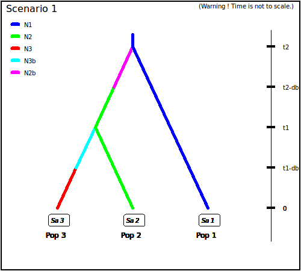
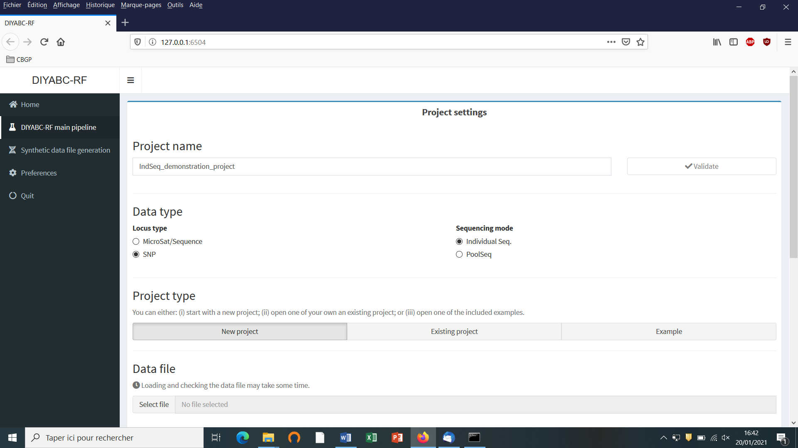
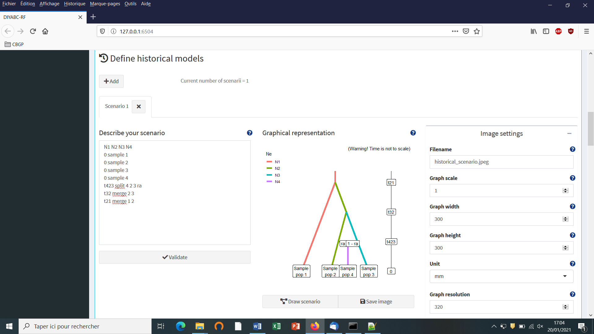
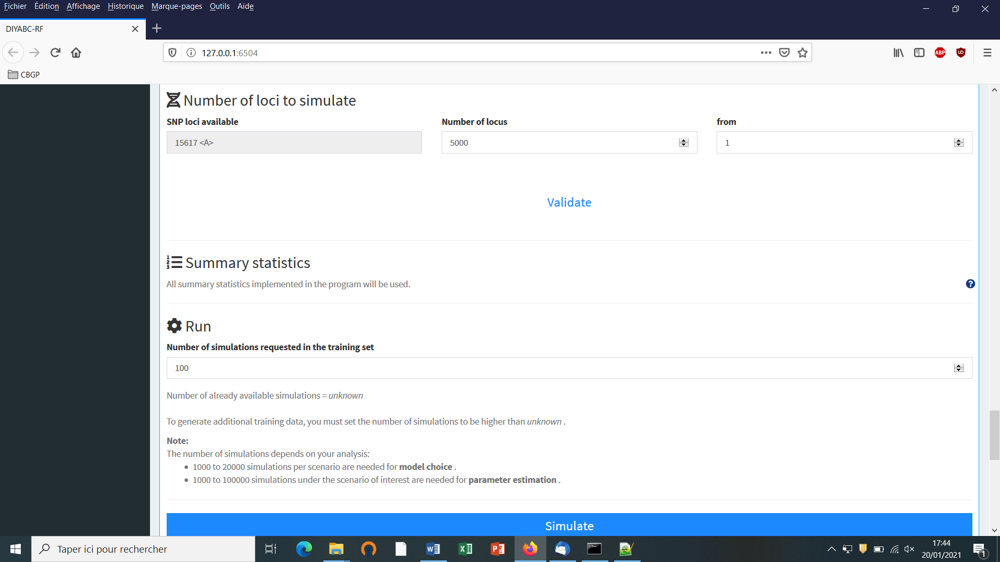
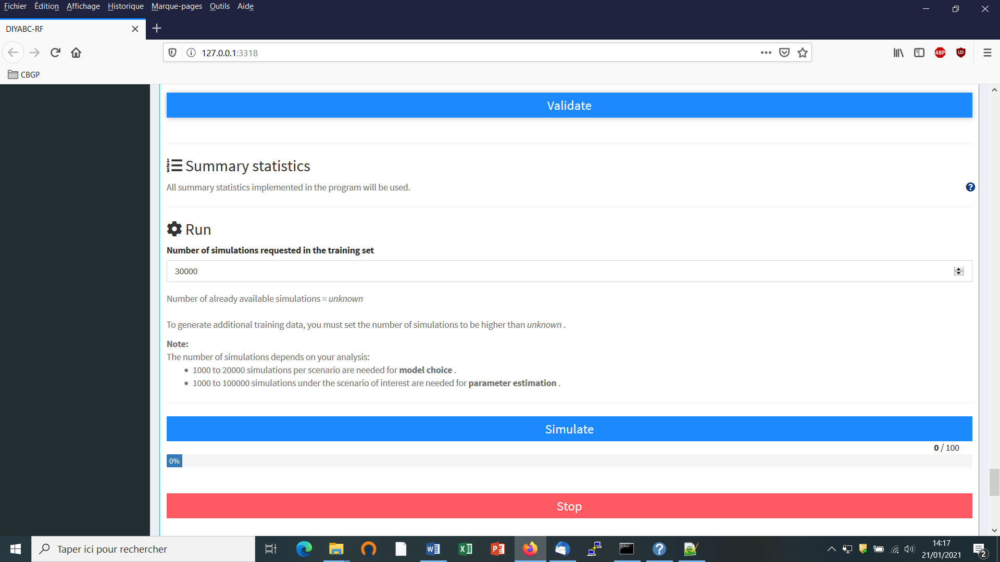

USER MANUAL for DIYABC Random Forest v1.0
=========================================

-   3 of July 2020 -
    ================

François-David Collin ^1,\*^, Ghislain Durif ^1,\*^, Louis Raynal ^1^,
Eric Lombaert ^2^, Mathieu Gautier ^3^, Renaud Vitalis ^3^, Jean-Michel
Marin ^1,&^, Arnaud Estoup ^3,&^

^1^ IMAG, Univ Montpellier, CNRS, UMR 5149, Montpellier, France

^2^ ISA, INRAE, CNRS, Univ Côte d'Azur, Sophia Antipolis, France

^3^ CBGP, Univ Montpellier, CIRAD, INRAE, Institut Agro, IRD,
Montpellier, France

^\*^ Equal contribution (F-D.C.: computation part of the program; S.D.:
interface part of the program)

^&^ These authors are joint senior authors on this work

Corresponding authors:

Arnaud Estoup. E-mail: <arnaud.estoup@.inrae.fr>

Francois-David.Collin: Francois-David.Collin\@umontpellier.fr

Ghislain Durif: ghislain.durif\@umontpellier.fr

CONTENTS
========

**Warning: Activate the option "Navigation panel" after opening this
file*.* This navigation panel, visible on the left size of the document
once activated, will allow you reaching directly through simple click
actions the different sections and sub-sections described below.**

PLAN ICI (ne pas donner les numeros pages car pourra evoluer)

1\. (BRIEF) INTRODUCTION

1.1 General context

1.2 How to cite the program DIYABC Random Forest v1.0

1.3 Web site

1.4. System requirements, installing and launching the program

1.5 Acknowledgements

2\. FORMALIZATION OF SCENARIOS AND GENERATION OF THE TRAINING SET

2.1 Basic notions

2.2 Main features of algorithms for data simulation

2.3 Historical model parameterization

2.3.1 Key notes

2.3.2 Examples

2.4 Mutation model parameterization (microsatellite and DNA sequence
loci)

2.4.1 Microsatellite loci

2.4.2 DNA sequence loci

2.4.3 SNPs do not require mutation model parameterization -- notion of
MAF and MRC

2.5 Prior distributions

2.6 Summary statistics as components of the feature vector

2.6.1 For microsatellite loci

2.6.2 For DNA sequence loci

2.6.3 For SNP loci

2.7 Generating the training set

3\. RANDOM FOREST ANALYSIS

3.1 Addition of linear combinations of summary statistics to the vector
feature

3.2 Prediction using Random Forest: scenario choice

3.3 Prediction using Random Forest: parameter estimation

3.4 Assessing the quality of predictions

3.4.1 Indices for scenario choice

3.4.2 Indices for parameter estimation

4\. PRACTICAL CONSIDERATIONS FOR ABC-RF TREATMENTS

4.1 Are my scenarios and/or associated priors compatible with the
observed dataset?

4.2 Did I simulate enough datasets for my training set?

4.3 Did my forest grow enough trees?

5\. RUNNING (EXAMPLE) DATASET TREATMENTS USING THE GRAPHIC USER
INTERFACE (GUI)

5.1 Launching the GUI

5.2 What is a DIYABC Random Forest project?

5.3 Main options of the home screen

5.4 How to generate an IndSeq SNP training set

5.4.1 Step 1: defining a new IndSeq SNP project

5.4.2 Step 2: choosing the data file

5.4.3 Step 3: Inform the Historical model

5.4.4 Step 4: Inform chromosome type and number of loci

5.4.5 Step 5: Summary statistics

5.4.6 Step 6: Simulate the training set

5.4.7 Step 7 (optional but recommended): Prior-scenario checking
PRE-ANALYSIS

5.5 How to generate a PoolSeq SNP training set

5.6 How to generate a microsatellite (and/or sequence) training set

5.6.1 Step 4: Inform the genetic model

5.6.2 Step 5: Summary statistics

6\. PERFORMING RANDOM FOREST ANALYSES

6.1 Files needed

6.2. Scenario choice analysis

6.3. Parameter estimation analysis

7\. KEY FILES

7.1 Data files

7.1.1 IndSeq SNP data

7.1.2 PoolSeq SNP data

7.1.3 Microsatellite and DNA sequence data

7.2 Training set file(s)

7.3 Output files produced by a Random Forest analysis

7.4 Other files

8\. USING DIYABC RANDOM FOREST ON A COMPUTER CLUSTER

9\. REFERENCES CITED

1. (BRIEF) INTRODUCTION
=======================

1.1 General context 
-------------------

> Simulation-based methods such as Approximate Bayesian Computation
> (ABC) are well adapted to the analysis of complex models of
> populations and species genetic history (Beaumont 2010). In this
> context, supervised machine learning (SML) methods provide attractive
> statistical solutions to conduct efficient inferences about both
> scenario choice and parameter estimation (Schrider & Kern 2018). The
> Random Forest methodology (RF) is a powerful ensemble of SML
> algorithms used for both classification and/or regression problems
> (Breiman 2001). RF allows conducting inferences at a lower
> computational cost than ABC, without preliminary selection of the
> relevant components of the ABC summary statistics, and bypassing the
> derivation of ABC tolerance levels (Pudlo et al. 2018; Raynal et al.
> 2019). We have implemented a set of RF algorithms to process
> inferences using simulated datasets generated from an extended version
> of the population genetic simulator implemented in DIYABC v2.1.0
> (Cornuet et al. 2014). The resulting computer package, named DIYABC
> Random Forest v1.0, integrates two functionalities into a
> user-friendly interface: the simulation under custom evolutionary
> scenarios of different types of molecular data (microsatellites, DNA
> sequences or SNPs -- including traditional **IndSeq** and more recent
> **PoolSeq** SNP data) and RF treatments including statistical tools to
> evaluate the power and accuracy of inferences (Collin et al. 2020).
> Because of the properties inherent of the implemented RF methods and
> the large feature vector (including various summary statistics and
> their linear combinations) available for SNP data, DIYABC Random
> Forest v1.0 can efficiently contribute to the analysis of large-size
> SNP (and other molecular markers) datasets to make inferences about
> complex population genetic histories.

1.2 How to cite the program DIYABC Random Forest v1.0
-----------------------------------------------------

> Collin F-D, Raynal L, Durif G, Gautier M, Vitalis R, Lombaert E.,
> Marin J-M, Estoup A (2020) DIYABC Random Forest v1.0: extending
> approximate Bayesian computation with supervised machine learning to
> infer demographic history from genetic polymorphisms. Submitted to
> *Molecular Ecology Resources*. \#\#\# bioRxiv \#\#\#\#

1.3 Web site
------------

<https://diyabc.github.io>.

You can get from this github site the executable files for different
operating systems, the latest version of this manual document, as well
as examples of DIYABC Random Forest analyses for different type of
markers.

1.4. System requirements, installing and launching the program
--------------------------------------------------------------

-   The package DIYABC Random Forest v1.0 is composed of three parts:
    the dataset simulator, the Random Forest inference engine and the
    graphical user interface. The whole is packaged as a standalone and
    user-friendly application available at <https://diyabc.github.io>
    The different developer and user manuals for each component of the
    package are available on the same site. DIYABC Random Forest v1.0 is
    a multithreaded program which runs on three operating systems:
    GNU/Linux, Microsoft Windows and MacOS. The program can be used
    through a modern and user-friendly graphical interface designed as
    an R shiny application (Chang et al. 2019). For a fluid and
    simplified user experience, this interface is available through a
    standalone application, which does not depend on R and hence can be
    used independently. The application is also implemented in a R
    package providing a standard shiny web application (with the same
    graphical interface) that can be run locally as any shiny
    application, or hosted as a web service to provide a DIYABC Random
    Forest v1.0 server for multiple users.

-   [To launch the program]{.underline}: install doing that...click to
    launch...etc

-   Minimum 4GB of RAM; 6GB of RAM recommended

-   From 1 to 10 GB free disk space for each DIYABC Random Forest v1.0
    project depending on the project configuration and the number of
    simulated datasets recorded in the training set file (reftableRF.bin
    file).

1.5 Acknowledgements
--------------------

We thank Pierre Pudlo for useful discussions and Jean-Marie Cornuet for
computer code expertise at the onset of the ABC Random Forest project.
We also thank several "beta-users", especially XXXNAMEXXX, who tested
the software DIYABC Random Forest v1.0 with their data. This work was
supported by funds from the French Agence National pour la Recherche
(ANR projects SWING and GANDHI), the INRAE scientific division SPE
(AAP-SPE 2016), and the LabEx NUMEV (NUMEV, ANR10-LABX-20).

2. FORMALIZATION OF SCENARIOS AND GENERATION OF THE TRAINING SET
================================================================

2.1 Basic notions
-----------------

Before processing Random Forest analyses, one need to generate a
*training set* which corresponds to the so called *reference table* in a
standard ABC framework (Cornuet et al. 2014 and see the associated
program DIYABC v2.1.0). The datasets composing the training set can be
simulated under different models (hereafter referred to as scenarios)
and sample (i.e. nb of markers and sampled individuals) configurations,
using parameter values drawn from prior distributions. Each resulting
dataset is summarized using a set of descriptive statistics. Scenarios
and prior distributions are formalized and summary statistics are
computed using the "Training set simulation" module of the main pipeline
of DIYABC Random Forest v1.0, which essentially corresponds to an
extended version of the population genetics simulator implemented in
DIYABC v2.1.0 (Cornuet et al. 2014). As in the latter program, DIYABC
Random Forest v1.0 allows considering complex population histories
including any combination of population divergence events, symmetrical
or asymmetrical admixture events (but not any continuous gene flow
between populations) and changes in past population size, with
population samples potentially collected at different times. Statistical
analysis based on Random Forest algorithms of an observed dataset using
a given training set are computed using the "Random Forest Analysis"
module of the main pipeline of the program.

2.2 Main features of algorithms for data simulation
---------------------------------------------------

The ABC part of DIYABC Random Forest is a simulation-based method. Data
simulation is based on the Wright-Fisher model. It consists in
generating the genealogy of all sampled genes until their most recent
common ancestor using (backward in time) coalescence theory. This begins
by randomly drawing a complete set of parameters from their own prior
distributions and that satisfy all imposed conditions. Then, once events
have been ordered by increasing times, a sequence of *actions* is
constructed. If there is more than one locus, the same sequence of
actions is used for all successive loci.

Possible *actions* fall into four categories:

\- **adding a sample to a population** = Add as many gene lineages to
the population as there are genes in the sample.

\- **merge two populations** = Move the lineages of the second
population into the first population.

\- **split between two populations** = Distribute the lineages of the
admixed population among the two parental populations according to the
admixture rate.

\- **coalesce and mutate lineages within a population** = There are two
possibilities here, depending on whether the population is *terminal* or
not. We call *terminal* the population including the most recent common
ancestor of the whole genealogy. In a terminal population, coalescences
and mutations stop when the MRCA is reached whereas in a non-terminal
population, coalescence and mutations stop when the upper (most ancient)
limit is reached. In the latter case, coalescences can stop before the
upper limit is reached because there remains a single lineage, but this
single remaining lineage can still mutate.

Two different coalescence algorithms are implemented: a generation by
generation simulation or a continuous time simulation. The choice,
automatically performed by the program, is based on an empirical
criterion which ensures that the continuous time algorithm is chosen
whenever it is faster than generation by generation while keeping the
relative error on the coalescence rate below 5% (see Cornuet et al. 2008
for a description of this criterion). In any case, a coalescent tree is
generated over all sampled genes.

Then the mutational simulation process diverges depending on the type of
markers: for microsatellite or DNA sequence loci, mutations are
distributed over the branches according to a Poisson process whereas for
SNP loci, one mutation is applied to a single branch of the coalescent
tree, this branch being drawn at random with probability proportional to
its length. Eventually, starting from an ancestral allelic state
(established as explained below), all allelic states of the genealogy
are deduced forward in time according to the mutation process. For
microsatellite loci, the ancestral allelic state is taken at random in
the stationary distribution of the mutation model (not considering
potential single nucleotide indel mutations). For DNA sequence loci, the
procedure is slightly more complicated. First, the total number of
mutations over the entire tree is evaluated. Then according to the
proportion of constant sites and the gamma distribution of individual
site mutation rates, the number and position of mutated sites are
generated. Finally, these mutated sites are given 'A', 'T', 'G' or 'C'
states according to the selected mutation model. For SNP loci, the
ancestral allelic state is arbitrarily set to 0 and it becomes equal to
1 after mutation.

::: {.Definition-Term}
Each category of loci has its own coalescence rate deduced from male and
female effective population sizes. In order to combine different
categories (e.g. autosomal and mitochondrial), we have to take into
account the relationships among the corresponding effective population
sizes. This can be achieved by linking the different effective
population sizes to the effective number of males (
$\mathbf{N}_{\mathbf{M}}$ ) and females ($\mathbf{N}_{\mathbf{F}}$)
through the sum
$\mathbf{N}_{\mathbf{T}}\mathbf{=}\mathbf{N}_{\mathbf{F}}\mathbf{+}\mathbf{N}_{\mathbf{M}}$
and the ratio
$\mathbf{r =}\mathbf{N}_{\mathbf{M}}\mathbf{/(}\mathbf{N}_{\mathbf{F}}\mathbf{+}\mathbf{N}_{\mathbf{M}}\mathbf{)}$.
We use the following formulae for the probability of coalescence (*p*)
of two lineages within this population:
:::

::: {.Definition-Term}
Autosomal diploid loci:
:::

$$p = \frac{1}{8r(1 - r)N_{T}}$$

::: {.Definition-Term}
Autosomal haploid loci:
:::

$$p = \frac{1}{4r(1 - r)N_{T}}$$

::: {.Definition-Term}
X-linked loci / haplo-diploid loci:
:::

$$p = \frac{1 + r}{9r(1 - r)N_{T}}$$

::: {.Definition-Term}
Y-linked loci:
:::

$$p = \frac{1}{rN_{T}}$$

::: {.Definition-Term}
Mitochondrial loci:
:::

$$p = \frac{1}{(1 - r)N_{T}}$$

::: {.Definition}
Users have to provide a (total) effective size $N_{T}$ (on which
inferences will be made) and a sex-ratio $r$. If no sex ratio is
provided, the default value of $r$ is taken as 0.5.
:::

2.3 Historical model parameterization
-------------------------------------

The evolutionary scenario, which is characterized by the historical
model, can be described in a dedicated panel of the interface of the
program as a succession in time of \"events\" and \"inter event
periods\". In the current version of the program, we consider 4
categories of events: population divergence, discrete change of
effective population size, admixture and sampling (the last one allow
considering samples taken at different times). Between two successive
events affecting a population, we assume that populations evolve
independently (e.g. without migration) and with a fixed effective size.
The usual parameters of the historical model are the times of occurrence
of the various events (counted in number of generations), the effective
sizes of populations and the admixture rates. **When writing the
scenario, events have to be coded sequentially backward in time** (see
section 2.3.2 for examples). Although this choice may not be natural at
first sight, it is coherent with coalescence theory on which are based
all data simulations in the program. For that reason, the keywords for a
divergence or an admixture event are `merge` and `split`, respectively.
Two keywords `varNe` and `sample` correspond to a discrete change in
effective population size and a gene sampling within a given population,
respectively. A scenario takes the form of a succession of lines (one
line per event), each line starting with the time of the event, then the
nature of the event, and ending with several other data depending on the
nature of the event. Following is the syntax used for each category of
event:

Population sample

:   $\langle time\rangle$ `sample` $\langle pop\rangle$

    Where $\langle time\rangle$ is the time (always counted in number of
    generations) at which the sample was collected and
    $\langle pop\rangle$ is the population number from which is taken
    the sample. It is worth stressing here that **samples are considered
    in the same order as they appear in the data file**. The number of
    lines will thus be exactly equal to the number of samples in the
    datafile.

    **Population size variation**

    $\langle time\rangle$ `varNe` $\langle pop\rangle$
    $\langle Ne\rangle$\
    From time $\langle time\rangle$, looking backward in time,
    population $\langle pop\rangle$ will have an effective size
    $\langle Ne\rangle$.

Population divergence

:   $\langle time\rangle$ `merge` $\langle pop1\rangle$
    $\langle pop0\rangle$\
    At time $\langle time\rangle$, looking backward in time, population
    $\langle pop0\rangle$ \"merges\" with population
    $\langle pop1\rangle$. Hereafter, only $\langle pop1\rangle$
    \"remains\".

Population admixture

:   $\langle time\rangle$ `split` $\langle pop0\rangle$
    $\langle pop1\rangle$ $\langle pop2\rangle$ $\langle rate\rangle$\
    At time $\langle time\rangle$, looking backward in time, population
    $\langle pop0\rangle$ \"splits\" between populations
    $\langle pop1\rangle$ and $\langle pop2\rangle$. A gene lineage from
    population $\langle pop0\rangle$ joins population
    $\langle pop1\rangle$ (respectively $\langle pop2\rangle$) with
    probability $\langle rate\rangle$ (respectively
    1-$\langle rate\rangle$). Hereafter, only $\langle pop1\rangle$ and
    $\langle pop2\rangle$ \"remain\".

Note that one needs to write a first line giving the **effective sizes
of the sampled populations before the first event described**, looking
backward in time. Expressions between arrows, other than population
numbers, can be either a numeric value (e.g. 25) or a character string
(e.g. `t0`). In the latter case, it is considered as a parameter of the
model. The program offers the possibility to add or remove scenarios, by
just clicking on the corresponding buttons. The usual shortcuts (e.g.
CTRL+C, CTRL+V and CTRL+X) can be used to edit the different scenarios.
Some or all parameters can be in common among scenarios.

### 2.3.1 Key notes

1.  There are two ways of giving a fixed value to effective population
    sizes, times and admixture rates. Either the fixed value appears as
    a numeric value in the scenario windows or it is given as a string
    value like any parameter. In the latter case, one gives this
    parameter a fixed value by choosing a Uniform distribution and
    setting the minimum and maximum to that value in the prior setting
    of the corresponding interface panel.

2.  All expressions must be separated by at least one space.

3.  All expressions relative to parameters can include sums or
    differences. For instance, it is possible to write:\
    `t0 merge 2 3`\
    `t0+t1 merge 1 2`\
    This means that `t1` is the time elapsed between the two merge
    events. Note that one cannot mix a parameter and a numeric value
    (e.g. `t1+150` will result in an error). This can be done by writing
    `t1+t2` and fixing `t2` by choosing a uniform distribution with
    lower and upper bounds both equal to 150 in the interface.

4.  **Time is always given in generations**. Since we look backward,
    time increases towards past.

5.  Negative times are allowed (e.g. the example given in section
    2.3.2), but not recommended.

6.  Population numbers must be consecutive natural integers starting
    at 1. The number of population can exceed the number of samples and
    vice versa: in other words, *unsampled populations* can be
    considered in the scenario on one hand, and the same population can
    be sampled more than once on the other hand.

7.  **Multi-furcating population trees** can be considered, by writing
    **several divergence events occurring at the same time.** However,
    one has to be careful to the order of the `merge` events. For
    instance, the following piece of scenario will fail:\
    `100 merge 1 2`\
    `100 merge 2 3`\
    This is because, after the first line, population 2, which has
    merged with population 1, does not \"exist\" anymore (the remaining
    population is population 1). So, it cannot receive lineages of
    population 3 as it should as a result of the second line. The
    correct ways are either to put line 2 before line 1, or to change
    line 2 to:\
    `100 merge 1 3`.

8.  Since times of events can be parameters, the order of events can
    change according to the values taken by the time parameters. In any
    case, before simulating a dataset, the program sorts out events by
    increasing times. Note that sorting out events by increasing times
    can only be done when all time values are known, i.e. when
    simulating datasets. When checking scenarios in the interface, all
    time values are not yet defined, so that when visualizing a
    scenario, events are represented in the same order as they appear in
    the window used to define the scenario. If two or more events occur
    at the same time, the order is that of the scenario as it is written
    by the user.

9.  Most scenarios begin with sampling events. We then need to know the
    effective size of the populations to perform the simulation of
    coalescences until the next event concerning each population. We
    decided to provide the effective size (first line) and the sampling
    description (following lines) on distinct lines.

**2.3.2 Examples**

Below are some usual scenarios with increasing complexity. Each scenario
is coded (as in the corresponding interface panel of the program) on the
left side and a graphic representation (given by DIYABC Random Forest)
is printed on the right side

1.  One population from which several samples have been taken at various
    generations: 0, 3 and 10. Generation 0 could correspond for instance
    to the most recent sampling date. The only unknown
    historical-demographical parameter of the scenario is the (constant)
    effective population size which is defined in the first line at
    sampling time.

+----------------------------------+----------------------------------+
| -   {width="1.0833333333333333in" | ng){width="2.6333333333333333in" |
|                                  |                                  |
|   height="0.8166666666666667in"} |    height="2.158333333333333in"} |
+----------------------------------+----------------------------------+

2.  Two populations of size `N1` and `N2` (defined in the first line at
    sampling time) have diverged `t` generations in the past from an
    ancestral population of size `N1+N2`.

+----------------------------------+----------------------------------+
| -   {width="1.4583333333333333in" | png){width="2.691666666666667in" |
|                                  |                                  |
|   height="0.8583333333333333in"} |   height="2.1333333333333333in"} |
+----------------------------------+----------------------------------+

3.  Two parental populations (1 and 2) with constant effective
    population sizes `N1` and `N2` have diverged at time `td` from an
    ancestral population of size `NA`. At time `ta`, there has been an
    [admixture event]{.underline} between the two populations giving
    birth to an admixed population (3) with effective size `N3` and with
    an admixture rate `ra` relative to population 1.

+----------------------------------+----------------------------------+
| -   {width="1.5166666666666666in" | png){width="3.361111111111111in" |
|     height="1.225in"}            |                                  |
|                                  |    height="2.601851487314086in"} |
+----------------------------------+----------------------------------+

4.  The next scenario includes [four population samples and two
    admixture events]{.underline}. All populations have identical
    effective sizes (`Ne`).

+----------------------------------+----------------------------------+
| -   {width="1.5166666666666666in" | png){width="3.361111111111111in" |
|     height="1.225in"}            |                                  |
|                                  |   height="2.7314818460192476in"} |
+----------------------------------+----------------------------------+

-   Note that although there are only four samples, the scenario
    includes a fifth [unsampled population]{.underline}. This unsampled
    population which diverged from population 1 at time `t3` was a
    parent in the admixture event occurring at time `t2`. Note also that
    the first line must include the effective sizes of the *five*
    populations.

5.  The following three scenarios correspond to a classic invasion
    history from an ancestral population (population 1[). In scenario 1,
    population 3 is derived from population 2, itself derived from
    population 1. In scenario 2, population 2 derived from population 3,
    itself derived from population 1. In scenario 3, both populations 2
    and 3 derived independently from population 1.]{.underline} Note
    that when a new population is created from its ancestral population,
    there is an initial size reduction (noted here `N2b` for population
    2 and `N3b` for population 3) for a given number of generation (here
    db for both populations) mimicking a demographic bottleneck since
    the invasive population generally starts with a few immigrants. For
    instance, a low number of Nxb individuals for db generations could
    corresponds to Nxb values ranging between 5 to 100 individuals and
    db values ranging from 1 to 10 generations (e.g. Fraimout et al.
    2017). If db = 0 then no bottleneck occur which can be also a coding
    choice.

Scenario 1

  ----------------------------------------------------------------------------- ----------------------------------------------------------------------------------------
  {width="1.575in" height="1.6833333333333333in"}   {width="4.370369641294838in" height="4.09259186351706in"}
  ----------------------------------------------------------------------------- ----------------------------------------------------------------------------------------

Scenario 2

  ------------------------------------------------------------------------------------------- ------------------------------------------------------------------------------------------
  {width="1.6333333333333333in" height="1.5416666666666667in"}   {width="4.3148140857392825in" height="4.055555555555555in"}
  ------------------------------------------------------------------------------------------- ------------------------------------------------------------------------------------------

Scenario 3

  ------------------------------------------------------------------------------ ------------------------------------------------------------------------------------------
  {width="1.525in" height="1.3166666666666667in"}   {width="4.240740376202974in" height="3.4074070428696412in"}
  ------------------------------------------------------------------------------ ------------------------------------------------------------------------------------------

2.4 Mutation model parameterization (microsatellite and DNA sequence loci)
--------------------------------------------------------------------------

The program can analyze microsatellite data and DNA sequence data
altogether as well as separately. SNP loci can be also analyzed
separately from microsatellite data and DNA sequence data. It is worth
stressing that all loci in an analysis must be [genetically
independent]{.underline}. Second, for DNA sequence loci, intralocus
recombination is not considered. Loci are grouped by the user according
to its needs. For microsatellite and DNA sequence, a different mutation
model can be defined for each group. For instance, one group can include
all microsatellites with motifs that are 2 bp long and another group
those with a 4 bp long motif. Also, with DNA sequence loci, nuclear loci
can be grouped together and a mitochondrial locus form a separate group.
[SNPs do not require mutation model parameterization (see below for
details)]{.underline}.

We now describe the parameterization of microsatellite and DNA sequence
markers.

### 2.4.1 Microsatellite loci

Although a variety of mutation models have been proposed for
microsatellite loci, it is usually sufficient to consider only the
simplest models (e.g. Estoup et al. 2002). This has the non-negligible
advantage of reducing the number of parameters. This is why we chose the
Generalized Stepwise Mutation model (GSM). Under this model, a mutation
increases or decreases the length of the microsatellite by a number of
repeated motifs following a geometric distribution. This model
necessitates only two parameters: the mutation rate (`µ`) and the
parameter of the geometric distribution (`P`). The same mutation model
is imposed to all loci of a given group. However, each locus has its own
parameters (µ~i~ and P~i~`) `and, following a hierarchical scheme, each
locus parameter is drawn from a gamma distribution with mean equal to
the mean parameter value.

Note also that:

1.  Individual loci parameters (µi and Pi) are considered as nuisance
    parameters and hence are never recorded. Only mean parameters are
    recorded.

2.  The variance or shape parameter of the gamma distributions are set
    by the user and are NOT considered as parameters.

3.  The SMM or Stepwise Mutation Model is a special case of the GSM in
    which the number of repeats involved in a mutation is always one.
    Such a model can be easily achieved by setting the maximum value of
    mean P ($\overline{P}$) to 0. In this case, all loci have their
    $P_{i}$ set equal to 0 whatever the shape of the gamma distribution.

4.  All loci can be given the same value of a parameter by setting the
    shape of the corresponding gamma distribution to 0 (this is NOT a
    limiting case of the gamma, but only a way of telling the program).

To give more flexibility to the mutation model, the program offers the
possibility to consider [mutations that insert or delete a single
nucleotide]{.underline} to the microsatellite sequence by using a mean
parameter (named $\mu_{(SNI)}$) with a prior to be defined and
individual loci having either values identical to the mean parameter or
drawn from a Gamma distribution.

### 2.4.2 DNA sequence loci

The program does not consider insertion-deletion mutations, mainly
because there does not seem to be much consensus on this topic.
Concerning substitutions, only the simplest models are considered. We
chose the Jukes-Cantor (1969) one parameter model, the Kimura (1980) two
parameter model, the Hasegawa-Kishino-Yano (1985) and the Tamura-Nei
(1993) models. The last two models include the ratios of each nucleotide
as parameters. In order to reduce the number of parameters, these ratios
have been fixed to the values calculated from the observed dataset for
each DNA sequence locus. Consequently, this leaves two and three
parameters for the Hasegawa-Kishino-Yano (HKY) and Tamura-Nei (TN),
respectively. Also, two adjustments are possible: one can fix the
fraction of constant sites (those that cannot mutate) on the one hand
and the shape of the Gamma distribution of mutations among sites on the
other hand. As for microsatellites, all sequence loci of the same group
are given the same mutation model with mean parameter(s) drawn from
priors and each locus has its own parameter(s) drawn from a Gamma
distribution (same hierarchical scheme). Notes 1, 2 and 4 of previous
subsection (2.4.1) apply also for sequence loci.

### 2.4.3 SNPs do not require mutation model parameterization -- notion of MAF and MRC

SNPs have two characteristics that allow to get rid of mutation models:
they are (necessarily) polymorphic and they present only two allelic
states (ancestral and derived). In order to be sure that all analyzed
SNP loci have the two characteristics, [non polymorphic loci are
discarded right from the beginning of analyses]{.underline}. Note that a
warning message will appear if the observed dataset include monomorphic
loci, the latter being automatically removed from further analyses by
the program. Consequently, one can assume that there occurred one and
only one mutation in the coalescence tree of sampled genes. We will see
below that this largely simplifies (and speeds up) SNP data simulation
as one can use in this case the efficient "-s" algorithm of Hudson
(2002) (Cornuet et al. 2014). Also, this advantageously reduces the
dimension of the parameter space as mutation parameters are not needed
in this case. There is however a potential drawback which is the absence
of any calibration generally brought by priors on mutation parameters.
[Consequently, time/effective size ratios rather than original time or
effective size parameters will be informative]{.underline}.

It is worth noting that, using the Hudson's simulation algorithm for SNP
markers leads to applying a default [MAF (minimum allele
frequency)]{.underline} criterion on the simulated dataset. As a matter
of fact, each locus in both the observed and simulated datasets will be
characterized by the presence of at least one copy of the SNP alleles
over all genes sampled from all studied populations (i.e. pooling all
genes genotyped at the locus). In DIYABC Random Forest v1.0, it is
possible to impose a given MAF criterion on the observed and simulated
datasets. This MAF is computed pooling all genes genotyped over all
studied population samples. For instance, the specification of a MAF
equal to 5% will automatically select a subset of *m* loci characterized
by a minimum allele frequency \> 5% out of the *l* loci of the observed
dataset. In agreement with this, only *m* loci with a MAF\>5% will be
retained in a simulated dataset. In practice, the instruction for a
given MAF has to be indicated directly in the headline of the file of
the observed dataset (see section 7.1.1 for data file examples). For
instance, if one wants to consider only loci with a MAF equal to 5% one
will write \<MAF=0.05\> in the headline. Writing \<MAF=hudson\> (or
omitting to write any instruction with respect to the MAF) will bring
the program to use the standard Hudson\'s algorithm without further
selection. The selection of a subset of loci fitting a given MAF allows:
(i) to remove the loci with very low level of polymorphism from the
dataset and hence increase the mean level of genetic variation of both
the observed and simulated datasets, without producing any bias in the
analyses; and (ii) to reduce the proportion of loci for which the
observed variation may corresponds to sequencing errors. In practice MAF
values ≤10% are considered. To check for the consistency/robustness of
the ABC results obtained, it may be useful to treat a SNP dataset
considering different MAFs (for instance MAF=hudson, MAF=1% and MAF=5%).

It is worth stressing that the MAF criterion applies to standard
Individual sequencing (hereafter **IndSeq**) SNP data. In addition to
IndSeq data, DIYABC Random Forest v1.0 allows the simulation and
analyses of pool-sequencing SNP data (hereafter **PoolSeq** data), which
basically consist of whole-genome sequences of pools of tens to hundreds
of individual DNAs (Gautier et al., 2013; Schlötterer et al., 2014). In
practice, the simulation of PoolSeq data consists first in simulating
individual SNP genotypes for all individuals in each population pool,
and then generating pool read counts from a binomial distribution
parameterized with the simulated allele counts (obtained from individual
SNP genotypes) and the total pool read coverage (e.g., Hivert, et al.
2018). A criterion somewhat similar to the MAF was implemented for
PoolSeq data: [the minimum read count (MRC)]{.underline}. The MRC is the
number of sequence reads of the minor allele frequency allele when
pooling the reads over all population samples. The specification of a
MRC equal for instance to 5 will automatically select a subset of *m*
PoolSeq loci characterized by more than five reads over all studied
pools among the *l* loci of the observed dataset. In agreement with
this, only *m* loci with more than five reads will be retained in a
simulated dataset.

2.5 Prior distributions
-----------------------

The Bayesian aspect of the ABC-RF approach implies that parameter
estimations use prior knowledge about these parameters that is given by
prior distributions of parameters. The program offers a choice among
usual probability distributions, i.e. Uniform, Log-Uniform, Normal or
Log-Normal for historical parameters and Uniform, Log-Uniform or Gamma
for mutation parameters. Extremum values (min and max) and other
parameters (e. g. mean and standard deviation) must be filled in by the
user. It is worth noting that one can impose some simple conditions on
historical parameters. For instance, there can be two times parameters
with overlapping prior distributions. However, we want that the first
one, say `t1`, to always be larger than the second one, say `t2`. For
that, we just need to set `t1` $>$ `t2` in the corresponding
edit-windows. Such a condition needs to be between two parameters and
more precisely between two parameters of the same category (i.e. two
effective sizes, two times or two admixture rates). The limit to the
number of conditions is imposed by the logics, not by the program. The
only binary relationships accepted here are $> , < , > = and < =$.

2.6 Summary statistics as components of the feature vector 
----------------------------------------------------------

The training set includes values of a feature vector which is a
multidimensional representation of any data point (i.e. simulated or
observed datasets) made up of measurements (or features) taken from it.
More specifically, the feature vector includes a large number of
statistics that summarize genetic variation in the way that they allow
capturing different aspects of gene genealogies and hence various
features of molecular patterns generated by selectively neutral
population histories (e.g. Beaumont 2010; Cornuet et al. 2014). For each
category (microsatellite, DNA sequences or SNP) of loci, the program
proposes a series of summary statistics among those used by population
geneticists.

Note: The code name of each statistic mentioned in the various program
outputs is given between brackets \[XXX\] in sections 2.6.1, 2.6.2 and
2.6.3.

### 2.6.1 For microsatellite loci

::: {.Definition-Term}
Single sample statistics:
:::

1.  ::: {.Definition}
    \[NAL\] - mean number of alleles across loci
    :::

2.  ::: {.Definition}
    \[HET\] - mean gene diversity across loci (Nei 1987)
    :::

3.  ::: {.Definition}
    \[VAR\] - mean allele size variance across loci
    :::

4.  \[MGW\] - mean M index across loci (Garza and Williamson 2001;
    Excoffier et al. 2005)

::: {.Definition-Term}
Two sample statistics:
:::

1.  ::: {.Definition}
    \[N2P\] - mean number of alleles across loci (two samples)
    :::

2.  ::: {.Definition}
    \[H2P\] - mean gene diversity across loci (two samples)
    :::

3.  ::: {.Definition}
    \[V2P\] - mean allele size variance across loci (two samples)
    :::

4.  ::: {.Definition}
    \[FST\] -$\text{\ \ }F_{\text{ST}}$ between two samples (Weir and
    Cockerham 1984)
    :::

5.  ::: {.Definition}
    \[LIK\] - mean index of classification (two samples)
    :::

::: {.Definition}
> (Rannala and Moutain 1997; Pascual et al. 2007)
:::

6.  ::: {.Definition}
    \[DAS\] - shared allele distance between two samples (Chakraborty
    and Jin 1993)
    :::

7.  ::: {.Definition}
    \[DM2\] - $(\delta\mu)^{2}$ distance between two samples (Golstein
    et al. 1995)
    :::

::: {.Definition-Term}
Three sample statistics:
:::

1.  ::: {.Definition}
    \[AML\] - Maximum likelihood coefficient of admixture (Choisy et
    al. 2004)
    :::

### 2.6.2 For DNA sequence loci

::: {.Definition-Term}
Single sample statistics:
:::

1.  ::: {.Definition}
    \[NHA\] - number of distinct haplotypes
    :::

2.  ::: {.Definition}
    \[NSS\] - number of segregating sites
    :::

3.  ::: {.Definition}
    \[MPD\] - mean pairwise difference
    :::

4.  ::: {.Definition}
    \[VPD\] - variance of the number of pairwise differences
    :::

5.  ::: {.Definition}
    \[DTA\] - Tajima's D statistics (Tajima 1989)
    :::

6.  ::: {.Definition}
    \[PSS\] - Number of private segregating sites
    :::

::: {.Definition}
(=number of segregating sites if there is only one sample)
:::

7.  ::: {.Definition}
    \[MNS\] - Mean of the numbers of the rarest nucleotide at
    segregating sites
    :::

8.  ::: {.Definition}
    \[VNS\] - Variance of the numbers of the rarest nucleotide at
    segregating sites
    :::

::: {.Definition-Term}
Two sample statistics:
:::

1.  ::: {.Definition}
    \[NH2\] - number of distinct haplotypes in the pooled sample
    :::

2.  ::: {.Definition}
    \[NS2\] - number of segregating sites in the pooled sample
    :::

3.  ::: {.Definition}
    \[MP2\] - mean of within sample pairwise differences
    :::

4.  ::: {.Definition}
    \[MPB\] - mean of between sample pairwise differences
    :::

5.  ::: {.Definition}
    \[HST\] -$\text{\ \ F}_{\text{ST}}$ between two samples (Hudson et
    al. 1992)
    :::

::: {.Definition-Term}
> Three sample statistics:
:::

1.  ::: {.Definition}
    \[SML\] Maximum likelihood coefficient of admixture (adapted from
    Choisy et al. 2004)
    :::

### 2.6.3 For SNP loci

> In addition to "standard" individual-sequencing SNP data (i.e.
> **IndSeq** data), the program allows the simulation and analyses of
> pool-sequencing SNP data (i.e. **PoolSeq** data), which basically
> consist of whole-genome sequences of pools of tens to hundreds of
> individual DNAs (Gautier et al., 2013; Schlötterer et al., 2014). For
> both IndSeq and PoolSeq SNPs, we have implemented the following (same)
> set of summary statistics.
>
> 1\. \[ML1p\] \[ML2p\] \[ML3p\] \[ML4p\] - *Proportion of monomorphic
> loci* for each population, as well as for each pair, triplet and
> quadruplet of populations.
>
> **Mean (m suffix added to the code name) and variance (v suffix) over
> loci values are computed for all subsequent summary statistics**
>
> 2\. \[HWm\] \[HWv\] \[HBm\] \[HBv\] - *Heterozygosity* for each
> population and for each pair of populations (Hivert et al. 2018).
>
> 3\. \[FST1m\] \[FST1v\] \[FST2m\] \[FST2v\] \[FST3m\] \[FST3v\]
> \[FST4m\] \[FST4v\] \[FSTGm\] \[FSTGv\] - *FST*-*related statistics*
> for each population (i.e., population-specific FST; Weir & Goudet
> 2017), for each pair, triplet, quadruplet and overall populations
> (when the dataset includes more than four populations) (Hivert et al.
> 2018).
>
> 4\. \[F3m\] \[F3v\] \[F4m\] \[F4v\] - *Patterson's f-statistics* for
> each triplet (f3-statistics) and quadruplet (f4-statistics) of
> populations (Patterson et al. 2012 and Leblois et al. 2018 for the
> PoolSeq unbiased f3-statistics)
>
> 5\. \[NEIm\] \[NEIv\] - *Nei's (1972) distance* for each pair of
> populations
>
> 6\. \[AMLm\] \[AMLv\] - *Maximum likelihood coefficient of admixture*
> computed for each triplet of populations (adapted from Choisy et al.
> 2004).

2.7 Generating the training set
-------------------------------

The training set can include as many scenarios as desired. The prior
probability of each scenario is uniform so that each scenario will have
approximately the same number of simulated datasets. Only parameters
that are defined for the drawn scenario are generated from their
respective prior distribution. Scenarios may or may not share
parameters. When conditions apply to some parameters (see section 2.3),
parameter sets are drawn in their respective prior distributions until
all conditions are fulfilled. The simulated datasets (summarized with
the statistics detailed in section 2.6) of the training set are recorded
for further statistical analyses (using Random Forest algorithms) in a
key binary file named [reftableRF.bin]{.underline}.

3. RANDOM FOREST ANALYSIS
=========================

Once the training set has been generated, one can start various statistical treatments using the Random Forest (RF) algorithms implemented in the program and by running the "Random Forest analyses" module.
=============================================================================================================================================================================================================

3.1 Addition of linear combinations of summary statistics to the vector feature 
===============================================================================

For scenario choice, the feature vector can be enriched before
processing RF predictions (default option that can be disabled) by
values of the *d* axes of a linear discriminant analysis (LDA) processed
on the above summary statistics (with *d* equal to the number of
scenarios minus 1; Pudlo et al. 2016). In the same spirit, for parameter
estimation, the feature vector can be completed (default option that can
be disabled) by values of a subset of the *s* axes of a Partial Least
Squares Regression analysis (PLS) also processed on the above summary
statistics (with *s* equal to the number of summary statistics). The
number of PLS axes added to the feature vector is determined as the
number of PLS axes providing a given fraction of the maximum amount of
variance explained by all PLS axes (i.e., 95% by default, but this
parameter can be adjusted). Note that, according to our own experience
on this issue, the addition into the feature vector of LDA or PLS axes
better extract genetic information from the training set and hence
globally improved statistical inferences. While the inferential gain
turned out to be systematic and substantial for LDA axes (scenario
choice), we found that including PLS axes improved parameter estimation
in a heterogeneous way, with a negligible gain in some cases (e.g.
Collin et al. 2020).

3.2 Prediction using Random Forest: scenario choice
===================================================

For scenario choice, the outcome of the first step of RF prediction
applied to a given target dataset is a [classification vote for each
scenario]{.underline} which represents the number of times a scenario is
selected in a forest of *n* trees. The scenario with the highest
classification vote corresponds to the scenario best suited to the
target dataset among the set of compared scenarios. This first RF
predictor is good enough to select the most likely scenario but not to
derive directly the associated posterior probabilities. A second
analytical step based on a second Random Forest in regression is
necessary to provide an estimation of the [posterior probability of the
best supported scenario]{.underline} (Pudlo et al. 2016).

3.3 Prediction using Random Forest: parameter estimation
========================================================

For parameter estimation, Raynal et al. (2019) extended the RF approach
developed in the context of (non-parametric) regression to estimate the
posterior distributions of a given parameter under a given scenario. The
approach requires the derivation of a new Random Forest for each
component of interest of the parameter vector (i.e. "one parameter, one
forest strategy"; Raynal et al. 2019). Quite often, practitioners of
Bayesian inference report the posterior mean, posterior variance or
posterior quantiles, rather than the full posterior distribution, since
the former are easier to interpret than the latter. We implemented in
DIYABC Random Forest the methodologies detailed in Raynal et al. (2019)
to provide estimations of the [posterior mean, variance, median (i.e.
50% quantile) as well as 5% and 95% quantiles (and hence 90% credibility
interval) of each parameter of interest]{.underline}. The posterior
distribution of each parameter of interest is also inferred using
importance weights following Meinshausen (2006)'s work on quantile
regression forests.

3.4 Assessing the quality of predictions 
========================================

To evaluate the robustness of inferences, DIYABC Random Forest provides:

(i) Global (i.e. prior) error/accuracy indices corresponding to
    prediction quality measures computed *over the entire data space*;

(ii) Local (i.e. posterior) error/accuracy indices computed
     conditionally on the observed dataset and hence corresponding to
     prediction quality *exactly at the position of the observed
     dataset*.

> Note that the program used the out-of-bag prediction method for
> estimating global and local error/accuracy measures (Pudlo et al.
> 2016; Raynal et al. 2019; Chapuis et al. 2020). This method is
> computationally efficient as it makes use of the datasets already
> present in the training set and hence avoids the (computationally
> costly) simulations of additional test datasets.

### 3.4.1 Indices for scenario choice

-   [Global prior errors]{.underline} including the *confusion matrix*
    (i.e. the contingency table of the true and predicted classes --
    here scenarios - for each example in the training set) and the *mean
    misclassification error rate* (over all scenarios).

-   [Local posterior error]{.underline} which corresponds to 1 minus the
    posterior probability of the selected scenario (Chapuis et al.
    2020).

### 3.4.2 Indices for parameter estimation

-   [Global (prior) and local (posterior) NMAE]{.underline} (i.e.
    normalized mean absolute error): it is the average absolute
    difference between the point estimate and the true simulated value
    divided by the true simulated value, with the mean or the median
    taken as point estimate.

-   [Global (prior) and local (posterior) MSE and NMSE]{.underline}
    (i.e. the mean square error): it is the average squared difference
    between the point estimate and the true simulated value for MSE,
    divided by the true simulated value for NMSE, again with the mean or
    the median taken as point estimate.

-   [Several confidence interval measures]{.underline} computed only at
    the global (prior) scale:

> \- *90% coverage*: it is the proportion of true simulated values
> located between the estimated 5% and 95% quantiles.
>
> \- *Mean or median of the 90% amplitude*: it is the mean or median of
> the difference between the estimated 5% and 95% quantiles.
>
> \- *Mean or median of the relative 90% amplitude*: it is the mean or
> median of the difference between the estimated 5% and 95% divided by
> the true simulated value.

4. PRACTICAL CONSIDERATIONS FOR ABC-RF TREATMENTS
=================================================

Random Forest is often (positively) considered as a "tuning-free" method
in the sense that it does not require meticulous calibrations. This
represents an important advantage of this method, especially for
non-expect users. In practice, we nevertheless advise users to consider
several checking points, thereafter formalized as questions, before
finalizing inferential treatments using DIYABC Random Forest v1.0.

4.1 Are my scenarios and/or associated priors compatible with the observed dataset?
===================================================================================

This question is of prime interest and applies to ABC-RF as well as to
any alternative ABC treatments. This issue is particularly crucial,
given that complex scenarios and high dimensional datasets (i.e., large
and hence very informative datasets) are becoming the norm in population
genomics. Basically, if none of the proposed scenario / prior
combinations produces some simulated datasets in a reasonable vicinity
of the observed dataset, this is a signal of incompatibility and it is
not recommended to attempt any inferences. In such situations, we
strongly advise reformulating the compared scenarios and/or the
associated prior distributions in order to achieve some compatibility in
the above sense. DIYABC Random Forest v1.0 proposes a visual way to
address this issue through the simultaneous projection of datasets of
the training database and of the observed dataset on the first Linear
Discriminant Analysis (LDA) axes. In the LDA projection, the (target)
observed dataset has to be reasonably located within the clouds of
simulated datasets. The program also proposes some complementary
dedicated tools: (i) a Principal Component Analysis (PCA) representing
on 2-axes plans the simulated dataset from the training set and the
observed dataset; and (ii), [for each summary statistics]{.underline},
the proportion of simulated data (considering the total training set)
that have a value below the value of the observed dataset. A star
indicates proportions lower than 5% or greater than 95% (two stars, \<1%
or \>1%; three stars, \<0.1% or \>0.1%). The latter numerical results
can help users to reformulating the compared scenarios and/or the
associated prior distributions in order to achieve some compatibility
(see e.g. Cornuet et al. 2010).

4.2 Did I simulate enough datasets for my training set?
=======================================================

A rule of thumb is, for scenario choice to simulate between 2,000 and
20,000 datasets per scenario among those compared (Pudlo et al. 2016;
Estoup et al. 2018), and for parameter estimation to simulate between
10,000 and 100,000 datasets under a given scenario (Raynal et al. 2019;
Chapuis et al. 2020). To evaluate whether or not this number is
sufficient for RF analysis, we recommend to compute error/accuracy
metrics such as those proposed by DIYABC Random Forest v1.0 from both
the entire training set and a subset of the latter (for instance from a
subset of 80,000 simulated datasets if the training set includes a total
of 100,000 simulated datasets). If error (accuracy) metrics from the
subset are similar, or only slightly higher (lower) than the value
obtained from the entire database, one can consider that the training
set contains enough simulated datasets. If a substantial difference is
observed between both values, then we recommend increasing the number of
simulated datasets in the training set.

4.3 Did my forest grow enough trees?
====================================

According to our experience, a forest made of 500 to 2,000 trees often
constitutes an interesting trade-off between computation efficiency and
statistical precision (Breiman, 2001; Chapuis et al. 2020; Pudlo et al.
2016; Raynal et al. 2019). To evaluate whether or not this number is
sufficient, we recommend plotting error/accuracy metrics as a function
of the number of trees in the forest. The shapes of the curves provide a
visual diagnostic of whether such key metrics stabilize when the number
of trees tends to a given value. DIYABC Random Forest v1.0 provides such
a plot-figure as output.

5. RUNNING (EXAMPLE) DATASET TREATMENTS USING THE GRAPHIC USER INTERFACE (GUI)
==============================================================================

**5.1 Launching the GUI**

-   The GUI can launch the program DIYABC Random Forest with the
    required parameters and keeps track of the progress of the latter
    through small log files. A given GUI session (window) allows working
    on a single project. Several GUI sessions (i.e. several windows) can
    be launched on a single computer hence allowing working on several
    projects in parallel. When the computation program has exited
    abnormally, the GUI issues an error message trying to explain where
    the program failed.

-   Launch the GUI by clicking on the "DIYABC Random Forest" standalone
    application icon.

It is worth stressing that the program can also be run locally as any
shiny application using R. Moreover, we intend to host soon the program
as a web service to provide a DIYABC Random Forest v1.0 server for
multiple users.

The main pipeline of DIYABC Random Forest v1.0 is divided into two main
modules corresponding to the two main phases, i.e. the simulation and
the statistical treatments:

-   Module 1 = "[Training set simulation]{.underline}" where users
    specify how simulated data will be generated under the ABC framework
    to produce a training set.

```{=html}
<!-- -->
```
-   Module 2 = "[Random Forest analysis]{.underline}" (necessitating the
    presence of a training set) which guides users through scenario
    choice and parameter inference by providing a simple interface for
    the supervised learning framework based on Random Forest
    methodologies.

Note that an additional (second order) module named "[Synthetic data
file generation]{.underline}" is also available from the GUI. It can be
used to easily generate data file(s) corresponding to synthetic "ground
truth" raw data (not summarized through statistics) under a given
historical scenario and a set of fixed parameter values, for instance
for benchmarking purpose. The formats of such simulated data files are
the same as those described in section 7.1 for observed (i.e. real)
datasets for which one usually wants to make inferences.

5.2 What is a DIYABC Random Forest project?
-------------------------------------------

DIYABC Random Forest works with projects. A DIYABC Random Forest project
is a unit of work materialized by a specific and unique directory that
has been named by the users through the interface. A project includes at
least one [observed dataset]{.underline} and one [header
file]{.underline} associated to a (already generated or not) [training
set]{.underline}. The header file, always named `header``RF``.txt`,
contains all information necessary to compute a training set associated
with the data: i.e. the scenarios, the scenario parameter priors, the
characteristics of loci, the loci parameter priors and the list of
summary statistics to compute using the *Training set simulation*
module. As soon as the first records of the training set have been
simulated, they are saved in the training set file, always named
`reftable``RF``.bin` (to keep with the previous name of this key file in
the previous standard DIYABC context).

It is worth noting that if one needs to change a scenario or a parameter
prior, or a summary statistics, a new project needs to be defined. This
is to guarantee that all subsequent actions performed on the project are
in coherence with the current data and header files. It is of course
strongly advised NOT to manually move files among projects.
Incidentally, the `header``RF``.txt` file is only built when the project
has been saved, the information progressively input by the user being
saved in a series of temporary files. Once a sufficiently large training
set has been simulated the different files can be (have to be) zip-saved
by the user. Statistical analyses can then be performed using the
*Random Forest analysis* module. The different output files produced by
a Random Forest analysis can be (have to be) zip-saved by the user.

5.3 Main options of the home screen
-----------------------------------

When launching the GUI, the home screen appears like this:

{width="6.979256342957131in"
height="3.9259251968503937in"}

-   Access to main functionalities: you can access to the two main
    functionalities of the program (i.e. training set simulation and
    random forest analyses) in two ways: (i) by clicking on the "launch
    project" button in the middle of the panel or (ii) by clicking on
    the "DIYABC-RF main pipeline" button in the upper-left part of the
    panel.

-   Access to other functionalities:

```{=html}
<!-- -->
```
-   To access to the panels allowing generating files corresponding to
    full in silico datasets (also called pseudo-observed datasets) click
    on the "Synthetic data file generation" button in the middle of the
    panel or on the "Synthetic data file generation" Button in the
    upper-left part of the panel.

-   Clicking on the "Preference" button (upper left) gives access to the
    following screen

> {width="6.5in" height="3.656334208223972in"}
>
> The different options proposed are self-meaning. Default values can be
> changed by the user. Note that the loop-size option corresponds to the
> number of simulated datasets distributed over all computer threads and
> stored in RAM before writing them into the training set file
> (reftableRF.bin).

5.4 How to generate an IndSeq SNP training set
----------------------------------------------

5.4.1 Step 1: defining a new IndSeq SNP project
-----------------------------------------------

Defining a new project requires different steps which are not strictly
the same whether the data are microsatellites/DNA sequences (MSS) or SNP
(IndSeq or PoolSeq). Let's start with an IndSeq SNP project. Click on
the "launch project" button in the middle of the panel. The following
panel appears.

{width="7.538919510061242in"
height="4.240740376202974in"}

-   Enter a project name in the "Project name" window (here
    IndSeq\_demonstration\_project)

-   Select the project type (Microsat/sequence or SNP) and the
    sequencing mode (for SNP only; IndSeq or PoolSeq). Here select SNP
    and Individual Seq.

-   Click on the "New project" button as we want to implement a new
    project from scratch.

5.4.2 Step 2: choosing the data file
------------------------------------

-   Browse and choose a data file (an IndSeq format data file in this
    case) in the "Data file" window (here
    INDSNP\_sim\_dataset\_4POP\_001.snp). A short summary of the
    specificities of the loaded datafile appears: here the total number
    of loci (30000), the minimum allele frequency chosen for simulation
    (MAF=0.05), the sex ratio indicated by the user (NM=1NF), the total
    number of individuals and populations, and finally the locus type
    and their corresponding numbers (A= autosomal, M=mitochondrial,...;
    see section 7.1 for details about datafile format).

> {width="7.203702974628172in"
> height="4.052178477690289in"}

-   A "Project set up is ok" message appears at the bottom of the panel
    if all items have gone correctly. You can then go the next steps. To
    go to the next step click on the large blue color "Training set
    simulation" "+" button". The following panel appears.

{width="7.5648140857392825in"
height="4.255308398950131in"}

5.4.3 Step 3: Inform the Historical model
-----------------------------------------

Click on the "Add" button of the "Define historical models" section. The
following panel appears:

{width="7.390773184601925in"
height="4.15740813648294in"}

Write the code of a first scenario (scenario 1) in the "Describe your
scenario" edit window.

We get this:\
{width="7.390773184601925in"
height="4.15740813648294in"}

• If we click on the "Draw scenario" button, the logic of the scenario
is checked and if it is found OK, and if the scenario is draw-able, the
drawing appears on a new frame. The graphical representation of the
scenario can be saved by clicking on the "Save image" button.

The "Priors and conditions" frame allows choosing the prior density of
each parameter of the scenario. A parameter is anything in the scenario
that is not a keyword (here `sample`, `merge`` and split`), nor a
numeric value. In our example scenario, parameters are hence:
`N1, N2, N3,`` N4, ra,`` t``2``1``, t32` and `t431`. We choose a uniform
distribution and change the min and max values of the different
parameters (see panel below). In our example, we need to set the priors
on `t21, t32 and t431 such that `t21\>t32 and t431\<t32.

{width="7.571837270341208in"
height="4.259258530183727in"}

To do this we write t21\>t32 and t431\<t32 on two successive lines in
the "Condition setting" frame. As noted in the panel, conditions should
have the following format: XX\<YY. where 'XX\' and \'YY\' are parameters
of the same type. You can use the standard comparison signs: \'\>\',
\'\>=\', \'\<\', \'=\<\'. It is worth stressing that the omission of
such conditional constraints on merge times (cf. a population needs to
exist in the past to allow coalescence events in it) is one of the most
frequent implementation error made by DIYABC Random Forest users. If
forgotten a \"gene genealogy failure\" message pointing to the
problematic scenario will appear when launching simulations. Note that
the occurrence of a too large number of time conditional constraints
within a scenario may substantially slow down simulations as a valid t
parameter vector will be retain and run only once all conditions are
fulfilled.

-   We then can [add some other scenarios in additional
    windows]{.underline} by clicking on the button "Add scenario" (one
    or several times if one wants to add a single or several other
    scenarios). In the present example, we simulate datasets from six
    different scenarios that we want to compare (see Collin et al. 2020
    for details), hence the six scenario windows that we have completed
    with instructions for each scenario. For the sixth scenario the
    panel looks like this:

{width="7.703521434820647in"
height="4.333333333333333in"}

**5.4.4 Step 4: Inform chromosome type and number of loci**

Choose the number of SNP locus that you want to simulate for each
chromosome type define in the data file. Here we have only type \<A\>
SNP loci that correspond to SNPs located on autosomal chromosomes.
According to our own experience, analyzing (evolutionary neutral)
scenarios using 5000, 10000 or 20000 SNP loci is sufficient to obtain
robust results. In this example, we choose to consider simulations based
on a subset of 5000 SNP loci (with MAF=0.05 as indicated previously)
taken in order from the first SNP locus of the data file, by replacing
30000 by 5000 in the corresponding frame. It is worth stressing that
choosing a subset of 5000 SNP loci taken from the SNP locus 5001 of the
data file would lead to a training set generated from a set of 5000 loci
completely independent from the previous one. Generating by this way
different training sets is a way to process independent analyses of a
given dataset (a sufficiently large number of SNP loci available in the
observed dataset is obviously needed to do that).

{width="7.63767716535433in"
height="4.2962959317585305in"}

**5.4.5 Step 5: Summary statistics**

In the present version of the program, all available summary statistics
are computed. When you click on the "Summary statistics" button, the
following text message appears.

> WARNING! ALL SUMMARY STATISTICS IMPLEMENTED IN THE PROGRAM WILL BE
> COMPUTED AND INCLUDED IN THE TRAINING SET
>
> For both IndSeq and PoolSeq SNP loci, the following set of summary
> statistics has been implemented.
>
> 1\. *Proportion of monomorphic loci* for each population, as well as
> for each pair and triplet of populations (ML1p, ML2p, ML3p)
>
> **Mean and variance (over loci) values are computed for all subsequent
> summary statistics.**
>
> 2\. *Heterozygosity* for each population (HW) and for each pair of
> populations (HB)
>
> 3\. *FST*-*related statistics* for each population (FST1), for each
> pair (FST2), triplet (FST3), quadruplet (FST4) and overall (FSTG)
> populations (when the dataset includes more than four populations)
>
> 4\. *Patterson's f-statistics* for each triplet (f3-statistics; F3)
> and quadruplet (f4-statistics; F4) of populations
>
> 5\. *Nei's distance* (NEI) for each pair of populations
>
> 6\. *Maximum likelihood coefficient of admixture* (AML) computed for
> each triplet of populations.
>
> Note the short code name for each type of summary statistics (MLP1p,
> HW, FST2, F3,...). Such code names of statistics (plus the suffix m
> and v for mean and variance over loci, respectively; see section
> 2.6.3) will be used in most files produced by the program, including
> the key files headerRF.txt, reftableRF.bin and statobsRF.txt.

5.4.6 Step 6: Simulate the training set
---------------------------------------

Click on the large blue "Training set simulation" "+" button. The
following "Run" panel appears.

{width="7.611111111111111in"
height="4.281351706036745in"}

-   Indicate the required number of datasets to simulate in the training
    set (here 12000 and hence 2000 simulated datasets for each of the
    six scenarios)

-   You can activate the "Run prior and scenario checking" option; see
    further explanation about this option in the next section 5.4.7 Step
    7 (optional but recommended) - Scenario-priors checking PRE-ANALYSIS

-   Launch the generation of the simulated datasets of the training set
    by clicking on the "Simulate" button. The number of datasets already
    simulated is given in the progress bar below.

"mettre panel illustratif adapté !!!!!"

-   You can stop the generation of simulated datasets by clicking on the
    "STOP" button. A "Simulation terminated" label appears when all
    requested simulations have been processed.

-   Do not forget to click on the "Save" button in the "Project
    housekeeping" panel to save a concatenated .zip file including
    various input and output files (see section 7 for a description of
    the content of some of those files) on your computer. The name of
    the concatenated .zip file is the one given at the start in the
    "Project name" window.

{width="7.259091207349082in"
height="4.083333333333333in"}

-   Warning: The button "Reset" in the "Project housekeeping" panel
    restart the pipeline from scratch removing all instructions
    previously entered.

5.4.7 Step 7 (optional but recommended): Prior-scenario checking PRE-ANALYSIS
-----------------------------------------------------------------------------

Before performing a full ABC-RF analysis on a large size training set,
we advise using the prior-scenario checking option on a training set of
small size (e.g. including 500 to 1000 simulated dataset per scenarios).
As a matter of fact, this pre-analysis option is a convenient way to
reveal potential mispecification of models (scenarios) and/or prior
distributions of parameters (and correct it). When the "prior and
scenario checking" option is activated (before launching the generation
of the training set; cf. previous section 5.4.6), the program will then
use the statobsRF.txt and reftableRF.bin files to generate two specific
outputs:

-   A Principal Component Analysis (PCA) representing on 2-axes plans
    the simulated dataset from the training set and the observed dataset
    as graphical output. Note that this figure is somewhat similar in
    its spirit to the graphical output
    LDA\_training\_set\_and\_obs\_dataset.png obtained when running the
    scenario choice option in "Random Forest Analyses". The latter
    output is different, however, as it corresponds to the projection of
    the datasets from the training set linear discriminant analysis
    (LDA) axes (see section 7.3 for details).

-   A numerical output file, named pcaloc1\_locate.txt, which includes
    for each summary statistics and for each scenario, the proportion of
    simulated data (considering the total training set) that have a
    summary statistics value below the value of the observed dataset. A
    star indicates proportions lower than 5% or greater than 95% (two
    stars, \<1% or \>1%; three stars, \<0.1% or \>0.1%). The presence of
    such star symbols is a sign of substantial mismatch between the
    observed dataset and the simulated datasets. The latter numerical
    results can help users to reformulating the compared scenarios
    and/or the associated prior distributions in order to achieve some
    compatibility (see e.g. Cornuet et al. 2010). If only a few stars
    are observed at a few summary statistics for one or several
    scenarios, one can conclude that prior-scenario conditions are
    suitable enough to further process Random Forest analysis, and this
    potentially on a training set including more simulated datasets.

5.5 How to generate a PoolSeq SNP training set
----------------------------------------------

Follow the same five steps described in section 5.4 for IndSeq SNPs.

-   *Step 1*: Defining a new PoolSeq SNP project see section 5.4.1

Click on the "Launch project" button of the home screen. Select SNP as
project type and PoolSeq as sequencing mode

-   *Step 2*: Choosing the data file see section 5.4.2 and select a
    dataset file characterized by a PoolSeq format (format detailed in
    section 7.1.2).

-   *Step 3*: Inform the Historical model see section 5.4.3

-   *Step 4*: Inform chromosome type and number of loci see section
    5.4.4

Note: The panel for PoolSeq SNPs is simpler than for IndSeq SNPs because
PoolSeq SNPs are considered as located on **autosomal chromosomes
only**.

-   *Step 5*: Define summary statistics: see section 5.4.5

-   *Step 6*: Simulate the training set see section 5.4.6

-   *Step 7* (optional but recommended): Prior-scenario checking
    PRE-ANALYSIS see section 5.4.7

5.6 How to generate a microsatellite (and/or sequence) training set
-------------------------------------------------------------------

Follow the same steps described in section 5.4 for IndSeq SNPs.

-   *Step 1*: Defining a new or microsatellites/DNA sequences project
    see section 5.4.1

> Click on the "Launch project" button of the home screen. Select
> Microsat/Sequences as project type (not any sequencing mode is needed)

-   *Step 2*: Choosing the data file see section 5.4.2 and select a
    dataset file characterized by a Microsatellite and/or DNA Sequences
    format (format detailed in section 7.1.3).

-   *Step 3*: Inform the Historical model see section 5.4.3

-   ***Step 4*: The panel "Inform chromosome type and number of loci" is
    replaced by the panel "Inform the genetic model" see details below
    in section 5.6.1**

METTRE DANS LA SECTION 5.6.1 UN EXEMPLE DE PANNEL POUR MICROSAT ET UN
EXEMPLE DE PANNEL POUR SEQUENCES (avec des explications)

-   ***Step 5*: Summary statistics: the corresponding panel points to
    different sets of summary statistics as compared to SNP summary
    statistics see details below in section 5.6.2**

-   *Step 6*: Simulate the training set see section 5.4.6

-   *Step 7* (optional but recommended): Prior-scenario checking
    PRE-ANALYSIS see section 5.4.7

### 5.6.1 Step 4: Inform the genetic model 

Click on the corresponding "Genetic model" button. We get the following
screen:\
{width="4.375in"
height="3.1979166666666665in"}

On the left part of the screen, there is the list of loci, with their
type (M for microsatellites or S for DNA sequences) and the motif size
and allelic range for microsatellite loci only. Actually, the values for
motif size and allelic range are just default values and do not
necessarily correspond to the actual data. The user who knows the real
values for its data is required to set the correct values at this stage.
If the range is too short to include all values observed in the analyzed
dataset, a message appears in a box asking to enlarge the corresponding
allelic range. Note that the allelic range is measured in number of
motifs, so that a range of 40 for a motif length of 2 bp means that the
difference between the smallest and the longest alleles should not
exceed 80 bp. It is worth stressing that the indicated allelic range
(expressed in number of continuous allelic states) corresponds to a
potential range which is usually larger than the range observed from the
analyzed dataset (cf. all possible allelic states have usually not been
sampled). In practice it is difficult to assess the actual
microsatellite constraints on the allelic range; to do that one needs
allelic data from several distantly related populations/sub-species as
well as related species which is rarely the case(see Pollack et al.
1998; Estoup et al. 2002). We achieved a meta-analysis from numerous
primer notes documenting the microsatellite allelic ranges of many
(i.e. \> 100) different species (and related species). We used the
corrective statistical treatment on such data proposed by (Pollack et
al. 1998). Our results pointed to a mean microsatellite allelic range of
40 continuous states (hence the default allelic range value of 40
mentioned in the program). We also found, however, that range values
greatly varied among species and among loci within species (unpublished
results). We therefore recommend the following pragmatic behavior when
considering the allelic range of your analysed microsatellite dataset:
(i) if the difference in number of motif of your locus is \< 40 motifs
in the analysed dataset then leave the default allelic range value of
40. (ii) if the difference in number of motif of your locus is \>40
motifs in your dataset then take Max\_allele\_size $-$
Min\_allele\_size)/motif size + say 10 additional motifs to re-define
the allelic range of the locus in the corresponding DIYABC panel
(e.g. (200 nu $-$ 100 nu)/2 + 10 = 50 + 10 = 60 as allelic range).

We then need to define at least one group of loci by clicking on the
button. We get this:\
{width="4.416666666666667in"
height="3.3645833333333335in"}

Suppose we want all loci in the same group because we consider that they
all have similar mutational modalities. We select them like in any
table, extending the selection with the `Shift` and `Control` keys (see
below):\
{width="4.53125in" height="3.46875in"}

and then pressing the button:\
{width="4.510416666666667in"
height="3.4583333333333335in"}

Note that the button would have produced the same result of putting all
the microsatellite loci in the same group. We then need to define the
mutation model and the summary statistics of the locus group. Clicking
on the button, the following screen appears:\
{width="4.229166666666667in"
height="3.2604166666666665in"}

### 5.6.2 Step 5: Summary statistics

In the present version of the program, all available summary statistics
are computed. When you click on the "Summary statistics" button, the
following text message appears.

**[For microsatellite loci]{.underline}**

> WARNING! ALL SUMMARY STATISTICS IMPLEMENTED IN THE PROGRAM WILL BE
> COMPUTED AND INCLUDED IN THE TRAINING DATASET
>
> For microsatellite loci, the following set of summary statistics has
> been implemented.

Single sample statistics:

:   1\. mean number of alleles across loci (NAL)

    2\. mean gene diversity across loci (HET)

    3\. mean allele size variance across loci (VAR)

3\. mean M index across loci (MGW)

Two sample statistics:

:   1\. mean number of alleles across loci (two samples) (N2P)

    2\. mean gene diversity across loci (two samples) (H2P)

    3\. mean allele size variance across loci (two samples) (V2P)

    ${3.\ F}_{\text{ST}}$ between two samples (FST)

    4\. mean index of classification (two samples) (LIK)

    5\. shared allele distance between two samples (DAS)

    6.$\ (\delta\mu)^{2}$ distance between two samples (DM2)

Three sample statistics:

:   1\. Maximum likelihood coefficient of admixture (AML)

**[For DNA sequence loci]{.underline}**

> WARNING! ALL SUMMARY STATISTICS IMPLEMENTED IN THE PROGRAM WILL BE
> COMPUTED AND INCLUDED IN THE TRAINING DATASET
>
> For DNA sequence loci, the following set of summary statistics has
> been implemented.

Single sample statistics:

:   1\. number of distinct haplotypes (NHA)

    2\. number of segregating sites (NSS)

    3\. mean pairwise difference (MPD)

    4\. variance of the number of pairwise differences (VPD)

    5\. Tajima's D statistics (DTA)

    6\. Number of private segregating sites (PSS)

    7\. Mean of the numbers of the rarest nucleotide at segregating
    sites (MNS)

    8\. Variance of the numbers of the rarest nucleotide at segregating
    sites (VNS)

Two sample statistics:

:   1\. number of distinct haplotypes in the pooled sample (NH2)

    2\. number of segregating sites in the pooled sample (NS2)

    3\. mean of within sample pairwise differences (MP2)

    4\. mean of between sample pairwise differences (MPB)

    ${5.\ F}_{\text{ST}}$ between two samples (HST)

:   1\. Maximum likelihood coefficient of admixture (SML)

6. PERFORMING RANDOM FOREST ANALYSES
====================================

6.1 Files needed
----------------

Three files are needed at this stage:

-   the file **headerRF.txt** which describes the full settings of the
    generation of the training set

-   the training set file **reftableRF.bin** (generated from the
    headerRF.txt file),

-   the file **statobsRF.txt** which corresponds to the values of the
    summary statistics computed for the observed dataset and which was
    generated when producing the headerRF.txt and reftableRF.bin files.

-   Note: although not necessary for Random Forest analyses as the later
    only need the statobsRF.txt file as data point to analyze, the SNP
    data file has to be present or loaded using the corresponding "Data
    file" browser.

-   These files are already available in an in course analysis or can be
    loaded independently by clicking on the "Existing project" button
    and using the browser of the "Project files" item.

{width="7.7314807524059495in"
height="4.349060586176728in"}

6.2. Scenario choice analysis
-----------------------------

-   Click on the large orange color "Random Forest Analyses" button ("+"
    on the right). The panel looks like this.

{width="6.531944444444444in"
height="3.6743055555555557in"}

-   Useful information about the training set (cf. reftableRF.bin file)
    content is provided (total nbr of simulated datasets, nbr of
    scenarios, nbr of parameters, nbr of summary statistics). The
    observed dataset that will be analyzed is the one described in the
    file "statobsRF.txt".

-   Activate the "Scenario choice" button in the mode setting (button
    activated by default)

-   Indicate the number of simulated datasets in the training set to
    consider for analyses (default = total number of simulated datasets
    available in the training set). This number should be lower or equal
    to the total number of simulated datasets available in the training
    set.

-   Indicate the number of noise variables to add (default = 5). Noise
    variables (corresponding to values randomly drawn into uniform
    distributions bounded between 0 and 1) allows evaluating which
    components of the feature vector (i.e. summary statistics) are
    informative (see section 7.3 and Collin et al. 2020 for details).

-   Enable/disable the addition of linear combinations axes (LDA for
    model choice) (default = enable)

-   Click on the button "RUN" to launch the RF scenario choice analysis

> "mettre ici panel illustratif adapté"

-   Follow the progress bar. You can stop the RF analysis by clicking on
    the "STOP" button. A "RF analyses terminated" label appears when the
    RF analysis has been entirely processed.

-   Do not forget to click on the "Save" button in the "Project
    housekeeping" panel to save a concatenated .zip file including
    various input and output files (see section 7 for a description of
    the content of some of those files) on your computer. The name of
    the concatenated .zip file is the one given at the start in the
    "Project name" window.

6.3. Parameter estimation analysis
----------------------------------

-   Click on the large orange color "Random Forest Analyses" button ("+"
    on the right).

-   Useful information about the training set (cf. reftableRF.bin file)
    content is provided (total nbr of simulated datasets, nbr of
    scenarios, nbr of parameters, nbr of summary statistics). The
    observed dataset that will be analyzed is the one described in the
    file "statobsRF.txt".

-   Activate the "Parameter estimation" button in the mode setting. The
    panel then looks like this.

{width="8.329020122484689in"
height="4.685184820647419in"}

-   Indicate the Scenario ID number for parameter estimation (default
    = 1)

-   Indicate the name of the parameter to estimate: a list of parameter
    names available for estimation according to the header and training
    set files is provided. Give a single name or a combination of names
    as explained in the interface. One analysis has to be processed for
    each parameter of interest.

> {width="7.785823490813648in"
> height="4.379629265091864in"}

-   Indicate the number of simulated datasets in the training set to
    consider for analyses (default = 10000). This number should be lower
    or equal to the total number of simulated datasets available for the
    chosen scenario in the training set.

-   Indicate the number of noise variables to add (default = 5)

-   Enable/Disable the addition of linear combinations axes (PLS for
    parameter estimation) (default = enable)

-   Indicate the number of out-of-bag (oob) testing samples (default =
    1000). This number should be equal or lower to the number of
    datasets available in the training set for the scenario under study.

-   Click on the button "RUN" to launch the parameter estimation
    analyses focusing on the single parameter (or parameter combination)
    indicated above.

> "mettre ici panel illustratif adapté"

-   Follow the progress bar. You can stop the RF analysis by clicking on
    the "STOP" button. A "RF analyses terminated" label appears when the
    RF analysis has been entirely processed.

-   Do not forget to click on the "Save" button in the "Project
    housekeeping" panel to save a concatenated .zip file including
    various input and output files (see section 7 for a description of
    the content of some of those files) on your computer. The name of
    the concatenated .zip file is the one given at the start in the
    "Project name" window.

7. KEY FILES
============

The program uses and produces various files which we will describe now.

7.1 Data files 
--------------

**7.1.1 IndSeq SNP data**

The data file format includes:

-   A first line (headline) providing the sex-ratio as above (e.g.
    $< NM = 1.0NF >$), the required MAF (minimum allele frequency
    criterion; e.g. $<$MAF=0.05$>$ or $<$MAF=hudson\>), and any text
    that can be used as a title. The sex ratio of the analyzed species
    is noted under the form \<NM=rNF\>, in which r is the ratio of the
    number of females per male (e.g. \<NM=2.5NF\> means that the number
    of males is 2.5 times the number of females; for a balanced sex
    ratio one should write \<NM=1.0NF\>). The MAF is computed pooling
    all genes genotyped over all studied population samples. For
    instance, the specification of a MAF equal to 5% (i.e.
    $<$MAF=0.05$>$) will automatically select a subset of m loci
    characterized by a minimum allele frequency $>$ 5% among the *l*
    locus of the observed dataset. In agreement with this, only *m*
    locus with a MAF\>5%. Writing \<MAF = Hudson\> (or omitting to write
    any instruction with respect to the MAF) will bring the program to
    use the standard Hudson's algorithm without further selection; see
    also the above section 2.4.2.

-   A second line starting with the three keywords `IND SEX POP`,
    separated by at least one space, followed by as many letters as SNP
    loci, the letter giving the location of the locus as above *A* for
    autosomal diploid loci, *H* for autosomal haploid loci, *X* for
    X-linked (or haplo-diploid) loci, *Y* for Y-linked loci and *M* for
    mitochondrial loci. Letters are separated by a single space.

-   As many lines as there are genotyped individuals, with the code-name
    of the individual, a letter (M or F; or 9 if the sex of the
    individual is unknown) indicating its sex, and a code-name for its
    population. [**A genotype is defined by the values 0, 1 or 2 which
    correspond to the number of the (arbitrarily chosen) reference
    allele composing the genotype**]{.underline} at each SNP locus. For
    instance in the case autosomal diploid SNP loci (denoted A), we
    have: 2 = homozygous genotype for the reference allele (cf. 2 copies
    of the reference allele), 1 = heterozygous genotype (cf. 1 copy of
    the reference allele), and 0 = homozygous genotype for the variant
    allele, with 0 copy of the reference allele. [It is worth noting
    that for autosomal haploid loci (denoted H), as well as for
    mitochondrial loci (denoted M) and Y-linked loci (denoted Y), the
    SNP genotypes will be 0 or 1, which is coherent with our logic of
    defining a genotype according to the number of the reference allele
    composing the genotype.]{.underline}

-   Missing SNP genotypes are noted 9 for all type of SNP loci.

-   Only a subset of the SNP loci included in the data file can be
    considered (selected) in the simulations and hence in subsequent
    analyses, without modifying the original dataset. For instance one
    can choose to select in the corresponding panel the SNP loci 1 to
    1000 of a data file including a total of say 10000 loci (see the
    above section 5.4.4). This allows running faster simulations and
    processing independent replicate analyses of sets of 1000 SNP loci
    by considering loci 1 to 1000 and then 1001 to 2000, and so on, in
    separate analyses.

-   Following Hudson's (2002) criterion, only polymorphic SNP loci (over
    the entire dataset) are considered. Monomorphic SNP loci (over the
    entire dataset) are automatically filtered by the program. It is
    preferable, however, that the user removes himself all monomorphic
    loci from his/her (observed) dataset before submitting it to DIYABC
    Random Forest.

-   Before running any simulation, DIYABC Random Forest provides a text
    file including the set of SNP loci selected from the observed
    dataset (e.g. polymorphic loci 1 to 1000 with a MAF=0.05). This file
    is named "UserDataFileName.bin.txt".

**EXAMPLE**

In our example below, the species is diploid, has an unbalanced sex
ration the sex-ratio as above (i.e. \<NM=1.5NF\>) and two of its
populations were genotyped at 23 SNP loci: 20 autosomal loci, 1 X-linked
locus, 1 Y-linked locus and 1 mitochondrial locus. The first line
provides the title which includes the species sex-ratio and the MAF
(minimum allele frequency). The second line indicates: individual name
in column 1, individual sex in column 2 (`M` for male, `F` for female,
`9` or any other letter if unknown), population name in column 3 and one
column per SNP locus (letter `A` for an autosomal locus, `X` for an
X-linked locus, `Y` for a Y-linked locus and `M` for a mitochondrial
locus). Columns are separated by one or more spaces. SNP genotypes are
coded `0`, `1` or `2` (`9` for missing data) according to the number of
reference alleles at the corresponding locus. Note that the sex has no
influence on simulations for autosomal, mitochondrial or haploid loci
(any sex can be hence declared). For individuals with an unknown sex
(denoted `9`, see `IND P1_2, P1_3 and P2_15),` data for autosomal (as
well as mitochondrial and haploid) loci will be taken into account and
simulated. On the other hand, the genotypes of X-linked and Y-linked
loci for the `same IND P1_2, P1_3 and P2_15` with unknown sex cannot be
safely determined and are hence noted `9` for missing data (i.e. they
are not simulated).

{width="4.833333333333333in"
height="4.354166666666667in"}

**7.1.2 PoolSeq SNP data**

The data file format includes:

-   A first line (headline) providing the sex-ratio of the analyzed
    species (e.g.\<NM=1.0NF\>), the required MRC (minimum read count
    criterion; e.g. \<MRC=5\>), and any text that can be used as a
    title. The sex ratio is noted under the form \<NM=rNF\>, in which r
    is the ratio of the number of females per male (e.g. \<NM=2.5NF\>
    means that the number of males is 2.5 times the number of females;
    for a balanced sex ratio one should write \<NM=1.0NF\>). The MRC is
    the number of sequence reads of the minor allele frequency allele
    when pooling the reads over all population samples. The
    specification of a MRC equal for instance to 5 (as in the present
    example) will automatically select a subset of *m* PoolSeq loci
    characterized by more than five reads over all studied pools among
    the l loci of the observed dataset. For instance the first locus of
    the list (cf. third line of the file) will not be selected. In
    agreement with this, only *m* loci with more than five reads will be
    retained in a simulated dataset. We advise using MRC values of 2, 3,
    4 or 5.

-   Remember that (in contrast to IndSeq SNP) only PoolSeq SNPs located
    on autosomal chromosomes of diploid individuals can be considered by
    the program.

-   A second line provides the haploid sample size of each population
    pool.

-   The following lines correspond to the PoolSeq SNP genotypes (given
    in read counts). Each line represents a SNP and each pair of columns
    points to a population pool in the same order as in the second line.
    For each SNP-pool combination, the number of read counts is
    indicated for the first and second allele in the first and second
    column, respectively.

-   Warning: no missing data (i.e. "0 0" data; cf. no read count for any
    allele) is allowed in the PoolSeq data file and this for any pools
    in the data file.

-   We advise to put only SNP loci with a coverage \> 10 reads for each
    analyzed pool of the dataset in order to ensure descent allele
    frequency estimation within each pool. SNP loci with an abnormally
    high coverage should be also removed as those loci can be duplicated
    loci.

-   Only a subset of the SNP loci included in the data file can be
    considered (selected) in the simulations and hence in subsequent
    analyses, without modifying the original dataset. For instance one
    can choose to select in the corresponding panel the SNP loci 1 to
    1000 of a data file including a total of say 10000 loci (see the
    above section 5.4.4). This allows running faster simulations and
    processing independent replicate analyses of sets of 1000 SNP loci
    by considering loci 1 to 1000 and then 1001 to 2000, and so on, in
    separate analyses.

**EXAMPLE**

In our example below, the species is diploid and was genotyped using the
PoolSeq technology at several thousands of autosomal SNPs in four
population pools; [only the first 13 SNPs are shown here]{.underline}
for sake of concision. The species sex-ratio is balanced and hence equal
1 and the MRC (minimum read count) is 5. Each population pool is
composed of 100 diploid individuals (haploid sample size = 200). The
second line provides the haploid sample size of each population pool. It
has to start with the explicit terminology POOL
POP\_NAME:HAPLOID\_SAMPLE\_SIZE. Here the haploid sample size is 200 for
each "POPx". Note that you can write any sample name, e.g. MONTPELLIER,
instead of POPx. Columns are separated by one or more spaces. Each line
represents a SNP (hence the 13 lines) and each pair of columns points to
a population pool (hence the 4 pairs of column). For each SNP-pool
combination, the number of read counts is indicated for the first and
second allele in the first and second column, respectively. For
instance, we have 2 reads of the first allele and 114 reads of the
second allele for the first SNP genotyped in the POOL-POP3. Note that
because the MRC=5 several SNP of the present example data file, e.g. the
first SNP for which only two read counts are present over all pools,
will not be selected when generating simulated datasets.

{width="6.525971128608924in"
height="4.354166666666667in"}

**7.1.3 Microsatellite and DNA sequence data**

The data file format is an extended format of the file used in the
classical population genetics program Genepop (Rousset et al. 1995). The
additional features are:

-   In the title line appears the sex ratio noted $< NM = rNF >$, in
    which $r$ is the ratio of the number of females per male
    ($\text{e.g.}$ $< NM = 2.5NF >$ means that the number of males is
    2.5 times the number of females; for a balanced sex ratio one should
    write $< NM = 1.0NF >$). Since the title is generally only copied,
    this addition should not interfere with other programs using Genepop
    datafiles. Also if there is no such sex ratio addition, DIYABC will
    consider by default that NM=1.0NF.

-   After the locus name, there is an indication for the category of the
    locus which is $< A >$ for autosomal diploid loci, $< H >$ for
    autosomal haploid loci, $< X >$ for X-linked (or haplo-diploid)
    loci, $< Y >$ for Y-linked loci and $< M >$ for mitochondrial loci.
    If no category is noted, DIYABC will consider the locus as autosomal
    diploid or autosomal haploid depending on the corresponding genotype
    of the first typed individual.

-   Genotypes of microsatellite loci are noted with **six digit
    numbers** if diploid (e.g. 190188 for a heterozygous genotype with
    one allele 190 and one allele 188, and 200200 for a homozygous
    genotype with two alleles 200) and by **three digit numbers**
    (e.g. 190) if haploid. [The three digit numbers corresponds to the
    length in nucleotides of the corresponding PCR
    products]{.underline}.

-   Sequence locus are noted between $<$ and $>$ . In addition each
    > sequence alleles/haplotypes is noted between brackets. For
    > instance, a haploid sequence locus will be noted
    > $< \lbrack$GTCTA$\rbrack >$ and a diploid sequence locus
    > $< \lbrack$GTCTA$\rbrack\lbrack$GTCTT$\rbrack >$. Sequences may
    > contain undetermined nucleotides which will be denoted \"N \" or
    > \" - \". Note that all sequence alleles/haplotypes have to be of
    > same length. The length of shorter sequence allele/haplotypes
    > needs to be adjusted to the larger sequence allele/haplotype by
    > adding \"N \" or \" - \" symbols at the end of the sequences. It
    > is worth stressing that, at a given locus, only the portion of the
    > sequence shared by all individuals of the dataset will be used for
    > computing summary statistics. We therefore advise removing
    > locus-individual sequence data with too many "N" and replace them
    > by missing data. Finally, remember that this version of the
    > program does not consider insertion-deletion mutations, mainly
    > because there does not seem to be much consensus on this topic.

-   Missing microsatellite genotypes are noted 000 if haploid or 000000
    > if diploid.

-   Missing sequence alleles/haplotypes are noted $< \lbrack\ \rbrack >$
    > if haploid or $< \lbrack\ \rbrack\lbrack\ \rbrack >$ if diploid.

-   Missing data are taken into account in the following way. For each
    > appearance of a missing genotype in the observed dataset, the
    > program records the individual and the locus. When simulating
    > datasets, the program replaces the simulated genotype (obtained
    > through the coalescence process algorithm) by the missing data
    > code at all corresponding locations. All summary statistics are
    > thus computed with the same missing data as for the observed
    > dataset. *WARNING*: data files with virtually any amount of
    > missing data can be analyzed by DIYABC Random Forest. [However,
    > for each locus a minimum of one genotyped individual per
    > population is required.]{.underline} This is because summary
    > statistics cannot be computed at a given locus in a given
    > population if only missing data are present.

**EXAMPLES**

[Example 1]{.underline}: the example dataset below includes two
population samples, each of 12 diploid individuals (8 females and 4
males in the first sample and 5 females and 7 males in the second
sample). As deduced from the letter between $<$ and $>$ on the locus
name lines (see page 25), these individuals have been genotyped at 3
microsatellite loci (1 autosomal $< A >$, 1 X-linked $< X >$ and 1
Y-linked $< Y >$) and 3 DNA sequence loci (1 autosomal. 1 X-linked and 1
mitochondrial $< M >$). The species sex-ratio, given in the title line,
is of three males for one female ($< NM = 3NF >$) or in other words, the
number of males equals three times the number of females.

{width="5.383333333333334in" height="4.191666666666666in"}
=======================================================================================

[Example 2]{.underline}: in this second example, the species is haploid.
Individuals have been genotyped at three autosomal microsatellite loci
and one mitochondrial DNA sequence locus. The species being haploid
(deduced from the presence of autosomal haploid loci), no indication of
the sex-ratio appears in the title line.

{width="4.90625in"
height="2.7291666666666665in"}

7.2 Training set file(s)
------------------------

Training set files are binary files which include two successive parts:

-   The first file is a header (named **headerRF.txt**) which contains
    information necessary to read the second part (file), such as the
    number of scenarios, or the number of parameters of each scenario.

-   The second file (named **reftableRF.bin**) corresponds to the
    training set per se, as this file contains simulated dataset
    records, each record containing on the same line the scenario
    number, the parameter values and summary statistics values.

Each time a training set (reftableRF.bin) is created or increased (each
time the training set "Run" button is pressed), two text files are
created in the project directory:

-   **statobsRF.txt**: this text file contains the values of summary
    statistics for the observed data set.

-   `first_records_of_the_reference_table_X.txt` in which `X` is an
    integer number starting at 0 and increasing each time the training
    set "Run" button is pressed. This file provides a text version of
    the first $n$ newly created records of the training set
    reftableRF.bin ($n$ being equal to the *Particle loop size*, see
    section 3.7.3).

7.3 Output files produced by a Random Forest analysis
-----------------------------------------------------

DIYABC Random Forest provides various numerical and graphical outputs.
The integration of the various graphical outputs is managed with the
ggplot2 R package (Wickham 2016), allowing user to create and export
high-quality graphics related to the analyses. Graphs are saved under
the XXpngXX format and non-graphical outputs are saved in text files.
Once a Random Forest analysis is terminated, do not forget to click on
the "Save" button in the "Project housekeeping" panel to save a
concatenated .zip file including the output files on your computer. The
name of the concatenated .zip file is the one given at the start in the
"Project name" window.

We now describe all the files produced by each Random Forest analysis.

[Scenario choice analysis]{.underline}

-   *Numerical outputs*

**abcranger\_mod\_choice\_call.log**: log files with votes and posterior
probability of the selected (i.e. best) scenario (i.e. model).

**modelchoice\_out.confusion**: mean misclassification error rate and
confusion matrix (i.e. the contingency table of the true and predicted
classes for each example in the training set). These indices are
computed using the out-of-bag (a.k.a. out-of-bootstrap or OOB) training
data as free test dataset.

**modelchoice\_out.prediction**: votes, prediction of the selected
scenario and posterior probability of the selected scenario (i.e.
model).

**modelchoice\_out.ooberror**: Evolution of prediction power relatively
to the number of trees in the forest. Line number is the number of
trees. Power is the global (prior) error rate for scenario choice with
the mean taken as point estimate (computed using OOB). See the file
modelchoice\_out\_graph\_error\_versus\_ntrees.png for a graphical
representation.

**modelchoice\_out.importance**: variables importance (sorted) which
correspond to the contributions of the statistics to the Random Forest
when choosing among scenarios. The variable importance of each
statistics is computed as the mean decrease of impurity across the
trees, where the impurity measure is the Gini index. Note that the scale
is irrelevant: only the relative values matter. The variable importance
was computed for each of the summary statistics provided by DIYABC
Random Forest, plus the LDA axes (denoted LD) if they have been added to
the feature vector. The higher the variable importance the more
informative is the statistic. Variable importance of noise variables
(denoted NOISEx and corresponding to values randomly drawn into uniform
distributions bounded between 0 and 1) are also provided. Such noise
variable can be added to the feature vector processed by RF in order to
evaluate the threshold of variable importance values below which
components of the vector are not informative anymore. More details about
summary statistics including their code names can be found in section
2.6.3. Population index(s) are also indicated at the end of each
statistics. See Collin et al. 2020 for examples. See the file
modelchoice\_out\_graph\_variable\_importance.png for a graphical
representation.

**modelchoice\_out.lda:** coordinates for the projection of the datasets
from the training set and from the observed dataset on the first two
linear discriminant analysis (LDA) axes when analyzing more than two
scenarios (models) and on a single LDA axis when analyzing a pair of
scenarios (or two groups of scenarios); See the file
modelchoice\_out\_graph\_lda.png for a graphical representation.

-   *Graphical outputs*

**modelchoice\_out\_graph\_lda.png:** Projection of the datasets from
the training set on the first two linear discriminant analysis (LDA)
axes when analyzing more than two scenarios (models) and on a single LDA
axis when analyzing a pair of scenarios (or two groups of scenarios).
The location of the observed dataset in the LDA projection is indicated
by a star symbol or a vertical line. Graphical representation obtained
from the text file modelchoice\_out.lda; see also Figure 2 in Collin et
al. 2020.

**modelchoice\_out\_graph\_error\_versus\_ntrees.png:** Evolution of
prediction power relatively to the number of trees in the forest.
Graphical representation obtained from the text file
modelchoice\_out.ooberror ; see also Figure S1 in Collin et al. 2020.

**modelchoice\_out\_graph\_variable\_importance.png:** Contributions of
the 50 most informative statistics (including LDA axes if computed) to
the Random Forest when choosing among scenarios. Graphical
representation obtained from the text file modelchoice\_out.importance;
see also Figure 3 in Collin et al. 2020.

[Parameter estimation analysis]{.underline}

-   *Numerical outputs*

**abcranger\_param\_estim\_call.log**: this log files contains the main
outputs of parameter estimation (including predictions and accuracy of
estimation indices).

**estim\_param\_out.predictions**: expectation, median, quantiles 0.05,
quantile 0.95, and variance for prediction of parameter estimation

**estim\_param\_out.ooberror**: Evolution of prediction power relatively
to the number of trees in the forest. Line number is the number of
trees. Power is the global (prior) mean squared error with the mean
taken as point estimate (computed using OOB). See the file
estim\_param\_out\_graph\_error\_versus\_ntrees.png for a graphical
representation.

**estim\_param\_out.oobstats**: this file contains various accuracy
indices of parameter estimation (computed using OOB). Both global
(prior) error indices and Local (posterior) error indices are provided
(see Collin et al. 2020 for details).

**estim\_param\_out.importance**: variables importance (sorted) which
correspond to the contributions of the statistics to the Random Forest
when processing parameter estimation. The variable importance of each
statistics is computed as the mean decrease of impurity across the
trees, where the impurity measure is the residual sum of squares. Note
that the scale is irrelevant: only the relative values matter. The
variable importance was computed for each of the summary statistics
provided by DIYABC Random Forest, plus the PLS axes (denoted Comp.) if
they have been added to the feature vector. The higher the variable
importance the more informative is the statistic. Variable importance of
noise variables (denoted NOISEx and corresponding to values randomly
drawn into uniform distributions bounded between 0 and 1) are also
provided. Such noise variable can be added to the feature vector
processed by RF in order to evaluate the threshold of variable
importance values below which components of the vector are not
informative anymore. More details about summary statistics including
their code names can be found in section 2.6.3. Population index(s) are
also indicated at the end of each statistics. See Collin et al. 2020 for
examples. See the file
estim\_param\_out\_graph\_variable\_importance.png for a graphical
representation.

**estim\_param\_out.predweights**: pairs of parameter value - weight
value inferred during prediction. Such pairwise values can be used to do
density plot of parameter estimation. See the file
estim\_param\_out\_graph\_density\_plot.png for a graphical
representation.

*If a Partial Least Squares Regression analysis (PLS) is processed on
the summary statistics then two additional output files are provided.*

**estim\_param\_out.plsvar**: variance explained by number of the *c*
selected PLS components (from component 1 to *c,* with c the number of
PLS axes providing a given fraction of the maximum amount of variance
explained by all PLS axes - 95% by default-).

**estim\_param\_out.plsweights**: weight of each variable (i.e. summary
statistics) for the first PLS component (sorted by absolute value)

-   *Graphical outputs*

**estim\_param\_out\_graph\_density\_plot.png**: density plot graphical
representation for the estimated parameter (obtained from the text file
estim\_param\_out.predweights).

**estim\_param\_out\_graph\_error\_versus\_ntrees.png:** Evolution of
prediction power relatively to the number of trees in the forest.
Graphical representation obtained from the text file
estim\_param\_out.ooberror; see also Figure S1 in Collin et al. 2020.

**estim\_param\_out\_graph\_variable\_importance.png**: Contributions of
the 50 most informative statistics (including PLS axes if computed) to
the Random Forest when choosing among scenarios. Graphical
representation obtained from the text file estim\_param\_out.ooberror;
see also Figure 3 in Collin et al. 2020.

7.4 Other files
---------------

The program writes several additional files in the saved project
directory:

::: {.Definition-Term}
diyabcGUI\_proj.txt: this file contain the project name
:::

::: {.Definition-Term}
diyabc\_run\_call.log: this text file contains information about the
first steps of the training set production, including the reading of the
observed data file and the interpretation of the headerRF.txt file.
:::

reftable.log: this file contains information about the progress of computations (achieved number of records)

:   **reftable.csv**: this is a csv format of the file
    first\_records\_of\_the\_reference\_table\_X.txt file (see section
    7.2)

    **RNG\_state\_0000.bin**: this binary file contains the current
    state of the random generator.

    **diyabc\_seed\_init\_call.log:** this text file contains
    information about the initialization of the random generator

**8. USING DIYABC RANDOM FOREST ON A COMPUTER CLUSTER**

The computing effort is considerably reduced for ABC Random Forest, as
the method requires a substantially smaller training set compared to ABC
methods (e.g., a few thousands of simulated datasets versus hundreds of
thousands of simulations per scenario for most ABC approaches; Blum &
François, 2010; Fraimout et al., 2017; Pudlo et al., 2016; Raynal et
al., 2019). Given the ever-increasing dimensionality of modern genetic
data generated using NGS technologies, this is a particularly appealing
property of this method. Your personal computer or some small local
server should hence represent sufficient computer resources to run most
of your DIYABC Random Forest analyses in a descent time. However, in
some cases (for instance when very large SNP datasets have to be
simulated), it might be useful to take advantage of [a computer grid
cluster, especially to generate the training set (i.e. the file
reftableRF.bin)]{.underline}.

To do this (i.e. generate the reftableRF.bin training set), load from
the DIYABC Random Forest github site <https://github.com/diyabc/diyabc>
, the diyabc v3.0 binary (executable) file corresponding to your
Operating System. You can also compile locally the diyabc v3.0 sources
(also available at https://github.com/diyabc/diyabc) to obtain your own
binary. Then run this binary by using command line instructions with
parameters as detailed at https://github.com/diyabc/diyabc. Such command
lines can be embedded in a bash script adapted to your cluster system.

The sources and various binary versions of the program abcranger, which
corresponds to Random Forest inference engine part of the program DIYABC
Random Forest, are also available at https://github.com/diyabc/diyabc.
The program abcranger can also be run through command line instructions
with parameters as detailed in https://github.com/diyabc/diyabc. Again,
such command lines can be embedded in a bash script adapted to your
cluster system. However, this is less crucial as Random Forest
treatments with abcranger (using a given training set) are much more
rapid than the generation of the training set with diyabc v3.0 (e.g.
Collin et al. 2020).

It is worth stressing that abcranger is not limited to population
genetics applications as the program can be used as a Random Forest
inference engine independently from the diyabc simulator. However, for
the moment, the binary standalone used by the DIYABC Random Forest
interface handles only outputs produced by the diyabc simulator. A
python wrapper (and example notebooks) is available at
https://github.com/diyabc/abcranger and a R wrapper will be soon
provided at the same site.

**9. REFERENCES CITED**

Beaumont, M., 2010. Approximate Bayesian computation in evolution and
ecology. Annual Review of Ecology, Evolution, and Systematics, 41,
379--406.

Breiman, L., 2001. Random forests. Machine Learning, 45(1), 5--32.

Blum, M.G.B., & François, O. , 2010.Non-linear regression models for
Approximate Bayesian Computation. Statistics and computing.
20(1):63--73. https://doi.10.1007/s11222-009-9116-0

Chang, W., Cheng, J., Allaire, JJ, Xie, Y., & McPherson J. ,2019. Shiny:
Web Application Framework for R. R package version 1.4.0.
https://CRAN.R-project.org/package=shiny

Chapuis, M-P R., Raynal, L., Plantamp, C., Meynard, CN., Blondin, L.,
Marin, J-M ., & Estoup, A. , 2020. A young age of subspecific divergence
in the desert locust Schistocerca gregaria, inferred by ABC Random
Forest, bioRxiv, 671867, ver. 4 peer-reviewed by Peer Community in
Evolutionary Biology. https://www.biorxiv.org/content/10.1101/671867v4

Choisy, M., P. Franck and J.M. Cornuet, 2004. Estimating admixture
proportions with microsatellites: comparison of methods based on
simulated data. *Mol. Ecol.* 13, 955-968.

Chakraborty R and L Jin, 1993. A unified approach to study hypervariable
polymorphisms: statistical considerations of determining relatedness and
population distances. EXS. *67*, 153?175.

Collin F-D, Raynal L, Durif G, Gautier M, Vitalis R, Marin J-M, Estoup
A., 2020. DIYABC Random Forest v1.0: extending approximate Bayesian
computation with supervised machine learning to infer demographic
history from genetic polymorphisms. Submitted to Molecular Ecology
Resources. \#\#\# bioRxiv \#\#\#\#

Cornuet J.M., V. Ravigné and A. Estoup, 2010. Inference on population
history and model checking using DNA sequence and microsatellite data
with the sofware DIYABC (v1.0). *BMC Bioinformatics* 11,401.

Cornuet J.M., F. Santos, M.A. Beaumont, C.P. Robert, J.M. Marin, D.J.
Balding, T. Guillemaud and A. Estoup, 2008. Infering population history
with DIYABC: a user-friendly approach to Approximate Bayesian
Computations. *Bioinformatics*, 24 (23), 2713-2719.

Cornuet, J-M., Pudlo, P., Veyssier, J., Dehne-Garcia A., Gautier M.,
Leblois R., Marin J-M, and A. Estoup, 2014. DIYABC v2.0: a software to
make approximate Bayesian computation inferences about population
history using single nucleotide polymorphism, DNA sequence and
microsatellite data. *Bioinformatics*. Vol. 30, no. 8, p11871189, doi:
10.1093/bioinformatics/btt763.

Jarne and J.M. Cornuet, 2002. Homoplasy and mutation model at
microsatellite loci and their consequences for population genetics
analysis. *Mol. Ecol.*, 11, 1591-1604.

Estoup, A., Raynal, L., Verdu, P., & Marin, J-M. (2018) Model choice
using Approximate Bayesian Computation and Random Forests: analyzes
based on model grouping to make inferences about the genetic history of
Pygmy human populations. Journal de la Société Française de
Statistiques, 159(3), 167-190.

Excoffier, L., A. Estoup and J.M. Cornuet, 2005. Bayesian analysis of an
admixture model with mutations and arbitrarily linked markers.
*Genetics* 169, 1727-1738.

Fraimout, A., Debat, V., Fellous, S., Hufbauer, R. A., Foucaud, J.,
Pudlo, P.,...Estoup A. , 2017. Deciphering the routes of invasion of
Drosophila suzukii by means of ABC Random Forest. Molecular biology and
evolution, 34(4), 980--996. https:// doi.10.1093/molbev/msx050

Garza JC and E Williamson, 2001. Detection of reduction in population
size using data from microsatellite DNA. *Mol. Ecol.* 10,305-318.

Gautier, M., Foucaud, J., Gharbi, K., Cezard, T., Galan, M., Loiseau,
A., ..., Estoup, A. , 2013. .Estimation of population allele frequencies
from next-generation sequencing data: pool-versus individual-based
genotyping. Molecular Ecology, 22(14), 3766-3779.
http://doi.10.1111/mec.12360

Goldstein DB, Linares AR, Cavalli-Sforza LL, and Feldman MW, 1995. An
evaluation of genetic distances

Hasegawa, M., Kishino, H and Yano, T., 1985. Dating the human-ape
splitting by a molecular clock of mitochondrial DNA. *Journal of
Molecular Evolution* 22:160-174.

Hivert, V., Leblois, R., Petit, E. J., Gautier, M., & Vitalis, R , 2018.
Measuring genetic differentiation from pool-seq data. Genetics, 210(1):
31-330. https://doi.10.1534/genetics.118.300900

Hudson,R., M. Slatkin and W.P. Maddison, 1992. Estimation of levels of
gene flow fom DNA sequence data. *Genetics*, 132, 583-589.

Hudson, R., 2002. Generating samples under a Wright-Fisher neutral model
of genetic variation. *Bioinformatics*, 18: 337-338.

Jukes, TH and Cantor, CR., 1969. Evolution of protein molecules. Pp.
21-123 in H. N. Munro, ed. *Mammalian protein metabolism*. Academic
Press, New York.

Kimura, M., 1980. A simple method for estimating evolutionary rate of
base substitution through comparative studies of nucleotide sequences.
*Journal of Molecular Evolution* 16:111-120.

Leblois R., Gautier M., Rohfritsch A., Foucaud J., Burban C., Galan
M.,...,Kerdelhué C. ,2018. Deciphering the demographic history of
allochronic differentiation in the pine processionary moth Thaumetopoea
pityocampa. Molecular Ecology, 27(1), 264-278. doi.10.1111/mec.14411

Meinshausen, N. , 2006. Quantile regression forests. Journal of Machine
Learning Research, 7, 983--999.
https://dl.acm.org/doi/10.5555/1248547.1248582

Nei M., 1972. Genetic distance between populations. *Am. Nat.*
106:283-292

Nei M., 1987. *Molecular Evolutionary Genetics*. Columbia University
Press, New York, 512 pp.

Patterson, N., Moorjani, P., Luo, Y., Mallick, S., Rohland, N., Zhan,
Y., & Reich, D. , 2012. Ancient admixture in human history. Genetics,
192 ,3), 1065--1093. https://doi.org/10.1534/genetics.112.145037

Pascual, M., M.P. Chapuis, F. Mestres, J. Balanyá, R.B. Huey, G.W.
Gilchrist, L. Serra and A. Estoup, 2007. Introduction history of
*Drosophila subobscura* in the New World: a microsatellite based survey
using ABC methods. *Mol. Ecol.*, 16, 3069-3083.

Pollock DD, Bergman A, Feldman MW, Goldstein DB, 1998. Microsatellite
behavior with range constraints: parameter estimation and improved
distances for use in phylogenetic reconstruction. *Theoretical
Population Biology*, 53, 256?271.

Pudlo, P., Marin, J.-M., Estoup, A., Cornuet, J.-M., Gautier, M., &
Robert, C. P. , 2016. Reliable ABC model choice via random forests.
Bioinformatics, 32(6), 859--866.
https://doi.10.1093/bioinformatics/btv684

Rannala, B., and J. L. Mountain, 1997. Detecting immigration by using
multilocus genotypes. *Pro. Nat. Acad. Sci. USA* 94, 9197-9201.

Raymond M., and F. Rousset, 1995. Genepop (version 1.2), population
genetics software for exact tests and ecumenicism. *J. Hered.*, 86,
248-249

Raynal L., Marin J-M., Pudlo P., Ribatet M., Robert C.P., & Estoup A ,
2019. ABC random forests for Bayesian parameter inference.
Bioinformatics, 35(10), 1720--1728.
https://doi.10.1093/bioinformatics/bty867

Schlötterer, C., Tobler, R., Kofler, R., & Nolte, V. , 2014. Sequencing
pools of individuals - mining genome-wide polymorphism data without big
funding. Nature Reviews Genetics, 15(11), 749-763. doi.10.1038/nrg3803

Schrider, D.R., & Kern, A.D. , 2018. Supervised machine learning for
population genetics: a new paradigm. Trends in Genetics, 34(4), 301-312.
https://doi.org/10.1016/j.tig.2017.12.005

Tajima, F., 1989. Statistical method for testing the neutral
mutationhypothesis by DNA polymorphism. *Genetics* 123: 585-595

Tamura, K., and M. Nei., 1993. Estimation of the number of nucleotide
substitutions in the control region of mitochondrial DNA in humans and
chimpanzees. *Molecular Biology and Evolution* 10:512-526.

Weir BS and CC Cockerham , 1984. Estimating F-statistics for the
analysis of population structure. *Evolution* 38: 1358-1370.

Weir, BS., & Goudet, J. , 2017. A unified characterization of population
structure and relatedness. Genetics, 206(4), 2085-2103.
https://doi.10.1534/genetics.116.198424

Wickham, H. (2016) ggplot2: Elegant Graphics for Data Analysis.
Springer-Verlag New York. ISBN 978-0-387-98141-3
